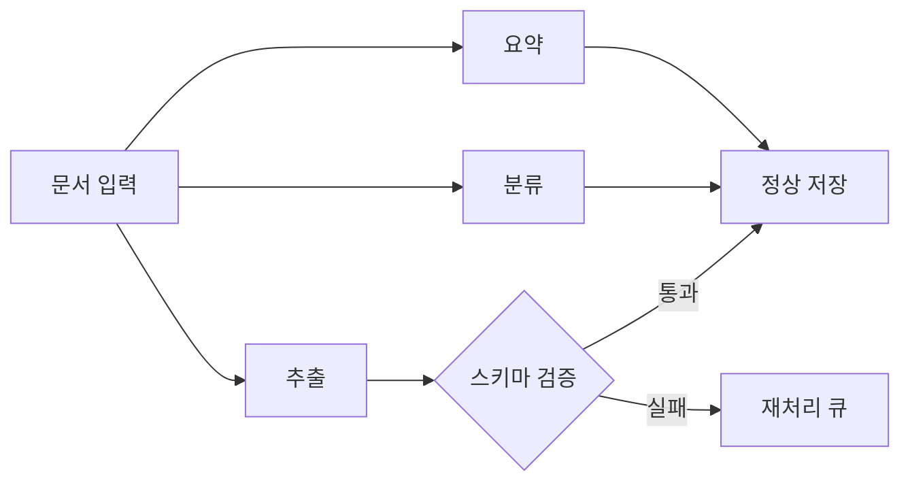
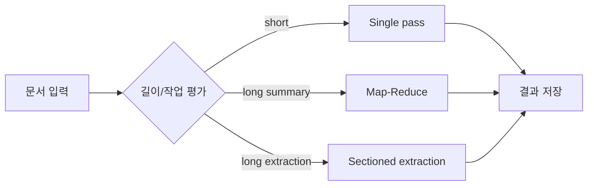

# AI App Patterns 101 (3/6): 문서 어시스턴트 — 요약, 추출, 분류

문서 처리 작업은 겉으로 보면 서로 달라 보이지만, 실제 엔지니어링 문제는 놀랄 만큼 비슷합니다. 긴 입력을 받고, 모델이 처리할 수 있게 형태를 다듬고, 짧고 계약이 분명한 출력으로 돌려주는 일입니다. 이 관점으로 보면 요약, 정보 추출, 분류는 서로 다른 기능이 아니라 같은 패턴군으로 읽힙니다.

문서 어시스턴트를 챗봇처럼 보면 설계 포인트를 놓치기 쉽습니다. 여기서는 대화가 이어지지 않습니다. 문서가 입력이고, 규칙 있는 결과가 출력입니다. 따라서 중요한 것은 기억 유지보다 입력 분할, 출력 형식, 배치 처리 안정성입니다.

이 글은 AI App Patterns 101 시리즈의 세 번째 글입니다. 여기서는 문서 어시스턴트 패턴을 요약, 구조화 추출, 분류 흐름으로 나누어 정리합니다.


*짧은 문서 요약 흐름*
> 문서 어시스턴트는 대화형 시스템이 아니라, 긴 입력을 읽고 작업 목적에 맞는 짧은 출력으로 바꾸는 변환기입니다.

## 먼저 던지는 질문

- 문서 어시스턴트에서 요약, 추출, 분류는 왜 서로 다른 출력 계약이 필요할까요?
- 긴 문서는 언제 Map-Reduce 요약처럼 단계적으로 나눠야 할까요?
- 추출과 분류 결과를 운영 코드가 믿으려면 어떤 검증이 필요할까요?

## 문서 요약

### 짧은 문서 요약 흐름

짧은 문서는 전체 텍스트를 그대로 넘기고 요약만 요청하면 됩니다. 스타일, 길이, 독자층을 매개변수화하면 같은 체인을 여러 소비자에게 재사용할 수 있습니다.

```python
import os

from langchain_core.output_parsers import StrOutputParser
from langchain_core.prompts import ChatPromptTemplate
from langchain_groq import ChatGroq

llm = ChatGroq(
    model="llama-3.1-8b-instant",
    api_key=os.environ["GROQ_API_KEY"],
)

summarize_prompt = ChatPromptTemplate.from_messages([
    (
        "system",
        "Summarize the following document in a {style} style.\n"
        "Length: {length}\n"
        "Audience: {audience}",
    ),
    ("human", "Document:\n{document}"),
])

chain = summarize_prompt | llm | StrOutputParser()

document = """
A 2024 Python developer survey found Python ranked as the most popular programming
language for the fifth consecutive year. Sixty-seven percent of respondents use Python
as their primary language; of those, 45 percent apply it to data science and machine
learning workloads. Web development accounts for 28 percent of use cases, and
automation scripting for 18 percent.

Python 3.12 delivered a 25 percent performance improvement over the prior version
and strengthened type hint support. Eighty-nine percent of respondents run Python 3.x;
only 2 percent still use Python 2.x.

The most-used frameworks are FastAPI (52 percent), Django (38 percent), and Flask
(34 percent). In the data science domain, pandas (78 percent), numpy (72 percent),
and scikit-learn (65 percent) dominate.
"""

exec_summary = chain.invoke({
    "document": document,
    "style": "business-focused",
    "length": "three sentences or fewer",
    "audience": "non-technical executives",
})
print("=== Executive summary ===")
print(exec_summary)

dev_summary = chain.invoke({
    "document": document,
    "style": "technical",
    "length": "five bullet points",
    "audience": "senior engineers",
})
print("\n=== Developer summary ===")
print(dev_summary)
```

---

## 긴 문서 요약 — Map-Reduce

### 청크 요약과 최종 합성


*청크 요약과 최종 합성*
문서가 컨텍스트 창을 넘으면 한 번의 호출로 처리할 수 없습니다. Map-Reduce는 문서를 청크로 나누고 각 청크를 독립적으로 요약한 뒤(Map), 그 요약들을 합쳐 하나의 일관된 결과로 만드는 방식입니다(Reduce).

> 멘탈 모델은 간단합니다. 모델 하나가 긴 문서를 한 번에 이해한다고 기대하지 말고, 먼저 부분 요약을 만들고 나중에 총괄 편집자를 한 번 더 태운다고 생각하면 됩니다.

```python
import os

from langchain_core.output_parsers import StrOutputParser
from langchain_core.prompts import ChatPromptTemplate
from langchain_groq import ChatGroq
from langchain_text_splitters import RecursiveCharacterTextSplitter

llm = ChatGroq(
    model="llama-3.1-8b-instant",
    api_key=os.environ["GROQ_API_KEY"],
)

map_prompt = ChatPromptTemplate.from_messages([
    ("system", "Summarize the following text segment in two to three sentences, keeping only the key points."),
    ("human", "{chunk}"),
])

reduce_prompt = ChatPromptTemplate.from_messages([
    (
        "system",
        "You have received summaries of multiple document segments.\n"
        "Merge them into a single coherent summary.\n"
        "Remove duplicates and preserve logical flow.",
    ),
    ("human", "Segment summaries:\n{summaries}"),
])

map_chain = map_prompt | llm | StrOutputParser()
reduce_chain = reduce_prompt | llm | StrOutputParser()

def map_reduce_summarize(long_document: str) -> str:
    splitter = RecursiveCharacterTextSplitter(chunk_size=500, chunk_overlap=50)
    chunks = splitter.split_text(long_document)
    print(f"  chunks: {len(chunks)}")

    # 맵: 각 청크를 독립적으로 요약
    chunk_summaries = []
    for i, chunk in enumerate(chunks):
        summary = map_chain.invoke({"chunk": chunk})
        chunk_summaries.append(summary)
        print(f"  chunk {i + 1}/{len(chunks)} summarized")

    # 축소: 모든 요약을 병합합니다.
    combined = "\n\n".join(
        f"[Segment {i + 1}] {s}" for i, s in enumerate(chunk_summaries)
    )
    return reduce_chain.invoke({"summaries": combined})

long_doc = """
Artificial intelligence (AI) is the field of computer science dedicated to simulating
human cognitive ability in machines. Alan Turing posed the foundational question —
"Can machines think?" — in the 1950s, and the field has since gone through multiple
cycles of enthusiasm and disillusionment.

Machine learning is a subfield of AI in which computers learn rules from data rather
than executing explicitly programmed instructions. Decision trees, random forests, and
support vector machines are representative algorithms.

Deep learning is a branch of machine learning that uses artificial neural networks
modeled on the human brain. The field gained widespread attention after a deep learning
model dominated the 2012 ImageNet competition by a large margin. It has since driven
breakthroughs in image recognition, speech recognition, and natural language processing.

Large language models (LLMs) are deep learning models trained on massive text corpora.
GPT, BERT, and LLaMA are prominent examples. They handle text generation, summarization,
translation, and code writing, among other tasks. ChatGPT's release in late 2022 brought
LLMs into mainstream public awareness.

The future of AI is promising but comes with substantial challenges. Explainability,
bias, privacy, energy consumption, and labor displacement require coordinated social
responses. At the same time, AI is expected to play a central role in addressing
pressing problems in medicine, climate change, and education.
"""

print("Starting Map-Reduce summarization...")
final = map_reduce_summarize(long_doc)
print(f"\n=== Final summary ===\n{final}")
```

---

## 정보 추출

### 비정형 텍스트에서 JSON 추출


*비정형 텍스트에서 JSON 추출*
비정형 텍스트 안에는 후속 시스템이 필요로 하는 구조화 데이터가 숨어 있는 경우가 많습니다. 추출할 필드를 명시하고 JSON으로만 반환하게 한 뒤, `JsonOutputParser`로 파싱하면 됩니다.

```python
import os

from langchain_core.output_parsers import JsonOutputParser
from langchain_core.prompts import ChatPromptTemplate
from langchain_groq import ChatGroq

llm = ChatGroq(
    model="llama-3.1-8b-instant",
    api_key=os.environ["GROQ_API_KEY"],
)

extract_prompt = ChatPromptTemplate.from_messages([
    (
        "system",
        "Extract information from the text below and return it as JSON only. "
        "Do not include any other text.\n\n"
        "Fields to extract:\n{schema}",
    ),
    ("human", "Text:\n{text}"),
])

chain = extract_prompt | llm | JsonOutputParser()

job_schema = """
{
  "company": "company name",
  "position": "job title",
  "location": "location",
  "salary_range": "salary range (null if not mentioned)",
  "required_skills": ["list of required skills"],
  "experience_years": "years of experience as a number (null if not mentioned)",
  "employment_type": "full-time / contract / freelance"
}"""

job_postings = [
    """
    ABCTech is hiring a senior backend engineer in Gangnam, Seoul.
    Salary range 80M-120M KRW. Five or more years with Python/Django required.
    AWS and Docker experience a plus. Full-time position.
    """,
    """
    Startup XYZ is looking for a full-stack developer. Remote work available.
    Proficiency in React, Node.js, and PostgreSQL required. Three or more years.
    Contract role with potential conversion to full-time.
    """,
]

for i, posting in enumerate(job_postings, start=1):
    print(f"\n=== Job posting {i} ===")
    result = chain.invoke({"text": posting, "schema": job_schema})
    for key, value in result.items():
        print(f"  {key}: {value}")
```

---

## 문서 분류

### 신뢰도를 함께 돌려주는 배치 분류


*신뢰도를 함께 돌려주는 배치 분류*
문서를 카테고리로 분류하는 일은 콘텐츠 파이프라인, 지원 티켓 라우팅, 규정 준수 워크플로에서 흔한 전처리 단계입니다.

```python
import os

from langchain_core.output_parsers import JsonOutputParser
from langchain_core.prompts import ChatPromptTemplate
from langchain_groq import ChatGroq

llm = ChatGroq(
    model="llama-3.1-8b-instant",
    api_key=os.environ["GROQ_API_KEY"],
)

classify_prompt = ChatPromptTemplate.from_messages([
    (
        "system",
        "Classify the following text. Return JSON only.\n\n"
        "Available categories: {categories}\n\n"
        'Format: {{"category": "category name", "confidence": 0 to 1, "reason": "brief reason"}}',
    ),
    ("human", "Text:\n{text}"),
])

chain = classify_prompt | llm | JsonOutputParser()

categories = "Technology/IT, Business/Finance, Health/Medicine, Sports, Entertainment, Other"

texts = [
    "Python 3.12 significantly improved generic type handling speed, reducing overhead by 25 percent.",
    "Operating profit for Q3 rose 15 percent year-over-year, driven by expansion into overseas markets.",
    "A new study reports that regular aerobic exercise reduces cardiovascular disease risk by 30 percent.",
    "Real Madrid defeated Manchester City 2-1 in the Champions League final to claim the title.",
]

for text in texts:
    result = chain.invoke({"text": text, "categories": categories})
    print(f"text: {text[:60]}...")
    print(f"  category: {result.get('category')}, confidence: {result.get('confidence'):.2f}")
    print(f"  reason: {result.get('reason')}\n")
```

---

## 이 코드에서 먼저 볼 점

- `main.py`는 긴 문서를 여러 모델 호출에 걸쳐 처리할 수 있도록 map 단계와 reduce 단계를 명시적으로 분리합니다.
- 중간 청크 요약을 각각 출력하기 때문에 어디서 정보가 빠졌는지 디버깅하기 쉽습니다.
- 같은 패턴은 요약뿐 아니라 추출이나 분류 배치로도 자연스럽게 일반화됩니다.

---

## 어디서 자주 헷갈릴까요?

### 요약, 추출, 분류 사이의 패턴 선택


*요약, 추출, 분류 사이의 패턴 선택*
- 많은 팀이 먼저 더 큰 모델을 찾지만, 요약 품질에는 대개 청크 크기와 overlap이 더 크게 작용합니다.
- Map-Reduce는 병렬화에 유리하지만 청크 사이의 전역 문맥을 약하게 만듭니다. 그래서 reduce 프롬프트가 중요합니다.
- 문서 요약과 문서 Q&A는 입력층에서 비슷해 보여도, 실제로 최적화하는 운영 메트릭은 다릅니다.

---

## 체크리스트

- [ ] 긴 문서가 여러 청크로 분할된다
- [ ] 각 청크가 독립적으로 요약된다
- [ ] 부분 요약들이 하나의 최종 요약으로 합쳐진다
- [ ] 최종 합성 프롬프트가 중복 제거와 일관성을 책임진다

---

## 문서 처리 API: 요약·추출·분류를 같은 서비스에서 운영하기

### 작업별 시스템 프롬프트 템플릿

문서 어시스턴트는 "한 모델"보다 "작업 계약"이 먼저입니다. 아래처럼 작업마다 프롬프트 템플릿을 분리하면 품질 회귀를 좁게 관리할 수 있습니다.

```python
SUMMARY_SYSTEM_PROMPT = """
당신은 기술 문서를 요약하는 편집자입니다.
- 핵심 주장, 근거, 결론만 남깁니다.
- 과장 표현을 제거합니다.
- 출력은 4문장 이내로 제한합니다.
""".strip()

EXTRACTION_SYSTEM_PROMPT = """
당신은 비정형 문서에서 구조화 필드를 추출합니다.
- 지정된 JSON 스키마만 반환합니다.
- 값이 없으면 null로 기록합니다.
- 추측으로 필드를 채우지 않습니다.
""".strip()

CLASSIFICATION_SYSTEM_PROMPT = """
당신은 운영 라우팅 분류기입니다.
- 허용 라벨 집합 밖의 값을 만들지 않습니다.
- 신뢰도(confidence)를 0~1로 함께 반환합니다.
""".strip()
```

이렇게 나누면 요약 품질 저하와 추출 파싱 실패를 동일 원인으로 섞지 않게 됩니다. 운영 중에는 문제를 빠르게 분해하는 능력이 결과적으로 비용을 줄입니다.

### Flask 엔드포인트 예시

```python
from flask import Flask, request, jsonify

app = Flask(__name__)

@app.post('/documents/summarize')
def summarize_document():
    text = request.json['text']
    style = request.json.get('style', 'technical')
    # 실제로 실제로 SUMMARY_SYSTEM_PROMPT를 실행하여 호출합니다.
    return jsonify({'summary': f'[{style}] 요약 예시: {text[:120]}...'})

@app.post('/documents/extract')
def extract_fields():
    text = request.json['text']
    schema = request.json['schema']
    # 실제 구현에서는 EXTRACTION_SYSTEM_PROMPT + JSON 파서
    return jsonify({'result': {'company': 'ABCTech', 'salary_range': None}, 'schema': schema})

@app.post('/documents/classify')
def classify_document():
    text = request.json['text']
    # CLASSIFICATION_SYSTEM_PROMPT의 실제 구현
    return jsonify({'category': 'Technology/IT', 'confidence': 0.91, 'preview': text[:60]})
```

### 배치 처리에서의 실패 복구 단위

문서 처리에서는 한 건 실패 때문에 전체 배치를 중단하지 않는 설계가 중요합니다. 그래서 보통 문서 단위 재시도 키를 둡니다.

```text
job_id: batch-2026-05-21-001
item_id: doc-00041
status: failed
failed_stage: extraction
retry_count: 2
last_error: invalid_json_output
```

이 메타데이터를 남기면 재처리 큐에서 `failed_stage`부터 재개할 수 있습니다. "어디서 깨졌는지"가 남지 않으면 긴 배치 작업은 재현 비용이 급격히 커집니다.

## 문서 처리 안정성: 스키마 검증과 부분 실패 허용

요약은 자연어라서 느슨하게 처리해도 되지만, 추출과 분류는 후속 시스템 입력이므로 엄격해야 합니다. 아래처럼 Pydantic 검증 계층을 두면 모델 출력이 흔들려도 오류를 조기에 잡을 수 있습니다.

```python
from pydantic import BaseModel, Field, ValidationError

class JobExtract(BaseModel):
    company: str
    position: str
    location: str | None = None
    salary_range: str | None = None
    experience_years: int | None = Field(default=None, ge=0, le=40)

def validate_extract(payload: dict) -> tuple[bool, str]:
    try:
        JobExtract.model_validate(payload)
        return True, 'ok'
    except ValidationError as exc:
        return False, str(exc)
```

### 부분 실패 허용 배치 루프

```python
def process_batch(items: list[dict]) -> dict:
    results = []
    failures = []

    for item in items:
        extracted = run_extraction(item['text'])
        ok, reason = validate_extract(extracted)

        if ok:
            results.append({'id': item['id'], 'result': extracted})
        else:
            failures.append({'id': item['id'], 'reason': reason})

    return {
        'success_count': len(results),
        'failure_count': len(failures),
        'results': results,
        'failures': failures,
    }
```

배치 시스템에서 중요한 것은 100건 중 2건 실패를 100건 전체 실패로 키우지 않는 것입니다. 실패한 건만 분리해 재처리하면 처리량과 안정성을 동시에 챙길 수 있습니다.

### 처리 파이프라인 다이어그램



*요약·추출·분류 공존 파이프라인과 검증 분기*

## 문서 길이와 작업 타입에 따른 실행 전략

문서 어시스턴트의 운영 비용은 문서 길이 분포에 크게 좌우됩니다. 그래서 보통 입력 길이를 기준으로 실행 전략을 나눕니다.

```python
def choose_strategy(char_len: int, task_type: str) -> str:
    if task_type == 'summary' and char_len > 8000:
        return 'map_reduce_summary'
    if task_type == 'extraction' and char_len > 12000:
        return 'sectioned_extraction'
    if task_type == 'classification' and char_len > 20000:
        return 'hierarchical_classification'
    return 'single_pass'
```

이 분기는 단순해 보이지만 효과가 큽니다. 모든 문서를 단일 전략으로 처리하면 과도한 비용이나 파싱 실패가 누적되기 쉽습니다.

### 오케스트레이션 다이어그램



*문서 길이 기반 실행 전략 분기*

### 운영 팁

추출 실패를 줄이려면 모델 출력이 JSON이라고 가정하지 말고, "파싱 실패 시 원문 보존 + 재시도 큐"를 기본으로 두는 편이 안전합니다. 데이터 파이프라인에서 가장 비싼 실패는 조용한 실패입니다.

## 품질 점검 샘플셋 운영

문서 어시스턴트는 운영 전에 작업별 샘플셋을 두는 편이 안전합니다. 요약은 핵심 누락 여부, 추출은 스키마 일치율, 분류는 라벨 정확도로 분리해 측정해야 합니다.

```text
summary_set: 200건, metric=핵심키워드 재현율
extraction_set: 300건, metric=필드 정합률
classification_set: 500건, metric=macro_f1
```

하나의 점수로 묶으면 어떤 작업이 깨졌는지 보이지 않습니다. 작업별 품질 계기판을 분리하는 것이 유지보수에 유리합니다.

### 출력 길이 가드

요약 결과가 너무 길어지면 후속 시스템이 예상한 화면이나 DB 컬럼 길이를 넘길 수 있습니다. 작업별 최대 길이를 두고 초과 시 자동 재요약하는 후처리를 두면 안정성이 좋아집니다.

### 파이프라인 버전 관리

요약/추출/분류 체인은 각각 버전을 붙여 릴리스 노트와 함께 관리해야 합니다. 같은 문서라도 체인 버전에 따라 결과가 달라질 수 있기 때문입니다.

### 운영 회고에서 반드시 남길 항목

패턴 설계가 실제로 효과가 있었는지는 회고 기록 품질에서 드러납니다. 각 글에서 다룬 구조를 실서비스에 적용했다면, 최소한 다음 항목은 공통 템플릿으로 남기는 편이 좋습니다.

- 변경 전/후의 실패 유형 분포
- 변경 전/후의 평균 지연 시간과 p95
- 사람이 개입한 건수와 자동 처리 건수 비율
- 근거 부족, 파싱 실패, 도구 오류 같은 실패 코드의 추세
- 다음 분기에서 조정할 임계값 또는 프롬프트 버전

이 기록이 쌓이면 모델 자체 성능보다 애플리케이션 패턴 결정이 어떤 영향을 주었는지 분리해서 볼 수 있습니다. 결국 운영 품질은 한 번의 정답 설계가 아니라, 측정 가능한 개선 루프를 오래 유지하는 능력에서 만들어집니다.

## 정리

요약, 추출, 분류는 문서 처리 사용 사례의 대부분을 차지합니다. 각 체인은 하나의 작업만 맡게 두는 편이 좋습니다. 요약과 추출을 한 프롬프트 안에 섞으면 출력 품질이 안정적으로 떨어집니다. 긴 문서에는 표준 접근이 분명합니다. 청크로 나누고, 독립적으로 map을 돌리고, 마지막에 한 번 reduce합니다.

다음 글에서는 에이전트와 도구 패턴을 다룹니다. 문맥만으로 답할 수 없는 질문에 대해 LLM이 자율적으로 도구를 선택하고 호출하는 구조입니다.

---

## 처음 질문으로 돌아가기

- **문서 어시스턴트에서 요약, 추출, 분류는 왜 서로 다른 출력 계약이 필요할까요?**
  요약은 자연어 압축, 추출은 구조화 필드, 분류는 제한된 라벨을 요구하므로 같은 parser와 검증 규칙으로 묶으면 실패 경계가 흐려집니다.

- **긴 문서는 언제 Map-Reduce 요약처럼 단계적으로 나눠야 할까요?**
  문서가 모델 컨텍스트를 넘거나 섹션별 의미가 중요하면 조각별 요약 후 합치는 Map-Reduce 구조가 필요합니다.

- **추출과 분류 결과를 운영 코드가 믿으려면 어떤 검증이 필요할까요?**
  필수 필드, enum 라벨, 길이 제한, 누락 값 처리를 코드 검증으로 확인해야 후속 업무 로직이 결과를 안전하게 사용할 수 있습니다.

<!-- toc:begin -->
## 시리즈 목차

- [AI App Patterns 101 (1/6): 챗봇 패턴 — 대화 이력과 상태 관리](./01-chatbot-pattern.md)
- [AI App Patterns 101 (2/6): RAG Q&A 패턴 — 문서 기반 질의응답](./02-rag-qa-pattern.md)
- **AI App Patterns 101 (3/6): 문서 어시스턴트 — 요약, 추출, 분류 (현재 글)**
- AI App Patterns 101 (4/6): 에이전트와 도구 패턴 — 자율적 도구 선택 (예정)
- AI App Patterns 101 (5/6): 워크플로 자동화 — 다단계 체인 설계 (예정)
- AI App Patterns 101 (6/6): Human-in-the-loop — 사람 개입 설계 (예정)

<!-- toc:end -->

---

## 참고 자료

- [LangChain summarization guide](https://python.langchain.com/docs/use_cases/summarization/)
- [JsonOutputParser](https://python.langchain.com/docs/modules/model_io/output_parsers/json/)
- [Map-Reduce pattern](https://python.langchain.com/docs/use_cases/summarization/#option-2-map-reduce)

- [이 글의 예제 코드 (book-examples)](https://github.com/yeongseon-books/book-examples/tree/main/ai-app-patterns-101/ko/03-document-assistant)

Tags: LLM, RAG, Agent, Python
