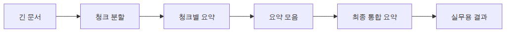
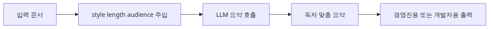
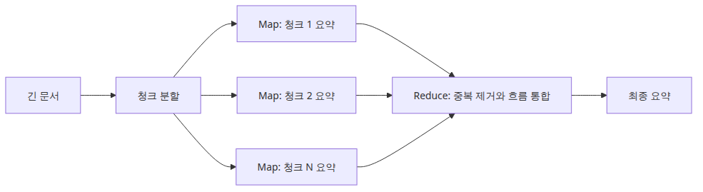
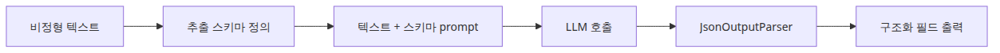
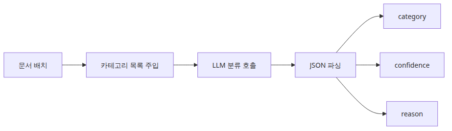
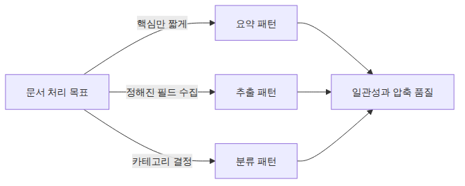

# 문서 어시스턴트 — 요약, 추출, 분류

문서 처리 작업은 겉으로 보면 서로 달라 보이지만, 실제 엔지니어링 문제는 놀랄 만큼 비슷합니다. 긴 입력을 받고, 모델이 처리할 수 있게 형태를 다듬고, 짧고 계약이 분명한 출력으로 돌려주는 일입니다. 이 관점으로 보면 요약, 정보 추출, 분류는 서로 다른 기능이 아니라 같은 패턴군으로 읽힙니다.

문서 어시스턴트를 챗봇처럼 보면 설계 포인트를 놓치기 쉽습니다. 여기서는 대화가 이어지지 않습니다. 문서가 입력이고, 규칙 있는 결과가 출력입니다. 따라서 중요한 것은 기억 유지보다 입력 분할, 출력 형식, 배치 처리 안정성입니다.

이 글은 AI App Patterns 101 시리즈의 3번째 글입니다. 여기서는 문서 어시스턴트 패턴을 요약, 구조화 추출, 분류 흐름으로 나누어 정리합니다.

## 이 글에서 다룰 문제

- 문서가 한 번의 프롬프트에 담기기엔 너무 길 때 어떤 체인 구조가 요약을 안정적으로 유지할까요?
- 요약 파이프라인에서 청크 단위 처리와 최종 합성은 어떻게 분리해야 할까요?
- 문서 어시스턴트 패턴은 왜 챗봇보다 배치 처리에 더 잘 맞을까요?

> 문서 어시스턴트는 대화형 시스템이 아니라, 긴 입력을 읽고 작업 목적에 맞는 짧은 출력으로 바꾸는 변환기입니다.



*이 글에서 답할 질문*
> AI App Patterns 101 (3/6)

예제 코드: [github.com/yeongseon-books/ai-app-patterns-101](https://github.com/yeongseon-books/ai-app-patterns-101/tree/main/en/03-document-assistant)

문서 어시스턴트 패턴은 문서를 입력으로 받아 특정 처리 작업을 수행합니다. 챗봇이나 RAG 파이프라인과 달리, 여기에는 이어지는 대화가 없습니다. 문서가 입력이고, 구조화되거나 압축된 결과가 출력입니다. LLM이 요약, 정보 추출, 분류를 잘 처리하는 이유도 세 작업이 결국 같은 연산으로 환원되기 때문입니다. 문서를 읽고, 규칙을 적용하고, 구조화된 텍스트를 반환하는 일입니다.

다룰 주제는 다음과 같습니다.

- 스타일과 독자층을 제어하는 요약
- 컨텍스트 창을 넘는 문서를 위한 Map-Reduce
- JSON 출력 기반의 구조화 정보 추출
- 다중 카테고리 문서 분류

---

## 문서 요약

### 짧은 문서 요약 흐름



*짧은 문서 요약 흐름*
짧은 문서는 전체 텍스트를 그대로 넘기고 요약만 요청하면 됩니다. 스타일, 길이, 독자층을 매개변수화하면 같은 체인을 여러 소비자에게 재사용할 수 있습니다.

```python
import os

from langchain_core.output_parsers import StrOutputParser
from langchain_core.prompts import ChatPromptTemplate
from langchain_groq import ChatGroq

llm = ChatGroq(
    model="llama-3.1-8b-instant",
    api_key=os.environ["GROQ_API_KEY"],
)

summarize_prompt = ChatPromptTemplate.from_messages([
    (
        "system",
        "Summarize the following document in a {style} style.\n"
        "Length: {length}\n"
        "Audience: {audience}",
    ),
    ("human", "Document:\n{document}"),
])

chain = summarize_prompt | llm | StrOutputParser()

document = """
A 2024 Python developer survey found Python ranked as the most popular programming
language for the fifth consecutive year. Sixty-seven percent of respondents use Python
as their primary language; of those, 45 percent apply it to data science and machine
learning workloads. Web development accounts for 28 percent of use cases, and
automation scripting for 18 percent.

Python 3.12 delivered a 25 percent performance improvement over the prior version
and strengthened type hint support. Eighty-nine percent of respondents run Python 3.x;
only 2 percent still use Python 2.x.

The most-used frameworks are FastAPI (52 percent), Django (38 percent), and Flask
(34 percent). In the data science domain, pandas (78 percent), numpy (72 percent),
and scikit-learn (65 percent) dominate.
"""

exec_summary = chain.invoke({
    "document": document,
    "style": "business-focused",
    "length": "three sentences or fewer",
    "audience": "non-technical executives",
})
print("=== Executive summary ===")
print(exec_summary)

dev_summary = chain.invoke({
    "document": document,
    "style": "technical",
    "length": "five bullet points",
    "audience": "senior engineers",
})
print("\n=== Developer summary ===")
print(dev_summary)
```

---

## 긴 문서 요약 — Map-Reduce

### 청크 요약과 최종 합성



*청크 요약과 최종 합성*
문서가 컨텍스트 창을 넘으면 한 번의 호출로 처리할 수 없습니다. Map-Reduce는 문서를 청크로 나누고 각 청크를 독립적으로 요약한 뒤(Map), 그 요약들을 합쳐 하나의 일관된 결과로 만드는 방식입니다(Reduce).

> 멘탈 모델은 간단합니다. 모델 하나가 긴 문서를 한 번에 이해한다고 기대하지 말고, 먼저 부분 요약을 만들고 나중에 총괄 편집자를 한 번 더 태운다고 생각하면 됩니다.

```python
import os

from langchain_core.output_parsers import StrOutputParser
from langchain_core.prompts import ChatPromptTemplate
from langchain_groq import ChatGroq
from langchain_text_splitters import RecursiveCharacterTextSplitter

llm = ChatGroq(
    model="llama-3.1-8b-instant",
    api_key=os.environ["GROQ_API_KEY"],
)

map_prompt = ChatPromptTemplate.from_messages([
    ("system", "Summarize the following text segment in two to three sentences, keeping only the key points."),
    ("human", "{chunk}"),
])

reduce_prompt = ChatPromptTemplate.from_messages([
    (
        "system",
        "You have received summaries of multiple document segments.\n"
        "Merge them into a single coherent summary.\n"
        "Remove duplicates and preserve logical flow.",
    ),
    ("human", "Segment summaries:\n{summaries}"),
])

map_chain = map_prompt | llm | StrOutputParser()
reduce_chain = reduce_prompt | llm | StrOutputParser()

def map_reduce_summarize(long_document: str) -> str:
    splitter = RecursiveCharacterTextSplitter(chunk_size=500, chunk_overlap=50)
    chunks = splitter.split_text(long_document)
    print(f"  chunks: {len(chunks)}")

    # Map: summarize each chunk independently
    chunk_summaries = []
    for i, chunk in enumerate(chunks):
        summary = map_chain.invoke({"chunk": chunk})
        chunk_summaries.append(summary)
        print(f"  chunk {i + 1}/{len(chunks)} summarized")

    # Reduce: merge all summaries
    combined = "\n\n".join(
        f"[Segment {i + 1}] {s}" for i, s in enumerate(chunk_summaries)
    )
    return reduce_chain.invoke({"summaries": combined})

long_doc = """
Artificial intelligence (AI) is the field of computer science dedicated to simulating
human cognitive ability in machines. Alan Turing posed the foundational question —
"Can machines think?" — in the 1950s, and the field has since gone through multiple
cycles of enthusiasm and disillusionment.

Machine learning is a subfield of AI in which computers learn rules from data rather
than executing explicitly programmed instructions. Decision trees, random forests, and
support vector machines are representative algorithms.

Deep learning is a branch of machine learning that uses artificial neural networks
modeled on the human brain. The field gained widespread attention after a deep learning
model dominated the 2012 ImageNet competition by a large margin. It has since driven
breakthroughs in image recognition, speech recognition, and natural language processing.

Large language models (LLMs) are deep learning models trained on massive text corpora.
GPT, BERT, and LLaMA are prominent examples. They handle text generation, summarization,
translation, and code writing, among other tasks. ChatGPT's release in late 2022 brought
LLMs into mainstream public awareness.

The future of AI is promising but comes with substantial challenges. Explainability,
bias, privacy, energy consumption, and labor displacement require coordinated social
responses. At the same time, AI is expected to play a central role in addressing
pressing problems in medicine, climate change, and education.
"""

print("Starting Map-Reduce summarization...")
final = map_reduce_summarize(long_doc)
print(f"\n=== Final summary ===\n{final}")
```

---

## 정보 추출

### 비정형 텍스트에서 JSON 추출



*비정형 텍스트에서 JSON 추출*
비정형 텍스트 안에는 후속 시스템이 필요로 하는 구조화 데이터가 숨어 있는 경우가 많습니다. 추출할 필드를 명시하고 JSON으로만 반환하게 한 뒤, `JsonOutputParser`로 파싱하면 됩니다.

```python
import os

from langchain_core.output_parsers import JsonOutputParser
from langchain_core.prompts import ChatPromptTemplate
from langchain_groq import ChatGroq

llm = ChatGroq(
    model="llama-3.1-8b-instant",
    api_key=os.environ["GROQ_API_KEY"],
)

extract_prompt = ChatPromptTemplate.from_messages([
    (
        "system",
        "Extract information from the text below and return it as JSON only. "
        "Do not include any other text.\n\n"
        "Fields to extract:\n{schema}",
    ),
    ("human", "Text:\n{text}"),
])

chain = extract_prompt | llm | JsonOutputParser()

job_schema = """
{
  "company": "company name",
  "position": "job title",
  "location": "location",
  "salary_range": "salary range (null if not mentioned)",
  "required_skills": ["list of required skills"],
  "experience_years": "years of experience as a number (null if not mentioned)",
  "employment_type": "full-time / contract / freelance"
}"""

job_postings = [
    """
    ABCTech is hiring a senior backend engineer in Gangnam, Seoul.
    Salary range 80M-120M KRW. Five or more years with Python/Django required.
    AWS and Docker experience a plus. Full-time position.
    """,
    """
    Startup XYZ is looking for a full-stack developer. Remote work available.
    Proficiency in React, Node.js, and PostgreSQL required. Three or more years.
    Contract role with potential conversion to full-time.
    """,
]

for i, posting in enumerate(job_postings, start=1):
    print(f"\n=== Job posting {i} ===")
    result = chain.invoke({"text": posting, "schema": job_schema})
    for key, value in result.items():
        print(f"  {key}: {value}")
```

---

## 문서 분류

### 신뢰도를 함께 돌려주는 배치 분류



*신뢰도를 함께 돌려주는 배치 분류*
문서를 카테고리로 분류하는 일은 콘텐츠 파이프라인, 지원 티켓 라우팅, 규정 준수 워크플로에서 흔한 전처리 단계입니다.

```python
import os

from langchain_core.output_parsers import JsonOutputParser
from langchain_core.prompts import ChatPromptTemplate
from langchain_groq import ChatGroq

llm = ChatGroq(
    model="llama-3.1-8b-instant",
    api_key=os.environ["GROQ_API_KEY"],
)

classify_prompt = ChatPromptTemplate.from_messages([
    (
        "system",
        "Classify the following text. Return JSON only.\n\n"
        "Available categories: {categories}\n\n"
        'Format: {{"category": "category name", "confidence": 0 to 1, "reason": "brief reason"}}',
    ),
    ("human", "Text:\n{text}"),
])

chain = classify_prompt | llm | JsonOutputParser()

categories = "Technology/IT, Business/Finance, Health/Medicine, Sports, Entertainment, Other"

texts = [
    "Python 3.12 significantly improved generic type handling speed, reducing overhead by 25 percent.",
    "Operating profit for Q3 rose 15 percent year-over-year, driven by expansion into overseas markets.",
    "A new study reports that regular aerobic exercise reduces cardiovascular disease risk by 30 percent.",
    "Real Madrid defeated Manchester City 2-1 in the Champions League final to claim the title.",
]

for text in texts:
    result = chain.invoke({"text": text, "categories": categories})
    print(f"text: {text[:60]}...")
    print(f"  category: {result.get('category')}, confidence: {result.get('confidence'):.2f}")
    print(f"  reason: {result.get('reason')}\n")
```

---

## 이 코드에서 먼저 볼 점

- `main.py`는 긴 문서를 여러 모델 호출에 걸쳐 처리할 수 있도록 map 단계와 reduce 단계를 명시적으로 분리합니다.
- 중간 청크 요약을 각각 출력하기 때문에 어디서 정보가 빠졌는지 디버깅하기 쉽습니다.
- 같은 패턴은 요약뿐 아니라 추출이나 분류 배치로도 자연스럽게 일반화됩니다.

---

## 어디서 자주 헷갈릴까요?

### 요약, 추출, 분류 사이의 패턴 선택



*요약, 추출, 분류 사이의 패턴 선택*
- 많은 팀이 먼저 더 큰 모델을 찾지만, 요약 품질에는 대개 청크 크기와 overlap이 더 크게 작용합니다.
- Map-Reduce는 병렬화에 유리하지만 청크 사이의 전역 문맥을 약하게 만듭니다. 그래서 reduce 프롬프트가 중요합니다.
- 문서 요약과 문서 Q&A는 입력층에서 비슷해 보여도, 실제로 최적화하는 운영 메트릭은 다릅니다.

---

## 체크리스트

- [ ] 긴 문서가 여러 청크로 분할된다
- [ ] 각 청크가 독립적으로 요약된다
- [ ] 부분 요약들이 하나의 최종 요약으로 합쳐진다
- [ ] 최종 합성 프롬프트가 중복 제거와 일관성을 책임진다

---

## 정리

요약, 추출, 분류는 문서 처리 사용 사례의 대부분을 차지합니다. 각 체인은 하나의 작업만 맡게 두는 편이 좋습니다. 요약과 추출을 한 프롬프트 안에 섞으면 출력 품질이 안정적으로 떨어집니다. 긴 문서에는 표준 접근이 분명합니다. 청크로 나누고, 독립적으로 map을 돌리고, 마지막에 한 번 reduce합니다.

다음 글에서는 에이전트와 도구 패턴을 다룹니다. 문맥만으로 답할 수 없는 질문에 대해 LLM이 자율적으로 도구를 선택하고 호출하는 구조입니다.

<!-- toc:begin -->
## 시리즈 목차

- [챗봇 패턴 — 대화 이력과 상태 관리](./01-chatbot-pattern.md)
- [RAG Q&A 패턴 — 문서 기반 질의응답](./02-rag-qa-pattern.md)
- **문서 어시스턴트 — 요약, 추출, 분류 (현재 글)**
- 에이전트와 도구 패턴 — 자율적 도구 선택 (예정)
- 워크플로 자동화 — 다단계 체인 설계 (예정)
- Human-in-the-loop — 사람 개입 설계 (예정)

<!-- toc:end -->

---

## 참고 자료

- [LangChain summarization guide](https://python.langchain.com/docs/use_cases/summarization/)
- [JsonOutputParser](https://python.langchain.com/docs/modules/model_io/output_parsers/json/)
- [Map-Reduce pattern](https://python.langchain.com/docs/use_cases/summarization/#option-2-map-reduce)

Tags: LLM, RAG, Agent, Python
