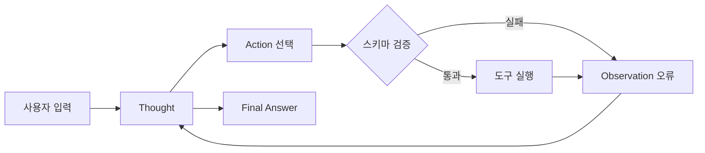

# AI App Patterns 101 (4/6): 에이전트와 도구 패턴 — 자율적 도구 선택

어떤 문제는 다음 단계가 실행 중 발견한 정보에 따라 바뀌는 순간부터 고정 체인에 잘 들어맞지 않습니다. 이때 진짜 설계 질문은 “에이전트가 강력한가”가 아니라, 모델에게 줄 도구 선택지를 얼마나 좁고 명확하게 정의할 수 있는가입니다.

에이전트를 마법처럼 보면 운영이 금방 흐려집니다. 반대로 에이전트를 런타임 제어 루프로 보면 무엇을 관찰해야 하는지 선명해집니다. 어떤 도구를 왜 골랐는지, 실패했을 때 무엇을 봐야 하는지, 반복이 어디서 멈춰야 하는지가 중요해집니다.

이 글은 AI App Patterns 101 시리즈의 네 번째 글입니다. 여기서는 에이전트와 도구 패턴이 언제 정당화되는지, 그리고 도구 선택을 어떻게 관찰 가능하고 디버깅 가능한 구조로 만들지 살펴봅니다.


*고정 체인과 동적 에이전트*
> 에이전트는 모든 단계를 미리 하드코딩하는 대신, 모델이 런타임에 도구 호출 경로를 선택하게 하는 제어기입니다.

## 먼저 던지는 질문

- 에이전트가 “도구를 고른다”는 말은 실제로 어디까지 자율적이라는 뜻일까요?
- 도구 실행 전에 이름과 인자를 검증하지 않으면 어떤 위험이 생길까요?
- ReAct 로그를 보면 에이전트 실패를 어떻게 더 빨리 좁힐 수 있을까요?

## 에이전트 vs 체인

### 고정 체인과 동적 에이전트

**Chain**은 입력 → 단계 A → 단계 B → 출력으로 흐릅니다. 실행 경로는 설계 시점에 결정됩니다.

**Agent**는 입력 → LLM 추론 → 도구 선택 → 도구 실행 → 결과 관찰 → 필요하면 반복 → 최종 답변으로 흐릅니다. 실행 경로는 런타임에 결정됩니다.

에이전트는 ReAct(Reason + Act) 루프를 사용합니다. 즉 Thought → Action → Observation을 반복하다가, LLM이 답하기에 정보가 충분하다고 판단하는 순간 멈춥니다. LLM은 자신의 추론을 적고, 도구 이름을 고르고, 인자를 넣고, 도구 출력을 읽은 뒤 다시 추론합니다.

---

## 도구 정의

### 도구 레지스트리와 선택 표면


*도구 레지스트리와 선택 표면*
LangChain에서 도구는 `@tool`로 장식한 Python 함수입니다. docstring이 LLM이 도구를 고를 때 읽는 설명이 됩니다. 따라서 대충 쓸 수 없습니다. 모호한 docstring은 잘못된 도구 선택으로 곧장 이어집니다.

```python
import math
import os
from datetime import datetime

from langchain_core.tools import tool

@tool
def calculate(expression: str) -> str:
    """
    Evaluate a mathematical expression and return the result.
    Examples: '2 + 3 * 4', 'sqrt(16)', 'pow(2, 10)'
    Uses Python expression syntax. Only math functions are allowed.
    """
    try:
        allowed = {
            "sqrt": math.sqrt,
            "pow": math.pow,
            "abs": abs,
            "round": round,
            "pi": math.pi,
            "e": math.e,
        }
        result = eval(expression, {"__builtins__": {}}, allowed)
        return str(result)
    except Exception as exc:
        return f"calculation error: {exc}"

@tool
def get_current_time(timezone: str = "Asia/Seoul") -> str:
    """
    Return the current date and time.
    The timezone parameter accepts a timezone name (default: Asia/Seoul).
    """
    now = datetime.now()
    return f"current time: {now.strftime('%Y-%m-%d %H:%M')} ({timezone})"

@tool
def word_count(text: str) -> str:
    """
    Return the word count and character count of the given text.
    """
    words = len(text.split())
    chars = len(text)
    chars_no_space = len(text.replace(" ", ""))
    return f"words: {words}, characters: {chars} (excluding spaces: {chars_no_space})"

@tool
def unit_convert(value: float, from_unit: str, to_unit: str) -> str:
    """
    Convert a value between units.
    Supported conversions: km/mile, kg/lb, celsius/fahrenheit, m/ft.
    Example: value=100, from_unit='km', to_unit='mile'
    """
    conversions = {
        ("km", "mile"): lambda x: x * 0.621371,
        ("mile", "km"): lambda x: x * 1.60934,
        ("kg", "lb"): lambda x: x * 2.20462,
        ("lb", "kg"): lambda x: x * 0.453592,
        ("celsius", "fahrenheit"): lambda x: x * 9 / 5 + 32,
        ("fahrenheit", "celsius"): lambda x: (x - 32) * 5 / 9,
        ("m", "ft"): lambda x: x * 3.28084,
        ("ft", "m"): lambda x: x * 0.3048,
    }
    key = (from_unit.lower(), to_unit.lower())
    if key not in conversions:
        return f"unsupported conversion: {from_unit} to {to_unit}"
    result = conversions[key](value)
    return f"{value} {from_unit} = {result:.4f} {to_unit}"

@tool
def search_policy(query: str) -> str:
    """
    내부 지원 정책 지식베이스를 검색합니다.
    환불 규정, 배송 지연, 계정 복구, SLA 질문에 사용합니다.
    """
    kb = {
        "refund": "연간 플랜은 사용량이 100 API 호출 이하일 때 14일 안에 환불할 수 있습니다.",
        "shipping": "주문이 영업일 기준 10일 이상 지연되면 긴급 재배송 대상이 됩니다.",
        "password": "계정 복구에는 이메일 인증과 최근 결제 정보 한 가지가 필요합니다.",
    }
    lowered = query.lower()
    for keyword, answer in kb.items():
        if keyword in lowered:
            return answer
    return "policy not found"
```

---

## ReAct 에이전트 만들기

### Thought action observation 루프


*Thought action observation 루프*
```python
import os

from langchain.agents import AgentExecutor, create_react_agent
from langchain_core.prompts import PromptTemplate
from langchain_groq import ChatGroq

llm = ChatGroq(
    model="llama-3.1-8b-instant",
    api_key=os.environ["GROQ_API_KEY"],
)

tools = [calculate, get_current_time, word_count, unit_convert, search_policy]

# ReAct prompt — instructs the LLM to follow the Thought/Action/Observation loop
react_prompt = PromptTemplate.from_template("""
You are an AI assistant that answers questions using the tools available to you.

Available tools:
{tools}

Tool names: {tool_names}

You MUST follow this exact format:

Question: the question to answer
Thought: think about how to approach the question
Action: the name of the tool to use (must be one from the tool names list)
Action Input: the input to pass to the tool
Observation: the result returned by the tool
... (repeat Thought/Action/Action Input/Observation as needed)
Thought: I now know the final answer
Final Answer: the final answer to the question

Begin!

Question: {input}
Thought: {agent_scratchpad}
""")

agent = create_react_agent(llm=llm, tools=tools, prompt=react_prompt)
agent_executor = AgentExecutor(
    agent=agent,
    tools=tools,
    verbose=True,
    max_iterations=5,
    handle_parsing_errors=True,
    return_intermediate_steps=True,
)

questions = [
    "What is 2 to the power of 10?",
    "What time is it now?",
    "How many miles is 100 kilometers?",
    "Count the words in this text, then multiply by 2: 'The quick brown fox jumps over the lazy dog'",
    "What is the refund policy for annual plans?",
]

for question in questions:
    print(f"\n{'=' * 60}")
    print(f"question: {question}")
    result = agent_executor.invoke({"input": question})
    print(f"final answer: {result['output']}")
```

---

## 실제로 어떤 도구를 골랐는지 검증하기

### 중간 실행 단계를 남기는 도구 선택 추적


*실행 흔적과 중단 조건*
에이전트 데모는 고른 도구 경로를 눈으로 확인할 수 있어야 믿을 수 있습니다. `verbose=True`는 사람이 보기에는 좋지만, 회귀 점검까지 하려면 구조화된 추적이 더 낫습니다.

```python
def run_with_trace(question: str) -> dict:
    result = agent_executor.invoke({"input": question})
    tool_sequence = [action.tool for action, _ in result["intermediate_steps"]]
    return {
        "question": question,
        "tools": tool_sequence,
        "answer": result["output"],
    }

test_cases = [
    ("What is 2 to the power of 10?", "calculate"),
    ("What is the refund policy for annual plans?", "search_policy"),
    ("How many feet is 3 meters?", "unit_convert"),
]

for question, expected_first_tool in test_cases:
    traced = run_with_trace(question)
    print(f"\nquestion: {traced['question']}")
    print(f"tools used: {traced['tools']}")
    print(f"expected first tool: {expected_first_tool}")
    print(f"answer: {traced['answer']}")
```

**Expected output:**

```text
question: What is the refund policy for annual plans?
tools used: ['search_policy']
expected first tool: search_policy
answer: Annual plans can be refunded within 14 days if usage stays below 100 API calls.
```

이 지점부터 에이전트 디버깅이 실전성이 생깁니다. “모델이 이상했다”라고 뭉뚱그리지 않고, 잘못된 도구를 골랐는지, 설명이 부족했는지, 루프가 너무 오래 돌았는지를 분해해서 볼 수 있기 때문입니다.

---

## 에이전트 추론 관찰하기

### 실행 흔적과 중단 조건


*실행 흔적과 중단 조건*
`verbose=True`를 주면 콘솔에 Thought, Action, Action Input, Observation이 모두 출력됩니다. 단순한 질문은 보통 한 번의 라운드로 끝납니다. 단어 수를 세고 그 결과에 2를 곱하는 식의 2단계 질문은 보통 두 라운드가 필요하고, 첫 번째 도구 출력이 두 번째 계산의 입력으로 이어집니다.

`max_iterations`는 무한 루프를 막는 안전장치입니다. 실용적인 작업은 대개 5~10회 안에서 충분합니다.

### 에이전트가 엉뚱한 도구를 고를 때 먼저 볼 것

도구 선택이 이상하게 보이면 다음 순서로 확인하는 편이 빠릅니다.

1. **도구 설명의 명확성** — 언제 쓰고 언제 쓰지 말아야 하는지가 docstring에 드러나는가?
2. **기능 중복** — 둘 이상의 도구가 같은 질문에 그럴듯하게 보이지 않는가?
3. **실행 흔적 길이** — 첫 Observation이 모호해서 루프가 길어지지 않는가?
4. **중단 기준** — `max_iterations`가 끝내기에는 충분하고, 실패를 늦추지는 않는가?

---

## 도구 오류를 우아하게 처리하기

### Observation으로 되돌리는 도구 오류


*Observation으로 되돌리는 도구 오류*
도구가 처리되지 않은 예외를 던지면 에이전트는 멈춥니다. 반대로 도구 안에서 예외를 잡아 설명 문자열을 반환하면 에이전트는 계속 실행됩니다. 그 문자열이 Observation이 되고, LLM은 다른 접근을 시도하거나 실패 이유를 설명할 수 있습니다.

> 멘탈 모델은 “도구 예외를 죽이지 말고 에이전트의 관찰값으로 바꾸라”입니다. 에이전트 루프는 실패 신호까지 읽고 다음 행동을 결정하는 제어기이기 때문입니다.

```python
@tool
def safe_divide(a: float, b: float) -> str:
    """Divide a by b. Returns an error message if b is zero."""
    if b == 0:
        return "error: cannot divide by zero"
    return str(a / b)
```

---

## 이 코드에서 먼저 볼 점

- `main.py`는 산술, 시간, 단어 수, 단위 변환, 정책 조회처럼 도구 표면을 의도적으로 좁게 유지합니다.
- `return_intermediate_steps=True`로 어떤 도구 경로를 탔는지 검증 가능한 실행 흔적을 남깁니다.
- 짧은 프롬프트와 좁은 도구 설명이 도구 선택 실패 모드를 줄입니다.

---

## 어디서 자주 헷갈릴까요?

- 에이전트는 자동으로 더 똑똑해지지 않습니다. 런타임 유연성을 얻는 대신 예측 가능성을 일부 포기합니다.
- 도구가 약하면 에이전트도 약합니다. 병목은 LLM이 아니라 도구 인터페이스일 때가 많습니다.
- 검색 도구와 RAG는 멀리서 보면 비슷해 보일 수 있지만, 하나는 도구 호출이고 다른 하나는 프롬프트 문맥 주입입니다.

---

## 체크리스트

- [ ] 각 도구에 명확한 설명과 입력 형태가 있다
- [ ] `AgentExecutor`가 계산기 도구를 한 번 호출한다
- [ ] 지식베이스 질문에서는 정책 검색 도구를 고를 수 있다
- [ ] 중간 실행 단계로 어떤 도구를 골랐는지 호출자가 확인할 수 있다

---

## 정리

에이전트 패턴은 체인 기반 LLM 앱을 여러 단계와 여러 도구를 가로질러 추론할 수 있는 시스템으로 확장합니다. docstring은 LLM이 도구를 고를 때 가진 거의 유일한 신호입니다. 주석처럼 쓰지 말고 계약처럼 다뤄야 합니다. 도구는 좁고 분명해야 합니다. 하나의 책임, 예외 대신 오류 메시지, 같은 입력에 같은 동작이 기본입니다.

다음 글에서는 워크플로 자동화를 다룹니다. 각 단계가 데이터를 변환해 다음 단계로 넘기는 다단계 체인 설계입니다.

---

## 도구 호출을 안전하게 감싸는 오케스트레이션 계층

### 도구 입력 스키마 검증

에이전트의 자유도는 도구 입력 검증이 있을 때만 안전합니다. 아래처럼 도구 호출 직전에 스키마를 확인하면 잘못된 호출을 Observation으로 되돌릴 수 있습니다.

```python
from pydantic import BaseModel, ValidationError

class UnitConvertArgs(BaseModel):
    value: float
    from_unit: str
    to_unit: str

def call_unit_convert_with_validation(raw_args: dict) -> str:
    try:
        args = UnitConvertArgs.model_validate(raw_args)
    except ValidationError as exc:
        return f"error: invalid arguments - {exc.errors()}"

    return unit_convert.invoke({
        'value': args.value,
        'from_unit': args.from_unit,
        'to_unit': args.to_unit,
    })
```

이 계층은 사소해 보여도 운영 안정성을 크게 올립니다. 모델이 `"100km"` 같은 문자열을 숫자 필드에 넣었을 때 즉시 실패 원인을 기록하고, 에이전트가 다른 전략을 선택할 기회를 줍니다.

### 에이전트 런타임 상태 다이어그램



*검증이 포함된 에이전트 런타임 루프*

### FastAPI 에이전트 실행 엔드포인트

```python
from fastapi import FastAPI
from pydantic import BaseModel

app = FastAPI()

class AgentRequest(BaseModel):
    question: str

@app.post('/agent/run')
def run_agent(req: AgentRequest):
    result = agent_executor.invoke({'input': req.question})
    steps = [
        {
            'tool': action.tool,
            'tool_input': str(action.tool_input),
            'observation': observation,
        }
        for action, observation in result['intermediate_steps']
    ]
    return {
        'question': req.question,
        'answer': result['output'],
        'steps': steps,
    }
```

이 응답 형식은 에이전트 관측 가능성의 핵심입니다. 호출자는 "왜 이런 답을 냈는가"를 단계별로 확인할 수 있고, 운영자는 실패 사례를 재현 가능한 케이스로 축적할 수 있습니다.

## 도구 호출 권한 경계와 시간 제한

실전에서는 모든 도구를 모든 요청에 열어 두지 않습니다. 사용자 역할, 조직 정책, 요청 위험도에 따라 노출 가능한 도구 집합을 줄여야 합니다.

```python
ROLE_TOOL_POLICY = {
    'viewer': {'word_count', 'get_current_time'},
    'support': {'word_count', 'get_current_time', 'search_policy'},
    'analyst': {'word_count', 'get_current_time', 'calculate', 'unit_convert'},
}

def allowed_tools_for_role(role: str, all_tools: list):
    allowed_names = ROLE_TOOL_POLICY.get(role, set())
    return [t for t in all_tools if t.name in allowed_names]
```

### 타임아웃과 서킷 브레이커

도구가 외부 API를 호출할 때는 시간 제한이 없으면 에이전트 루프 전체가 묶입니다. 각 도구에 timeout과 재시도 정책을 분리해 두는 편이 안전합니다.

```python
import time

def call_with_timeout(tool_fn, kwargs: dict, timeout_sec: float = 2.0):
    start = time.time()
    result = tool_fn(**kwargs)
    elapsed = time.time() - start
    if elapsed > timeout_sec:
        return f"error: tool_timeout elapsed={elapsed:.2f}s"
    return result
```

이 계층이 없으면 에이전트 실패가 모델 추론 문제인지 외부 도구 지연인지 분해하기 어렵습니다.

### 에이전트 API 응답 계약 확장

```json
{
  "question": "100 km를 mile로 변환해줘",
  "answer": "100 km는 약 62.1371 mile입니다.",
  "steps": [
    {
      "tool": "unit_convert",
      "tool_input": "{"value":100,"from_unit":"km","to_unit":"mile"}",
      "observation": "100 km = 62.1371 mile"
    }
  ],
  "runtime": {
    "iterations": 1,
    "guardrails": ["schema_validation", "tool_timeout"]
  }
}
```

응답에 실행 메타데이터를 포함하면, 호출자 시스템이 재시도 여부와 실패 분류를 기계적으로 처리할 수 있습니다.

## 에이전트 실패 분류와 대응 플레이북

에이전트 운영에서는 실패를 유형별로 분류해 두어야 대응 속도가 올라갑니다. 대표적인 실패 유형은 다음과 같습니다.

- `tool_not_found`: 모델이 허용되지 않은 도구명을 생성
- `tool_argument_invalid`: 입력 스키마 불일치
- `tool_runtime_error`: 도구 내부 예외
- `max_iterations_exceeded`: 루프 중단 조건 도달

```python
def classify_agent_failure(result: dict) -> str:
    if result.get('output'):
        return 'success'

    steps = result.get('intermediate_steps', [])
    if not steps:
        return 'no_action_generated'

    last_obs = str(steps[-1][1]).lower()
    if 'invalid arguments' in last_obs:
        return 'tool_argument_invalid'
    if 'timeout' in last_obs:
        return 'tool_runtime_error'
    return 'unknown_failure'
```

### 플레이북 예시

```text
if tool_argument_invalid -> 도구 스키마 힌트 강화 + few-shot 추가
if tool_runtime_error -> timeout/retry 정책 점검
if max_iterations_exceeded -> 프롬프트 종료 조건 명시 강화
```

이런 분류가 있으면 "에이전트가 가끔 이상함" 같은 모호한 운영 리포트를 실질적인 개선 작업으로 바꿀 수 있습니다.

## 시스템 프롬프트 최소 템플릿

에이전트 품질은 프롬프트 길이보다 제약의 명확성에 좌우됩니다. 아래처럼 도구 선택 규칙을 짧게 고정하면 루프 안정성이 좋아집니다.

```text
당신은 도구 기반 어시스턴트입니다.
규칙 1) 도구가 필요한 질문만 Action을 생성합니다.
규칙 2) 도구 인자는 JSON 스키마를 따릅니다.
규칙 3) Observation이 error면 원인을 설명하고 재시도는 최대 1회만 합니다.
규칙 4) 근거가 충분하면 Final Answer를 작성하고 종료합니다.
```

짧은 규칙이라도 반복 가능한 실패를 크게 줄일 수 있습니다. 에이전트는 "무엇을 할 수 있는가"보다 "무엇을 하면 안 되는가"를 명확히 줄 때 안정성이 올라갑니다.

### 도구 선택 회귀 테스트

에이전트 변경 시에는 최소 20개 내외의 질문 세트를 고정해 첫 번째 선택 도구가 기대값과 일치하는지 자동 점검하는 편이 좋습니다. 이 테스트가 있으면 프롬프트 수정이 도구 라우팅을 깨뜨리는 회귀를 빠르게 잡을 수 있습니다.

### 도구 설명 품질 점검

docstring은 에이전트의 라우팅 데이터입니다. "무엇을 하는가"뿐 아니라 "무엇을 하지 않는가"를 함께 써 두면 오선택을 크게 줄일 수 있습니다.

### 운영 회고에서 반드시 남길 항목

패턴 설계가 실제로 효과가 있었는지는 회고 기록 품질에서 드러납니다. 각 글에서 다룬 구조를 실서비스에 적용했다면, 최소한 다음 항목은 공통 템플릿으로 남기는 편이 좋습니다.

- 변경 전/후의 실패 유형 분포
- 변경 전/후의 평균 지연 시간과 p95
- 사람이 개입한 건수와 자동 처리 건수 비율
- 근거 부족, 파싱 실패, 도구 오류 같은 실패 코드의 추세
- 다음 분기에서 조정할 임계값 또는 프롬프트 버전

이 기록이 쌓이면 모델 자체 성능보다 애플리케이션 패턴 결정이 어떤 영향을 주었는지 분리해서 볼 수 있습니다. 결국 운영 품질은 한 번의 정답 설계가 아니라, 측정 가능한 개선 루프를 오래 유지하는 능력에서 만들어집니다.

## 처음 질문으로 돌아가기

- **에이전트가 “도구를 고른다”는 말은 실제로 어디까지 자율적이라는 뜻일까요?**
  에이전트의 자율성은 애플리케이션이 노출한 도구와 스키마 안에서 어떤 도구를 요청할지 고르는 수준입니다.

- **도구 실행 전에 이름과 인자를 검증하지 않으면 어떤 위험이 생길까요?**
  검증이 없으면 없는 도구 호출, 잘못된 인자, 권한 없는 실행, 중복 실행 같은 위험이 실제 함수 호출로 이어질 수 있습니다.

- **ReAct 로그를 보면 에이전트 실패를 어떻게 더 빨리 좁힐 수 있을까요?**
  ReAct 로그는 어떤 생각에서 어떤 도구와 인자를 골랐는지 보여 주므로 프롬프트 문제, 도구 설명 문제, 실행 오류를 빠르게 분리할 수 있습니다.

<!-- toc:begin -->
## 시리즈 목차

- [AI App Patterns 101 (1/6): 챗봇 패턴 — 대화 이력과 상태 관리](./01-chatbot-pattern.md)
- [AI App Patterns 101 (2/6): RAG Q&A 패턴 — 문서 기반 질의응답](./02-rag-qa-pattern.md)
- [AI App Patterns 101 (3/6): 문서 어시스턴트 — 요약, 추출, 분류](./03-document-assistant.md)
- **AI App Patterns 101 (4/6): 에이전트와 도구 패턴 — 자율적 도구 선택 (현재 글)**
- AI App Patterns 101 (5/6): 워크플로 자동화 — 다단계 체인 설계 (예정)
- AI App Patterns 101 (6/6): Human-in-the-loop — 사람 개입 설계 (예정)

<!-- toc:end -->

---

## 참고 자료

- [LangChain agents overview](https://python.langchain.com/docs/modules/agents/)
- [ReAct paper (Yao et al., 2022)](https://arxiv.org/abs/2210.03629)
- [LangChain tool definition](https://python.langchain.com/docs/modules/tools/)

- [이 글의 예제 코드 (book-examples)](https://github.com/yeongseon-books/book-examples/tree/main/ai-app-patterns-101/ko/04-agent-tool-pattern)

Tags: LLM, RAG, Agent, Python
