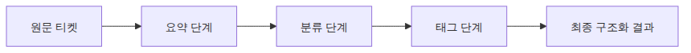

# 워크플로 자동화 — 다단계 체인 설계

## 이 글에서 답할 질문

- 여러 LLM 단계를 순차 체인으로 묶을 때 중간 산출물 구조를 어떻게 설계해야 할까요?
- 요약 → 분류 → 태깅 같은 다단계 워크플로는 어디서 실패를 감지해야 할까요?
- 고정된 워크플로가 Agent보다 나은 조건은 무엇일까요?

> 워크플로 자동화는 모델에게 선택권을 주는 대신, 사람이 정한 단계와 데이터 계약을 따라가게 만드는 파이프라인입니다.


> AI 앱 패턴 101 시리즈 (5/6)

예제 코드: [github.com/yeongseon-books/ai-app-patterns-101](https://github.com/yeongseon-books/ai-app-patterns-101/tree/main/ko/05-workflow-automation)

단일 LLM 호출로 해결하기 어려운 작업이 있습니다. 고객 문의를 받아 분류하고, 분류 결과에 따라 다른 처리를 하고, 최종적으로 답변을 생성하는 경우가 대표적입니다. 워크플로 자동화는 이런 여러 단계를 LangChain LCEL로 연결하는 패턴입니다.

이번 글에서는 다음을 다룹니다.

- 순차 체인 구성 방법
- 분기(routing) 패턴
- 실용적인 고객 지원 워크플로 예제
- 각 단계의 출력을 다음 단계로 넘기는 방법

---

## 순차 체인

LCEL의 `|` 연산자로 여러 단계를 연결합니다. 왼쪽 단계의 출력이 오른쪽 단계의 입력이 됩니다.

```python
import os

from langchain_core.output_parsers import StrOutputParser
from langchain_core.prompts import ChatPromptTemplate
from langchain_groq import ChatGroq

llm = ChatGroq(
    model="llama-3.1-8b-instant",
    api_key=os.environ["GROQ_API_KEY"],
)

# 1단계: 번역
translate_prompt = ChatPromptTemplate.from_messages([
    ("system", "다음 텍스트를 {target_language}로 번역하세요. 번역문만 반환하세요."),
    ("human", "{text}"),
])

# 2단계: 요약
summarize_prompt = ChatPromptTemplate.from_messages([
    ("system", "다음 텍스트를 2문장으로 요약하세요."),
    ("human", "{text}"),
])

# 3단계: 제목 생성
title_prompt = ChatPromptTemplate.from_messages([
    ("system", "다음 텍스트에 적합한 제목을 한 줄로 만드세요."),
    ("human", "{text}"),
])

str_parser = StrOutputParser()

# 순차 체인: 번역 → 요약 → 제목
def make_pipeline(target_language: str):
    """번역 → 요약 → 제목 생성 파이프라인."""

    def translate(inputs: dict) -> dict:
        translated = (translate_prompt | llm | str_parser).invoke({
            "text": inputs["text"],
            "target_language": target_language,
        })
        return {"text": translated}

    def summarize(inputs: dict) -> dict:
        summary = (summarize_prompt | llm | str_parser).invoke(inputs)
        return {"text": summary}

    def make_title(inputs: dict) -> str:
        return (title_prompt | llm | str_parser).invoke(inputs)

    return translate, summarize, make_title

article = """
Artificial intelligence is transforming the way businesses operate.
Companies across industries are adopting AI tools to automate repetitive tasks,
improve decision-making, and personalize customer experiences.
The healthcare sector, for instance, uses AI to assist in diagnosis and drug discovery.
In finance, AI powers fraud detection and algorithmic trading.
As AI becomes more capable, organizations must also address ethical considerations
such as bias, transparency, and data privacy.
"""

translate_fn, summarize_fn, title_fn = make_pipeline("한국어")

step1 = translate_fn({"text": article})
print(f"번역:\n{step1['text']}\n")

step2 = summarize_fn(step1)
print(f"요약:\n{step2['text']}\n")

step3 = title_fn(step2)
print(f"제목: {step3}")
```

```
출력 결과
번역:
인공 지능은 기업들이 작동하는 방식을 바꾸고 있습니다.
업계를 막론하고 기업들이 반복적인 업무를 자동화하고, 결정을 개선하고, 고객의 경험을 개인화하기 위해 AI 도구를 채택하고 있습니다.
건강 부문에서 예를 들어, AI는 진단과 약물 발굴에 도움을 주고 있습니다.
금융 부문에서 AI는 위조 차단과 알고리즘 트레이딩을 지원하고 있습니다.
AI가 더욱 능숙해질수록, 조직들은 또한 편향, 투명성, 데이터 개인 정보 보호와 같은 윤리적인 고려 사항을 해결해야 합니다.

요약:
기업들은 인공 지능(AI) 기술을 통해 업무의 자동화, 결정을 개선하고 고객의 경험을 개인화하기 위해 채택하고 있습니다. AI는 다양한 업계에서 활용되고 있으며, 건강 부문에서는 진단과 약물 발굴, 금융 부문에서는 위조 차단과 알고리즘 트레이딩을 지원하고 있습니다.

제목: "인공 지능(AI) 기술의 기업 적용"
```

---

## 분기(Routing) 패턴

입력에 따라 다른 처리 경로로 보냅니다. 먼저 분류 단계에서 카테고리를 판단하고, 그 결과에 따라 적절한 체인을 실행합니다.

```python
import os

from langchain_core.output_parsers import StrOutputParser
from langchain_core.prompts import ChatPromptTemplate
from langchain_groq import ChatGroq

llm = ChatGroq(
    model="llama-3.1-8b-instant",
    api_key=os.environ["GROQ_API_KEY"],
)
str_parser = StrOutputParser()

# 분류 체인
classify_prompt = ChatPromptTemplate.from_messages([
    (
        "system",
        "다음 고객 문의를 분류하세요.\n"
        "카테고리: BILLING(결제), TECHNICAL(기술), GENERAL(일반)\n"
        "카테고리 이름만 반환하세요. 다른 텍스트 없이.",
    ),
    ("human", "{inquiry}"),
])
classify_chain = classify_prompt | llm | str_parser

# 카테고리별 처리 체인
billing_prompt = ChatPromptTemplate.from_messages([
    (
        "system",
        "당신은 결제 전문 상담원입니다.\n"
        "환불, 청구서, 요금 관련 문의를 처리합니다.\n"
        "친절하고 정확하게 답하세요.",
    ),
    ("human", "{inquiry}"),
])

technical_prompt = ChatPromptTemplate.from_messages([
    (
        "system",
        "당신은 기술 지원 엔지니어입니다.\n"
        "버그, 오류, 사용 방법 문의를 처리합니다.\n"
        "단계별로 명확하게 안내하세요.",
    ),
    ("human", "{inquiry}"),
])

general_prompt = ChatPromptTemplate.from_messages([
    (
        "system",
        "당신은 고객 서비스 담당자입니다.\n"
        "일반적인 문의를 처리합니다.\n"
        "친절하게 안내하세요.",
    ),
    ("human", "{inquiry}"),
])

billing_chain = billing_prompt | llm | str_parser
technical_chain = technical_prompt | llm | str_parser
general_chain = general_prompt | llm | str_parser

def route_and_respond(inquiry: str) -> dict:
    """분류 → 라우팅 → 전문 응답 생성."""
    category = classify_chain.invoke({"inquiry": inquiry}).strip().upper()

    chains = {
        "BILLING": billing_chain,
        "TECHNICAL": technical_chain,
        "GENERAL": general_chain,
    }
    chain = chains.get(category, general_chain)
    response = chain.invoke({"inquiry": inquiry})

    return {"category": category, "response": response}

test_inquiries = [
    "지난달 요금이 갑자기 두 배로 올랐어요. 확인해 주세요.",
    "앱을 실행하면 계속 충돌이 납니다. 어떻게 해야 하나요?",
    "영업 시간이 어떻게 되나요?",
]

for inquiry in test_inquiries:
    print(f"\n문의: {inquiry}")
    result = route_and_respond(inquiry)
    print(f"카테고리: {result['category']}")
    print(f"답변: {result['response']}")
```

```
출력 결과

문의: 지난달 요금이 갑자기 두 배로 올랐어요. 확인해 주세요.
카테고리: BILLING
답변: 요금이 두 배로 올랐다는 것은 매우 이상한 현상입니다. 먼저, 최근 몇 달 동안의 요금 변동 사항을 확인해 보겠습니다.

1. 요금 계산서를 확인해 보겠습니다. 최근 몇 달 동안의 요금 변동 사항을 확인해 보겠습니다.
2. 요금 계산에 사용된 가격 정보를 확인해 보겠습니다. 최근 가격 정보가 변경되어 요금이 두 배로 올랐을 가능성이 있습니다.
3. 요금 계산 시 사용된 정책이나 규정에 대한 확인을 해 보겠습니다. 정책이나 규정 변경으로 인해 요금이 두 배로 올랐을 가능성이 있습니다.

만약 요금이 두 배로 올랐다는 것은 실수로 인한 오류거나, 정책 또는 가격 정보의 변경으로 인한 것이 아닌 경우, 다른 가능한 이유가 있습니다.

- 요금 계산 시 사용된 정보가 잘못된 경우
- 요금 계산 시 사용된 계산법이 잘못된 경우
- 요금 계산 시 사용된 데이터가 잘못된 경우

만약 위의 이유 중 하나가 있는 경우, 저희 고객센터에서 도움을 드릴 수 있습니다. 요금 청구서를 다시 한번 확인해 보겠습니다. 또한, 요금 청구서에 대한 자세한 정보를 제공해 드리겠습니다. 

위의 사항을 확인해 보았을 경우, 요금이 두 배로 올랐다는 것은 실수로 인한 오류가 아닌 정책 또는 가격 정보의 변경으로 인한 경우에 대한 조치를 취해 드리겠습니다.

다음과 같이 조치를 취해 드리겠습니다.
1. 요금 청구서를 다시 한번 확인해 보겠습니다.
2. 요금 청구서에 대한 자세한 정보를 제공해 드리겠습니다.
3. 정책이나 규정 변경에 대한 확인을 해 보겠습니다.
4. 요금 계산의 오류가 있는 경우, 즉시 조치해 드리겠습니다.

만약 위의 사항을 확인해 보았을 경우, 요금이 두 배로 올랐다는 것은 실수로 인한 오류가 아닌 정책 또는 가격 정보의 변경으로 인한 경우에 대한 조치를 취해 드리겠습니다.

문의: 앱을 실행하면 계속 충돌이 납니다. 어떻게 해야 하나요?
카테고리: TECHNICAL
답변: 앱이 계속 충돌하는 경우에는 몇 가지 기본적인 단계를 따라 해결 방법을 찾을 수 있습니다.

1. **앱을 재시작하세요**: 가장 먼저 앱을 재시작하도록 하세요. 종종 앱이 정상적으로 작동하지 않는 경우가 있지만, 간단한 재시작만으로도 문제를 해결할 수 있습니다.

2. **앱을 업데이트하세요**: 앱이 최신 버전인지 확인하세요. 만약 앱 버전이 outdated라면, 최신 버전으로 업데이트를 해보세요. 업데이트 후 앱이 정상적으로 작동하는지 확인하세요.

3. **앱 데이터를 초기화하세요**: 앱 데이터를 초기화하도록 하세요. 이 방법은 앱을 초기화하지만, 사용자 데이터는 삭제됩니다. 앱을 삭제한 후에 재설치하여 초기화합니다.

4. **앱을 캐시를 삭제하세요**: 앱 캐시를 삭제하도록 하세요. 캐시가 오래되어 앱이 충돌하는 경우가 있습니다. 설정 - 앱 관리 - 앱 이름을 선택하여 캐시를 삭제하도록 하세요.

5. **전화에서 앱을 삭제 후 재설치하세요**: 앱을 삭제한 후에 재설치를 하도록 하세요. 만약 앱이 정상적으로 작동하지 않는다면, 문제가 앱 자체에 있다는 것이 확정됩니다.

6. **문제를 신고하세요**: 만약 위의 방법으로도 해결되지 않았다면, 앱 개발자에게 문제를 신고하도록 하세요. 개발자는 문제를 분석하여 해결 방법을 찾을 것입니다.

앱이 계속 충돌하는 경우에는 위의 방법들을 시도하여 문제를 해결할 수 있습니다. 만약 해결되지 않으면, 앱 개발자에게 문제를 신고하여 해결 방법을 찾을 수 있을 것입니다.

문의: 영업 시간이 
... (truncated)
```

---

## 다단계 데이터 변환 파이프라인

각 단계가 이전 단계의 결과를 받아 처리하는 실용적인 패턴입니다. 코드 리뷰 워크플로를 예로 듭니다.

```python
import os

from langchain_core.output_parsers import JsonOutputParser, StrOutputParser
from langchain_core.prompts import ChatPromptTemplate
from langchain_groq import ChatGroq

llm = ChatGroq(
    model="llama-3.1-8b-instant",
    api_key=os.environ["GROQ_API_KEY"],
)

# 1단계: 코드 분석 (JSON 출력)
analyze_prompt = ChatPromptTemplate.from_messages([
    (
        "system",
        "다음 코드를 분석하고 JSON으로 반환하세요.\n"
        '형식: {{"language": "언어", "purpose": "목적", "issues": ["문제점 목록"], "score": 1-10}}\n'
        "JSON만 반환하세요.",
    ),
    ("human", "코드:\n{code}"),
])

# 2단계: 개선 제안 (분석 결과 기반)
suggest_prompt = ChatPromptTemplate.from_messages([
    (
        "system",
        "코드 분석 결과를 바탕으로 구체적인 개선 방안을 제시하세요.\n"
        "각 문제점에 대해 수정된 코드 예시를 포함하세요.",
    ),
    ("human", "분석 결과:\n{analysis}\n\n원본 코드:\n{code}"),
])

# 3단계: 요약 리포트
report_prompt = ChatPromptTemplate.from_messages([
    (
        "system",
        "코드 리뷰 결과를 간결한 리포트로 정리하세요.\n"
        "총평, 주요 개선사항, 권장 조치 순으로 작성하세요.",
    ),
    ("human", "분석:\n{analysis}\n\n개선 제안:\n{suggestions}"),
])

analyze_chain = analyze_prompt | llm | JsonOutputParser()
suggest_chain = suggest_prompt | llm | StrOutputParser()
report_chain = report_prompt | llm | StrOutputParser()

def code_review_pipeline(code: str) -> dict:
    """코드 분석 → 개선 제안 → 리포트 생성."""
    # 1단계: 분석
    analysis = analyze_chain.invoke({"code": code})
    print(f"  분석 완료: 점수 {analysis.get('score')}/10, 문제 {len(analysis.get('issues', []))}개")

    # 2단계: 개선 제안
    suggestions = suggest_chain.invoke({
        "analysis": str(analysis),
        "code": code,
    })
    print("  개선 제안 완료")

    # 3단계: 리포트
    report = report_chain.invoke({
        "analysis": str(analysis),
        "suggestions": suggestions,
    })
    print("  리포트 생성 완료")

    return {
        "analysis": analysis,
        "suggestions": suggestions,
        "report": report,
    }

sample_code = """
def get_user(id):
    import sqlite3
    conn = sqlite3.connect('users.db')
    cursor = conn.cursor()
    cursor.execute(f"SELECT * FROM users WHERE id = {id}")
    result = cursor.fetchone()
    conn.close()
    return result
"""

print("코드 리뷰 파이프라인 실행 중...")
result = code_review_pipeline(sample_code)
print(f"\n=== 최종 리포트 ===\n{result['report']}")
```

```
출력 결과
코드 리뷰 파이프라인 실행 중...
  분석 완료: 점수 6/10, 문제 3개
  개선 제안 완료
  리포트 생성 완료

=== 최종 리포트 ===
**총평**
코드는 데이터베이스에서 사용자 정보를 조회하는 데 사용되었는데, 몇 가지 문제가 있었습니다. SQL 인젝션 공격에 취약하고 에러 핸들링이 미흡했으며, 데이터베이스 연결을 close() 메서드로 직접 처리했습니다. 그러나 이러한 문제점을 해결하고 개선된 코드를 제공했습니다.

**주요 개선 사항**

1.  **SQL 인젝션 공격에 취약한 문제 해결**: parameterized query를 사용하여 사용자 입력 값을 신뢰할 수 없게 만들었습니다.
2.  **에러 핸들링의 개선**: try-except 블록을 사용하여 데이터베이스 연결이 실패하는 경우 예외를 적절하게 처리했습니다.
3.  **데이터베이스 연결의 개선**: with 문을 사용하여 context manager를 사용하여 자원을 자동으로 회수했습니다.

**권장 조치**
개선된 코드를 사용하여 데이터베이스에서 사용자 정보를 조회하세요. 또한, 데이터베이스 연결에 사용되는 코드를 리뷰하고, 개선된 코드를 적용하지 않은 경우에도 SQL 인젝션 공격에 취약하고 에러 핸들링이 미흡하며, 데이터베이스 연결을 close() 메서드로 직접 처리하는 경우 조치를 취하세요.
```

---

## 이 코드에서 봐야 할 것

- `main.py`는 같은 문의 텍스트를 요약, 카테고리 분류, 태그 추천 세 단계로 나눠 순차 실행합니다.
- 각 단계 출력이 모두 `dict`로 이어져 중간 결과를 그대로 로깅하거나 저장하기 쉽습니다.
- 이 패턴은 승인, 라우팅, 재시도 같은 운영 제어를 끼워 넣기 좋습니다.

---

## 실무에서 헷갈리는 지점

- 단계를 많이 쪼개면 항상 좋아질 것 같지만, 호출 수가 늘면서 비용과 실패 지점도 같이 늘어납니다.
- 중간 결과를 문자열 하나로만 넘기면 나중에 분기와 검증을 넣기 어렵습니다. 구조화된 dict가 유리합니다.
- 워크플로와 에이전트의 경계는 도구 사용 여부가 아니라 경로가 런타임에 바뀌는지 여부입니다.

---

## 체크리스트

- [ ] 요약 결과가 다음 단계 입력으로 전달된다
- [ ] 분류 단계가 제한된 카테고리 중 하나를 반환한다
- [ ] 태그 단계가 앞선 단계 결과를 함께 사용한다
- [ ] 최종 출력이 중간 결과를 모두 포함한 구조화 객체다

---

## 마무리

다단계 체인에서 핵심은 각 단계를 단일 책임으로 유지하는 것입니다. 하나의 단계가 너무 많은 일을 하면 중간 결과를 검증하기 어렵고, 오류가 발생했을 때 원인을 찾기 힘들어집니다. 단계를 작게 나누고 각 단계의 출력을 다음 단계의 입력으로 명확히 연결하는 것이 유지보수하기 쉬운 워크플로의 기본입니다.

다음 글에서는 Human-in-the-loop 패턴을 다룹니다. 자동화 파이프라인 중간에 사람의 판단과 승인을 넣는 방법입니다.

<!-- toc:begin -->
## 시리즈 목차

- [챗봇 패턴 — 대화 이력 관리와 상태](./01-chatbot-pattern.md)
- [RAG Q&A 패턴 — 문서 기반 질의응답](./02-rag-qa-pattern.md)
- [문서 어시스턴트 — 요약, 추출, 분류](./03-document-assistant.md)
- [Agent + Tool 패턴 — 자율 도구 선택](./04-agent-tool-pattern.md)
- **워크플로 자동화 — 다단계 체인 설계 (현재 글)**
- Human-in-the-loop — 사람 개입 설계 패턴 (예정)

<!-- toc:end -->

---

## 참고 자료

- [LangChain LCEL](https://python.langchain.com/docs/expression_language/)
- [LangChain 라우팅](https://python.langchain.com/docs/expression_language/how_to/routing/)
- [RunnableParallel](https://python.langchain.com/docs/expression_language/primitives/parallel/)

Tags: LLM, RAG, Agent, Python
