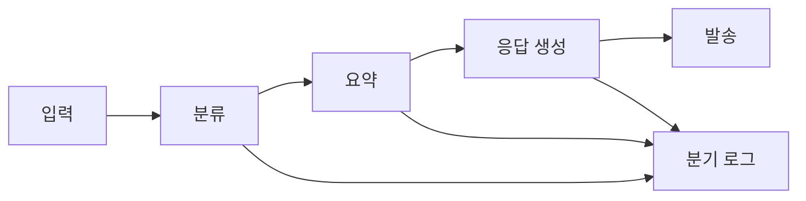
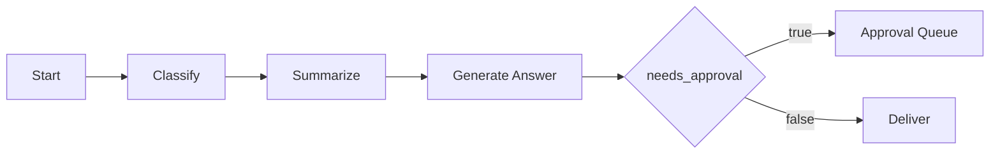

# AI App Patterns 101 (5/6): 워크플로 자동화 — 다단계 체인 설계

작업 단계가 예측 가능할 때는 모델에게 자유를 더 주는 편이 오히려 시스템 신뢰도를 떨어뜨립니다. 워크플로의 가치는 handoff 지점, 중간 데이터 형태, 실패를 드러내야 하는 위치를 고정해 두는 데 있습니다.

한 번의 LLM 호출로는 잘 풀리지 않는 업무가 많습니다. 고객 문의를 받아 요약하고, 분류하고, 카테고리별 로직을 적용하고, 답변을 생성하는 식의 흐름이 대표적입니다. 이런 작업은 모델의 즉흥성보다 단계 간 계약이 더 중요합니다.

이 글은 AI App Patterns 101 시리즈의 다섯 번째 글입니다. 여기서는 명시적인 단계와 깔끔한 데이터 계약을 가진 다단계 LLM 워크플로를 어떻게 설계할지 다룹니다.

## 먼저 던지는 질문

- 다단계 체인은 언제 단순 순차 실행이고 언제 라우팅이 필요할까요?
- 중간 결과의 타입을 고정하지 않으면 다음 단계에서 어떤 문제가 생길까요?
- 워크플로 자동화에서 실패를 한 번에 숨기지 않으려면 어디에 로그를 남겨야 할까요?

## 큰 그림


*단계 사이의 순차 handoff*

이 그림에서는 입력이 여러 처리 단계를 지나거나 분류 결과에 따라 다른 경로로 라우팅되는 흐름을 봅니다. 워크플로 자동화의 핵심은 단계별 계약과 실패 지점을 분리해서 긴 체인을 추적 가능하게 만드는 것입니다.

> 워크플로 자동화는 모델의 선택권을 줄이고, 사람이 정의한 단계와 데이터 계약을 따르는 파이프라인으로 바꾸는 설계입니다.

## 순차 체인

### 단계 사이의 순차 handoff

### 병렬 작업을 포함한 DAG 스타일 분기


*병렬 작업을 포함한 DAG 스타일 분기*
LCEL의 `|` 연산자는 단계를 연결합니다. 왼쪽 단계의 출력이 오른쪽 단계의 입력이 됩니다.

```python
import os

from langchain_core.output_parsers import StrOutputParser
from langchain_core.prompts import ChatPromptTemplate
from langchain_groq import ChatGroq

llm = ChatGroq(
    model="llama-3.1-8b-instant",
    api_key=os.environ["GROQ_API_KEY"],
)

translate_prompt = ChatPromptTemplate.from_messages([
    ("system", "Translate the following text to {target_language}. Return only the translation."),
    ("human", "{text}"),
])

summarize_prompt = ChatPromptTemplate.from_messages([
    ("system", "Summarize the following text in two sentences."),
    ("human", "{text}"),
])

title_prompt = ChatPromptTemplate.from_messages([
    ("system", "Generate a one-line title for the following text."),
    ("human", "{text}"),
])

str_parser = StrOutputParser()

def make_pipeline(target_language: str):
    """Return translate → summarize → title functions for the given language."""

    def translate(inputs: dict) -> dict:
        translated = (translate_prompt | llm | str_parser).invoke({
            "text": inputs["text"],
            "target_language": target_language,
        })
        return {"text": translated}

    def summarize(inputs: dict) -> dict:
        summary = (summarize_prompt | llm | str_parser).invoke(inputs)
        return {"text": summary}

    def make_title(inputs: dict) -> str:
        return (title_prompt | llm | str_parser).invoke(inputs)

    return translate, summarize, make_title

article = """
Artificial intelligence is transforming the way businesses operate.
Companies across industries are adopting AI tools to automate repetitive tasks,
improve decision-making, and personalize customer experiences.
The healthcare sector uses AI to assist in diagnosis and drug discovery.
In finance, AI powers fraud detection and algorithmic trading.
As AI becomes more capable, organizations must also address ethical considerations
such as bias, transparency, and data privacy.
"""

translate_fn, summarize_fn, title_fn = make_pipeline("Korean")

step1 = translate_fn({"text": article})
print(f"translation:\n{step1['text']}\n")

step2 = summarize_fn(step1)
print(f"summary:\n{step2['text']}\n")

step3 = title_fn(step2)
print(f"title: {step3}")
```

---

## 라우팅 — 분류 기반 분기

### 분류가 결정하는 라우팅


*분류가 결정하는 라우팅*
### 승인 게이트와 재시도 복구


*승인 게이트와 재시도 복구*
먼저 입력을 분류하고, 그 결과에 따라 적절한 체인으로 보냅니다. 두 단계 사이의 유일한 의존성은 분류기의 출력입니다.

```python
import os

from langchain_core.output_parsers import StrOutputParser
from langchain_core.prompts import ChatPromptTemplate
from langchain_groq import ChatGroq

llm = ChatGroq(
    model="llama-3.1-8b-instant",
    api_key=os.environ["GROQ_API_KEY"],
)
str_parser = StrOutputParser()

classify_prompt = ChatPromptTemplate.from_messages([
    (
        "system",
        "Classify the following customer inquiry.\n"
        "Categories: BILLING, TECHNICAL, GENERAL\n"
        "Return the category name only. No other text.",
    ),
    ("human", "{inquiry}"),
])
classify_chain = classify_prompt | llm | str_parser

billing_prompt = ChatPromptTemplate.from_messages([
    (
        "system",
        "You are a billing specialist.\n"
        "Handle refunds, invoices, and charge-related inquiries.\n"
        "Be accurate and reassuring.",
    ),
    ("human", "{inquiry}"),
])

technical_prompt = ChatPromptTemplate.from_messages([
    (
        "system",
        "You are a technical support engineer.\n"
        "Handle bugs, errors, and how-to questions.\n"
        "Guide users step by step.",
    ),
    ("human", "{inquiry}"),
])

general_prompt = ChatPromptTemplate.from_messages([
    (
        "system",
        "You are a customer service representative.\n"
        "Handle general inquiries politely and helpfully.",
    ),
    ("human", "{inquiry}"),
])

billing_chain = billing_prompt | llm | str_parser
technical_chain = technical_prompt | llm | str_parser
general_chain = general_prompt | llm | str_parser

def route_and_respond(inquiry: str) -> dict:
    """Classify → route → generate specialist response."""
    category = classify_chain.invoke({"inquiry": inquiry}).strip().upper()

    chains = {
        "BILLING": billing_chain,
        "TECHNICAL": technical_chain,
        "GENERAL": general_chain,
    }
    chain = chains.get(category, general_chain)
    response = chain.invoke({"inquiry": inquiry})

    return {"category": category, "response": response}

test_inquiries = [
    "My bill doubled this month without any explanation. Please check.",
    "The app keeps crashing when I open it. What should I do?",
    "What are your business hours?",
]

for inquiry in test_inquiries:
    print(f"\ninquiry: {inquiry}")
    result = route_and_respond(inquiry)
    print(f"category: {result['category']}")
    print(f"response: {result['response']}")
```

---

## 다단계 데이터 변환 파이프라인

### 코드 리뷰 산출물 계약


*코드 리뷰 산출물 계약*
각 단계는 이전 단계의 출력을 다른 형태로 변환합니다. 아래 코드 리뷰 파이프라인은 analysis → suggestions → report라는 세 단계 변환을 보여 줍니다.

> 멘탈 모델은 각 단계를 작은 서비스처럼 보는 것입니다. 이전 단계가 불분명한 문자열을 넘기면 다음 단계는 조용히 실패합니다. 계약이 분명한 `dict`를 넘기면 로깅, 검증, 재시도가 훨씬 쉬워집니다.

```python
import os

from langchain_core.output_parsers import JsonOutputParser, StrOutputParser
from langchain_core.prompts import ChatPromptTemplate
from langchain_groq import ChatGroq

llm = ChatGroq(
    model="llama-3.1-8b-instant",
    api_key=os.environ["GROQ_API_KEY"],
)

analyze_prompt = ChatPromptTemplate.from_messages([
    (
        "system",
        "Analyze the following code and return JSON only.\n"
        'Format: {{"language": "lang", "purpose": "purpose", "issues": ["issue list"], "score": 1-10}}',
    ),
    ("human", "Code:\n{code}"),
])

suggest_prompt = ChatPromptTemplate.from_messages([
    (
        "system",
        "Based on the code analysis, provide specific improvements.\n"
        "Include corrected code examples for each issue.",
    ),
    ("human", "Analysis:\n{analysis}\n\nOriginal code:\n{code}"),
])

report_prompt = ChatPromptTemplate.from_messages([
    (
        "system",
        "Summarize the code review into a concise report.\n"
        "Structure: overall assessment, key improvements, recommended actions.",
    ),
    ("human", "Analysis:\n{analysis}\n\nSuggestions:\n{suggestions}"),
])

analyze_chain = analyze_prompt | llm | JsonOutputParser()
suggest_chain = suggest_prompt | llm | StrOutputParser()
report_chain = report_prompt | llm | StrOutputParser()

def code_review_pipeline(code: str) -> dict:
    """Code analysis → suggestions → report."""
    analysis = analyze_chain.invoke({"code": code})
    print(f"  analysis done: score {analysis.get('score')}/10, {len(analysis.get('issues', []))} issues")

    suggestions = suggest_chain.invoke({
        "analysis": str(analysis),
        "code": code,
    })
    print("  suggestions done")

    report = report_chain.invoke({
        "analysis": str(analysis),
        "suggestions": suggestions,
    })
    print("  report done")

    return {"analysis": analysis, "suggestions": suggestions, "report": report}

sample_code = """
def get_user(id):
    import sqlite3
    conn = sqlite3.connect('users.db')
    cursor = conn.cursor()
    cursor.execute(f"SELECT * FROM users WHERE id = {id}")
    result = cursor.fetchone()
    conn.close()
    return result
"""

print("running code review pipeline...")
result = code_review_pipeline(sample_code)
print(f"\n=== final report ===\n{result['report']}")
```

---

## 이 코드에서 먼저 볼 점

- `code_review_pipeline()`은 JSON 분석, 개선 제안, 최종 보고서라는 세 handoff를 분명하게 보여 줍니다.
- 특히 중간 `analysis` 객체가 계약 역할을 하므로, 원시 문자열만 넘길 때보다 로깅과 검증이 훨씬 쉬워집니다.
- 이런 구조는 승인, 라우팅, 재시도 정책 같은 운영 제어와 잘 맞습니다.

---

## 어디서 자주 헷갈릴까요?

- 단계가 많다고 자동으로 좋아지지 않습니다. 호출 하나가 늘 때마다 비용, 지연, 실패 표면도 함께 늘어납니다.
- 단계 사이에 원시 문자열만 넘기면 이후 검증과 분기가 구조화된 딕셔너리를 넘길 때보다 훨씬 어려워집니다.
- 워크플로와 에이전트를 가르는 진짜 기준은 도구 사용 여부가 아니라, 실행 경로가 런타임에 바뀌는지 여부입니다.

---

## 체크리스트

- [ ] 요약 출력이 다음 단계의 입력으로 전달된다
- [ ] 분류기가 제한된 카테고리 집합 중 하나를 반환한다
- [ ] 태깅 단계가 원문만이 아니라 앞선 단계 결과도 활용한다
- [ ] 최종 출력이 중간 산출물을 여전히 포함하는 구조화 객체다

---

## 정리

각 단계는 하나의 책임만 맡게 두는 편이 좋습니다. 너무 많은 일을 하는 단계는 테스트하기 어렵고, 디버깅하기 어렵고, 교체하기도 어렵습니다. 단계 출력이 구조화 데이터여야 하는데 자유 텍스트로 흘러나오면, 다음 단계는 조용히 실패하는 경우가 많습니다. 모든 단계의 출력 형식을 먼저 정의하고 검증한 뒤에야 다음 단계로 넘기는 습관이 필요합니다.

마지막 글에서는 Human-in-the-loop 설계를 다룹니다. 자동화 파이프라인 안에 사람 검토와 승인 게이트를 삽입하는 방식입니다.

---

## 워크플로 오케스트레이션과 상태 전이

### 단계 상태를 가진 오케스트레이터

다단계 체인을 운영할 때는 각 단계의 성공/실패를 구조화해서 남겨야 합니다. 아래 예시는 상태 전이 기록을 포함한 최소 오케스트레이터입니다.

```python
from dataclasses import dataclass, field
from datetime import datetime

@dataclass
class StageEvent:
    stage: str
    status: str
    timestamp: str
    detail: str = ""

@dataclass
class WorkflowRun:
    run_id: str
    input_text: str
    events: list[StageEvent] = field(default_factory=list)
    outputs: dict = field(default_factory=dict)

    def mark(self, stage: str, status: str, detail: str = ""):
        self.events.append(StageEvent(
            stage=stage,
            status=status,
            timestamp=datetime.utcnow().isoformat(),
            detail=detail,
        ))

def run_workflow(text: str) -> WorkflowRun:
    run = WorkflowRun(run_id='wf-001', input_text=text)

    run.mark('classify', 'started')
    category = 'TECHNICAL'
    run.outputs['category'] = category
    run.mark('classify', 'completed', detail=f'category={category}')

    run.mark('summarize', 'started')
    summary = f'요약: {text[:100]}...'
    run.outputs['summary'] = summary
    run.mark('summarize', 'completed')

    run.mark('response', 'started')
    response = f'[{category}] {summary}'
    run.outputs['response'] = response
    run.mark('response', 'completed')

    return run
```

이벤트 로그가 있으면 실패가 나도 "최종 결과 없음"으로 끝나지 않습니다. 어느 단계까지 성공했는지 보이기 때문에 재시작 지점을 명확히 잡을 수 있습니다.

### 워크플로 다이어그램



*단계별 상태 이벤트를 남기는 워크플로*

### 운영 체크: 재시도와 멱등성

워크플로 자동화는 재시도 설계를 빼면 반쪽짜리입니다. 같은 입력이 두 번 들어와도 결과가 중복 발송되지 않도록 `idempotency_key`를 두고, 단계별 재시도 횟수를 제한해야 합니다.

- `idempotency_key`: 외부 요청 ID 또는 `(customer_id, request_ts)` 해시
- `retry_policy`: 단계별 `max_retries`, backoff, timeout
- `dead_letter_queue`: 반복 실패 건의 격리 저장소

이 기준이 없으면 장애 상황에서 자동화가 복구를 돕는 대신 중복 실행을 늘려 문제를 키우게 됩니다.

## 워크플로를 API와 이벤트로 분리하기

순차 체인이 한 프로세스에서만 돌아가면 장애 복구와 확장이 어렵습니다. 그래서 보통 트리거 API와 실행 워커를 분리합니다.

```python
from fastapi import FastAPI
from pydantic import BaseModel

app = FastAPI()

class WorkflowRequest(BaseModel):
    request_id: str
    text: str

work_queue: list[dict] = []

@app.post('/workflow/submit')
def submit(req: WorkflowRequest):
    work_queue.append({'request_id': req.request_id, 'text': req.text, 'status': 'queued'})
    return {'request_id': req.request_id, 'status': 'queued'}
```

```python
def worker_once():
    if not work_queue:
        return None

    item = work_queue.pop(0)
    run = run_workflow(item['text'])
    return {
        'request_id': item['request_id'],
        'status': 'completed',
        'outputs': run.outputs,
        'events': [e.__dict__ for e in run.events],
    }
```

### 승인 게이트를 포함한 워크플로 확장

자동화 파이프라인에 사람 승인을 넣어야 할 때는 별도 상태를 둡니다.

```text
queued -> running -> waiting_approval -> approved -> completed
queued -> running -> waiting_approval -> rejected
queued -> running -> failed
```

이 상태 전이가 있으면 대시보드에서 "왜 멈췄는가"를 한눈에 확인할 수 있습니다.

### 운영 메트릭

워크플로 자동화에서는 모델 품질 지표와 함께 프로세스 지표를 같이 봐야 합니다.

- `p95_stage_latency`: 단계별 지연 시간
- `reprocess_rate`: 재처리 비율
- `approval_wait_time`: 사람 승인 대기 시간
- `dead_letter_count`: 반복 실패 건수

이 네 가지가 잡혀 있으면 자동화가 실제로 효율을 높이는지, 단지 복잡도만 늘렸는지 판단할 수 있습니다.

## LangGraph 스타일 상태 머신으로 확장하기

워크플로가 길어지면 순차 함수 호출보다 상태 머신이 관리하기 쉽습니다. 노드별 책임을 분리하고 상태 객체를 공유하면 분기와 재시도를 명확히 다룰 수 있습니다.

```python
from typing import TypedDict

class FlowState(TypedDict):
    request_id: str
    inquiry: str
    category: str
    summary: str
    answer: str
    needs_approval: bool

def node_classify(state: FlowState) -> FlowState:
    state['category'] = 'BILLING'
    state['needs_approval'] = state['category'] == 'BILLING'
    return state

def node_summarize(state: FlowState) -> FlowState:
    state['summary'] = state['inquiry'][:120]
    return state

def node_answer(state: FlowState) -> FlowState:
    state['answer'] = f"[{state['category']}] {state['summary']}"
    return state
```

### 상태 기반 분기 다이어그램



*상태 플래그 기반 승인 분기*

### 왜 상태 머신이 유리한가

- 단계 추가 시 기존 코드 영향 범위를 줄일 수 있습니다.
- 실패 노드를 기준으로 재시작하기 쉽습니다.
- 대시보드에서 현재 노드를 그대로 보여 줄 수 있습니다.

이 특성 덕분에 워크플로 자동화는 기능 개발보다 운영 단계에서 더 큰 이점을 얻습니다.

## 장애 복구 런북: 단계 재실행

워크플로 장애 대응은 전체 재실행보다 단계 재실행이 기본이어야 합니다. 이를 위해 각 단계 출력 아티팩트를 저장해 둡니다.

```text
artifact://run_id/classify.json
artifact://run_id/summary.txt
artifact://run_id/response.txt
```

```python
def resume_from_stage(run_id: str, stage: str):
    if stage == 'summarize':
        classify = load_artifact(run_id, 'classify.json')
        return rerun_summarize_and_after(run_id, classify)
    if stage == 'response':
        summary = load_artifact(run_id, 'summary.txt')
        return rerun_response_only(run_id, summary)
    raise ValueError('unsupported stage')
```

재실행 단위를 단계로 제한하면 장애 대응 시간이 줄고, 중복 발송 같은 2차 사고를 줄일 수 있습니다.

### Flask 상태 조회 엔드포인트

```python
from flask import Flask, jsonify
app = Flask(__name__)

RUNS = {}

@app.get('/workflow/<run_id>')
def get_workflow_run(run_id: str):
    data = RUNS.get(run_id)
    if not data:
        return jsonify({'error': 'not found'}), 404
    return jsonify(data)
```

운영자는 이 엔드포인트로 현재 단계와 실패 이유를 즉시 확인할 수 있습니다. 워크플로 자동화의 품질은 기능 수보다 관측 가능성에서 결정됩니다.

### 단계별 타임아웃 정책

긴 워크플로에서 전체 타임아웃 하나만 두면 병목 단계를 찾기 어렵습니다. 분류 3초, 요약 8초, 응답 생성 8초처럼 단계별 제한 시간을 분리하면 지연 원인을 빠르게 좁힐 수 있습니다.

### 배포 전 드라이런

워크플로 변경을 배포할 때는 실데이터 대신 샘플 100건으로 드라이런을 수행해 단계별 성공률과 지연 시간을 비교해야 합니다. 드라이런 리포트 없이 배포하면 변경 영향 범위를 과소평가하기 쉽습니다.

### 운영 회고에서 반드시 남길 항목

패턴 설계가 실제로 효과가 있었는지는 회고 기록 품질에서 드러납니다. 각 글에서 다룬 구조를 실서비스에 적용했다면, 최소한 다음 항목은 공통 템플릿으로 남기는 편이 좋습니다.

- 변경 전/후의 실패 유형 분포
- 변경 전/후의 평균 지연 시간과 p95
- 사람이 개입한 건수와 자동 처리 건수 비율
- 근거 부족, 파싱 실패, 도구 오류 같은 실패 코드의 추세
- 다음 분기에서 조정할 임계값 또는 프롬프트 버전

이 기록이 쌓이면 모델 자체 성능보다 애플리케이션 패턴 결정이 어떤 영향을 주었는지 분리해서 볼 수 있습니다. 결국 운영 품질은 한 번의 정답 설계가 아니라, 측정 가능한 개선 루프를 오래 유지하는 능력에서 만들어집니다.

이 항목을 주간 리듬으로 점검하면, 자동화 품질이 우연이 아니라 재현 가능한 운영 습관으로 자리잡습니다.

## 처음 질문으로 돌아가기

- **다단계 체인은 언제 단순 순차 실행이고 언제 라우팅이 필요할까요?**
  모든 입력이 같은 순서로 처리되면 순차 체인이 충분하지만, 입력 유형별로 다른 처리나 담당자가 필요하면 라우팅이 필요합니다.

- **중간 결과의 타입을 고정하지 않으면 다음 단계에서 어떤 문제가 생길까요?**
  중간 결과 타입이 고정되지 않으면 다음 단계가 기대한 필드를 못 찾거나 문자열과 JSON을 혼동해 조용히 실패할 수 있습니다.

- **워크플로 자동화에서 실패를 한 번에 숨기지 않으려면 어디에 로그를 남겨야 할까요?**
  각 단계의 입력, 출력, 분기 결정, 예외를 별도로 기록해야 마지막 결과만 보고 원인을 추측하지 않아도 됩니다.

<!-- toc:begin -->
## 시리즈 목차

- [AI App Patterns 101 (1/6): 챗봇 패턴 — 대화 이력과 상태 관리](./01-chatbot-pattern.md)
- [AI App Patterns 101 (2/6): RAG Q&A 패턴 — 문서 기반 질의응답](./02-rag-qa-pattern.md)
- [AI App Patterns 101 (3/6): 문서 어시스턴트 — 요약, 추출, 분류](./03-document-assistant.md)
- [AI App Patterns 101 (4/6): 에이전트와 도구 패턴 — 자율적 도구 선택](./04-agent-tool-pattern.md)
- **AI App Patterns 101 (5/6): 워크플로 자동화 — 다단계 체인 설계 (현재 글)**
- AI App Patterns 101 (6/6): Human-in-the-loop — 사람 개입 설계 (예정)

<!-- toc:end -->

---

## 참고 자료

- [LangChain LCEL](https://python.langchain.com/docs/expression_language/)
- [LangChain routing](https://python.langchain.com/docs/expression_language/how_to/routing/)
- [RunnableParallel](https://python.langchain.com/docs/expression_language/primitives/parallel/)

- [이 글의 예제 코드 (book-examples)](https://github.com/yeongseon-books/book-examples/tree/main/ai-app-patterns-101/ko/05-workflow-automation)

Tags: LLM, RAG, Agent, Python
