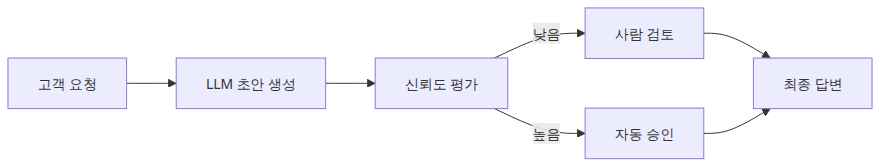
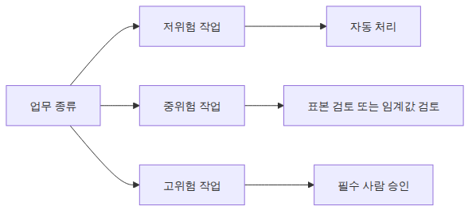
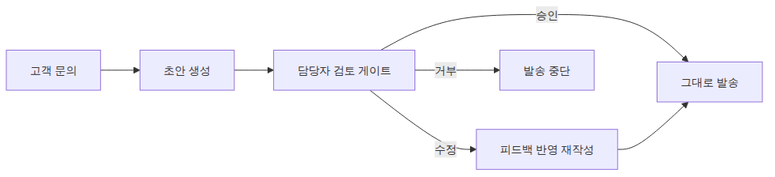
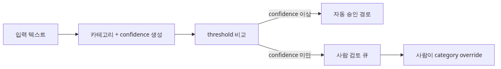
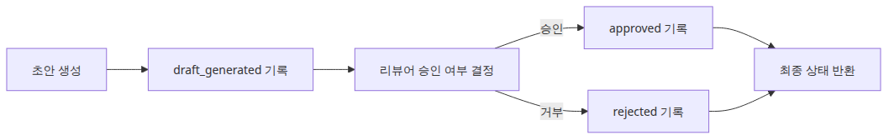
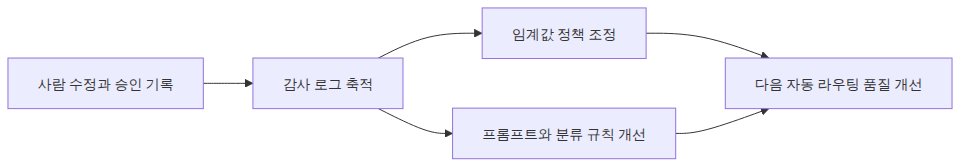

# Human-in-the-loop — 사람 개입 설계

더 나은 자동화가 사람 검토를 없애 주는 것은 아닙니다. 오히려 검토 경계를 더 중요하게 만듭니다. AI 시스템이 초안을 쓰고, 분류하고, 대규모로 행동을 트리거할 수 있게 되면, 진짜 엔지니어링 문제는 무엇을 그대로 통과시켜도 되는지와 무엇을 승인 대기 상태로 멈춰야 하는지를 정하는 일입니다.

완전 자동화가 언제나 바람직한 것도 아닙니다. 민감한 고객 데이터, 법적 효력이 있는 문서, 금전 의사결정이 걸리는 곳에서는 모델 출력이 효력을 갖기 전에 사람이 반드시 검토해야 합니다. HITL은 자동화 파이프라인 안에 이런 판단을 끼워 넣는 패턴입니다.

이 글은 AI App Patterns 101 시리즈의 마지막 글입니다. 여기서는 자동화 전체를 수동 작업으로 되돌리지 않으면서, 파이프라인 안에 사람 판단을 어디에 배치할지 다룹니다.

## 이 글에서 다룰 문제

- AI가 만든 초안을 보내기 전에 어떤 기준으로 사람 승인 단계를 넣어야 할까요?
- 신뢰도가 낮은 출력만 사람에게 올리는 분기를 어떻게 구현할 수 있을까요?
- 자동화 안에서 검증 가능성을 유지하면서도 사람 검토를 모델링하려면 HITL 데모 스크립트를 어떻게 구성해야 할까요?

> Human-in-the-loop는 자동화를 포기하는 것이 아니라, 자동화가 위험한 지점에만 사람 판단을 삽입하는 설계입니다.



*이 글에서 답할 질문*
> AI App Patterns 101 (6/6)

예제 코드: [github.com/yeongseon-books/ai-app-patterns-101](https://github.com/yeongseon-books/ai-app-patterns-101/tree/main/en/06-human-in-the-loop)

다룰 주제는 다음과 같습니다.

- HITL이 맞는 선택인 상황
- 승인 게이트 구현
- 신뢰도 기반 자동/수동 분기
- 감사 로그

---

## HITL이 맞는 선택인 상황

### 위험 수준에 따른 사람 검토



*위험 수준에 따른 사람 검토*
HITL은 지연과 비용을 늘립니다. 따라서 검증 없이 흘려보낸 오류의 비용이 큰 곳에서 써야 합니다.

**고위험 의사결정**: 송금, 계약 생성, 개인정보 처리처럼 실수 비용이 크거나 되돌리기 어려운 작업입니다.

**낮은 모델 신뢰도**: 불확실한 출력을 그대로 downstream에 넘기지 말고 사람에게 보내야 합니다.

**규제 요구사항**: 일부 산업은 완전 자율 AI 의사결정을 허용하지 않습니다.

**신뢰를 쌓는 초기 단계**: 새 시스템은 처음에 전수 사람 검토로 시작하고, 모델 신뢰가 쌓일수록 사람 검토 비율을 줄이는 편이 안전합니다.

---

## 기본 승인 게이트

### 승인 게이트가 있는 초안 생성



*승인 게이트가 있는 초안 생성*
가장 단순한 HITL 패턴은 파이프라인이 계속 진행되기 전에 사람 입력을 기다리는 blocking prompt입니다.

```python
import os

from langchain_core.output_parsers import StrOutputParser
from langchain_core.prompts import ChatPromptTemplate
from langchain_groq import ChatGroq

llm = ChatGroq(
    model="llama-3.1-8b-instant",
    api_key=os.environ["GROQ_API_KEY"],
)

draft_prompt = ChatPromptTemplate.from_messages([
    (
        "system",
        "You are a customer service representative.\n"
        "Write a draft response to the customer inquiry below.\n"
        "Be polite and professional.",
    ),
    ("human", "Customer inquiry:\n{inquiry}"),
])

draft_chain = draft_prompt | llm | StrOutputParser()

refine_prompt = ChatPromptTemplate.from_messages([
    (
        "system",
        "Revise the draft response based on the reviewer's feedback.\n"
        "Apply the feedback faithfully while maintaining a professional tone.",
    ),
    ("human", "Draft:\n{draft}\n\nFeedback:\n{feedback}"),
])

refine_chain = refine_prompt | llm | StrOutputParser()

def draft_with_human_review(inquiry: str) -> str:
    """Generate draft → human review → optional refinement → final response."""
    draft = draft_chain.invoke({"inquiry": inquiry})
    print(f"\n=== generated draft ===\n{draft}\n")

    print("reviewer options:")
    print("  [1] approve — use the draft as-is")
    print("  [2] revise — provide feedback to improve the draft")
    print("  [3] reject — discard this response")

    choice = input("choice (1/2/3): ").strip()

    if choice == "1":
        return draft
    elif choice == "2":
        feedback = input("enter feedback: ").strip()
        refined = refine_chain.invoke({"draft": draft, "feedback": feedback})
        print(f"\n=== revised response ===\n{refined}")
        return refined
    else:
        print("response rejected")
        return ""

inquiry = "I ordered three weeks ago and my package still hasn't arrived. What happened?"
final_response = draft_with_human_review(inquiry)
if final_response:
    print(f"\n=== final response sent ===\n{final_response}")
```

---

## 신뢰도 기반 분기

### 신뢰도 임계값 라우팅



*신뢰도 임계값 라우팅*
LLM이 출력과 함께 신뢰도 점수도 반환하게 만들고, 낮은 신뢰도의 결과만 자동으로 사람 검토자에게 보낼 수 있습니다.

```python
import os

from langchain_core.output_parsers import JsonOutputParser
from langchain_core.prompts import ChatPromptTemplate
from langchain_groq import ChatGroq

llm = ChatGroq(
    model="llama-3.1-8b-instant",
    api_key=os.environ["GROQ_API_KEY"],
)

classify_prompt = ChatPromptTemplate.from_messages([
    (
        "system",
        "Classify the following text and rate your confidence.\n"
        "Return JSON only.\n"
        'Format: {{"category": "category name", "confidence": 0.0-1.0, "reason": "brief reason"}}',
    ),
    ("human", "{text}"),
])

chain = classify_prompt | llm | JsonOutputParser()

CONFIDENCE_THRESHOLD = 0.85

def classify_with_hitl(text: str) -> dict:
    """Route to human review when model confidence is below threshold."""
    result = chain.invoke({"text": text})
    confidence = result.get("confidence", 0.0)

    if confidence >= CONFIDENCE_THRESHOLD:
        result["reviewed_by"] = "auto"
        print(f"auto-classified: {result['category']} (confidence {confidence:.2f})")
    else:
        print(f"low confidence ({confidence:.2f}) — manual review required")
        print(f"AI suggested category: {result['category']}")
        print(f"reason: {result['reason']}")
        human_category = input("enter correct category: ").strip()
        result["category"] = human_category
        result["reviewed_by"] = "human"

    return result

texts = [
    "Q3 2024 revenue increased 23 percent year-over-year.",  # clear case
    "The product was kind of different from what I expected.",  # ambiguous
]

for text in texts:
    print(f"\ntext: {text}")
    result = classify_with_hitl(text)
    print(f"result: {result}")
```

---

## 감사 로그

### 감사 이벤트로 남기는 검토 결정



*감사 이벤트로 남기는 검토 결정*
HITL 시스템은 누가 무엇을 언제 검토했는지 기록해야 합니다. 이 감사 로그는 시간이 지나면 모델 개선을 위한 학습 데이터가 되기도 합니다.

> 멘탈 모델은 단순합니다. 사람 검토는 파이프라인 바깥의 예외가 아니라, 기록 가능한 시스템 이벤트여야 합니다. 승인과 거부가 모두 남아야 다음 정책 조정이 가능합니다.

```python
import json
import os
from datetime import datetime
from pathlib import Path

from langchain_core.output_parsers import StrOutputParser
from langchain_core.prompts import ChatPromptTemplate
from langchain_groq import ChatGroq

LOG_FILE = Path("audit_log.jsonl")

llm = ChatGroq(
    model="llama-3.1-8b-instant",
    api_key=os.environ["GROQ_API_KEY"],
)

generate_prompt = ChatPromptTemplate.from_messages([
    ("system", "Draft a contract clause for the following request."),
    ("human", "{request}"),
])

generate_chain = generate_prompt | llm | StrOutputParser()

def log_event(event_type: str, data: dict) -> None:
    """Append an audit event to the JSONL log file."""
    entry = {
        "timestamp": datetime.now().isoformat(),
        "event_type": event_type,
        **data,
    }
    with LOG_FILE.open("a", encoding="utf-8") as f:
        f.write(json.dumps(entry, ensure_ascii=False) + "\n")

def contract_clause_with_audit(request: str, reviewer_id: str) -> dict:
    """Generate clause draft → audit log → human approval."""
    draft = generate_chain.invoke({"request": request})
    log_event("draft_generated", {"request": request, "draft": draft})

    print(f"\ndraft:\n{draft}\n")
    approved = input("approve? (y/n): ").strip().lower() == "y"

    if approved:
        log_event("approved", {
            "reviewer_id": reviewer_id,
            "request": request,
            "draft": draft,
        })
        return {"status": "approved", "content": draft}
    else:
        reason = input("rejection reason: ").strip()
        log_event("rejected", {
            "reviewer_id": reviewer_id,
            "request": request,
            "draft": draft,
            "reason": reason,
        })
        return {"status": "rejected", "reason": reason}

result = contract_clause_with_audit(
    request="full refund within 30 days of cancellation",
    reviewer_id="reviewer_001",
)
print(f"\nresult: {result['status']}")
print(f"audit log: {LOG_FILE}")
```

---

## 이 코드에서 먼저 볼 점

- `main.py`는 생성된 초안에 점수를 매기고, 낮은 신뢰도 사례만 `input()` 스타일 검토 단계로 보냅니다.
- 자동 검증을 위해 스크립트는 `HITL_DECISIONS` 환경변수로 검토자 선택을 시뮬레이션할 수 있습니다.
- 실제 애플리케이션에서는 이 경계가 승인 큐와 운영자 콘솔이 됩니다.

---

## 어디서 자주 헷갈릴까요?

### 정책 루프로 되돌아가는 사람 피드백



*정책 루프로 되돌아가는 사람 피드백*
- HITL은 항상 맨 마지막에만 놓이지 않습니다. 분류 전, 발송 전, 송금 전에도 사람 검토가 들어갈 수 있습니다.
- 신뢰도 점수는 객관적 진실값이 아니라 라우팅 힌트입니다. 검토 임계값은 결국 별도의 정책 판단이 필요합니다.
- 사람 검토를 추가하면 통제력은 좋아지지만 처리량은 떨어집니다. 운영 인력과 SLA 영향까지 함께 설계해야 합니다.

---

## 체크리스트

- [ ] 저위험 요청은 자동 승인 경로로 끝날 수 있다
- [ ] 고위험 또는 저신뢰 요청은 사람 검토 경로로 라우팅된다
- [ ] 검토자 결정이 최종 출력에 반영된다
- [ ] 자동 실행에서도 환경변수로 검토자 선택을 재현할 수 있다

---

## 정리

HITL은 자동화를 버리는 뜻이 아닙니다. 신뢰도가 높은 출력은 자동으로 통과시키고, 신뢰도가 낮거나 위험이 큰 출력만 사람 검토를 위해 멈춥니다. 모델이 실제 트래픽에서 신뢰를 쌓을수록 비율은 자동화 쪽으로 이동할 수 있습니다. 그리고 감사 로그가 루프를 닫습니다. 모든 사람 교정은 다음 미세조정이나 임계값 조정의 근거가 됩니다.

이 시리즈는 챗봇, RAG Q&A, 문서 어시스턴트, 도구를 쓰는 에이전트, 워크플로 자동화, Human-in-the-loop라는 여섯 가지 핵심 LLM 애플리케이션 패턴을 다뤘습니다. 각 패턴은 독립적으로도 쓸 수 있고, 서로 조합해 더 복잡한 시스템을 만들 수도 있습니다.

<!-- toc:begin -->
## 시리즈 목차

- [챗봇 패턴 — 대화 이력과 상태 관리](./01-chatbot-pattern.md)
- [RAG Q&A 패턴 — 문서 기반 질의응답](./02-rag-qa-pattern.md)
- [문서 어시스턴트 — 요약, 추출, 분류](./03-document-assistant.md)
- [에이전트와 도구 패턴 — 자율적 도구 선택](./04-agent-tool-pattern.md)
- [워크플로 자동화 — 다단계 체인 설계](./05-workflow-automation.md)
- **Human-in-the-loop — 사람 개입 설계 (현재 글)**

<!-- toc:end -->

---

## 참고 자료

- [LangGraph human-in-the-loop guide](https://langchain-ai.github.io/langgraph/how-tos/human_in_the_loop/)
- [NIST AI Risk Management Framework](https://www.nist.gov/itl/ai-risk-management-framework)
- [Python `json` 모듈 문서](https://docs.python.org/3/library/json.html)

Tags: LLM, RAG, Agent, Python
