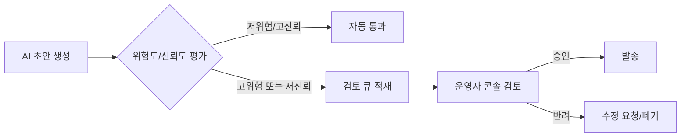

# AI App Patterns 101 (6/6): Human-in-the-loop — 사람 개입 설계

더 나은 자동화가 사람 검토를 없애 주는 것은 아닙니다. 오히려 검토 경계를 더 중요하게 만듭니다. AI 시스템이 초안을 쓰고, 분류하고, 대규모로 행동을 트리거할 수 있게 되면, 진짜 엔지니어링 문제는 무엇을 그대로 통과시켜도 되는지와 무엇을 승인 대기 상태로 멈춰야 하는지를 정하는 일입니다.

완전 자동화가 언제나 바람직한 것도 아닙니다. 민감한 고객 데이터, 법적 효력이 있는 문서, 금전 의사결정이 걸리는 곳에서는 모델 출력이 효력을 갖기 전에 사람이 반드시 검토해야 합니다. HITL은 자동화 파이프라인 안에 이런 판단을 끼워 넣는 패턴입니다.

이 글은 AI App Patterns 101 시리즈의 마지막 글입니다. 여기서는 자동화 전체를 수동 작업으로 되돌리지 않으면서, 파이프라인 안에 사람 판단을 어디에 배치할지 다룹니다.

## 먼저 던지는 질문

- Human-in-the-loop은 모델이 약해서 붙이는 예외 처리일까요, 제품 설계의 일부일까요?
- 승인 게이트와 신뢰도 기반 분기는 각각 어떤 상황에 맞을까요?
- 사람이 개입한 결정을 나중에 감사하려면 무엇을 로그로 남겨야 할까요?

## 큰 그림


*위험 수준에 따른 사람 검토*

이 그림에서는 자동 처리 경로가 특정 조건에서 사람 승인 또는 검토 단계로 분기되는 흐름을 봅니다. HITL은 자동화를 포기하는 장치가 아니라 위험한 결정을 안전한 경계 안에 두는 설계입니다.

> Human-in-the-loop는 자동화를 포기하는 것이 아니라, 자동화가 위험한 지점에만 사람 판단을 삽입하는 설계입니다.

## HITL이 맞는 선택인 상황

### 위험 수준에 따른 사람 검토

HITL은 지연과 비용을 늘립니다. 따라서 검증 없이 흘려보낸 오류의 비용이 큰 곳에서 써야 합니다.

**고위험 의사결정**: 송금, 계약 생성, 개인정보 처리처럼 실수 비용이 크거나 되돌리기 어려운 작업입니다.

**낮은 모델 신뢰도**: 불확실한 출력을 그대로 downstream에 넘기지 말고 사람에게 보내야 합니다.

**규제 요구사항**: 일부 산업은 완전 자율 AI 의사결정을 허용하지 않습니다.

**신뢰를 쌓는 초기 단계**: 새 시스템은 처음에 전수 사람 검토로 시작하고, 모델 신뢰가 쌓일수록 사람 검토 비율을 줄이는 편이 안전합니다.

---

## 기본 승인 게이트

### 승인 게이트가 있는 초안 생성


*승인 게이트가 있는 초안 생성*
가장 단순한 HITL 패턴은 파이프라인이 계속 진행되기 전에 사람 입력을 기다리는 blocking prompt입니다.

```python
import os

from langchain_core.output_parsers import StrOutputParser
from langchain_core.prompts import ChatPromptTemplate
from langchain_groq import ChatGroq

llm = ChatGroq(
    model="llama-3.1-8b-instant",
    api_key=os.environ["GROQ_API_KEY"],
)

draft_prompt = ChatPromptTemplate.from_messages([
    (
        "system",
        "You are a customer service representative.\n"
        "Write a draft response to the customer inquiry below.\n"
        "Be polite and professional.",
    ),
    ("human", "Customer inquiry:\n{inquiry}"),
])

draft_chain = draft_prompt | llm | StrOutputParser()

refine_prompt = ChatPromptTemplate.from_messages([
    (
        "system",
        "Revise the draft response based on the reviewer's feedback.\n"
        "Apply the feedback faithfully while maintaining a professional tone.",
    ),
    ("human", "Draft:\n{draft}\n\nFeedback:\n{feedback}"),
])

refine_chain = refine_prompt | llm | StrOutputParser()

def draft_with_human_review(inquiry: str) -> str:
    """Generate draft → human review → optional refinement → final response."""
    draft = draft_chain.invoke({"inquiry": inquiry})
    print(f"\n=== generated draft ===\n{draft}\n")

    print("reviewer options:")
    print("  [1] approve — use the draft as-is")
    print("  [2] revise — provide feedback to improve the draft")
    print("  [3] reject — discard this response")

    choice = input("choice (1/2/3): ").strip()

    if choice == "1":
        return draft
    elif choice == "2":
        feedback = input("enter feedback: ").strip()
        refined = refine_chain.invoke({"draft": draft, "feedback": feedback})
        print(f"\n=== revised response ===\n{refined}")
        return refined
    else:
        print("response rejected")
        return ""

inquiry = "I ordered three weeks ago and my package still hasn't arrived. What happened?"
final_response = draft_with_human_review(inquiry)
if final_response:
    print(f"\n=== final response sent ===\n{final_response}")
```

---

## 신뢰도 기반 분기

### 신뢰도 임계값 라우팅


*신뢰도 임계값 라우팅*
LLM이 출력과 함께 신뢰도 점수도 반환하게 만들고, 낮은 신뢰도의 결과만 자동으로 사람 검토자에게 보낼 수 있습니다.

```python
import os

from langchain_core.output_parsers import JsonOutputParser
from langchain_core.prompts import ChatPromptTemplate
from langchain_groq import ChatGroq

llm = ChatGroq(
    model="llama-3.1-8b-instant",
    api_key=os.environ["GROQ_API_KEY"],
)

classify_prompt = ChatPromptTemplate.from_messages([
    (
        "system",
        "Classify the following text and rate your confidence.\n"
        "Return JSON only.\n"
        'Format: {{"category": "category name", "confidence": 0.0-1.0, "reason": "brief reason"}}',
    ),
    ("human", "{text}"),
])

chain = classify_prompt | llm | JsonOutputParser()

CONFIDENCE_THRESHOLD = 0.85

def classify_with_hitl(text: str) -> dict:
    """Route to human review when model confidence is below threshold."""
    result = chain.invoke({"text": text})
    confidence = result.get("confidence", 0.0)

    if confidence >= CONFIDENCE_THRESHOLD:
        result["reviewed_by"] = "auto"
        print(f"auto-classified: {result['category']} (confidence {confidence:.2f})")
    else:
        print(f"low confidence ({confidence:.2f}) — manual review required")
        print(f"AI suggested category: {result['category']}")
        print(f"reason: {result['reason']}")
        human_category = input("enter correct category: ").strip()
        result["category"] = human_category
        result["reviewed_by"] = "human"

    return result

texts = [
    "Q3 2024 revenue increased 23 percent year-over-year.",  # clear case
    "The product was kind of different from what I expected.",  # ambiguous
]

for text in texts:
    print(f"\ntext: {text}")
    result = classify_with_hitl(text)
    print(f"result: {result}")
```

---

## 감사 로그

### 감사 이벤트로 남기는 검토 결정


*감사 이벤트로 남기는 검토 결정*
HITL 시스템은 누가 무엇을 언제 검토했는지 기록해야 합니다. 이 감사 로그는 시간이 지나면 모델 개선을 위한 학습 데이터가 되기도 합니다.

> 멘탈 모델은 단순합니다. 사람 검토는 파이프라인 바깥의 예외가 아니라, 기록 가능한 시스템 이벤트여야 합니다. 승인과 거부가 모두 남아야 다음 정책 조정이 가능합니다.

```python
import json
import os
from datetime import datetime
from pathlib import Path

from langchain_core.output_parsers import StrOutputParser
from langchain_core.prompts import ChatPromptTemplate
from langchain_groq import ChatGroq

LOG_FILE = Path("audit_log.jsonl")

llm = ChatGroq(
    model="llama-3.1-8b-instant",
    api_key=os.environ["GROQ_API_KEY"],
)

generate_prompt = ChatPromptTemplate.from_messages([
    ("system", "Draft a contract clause for the following request."),
    ("human", "{request}"),
])

generate_chain = generate_prompt | llm | StrOutputParser()

def log_event(event_type: str, data: dict) -> None:
    """Append an audit event to the JSONL log file."""
    entry = {
        "timestamp": datetime.now().isoformat(),
        "event_type": event_type,
        **data,
    }
    with LOG_FILE.open("a", encoding="utf-8") as f:
        f.write(json.dumps(entry, ensure_ascii=False) + "\n")

def contract_clause_with_audit(request: str, reviewer_id: str) -> dict:
    """Generate clause draft → audit log → human approval."""
    draft = generate_chain.invoke({"request": request})
    log_event("draft_generated", {"request": request, "draft": draft})

    print(f"\ndraft:\n{draft}\n")
    approved = input("approve? (y/n): ").strip().lower() == "y"

    if approved:
        log_event("approved", {
            "reviewer_id": reviewer_id,
            "request": request,
            "draft": draft,
        })
        return {"status": "approved", "content": draft}
    else:
        reason = input("rejection reason: ").strip()
        log_event("rejected", {
            "reviewer_id": reviewer_id,
            "request": request,
            "draft": draft,
            "reason": reason,
        })
        return {"status": "rejected", "reason": reason}

result = contract_clause_with_audit(
    request="full refund within 30 days of cancellation",
    reviewer_id="reviewer_001",
)
print(f"\nresult: {result['status']}")
print(f"audit log: {LOG_FILE}")
```

---

## 이 코드에서 먼저 볼 점

- `main.py`는 생성된 초안에 점수를 매기고, 낮은 신뢰도 사례만 `input()` 스타일 검토 단계로 보냅니다.
- 자동 검증을 위해 스크립트는 `HITL_DECISIONS` 환경변수로 검토자 선택을 시뮬레이션할 수 있습니다.
- 실제 애플리케이션에서는 이 경계가 승인 큐와 운영자 콘솔이 됩니다.

---

## 어디서 자주 헷갈릴까요?

### 정책 루프로 되돌아가는 사람 피드백


*정책 루프로 되돌아가는 사람 피드백*
- HITL은 항상 맨 마지막에만 놓이지 않습니다. 분류 전, 발송 전, 송금 전에도 사람 검토가 들어갈 수 있습니다.
- 신뢰도 점수는 객관적 진실값이 아니라 라우팅 힌트입니다. 검토 임계값은 결국 별도의 정책 판단이 필요합니다.
- 사람 검토를 추가하면 통제력은 좋아지지만 처리량은 떨어집니다. 운영 인력과 SLA 영향까지 함께 설계해야 합니다.

---

## 체크리스트

- [ ] 저위험 요청은 자동 승인 경로로 끝날 수 있다
- [ ] 고위험 또는 저신뢰 요청은 사람 검토 경로로 라우팅된다
- [ ] 검토자 결정이 최종 출력에 반영된다
- [ ] 자동 실행에서도 환경변수로 검토자 선택을 재현할 수 있다

---

## 정리

HITL은 자동화를 버리는 뜻이 아닙니다. 신뢰도가 높은 출력은 자동으로 통과시키고, 신뢰도가 낮거나 위험이 큰 출력만 사람 검토를 위해 멈춥니다. 모델이 실제 트래픽에서 신뢰를 쌓을수록 비율은 자동화 쪽으로 이동할 수 있습니다. 그리고 감사 로그가 루프를 닫습니다. 모든 사람 교정은 다음 미세조정이나 임계값 조정의 근거가 됩니다.

이 시리즈는 챗봇, RAG Q&A, 문서 어시스턴트, 도구를 쓰는 에이전트, 워크플로 자동화, Human-in-the-loop라는 여섯 가지 핵심 LLM 애플리케이션 패턴을 다뤘습니다. 각 패턴은 독립적으로도 쓸 수 있고, 서로 조합해 더 복잡한 시스템을 만들 수도 있습니다.

---

## 운영형 HITL: 검토 큐와 UI 흐름

### 검토 큐 API와 상태 전이

콘솔 `input()`은 개념 설명에는 충분하지만, 실제 서비스에서는 검토 큐가 필요합니다. 아래 예시는 검토 대상 생성, 조회, 승인/반려 업데이트를 분리한 FastAPI 스케치입니다.

```python
from fastapi import FastAPI, HTTPException
from pydantic import BaseModel

app = FastAPI()
review_queue: dict[str, dict] = {}

class ReviewItemCreate(BaseModel):
    request_id: str
    draft: str
    risk_level: str
    confidence: float

class ReviewDecision(BaseModel):
    reviewer_id: str
    decision: str  # approve | reject
    reason: str | None = None

@app.post('/reviews')
def create_review(item: ReviewItemCreate):
    review_queue[item.request_id] = {
        'status': 'pending',
        'draft': item.draft,
        'risk_level': item.risk_level,
        'confidence': item.confidence,
    }
    return {'request_id': item.request_id, 'status': 'pending'}

@app.get('/reviews/{request_id}')
def get_review(request_id: str):
    if request_id not in review_queue:
        raise HTTPException(status_code=404, detail='not found')
    return review_queue[request_id]

@app.post('/reviews/{request_id}/decision')
def decide_review(request_id: str, decision: ReviewDecision):
    if request_id not in review_queue:
        raise HTTPException(status_code=404, detail='not found')

    record = review_queue[request_id]
    record['status'] = 'approved' if decision.decision == 'approve' else 'rejected'
    record['reviewer_id'] = decision.reviewer_id
    record['reason'] = decision.reason
    return {'request_id': request_id, 'status': record['status']}
```

### 운영자 UI 흐름



*위험도와 신뢰도 기반 HITL UI 흐름*

### 사람 피드백을 정책으로 환류하기

HITL의 목적은 단순 승인 절차가 아닙니다. 반려 사유를 수집해 임계값과 프롬프트, 라우팅 규칙을 조정하는 데 있습니다. 예를 들어 반려 로그가 "법적 표현 과장"에 집중된다면, 생성 프롬프트에 금지 표현 규칙을 추가하고 해당 유형의 요청을 기본 검토 대상으로 승격할 수 있습니다.

```text
feedback_tag=legal_risk_overclaim
action_1=system_prompt_rule_add("확정적 법률 표현 금지")
action_2=threshold_update(risk=legal, confidence_cutoff=0.92)
action_3=mandatory_human_review(category=contract_clause)
```

이 루프가 있어야 HITL은 비용만 늘리는 절차가 아니라, 시간이 갈수록 자동화 품질을 끌어올리는 학습 시스템이 됩니다.

## 사람 검토 UX와 SLA 설계

HITL은 백엔드 로직만으로 완성되지 않습니다. 검토자가 빠르게 판단할 수 있는 화면 정보가 필요합니다. 최소한 아래 항목은 한 화면에서 보여야 합니다.

- 원본 입력 전문
- 모델 제안 출력
- 위험도/신뢰도 점수와 분기 이유
- 과거 유사 사례(승인/반려)
- 승인/반려 버튼과 사유 템플릿

### 검토 화면 데이터 계약

```json
{
  "request_id": "req-2026-05-21-119",
  "input": "계약 해지 후 30일 이내 전액 환불 조항 작성",
  "draft": "...",
  "risk_level": "high",
  "confidence": 0.71,
  "route_reason": "confidence_below_threshold",
  "history": [
    {"decision": "rejected", "reason": "법률적 단정 표현"}
  ]
}
```

검토자가 필요한 정보가 부족하면 승인 시간이 길어지고, 결국 자동화의 이점이 사라집니다. HITL에서 UX는 선택이 아니라 성능 요소입니다.

### Flask로 웹훅 기반 승인 반영

```python
from flask import Flask, request, jsonify

app = Flask(__name__)
state: dict[str, str] = {}

@app.post('/webhook/review-decision')
def review_decision_webhook():
    payload = request.json
    request_id = payload['request_id']
    decision = payload['decision']

    if decision == 'approve':
        state[request_id] = 'approved'
    else:
        state[request_id] = 'rejected'

    return jsonify({'request_id': request_id, 'status': state[request_id]})
```

### SLA 관점의 HITL 운영 규칙

사람 검토 단계가 들어오면 SLA를 다시 정의해야 합니다. 자동 응답 SLA와 검토 응답 SLA를 분리하지 않으면 운영 지표가 왜곡됩니다.

```text
auto_path_sla: 5초 이내 응답
human_review_sla: 30분 이내 1차 판정
escalation_rule: 30분 초과 시 on-call reviewer 호출
```

이 규칙을 명문화해 두면, HITL이 품질을 올리면서도 서비스 지연을 관리 가능한 범위에 묶을 수 있습니다.

## 정책 기준을 코드로 고정하기

HITL을 일관되게 운영하려면 "누가 볼지"를 매번 사람 감으로 정하면 안 됩니다. 위험도와 신뢰도 기준을 코드로 고정해야 팀 간 판단 편차를 줄일 수 있습니다.

```python
def should_require_human_review(risk_level: str, confidence: float, category: str) -> tuple[bool, str]:
    mandatory_categories = {'contract_clause', 'payment_refund', 'account_suspension'}

    if category in mandatory_categories:
        return True, 'mandatory_category'
    if risk_level == 'high':
        return True, 'high_risk'
    if confidence < 0.85:
        return True, 'low_confidence'
    return False, 'auto_pass'
```

### 승인자 책임 분리

```text
role=reviewer_level1: 일반 문의 승인/반려
role=reviewer_level2: 법무/금전/계정정지 최종 승인
role=auditor: 로그 열람, 정책 적합성 점검
```

책임 경계를 나누면 승인 병목과 책임 공백을 동시에 줄일 수 있습니다.

### 감사 로그 스키마 확장

```json
{
  "event_type": "review_decision",
  "request_id": "req-119",
  "route_reason": "mandatory_category",
  "reviewer_id": "legal_reviewer_02",
  "decision": "approved",
  "decision_latency_sec": 412,
  "policy_version": "hitl-policy-v3"
}
```

정책 버전을 로그에 남기면, 나중에 동일 입력이 왜 다른 결과를 냈는지 설명 가능성을 확보할 수 있습니다. HITL 시스템에서 설명 가능성은 선택이 아니라 기본 요구사항입니다.

## 검토 품질 측정 지표

HITL은 검토자 수를 늘린다고 자동으로 좋아지지 않습니다. 검토 일관성을 수치로 봐야 정책을 개선할 수 있습니다.

- `review_overturn_rate`: AI 제안을 사람이 뒤집은 비율
- `inter_reviewer_agreement`: 검토자 간 일치도
- `escalation_rate`: 2차 검토로 올라간 비율
- `false_auto_pass_rate`: 자동 통과 후 사후 반려된 비율

```python
def compute_overturn_rate(items: list[dict]) -> float:
    if not items:
        return 0.0
    overturned = sum(1 for i in items if i['ai_decision'] != i['human_decision'])
    return overturned / len(items)
```

이 지표를 주간 단위로 보면 임계값이 너무 낮은지, 특정 카테고리에서 모델이 반복적으로 흔들리는지 빠르게 포착할 수 있습니다.

### 검토 큐 우선순위 규칙

```text
priority=P1: 금전/법무 영향 + confidence < 0.9
priority=P2: 계정/권한 변경 + confidence < 0.85
priority=P3: 일반 문의 + confidence < 0.75
```

우선순위 기준이 없으면 검토 큐는 오래된 요청과 긴급 요청을 구분하지 못하고 SLA를 쉽게 위반합니다.

### 검토자 피드백 템플릿

반려 사유를 자유 텍스트로만 받으면 통계가 어려워집니다. `사실 오류`, `규정 위반`, `표현 과장`, `근거 부족` 같은 템플릿 태그를 함께 기록하면 정책 개선 루프가 빨라집니다.

### 정책 실험 방법

임계값을 바꿀 때는 전체 트래픽에 즉시 적용하지 않고 일부 비율에서만 A/B 테스트를 수행하는 편이 안전합니다. 검토 대기 시간과 반려율, 사후 오류율을 함께 보고 정책을 승격해야 운영 충격을 줄일 수 있습니다.

### 운영 회고에서 반드시 남길 항목

패턴 설계가 실제로 효과가 있었는지는 회고 기록 품질에서 드러납니다. 각 글에서 다룬 구조를 실서비스에 적용했다면, 최소한 다음 항목은 공통 템플릿으로 남기는 편이 좋습니다.

- 변경 전/후의 실패 유형 분포
- 변경 전/후의 평균 지연 시간과 p95
- 사람이 개입한 건수와 자동 처리 건수 비율
- 근거 부족, 파싱 실패, 도구 오류 같은 실패 코드의 추세
- 다음 분기에서 조정할 임계값 또는 프롬프트 버전

이 기록이 쌓이면 모델 자체 성능보다 애플리케이션 패턴 결정이 어떤 영향을 주었는지 분리해서 볼 수 있습니다. 결국 운영 품질은 한 번의 정답 설계가 아니라, 측정 가능한 개선 루프를 오래 유지하는 능력에서 만들어집니다.

이 항목을 주간 리듬으로 점검하면, 자동화 품질이 우연이 아니라 재현 가능한 운영 습관으로 자리잡습니다.

## 처음 질문으로 돌아가기

- **Human-in-the-loop은 모델이 약해서 붙이는 예외 처리일까요, 제품 설계의 일부일까요?**
  HITL은 모델이 약해서 붙이는 임시 예외가 아니라, 위험도와 책임 소재가 있는 결정을 제품 흐름 안에서 관리하는 설계입니다.

- **승인 게이트와 신뢰도 기반 분기는 각각 어떤 상황에 맞을까요?**
  명시적 승인이 필요한 배포·환불·권한 변경에는 승인 게이트가 맞고, 점수나 정책 기준에 따라 일부만 검토하려면 신뢰도 기반 분기가 맞습니다.

- **사람이 개입한 결정을 나중에 감사하려면 무엇을 로그로 남겨야 할까요?**
  원본 입력, 모델 제안, 신뢰도, 분기 이유, 승인자, 승인 시각, 최종 결정을 감사 로그로 남겨야 합니다.

<!-- toc:begin -->
## 시리즈 목차

- [AI App Patterns 101 (1/6): 챗봇 패턴 — 대화 이력과 상태 관리](./01-chatbot-pattern.md)
- [AI App Patterns 101 (2/6): RAG Q&A 패턴 — 문서 기반 질의응답](./02-rag-qa-pattern.md)
- [AI App Patterns 101 (3/6): 문서 어시스턴트 — 요약, 추출, 분류](./03-document-assistant.md)
- [AI App Patterns 101 (4/6): 에이전트와 도구 패턴 — 자율적 도구 선택](./04-agent-tool-pattern.md)
- [AI App Patterns 101 (5/6): 워크플로 자동화 — 다단계 체인 설계](./05-workflow-automation.md)
- **AI App Patterns 101 (6/6): Human-in-the-loop — 사람 개입 설계 (현재 글)**

<!-- toc:end -->

---

## 참고 자료

- [LangGraph human-in-the-loop guide](https://langchain-ai.github.io/langgraph/how-tos/human_in_the_loop/)
- [NIST AI Risk Management Framework](https://www.nist.gov/itl/ai-risk-management-framework)
- [Python `json` 모듈 문서](https://docs.python.org/3/library/json.html)

- [이 글의 예제 코드 (book-examples)](https://github.com/yeongseon-books/book-examples/tree/main/ai-app-patterns-101/ko/06-human-in-the-loop)

Tags: LLM, RAG, Agent, Python
