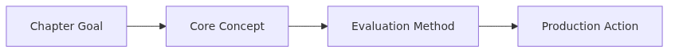
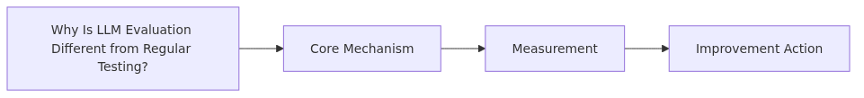
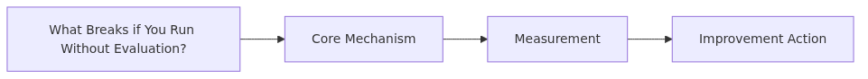
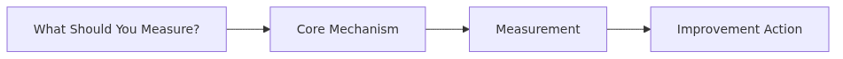
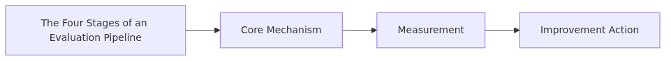

# Why Evaluate LLM Applications

> AI Evaluation 101 Series (1/10)

LLMs return different answers for the same input. Without evaluation, you cannot tell that a feature working yesterday is broken today. This post covers why LLM evaluation differs from regular software testing and what to measure.

---

## Why Is LLM Evaluation Different from Regular Testing?


Traditional unit tests are deterministic: `assert add(2, 3) == 5`. The same input produces the same output, and there is exactly one right answer.

LLMs are different.

```python
from openai import OpenAI

client = OpenAI()

def summarize(text: str) -> str:
    resp = client.chat.completions.create(
        model="gpt-4o-mini",
        messages=[{"role": "user", "content": f"Summarize in one sentence: {text}"}],
    )
    return resp.choices[0].message.content
```

Send the same `text` twice and the two responses will not match exactly. Several answers can reasonably be called "correct," and many are hard to call "wrong" with confidence. `==` comparison alone cannot evaluate this.

## What Breaks if You Run Without Evaluation?


Three things break at once.

1. **You cannot detect regressions.** You change one line of a prompt, another case breaks, and without evals you only learn from a user complaint.
2. **You become afraid to upgrade models.** You want to move from gpt-4o-mini to gpt-4.1, but with no way to measure "is it better?" you simply do not move.
3. **You have no proof you improved anything.** Saying "this prompt is better" carries no weight without numbers; you cannot convince stakeholders.

```python
# What changing a prompt without evals looks like
# Before: "Summarize in one sentence:"
# After:  "Summarize concisely in one sentence in a friendly tone:"
# -> You have no idea which cases got better and which got worse.
```

## What Should You Measure?


LLM responses have at least four dimensions, and each needs a different measurement approach.

```python
from dataclasses import dataclass

@dataclass
class EvalResult:
    correctness: float  # are the facts right
    relevance: float    # does it answer the question
    safety: float       # any harm or bias
    style: float        # does it follow the requested format and tone
```

1. **Correctness**: are the facts right? In RAG, does the answer match retrieved context?
2. **Relevance**: does the answer address the question or wander around it?
3. **Safety**: any PII leakage, discriminatory language, or dangerous advice?
4. **Style**: does it follow the JSON schema, length limit, or tone you required?

Later posts in this series cover which metrics fit each dimension, one at a time.

## The Four Stages of an Evaluation Pipeline


Whatever tool you use, an LLM evaluation system has the same four stages.

```python
def run_evaluation(eval_set: list[dict], system_under_test) -> dict:
    # 1. Generate — feed inputs to the system under test, collect responses
    predictions = [system_under_test(ex["input"]) for ex in eval_set]

    # 2. Score — score each response
    scores = [score_one(ex, pred) for ex, pred in zip(eval_set, predictions)]

    # 3. Aggregate — roll up the scores
    summary = {
        "accuracy": sum(s["correct"] for s in scores) / len(scores),
        "avg_relevance": sum(s["relevance"] for s in scores) / len(scores),
    }

    # 4. Compare — compare against the previous version
    return summary
```

1. **Generate**: produce system responses for the eval set inputs.
2. **Score**: score each response (deterministic metric, LLM-as-judge, human rating, or a combination).
3. **Aggregate**: roll up by dimension — average, pass rate, p95.
4. **Compare**: compare against the previous version or a baseline to catch regressions.

## Your First Evaluation — Start with Ten

"I will evaluate once we have enough data" means you will not start a year from now. Start with ten.

```python
eval_set = [
    {"input": "What is RAG?", "expected_keywords": ["retrieval", "generation"]},
    {"input": "Explain async/await", "expected_keywords": ["coroutine", "await"]},
    # ... 8 more
]

def score_one(ex, pred: str) -> dict:
    keywords_found = sum(1 for kw in ex["expected_keywords"] if kw.lower() in pred.lower())
    return {
        "correct": keywords_found == len(ex["expected_keywords"]),
        "keyword_recall": keywords_found / len(ex["expected_keywords"]),
    }

results = run_evaluation(eval_set, summarize)
print(f"Accuracy: {results['accuracy']:.0%}")
```

Even ten cases give you signals like "case #5 dropped after the prompt change." That single signal catches 90% of regressions.

## Five Common Mistakes

1. **"We will evaluate once production stabilizes."** Without evaluation, you cannot know whether it has stabilized. Start with ten cases on day one.
2. **Obsessing over a single score.** "87% accuracy" hides a drop in safety. Always look per dimension.
3. **The prompt author writes the eval set.** They cherry-pick cases that favor their own prompt and the result is inflated. Pull cases from someone else or from production traces.
4. **Using only deterministic metrics.** BLEU alone penalizes "right meaning, different wording." Combine with LLM-as-judge or rubric scoring.
5. **Running the eval once.** LLMs are stochastic, so the same input can score differently. Repeat important comparisons 3-5 times and look at the variance too.

## Key Takeaways

- LLM responses are not deterministic, so `==` comparison does not work.
- Without evaluation you cannot detect regressions, upgrade models, or prove improvements.
- Measure at least four dimensions separately: correctness, relevance, safety, style.
- The pipeline is four stages: generate, score, aggregate, compare.
- Do not wait for data to accumulate — start with ten cases today.

The next post covers how to design evaluation datasets — where to source them, how many you need, and how to label them.

---

<!-- toc:begin -->
## AI Evaluation 101 Series

- **Why Evaluate LLM Applications (current)**
- Designing Evaluation Datasets (upcoming)
- Deterministic Metrics — Exact Match, BLEU, ROUGE (upcoming)
- LLM-as-Judge (upcoming)
- Rubric-Based Scoring (upcoming)
- Evaluating RAG Systems (upcoming)
- Evaluating Agents (upcoming)
- Regression Testing (upcoming)
- A/B Testing LLMs (upcoming)
- Continuous Evaluation in Production (upcoming)
<!-- toc:end -->

## References

- [OpenAI — Evals framework](https://github.com/openai/evals)
- [Anthropic — Building evals](https://docs.anthropic.com/en/docs/test-and-evaluate/develop-tests)
- [Hugging Face — Evaluating LLMs](https://huggingface.co/learn/cookbook/en/llm_judge)
- [Eugene Yan — LLM evaluation patterns](https://eugeneyan.com/writing/llm-evaluators/)

Tags: AI Evaluation, LLM, Testing, Quality
