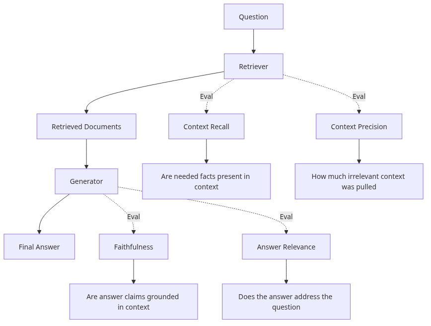
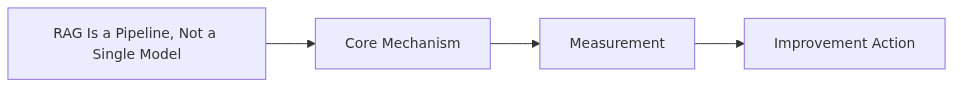
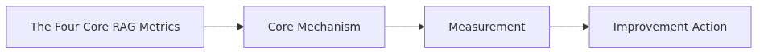
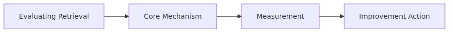
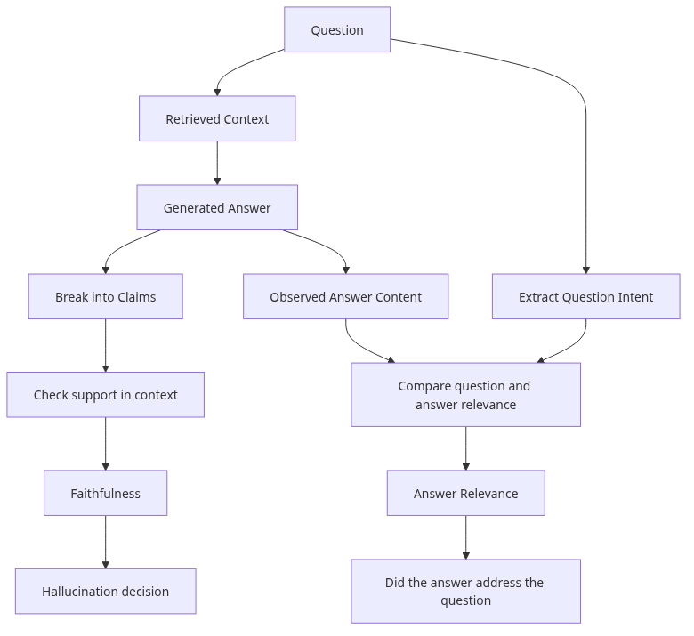

# Evaluating RAG Systems

> AI Evaluation 101 Series (6/10)

RAG requires evaluating both retrieval and generation stages. This post covers RAG-specific metrics like retrieval recall, context precision, faithfulness, and answer relevance.

---


*Evaluating RAG systems*
## RAG Is a Pipeline, Not a Single Model



*RAG is a Pipeline, not a single model*
A RAG (Retrieval-Augmented Generation) system runs in two stages.

```
question → [1. Retriever]  → top-K documents → [2. Generator (LLM)] → answer
            (vector DB)                          (uses context)
```

The two stages **fail in different ways.**

- Retriever fetches the wrong document → the LLM answers from bad context (generation looks fine).
- Retriever fetches the right document, but the LLM ignores it or hallucinates → the generation step is broken.

So RAG evaluation must measure **each stage separately**. A single number like "70% answer accuracy" does not tell you which stage to fix.

---

## The Four Core RAG Metrics



*The four core RAG metrics*
The industry standard, used by RAGAS and TruLens:

| Stage | Metric | What It Asks |
|------|-------|--------------|
| Retrieval | **Context Recall** | Are the facts needed for the answer present in the retrieved context |
| Retrieval | **Context Precision** | Are the retrieved chunks all relevant, or noise |
| Generation | **Faithfulness** | Does the answer rely only on the retrieved context (no hallucination) |
| Generation | **Answer Relevance** | Does the answer actually address the question |

Let's look at each.

---

## Evaluating Retrieval



*Evaluating retrieval*
### Context Recall — Did we retrieve what we need

For each fact (claim) required to produce the reference answer, check whether it appears in the retrieved context.

```python
# rag/context_recall.py
from openai import OpenAI
import json

client = OpenAI()

RECALL_PROMPT = """Check whether every fact (claim) needed to produce the reference is present in the retrieved context.

Question: {question}
Reference answer: {reference}
Retrieved context:
{context}

First, decompose the reference into atomic claims. Then mark each claim as supported by the context (yes/no).

Output JSON:
{{
  "claims": [
    {{"claim": "...", "supported_by_context": true}},
    ...
  ]
}}
"""

def context_recall(question: str, reference: str, context: str) -> float:
    response = client.chat.completions.create(
        model="gpt-4o",
        messages=[{"role": "user", "content": RECALL_PROMPT.format(
            question=question, reference=reference, context=context
        )}],
        temperature=0,
        response_format={"type": "json_object"},
    )
    data = json.loads(response.choices[0].message.content)
    claims = data["claims"]
    if not claims:
        return 0.0
    supported = sum(1 for c in claims if c["supported_by_context"])
    return supported / len(claims)
```

**Reading**: 0.8 means 80% of the reference claims were retrieved. Below 0.5 the retriever is missing core documents.

### Context Precision — How much retrieved context is noise

The fraction of retrieved chunks that are **actually relevant**. Top-K=10 with only 2 relevant gives precision=0.2.

```python
# rag/context_precision.py
PRECISION_PROMPT = """Is the following retrieved chunk needed to answer the question?

Question: {question}
Chunk: {chunk}

Output JSON: {{"relevant": true/false}}
"""

def context_precision(question: str, chunks: list[str]) -> float:
    relevant_count = 0
    for chunk in chunks:
        response = client.chat.completions.create(
            model="gpt-4o-mini",  # cheap model is fine for binary judgment
            messages=[{"role": "user", "content": PRECISION_PROMPT.format(
                question=question, chunk=chunk
            )}],
            temperature=0,
            response_format={"type": "json_object"},
        )
        if json.loads(response.choices[0].message.content)["relevant"]:
            relevant_count += 1
    return relevant_count / len(chunks)
```

**Reading**: low precision means the LLM is being drowned in noise and is more likely to produce a wrong answer.

---

## Evaluating Generation



*Evaluating generation*
### Faithfulness — Hallucination Detection

Decompose the answer into atomic claims and check whether each is **supported** by the retrieved context. Anything not in the context is a hallucination.

```python
# rag/faithfulness.py
FAITHFULNESS_PROMPT = """Decompose the answer into atomic claims and check whether each is supported by the context.

Question: {question}
Context: {context}
Answer: {answer}

Output JSON:
{{
  "claims": [
    {{"claim": "...", "supported_by_context": true/false}},
    ...
  ]
}}
"""

def faithfulness(question: str, context: str, answer: str) -> float:
    response = client.chat.completions.create(
        model="gpt-4o",
        messages=[{"role": "user", "content": FAITHFULNESS_PROMPT.format(
            question=question, context=context, answer=answer
        )}],
        temperature=0,
        response_format={"type": "json_object"},
    )
    data = json.loads(response.choices[0].message.content)
    claims = data["claims"]
    if not claims:
        return 0.0
    supported = sum(1 for c in claims if c["supported_by_context"])
    return supported / len(claims)
```

**Reading**: 1.0 means every claim is grounded. Below 0.7 hallucination is serious. **This is the top-priority metric for production RAG.**

### Answer Relevance — Did we actually address the question

LLMs sometimes drift away from the question. Ask the LLM to **reverse-engineer questions from the answer** and compare them to the original.

```python
# rag/answer_relevance.py
from sentence_transformers import SentenceTransformer
import numpy as np

model = SentenceTransformer("all-MiniLM-L6-v2")

REVERSE_PROMPT = """Guess three questions that this answer would be a response to. One per line.

Answer: {answer}
"""

def answer_relevance(question: str, answer: str) -> float:
    response = client.chat.completions.create(
        model="gpt-4o",
        messages=[{"role": "user", "content": REVERSE_PROMPT.format(answer=answer)}],
        temperature=0,
    )
    generated_qs = response.choices[0].message.content.strip().split("\n")[:3]

    emb_orig = model.encode([question])[0]
    embs_gen = model.encode(generated_qs)
    sims = [np.dot(emb_orig, eg) / (np.linalg.norm(emb_orig) * np.linalg.norm(eg))
            for eg in embs_gen]
    return float(np.mean(sims))
```

**Reading**: 1.0 means the answer fits exactly that question. Below 0.6 the answer is off-topic.

---

## Diagnosing With All Four Metrics

Looking at all four metrics together tells you **which stage to fix**.

| Recall | Precision | Faithfulness | Relevance | Diagnosis |
|--------|-----------|--------------|-----------|-----------|
| Low | High | High | High | Retriever misses core docs → fix embeddings or chunking |
| High | Low | High | High | Too much noise retrieved → reduce top-K or add a reranker |
| High | High | Low | High | LLM hallucinates → prompt must enforce "answer from context only" |
| High | High | High | Low | LLM ignores the question → redesign the prompt |
| High | High | High | High | RAG is healthy |

Without this diagnostic table, "70% answer accuracy" tells you nothing about what to fix.

---

## RAGAS — Bundle the Four Into One Library

You can implement these metrics yourself, or use [RAGAS](https://docs.ragas.io/) which provides standard implementations.

```python
# rag/with_ragas.py
from ragas import evaluate
from ragas.metrics import (
    context_recall, context_precision,
    faithfulness, answer_relevancy,
)
from datasets import Dataset

dataset = Dataset.from_dict({
    "question":     ["What is RAG?", ...],
    "ground_truth": ["RAG combines retrieval with generation...", ...],
    "answer":       ["RAG is a retrieval-based generation technique...", ...],
    "contexts":     [["RAG is...", "Retrieval is..."], ...],
})

result = evaluate(
    dataset,
    metrics=[context_recall, context_precision, faithfulness, answer_relevancy],
)
print(result)
# {'context_recall': 0.85, 'context_precision': 0.72, 'faithfulness': 0.91, 'answer_relevancy': 0.88}
```

If you do not have time to implement these yourself, start with RAGAS. For domain-specific scoring, custom code is more accurate.

---

## Common Mistakes

### Mistake 1: Measuring only end-to-end answer accuracy

"70% correct" hides which stage is broken. **Always split into the four metrics.**

### Mistake 2: Stopping at retrieval metrics

Recall=0.95 and Precision=0.9 do not mean RAG is healthy. **If Faithfulness is 0.5 the LLM is hallucinating** and the system is still broken.

### Mistake 3: Ignoring Faithfulness

The biggest production risk in RAG is **plausible-sounding lies**. Wire Faithfulness into your alerting; investigate immediately when it drops below 0.8.

### Mistake 4: Cranking up top-K blindly

More context is not better. At K=20, precision drops and the LLM gets confused. **Start at K=3-5** and tune empirically.

### Mistake 5: Trying to measure Recall without ground-truth context

Context Recall requires reference answers. Without them you cannot compute it. **Make sure your eval dataset includes reference answers** (see Ep2).

---

## Key Takeaways

- RAG is a two-stage pipeline (retrieval + generation), and **each stage must be measured separately**.
- Four metrics: **Context Recall** (missed retrieval), **Context Precision** (noise), **Faithfulness** (hallucination), **Answer Relevance** (on-topic).
- The combination of all four lets you **diagnose which stage is broken**.
- Faithfulness is the **top-priority metric in production**. It catches hallucinations.
- Use [RAGAS](https://docs.ragas.io/) to start fast; build custom metrics for domain-specific quality.

The next post moves from single responses to evaluating **agent trajectories**.

---

<!-- toc:begin -->
## AI Evaluation 101 Series

- [Ep1 Why Evaluate LLM Apps](./01-why-evaluate-llm-apps.md)
- [Ep2 Evaluation Dataset Design](./02-evaluation-dataset-design.md)
- [Ep3 Deterministic Metrics — Exact Match, BLEU, ROUGE](./03-deterministic-metrics.md)
- [Ep4 LLM-as-Judge — Evaluating Models with Models](./04-llm-as-judge.md)
- [Ep5 Rubric-Based Multi-Dimensional Scoring](./05-rubric-based-scoring.md)
- **Ep6 RAG Evaluation (current)**
- Ep7 Agent Evaluation (upcoming)
- Ep8 Regression Testing (upcoming)
- Ep9 A/B Testing LLMs (upcoming)
- Ep10 Production Evaluation (upcoming)
<!-- toc:end -->

## References

- [RAGAS — Reference-Free Evaluation of RAG Pipelines (Es et al., 2023)](https://arxiv.org/abs/2309.15217)
- [RAGAS Documentation](https://docs.ragas.io/)
- [TruLens — Evaluation and Tracking for LLM Apps](https://www.trulens.org/)
- [LangChain — RAG Evaluation Guide](https://docs.smith.langchain.com/evaluation/tutorials/rag)

Tags: AI Evaluation, RAG, Faithfulness, Retrieval
