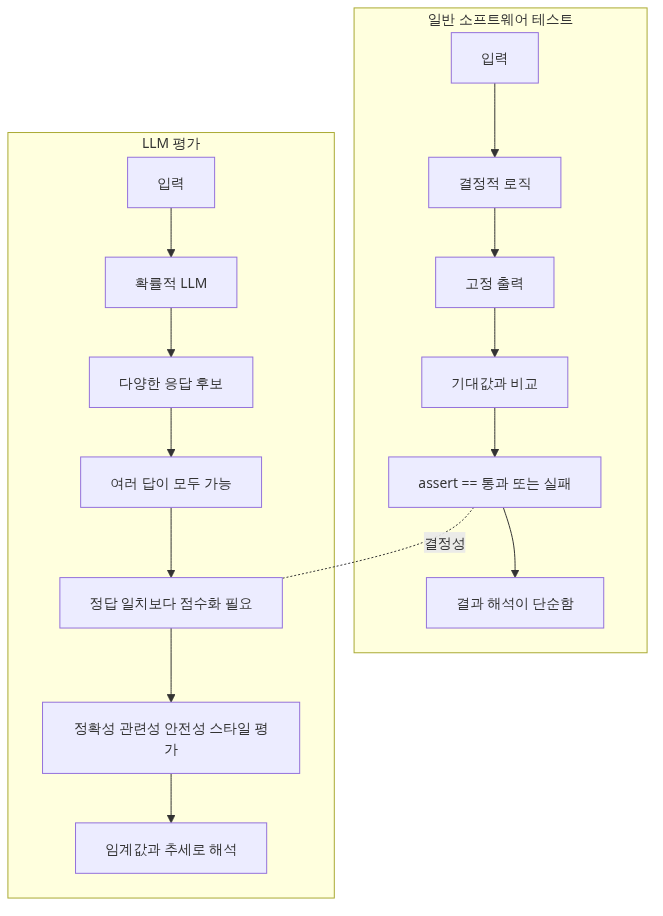
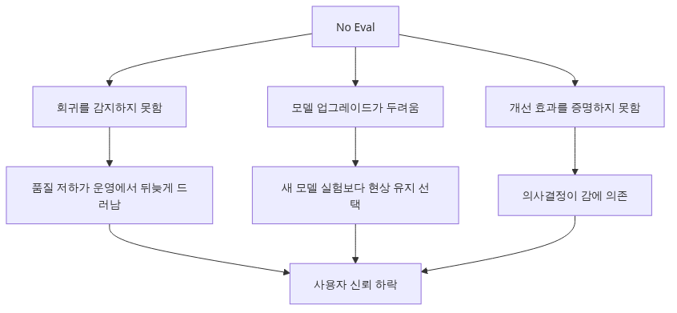

# 왜 LLM 애플리케이션을 평가해야 하는가

> AI Evaluation 101 시리즈 (1/10)

LLM은 같은 입력에도 다른 답을 내놓습니다. 평가 없이 운영하면 어제 잘 되던 기능이 오늘 망가지는 것을 알 수 없습니다. 이 글은 LLM 평가가 왜 일반 소프트웨어 테스트와 다른지, 무엇을 측정해야 하는지를 다룹니다.

---


*LLM 애플리케이션 평가의 필요성*
## LLM 평가는 왜 일반 테스트와 다른가요?



*LLM 평가와 일반 테스트의 차이*
전통적인 단위 테스트는 `assert add(2, 3) == 5`처럼 결정적입니다. 같은 입력은 같은 출력을 내고, 정답이 하나입니다.

LLM은 다릅니다.

```python
from openai import OpenAI

client = OpenAI()

def summarize(text: str) -> str:
    resp = client.chat.completions.create(
        model="gpt-4o-mini",
        messages=[{"role": "user", "content": f"Summarize in one sentence: {text}"}],
    )
    return resp.choices[0].message.content
```

같은 `text`를 두 번 넣어도 응답 두 줄이 정확히 일치하지 않습니다. "맞다"라고 부를 만한 답이 여러 개 있고, "틀렸다"고 단정하기 어려운 답도 많습니다. `==` 비교만으로는 평가가 불가능합니다.

## 평가 없이 운영하면 무엇이 깨지나요?



*평가 없이 운영하면 무엇이 깨지나요*
세 가지가 동시에 깨집니다.

1. **회귀를 발견할 수 없습니다**: prompt를 한 줄 바꿨더니 다른 케이스가 깨졌는데, eval이 없으면 사용자가 알려줄 때까지 모릅니다.
2. **모델 업그레이드를 두려워하게 됩니다**: gpt-4o-mini → gpt-4.1로 바꾸려는데 "더 나은지" 측정할 방법이 없으면 그냥 안 바꾸게 됩니다.
3. **개선했다는 증거가 없습니다**: "이번 prompt가 더 좋아졌어요"라고 말해도 숫자가 없으면 이해관계자를 설득할 수 없습니다.

```python
# 평가 없이 prompt를 바꾸는 흔한 모습
# 변경 전: "Summarize in one sentence:"
# 변경 후: "Summarize concisely in one sentence in a friendly tone:"
# → 어떤 case에서 좋아지고 어떤 case에서 나빠졌는지 모릅니다.
```

## 무엇을 측정해야 하나요?


*무엇을 측정해야 하나요*
LLM 응답에는 최소 4가지 차원이 있고, 각각 다른 측정 방법이 필요합니다.

```python
from dataclasses import dataclass

@dataclass
class EvalResult:
    correctness: float  # 사실이 맞는가
    relevance: float    # 질문에 답하는가
    safety: float       # 유해/편향 없는가
    style: float        # 요구한 형식/문체를 지키는가
```

1. **Correctness (정확성)**: 사실이 맞는가. RAG에서는 retrieved context와 일치하는가.
2. **Relevance (관련성)**: 질문에 답하고 있는가, 아니면 빙빙 도는가.
3. **Safety (안전성)**: PII 유출, 차별 발언, 위험한 조언이 없는가.
4. **Style (문체/형식)**: JSON 스키마, 길이 제한, 톤을 지키는가.

이 시리즈에서는 각 차원에 어떤 지표가 적합한지를 이후 글에서 하나씩 다룹니다.

## 평가 파이프라인의 4단계


*평가 파이프라인의 4단계*
LLM 평가 시스템은 어떤 도구를 쓰든 동일한 4단계로 구성됩니다.

```python
def run_evaluation(eval_set: list[dict], system_under_test) -> dict:
    # 1. Generate — 평가 대상 시스템에 입력을 넣어 응답을 받는다
    predictions = [system_under_test(ex["input"]) for ex in eval_set]

    # 2. Score — 각 응답에 점수를 매긴다
    scores = [score_one(ex, pred) for ex, pred in zip(eval_set, predictions)]

    # 3. Aggregate — 전체 점수를 집계한다
    summary = {
        "accuracy": sum(s["correct"] for s in scores) / len(scores),
        "avg_relevance": sum(s["relevance"] for s in scores) / len(scores),
    }

    # 4. Compare — 이전 버전과 비교한다
    return summary
```

1. **Generate**: eval set의 입력으로 시스템 응답을 생성합니다.
2. **Score**: 각 응답에 점수를 매깁니다 (결정적 지표, LLM-as-judge, 사람 평가 중 택1 또는 조합).
3. **Aggregate**: 차원별 평균, 통과율, p95 등으로 집계합니다.
4. **Compare**: 이전 버전 또는 baseline과 비교해서 회귀가 없는지 확인합니다.

## 첫 평가 — 10건이라도 시작하세요

"평가는 데이터가 충분히 모이면 시작하겠다"는 1년이 지나도 시작 못 합니다. 10건으로 시작하세요.

```python
eval_set = [
    {"input": "What is RAG?", "expected_keywords": ["retrieval", "generation"]},
    {"input": "Explain async/await", "expected_keywords": ["coroutine", "await"]},
    # ... 8 more
]

def score_one(ex, pred: str) -> dict:
    keywords_found = sum(1 for kw in ex["expected_keywords"] if kw.lower() in pred.lower())
    return {
        "correct": keywords_found == len(ex["expected_keywords"]),
        "keyword_recall": keywords_found / len(ex["expected_keywords"]),
    }

results = run_evaluation(eval_set, summarize)
print(f"Accuracy: {results['accuracy']:.0%}")
```

10건으로도 "5번 케이스에서 prompt 변경 후 점수가 떨어졌다"는 신호를 받을 수 있습니다. 이 신호 하나가 회귀의 90%를 잡습니다.

## 흔한 실수 5가지

1. **production이 안정되면 평가하겠다**: 평가가 없으면 안정되었는지를 알 수 없습니다. 첫날부터 10건으로 시작하세요.
2. **단일 점수에 집착**: "정확도 87%"만 보면 안전성이 떨어진 걸 놓칩니다. 항상 차원별로 보세요.
3. **eval set을 prompt 작성자가 직접 만듦**: 자기가 만든 prompt에 유리한 케이스만 골라 측정 결과가 부풀려집니다. 다른 사람 또는 production trace에서 가져오세요.
4. **결정적 지표만 사용**: BLEU만 보면 "의미는 맞지만 표현이 다른" 답이 모두 깎입니다. LLM-as-judge나 rubric 평가를 함께 쓰세요.
5. **평가를 한 번만 돌림**: LLM은 stochastic이라 같은 입력에도 점수가 달라질 수 있습니다. 중요한 비교는 3-5회 반복해서 분산을 함께 보세요.

## 핵심 요약

- LLM 응답은 결정적이지 않으므로 `==` 비교가 불가능합니다.
- 평가 없이 운영하면 회귀, 모델 업그레이드, 개선 증명 모두 불가능해집니다.
- 최소 4가지 차원(correctness, relevance, safety, style)을 별도로 측정하세요.
- 평가 파이프라인은 generate → score → aggregate → compare 4단계입니다.
- 데이터를 모을 때까지 기다리지 말고 10건으로라도 오늘 시작하세요.

다음 글에서는 평가 데이터셋을 어떻게 설계하는지 — 어디서 가져오고, 몇 건이 필요하고, 어떻게 라벨링하는지를 다룹니다.

---

<!-- toc:begin -->
## AI Evaluation 101 시리즈

- **왜 LLM 애플리케이션을 평가해야 하는가 (현재 글)**
- 평가 데이터셋 설계하기 (예정)
- 결정적 지표 — Exact Match, BLEU, ROUGE (예정)
- LLM-as-Judge (예정)
- Rubric 기반 채점 설계 (예정)
- RAG 시스템 평가하기 (예정)
- Agent 평가하기 (예정)
- 회귀 테스트 (예정)
- LLM A/B 테스팅 (예정)
- 운영 환경에서의 지속적 평가 (예정)
<!-- toc:end -->

## 참고 자료

- [OpenAI — Evals framework](https://github.com/openai/evals)
- [Anthropic — Building evals](https://docs.anthropic.com/en/docs/test-and-evaluate/develop-tests)
- [Hugging Face — Evaluating LLMs](https://huggingface.co/learn/cookbook/en/llm_judge)
- [Eugene Yan — LLM evaluation patterns](https://eugeneyan.com/writing/llm-evaluators/)

Tags: AI Evaluation, LLM, Testing, Quality
