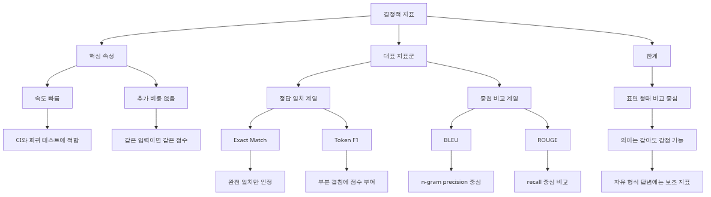
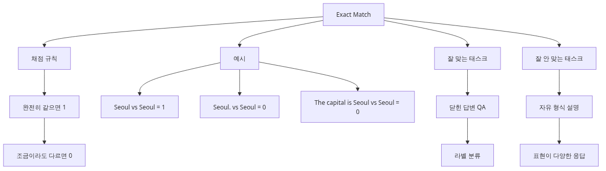
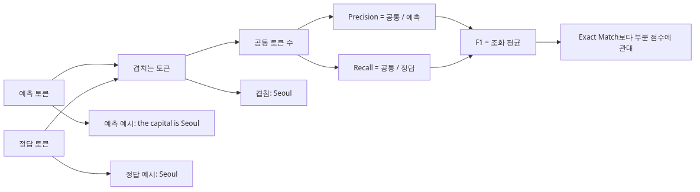
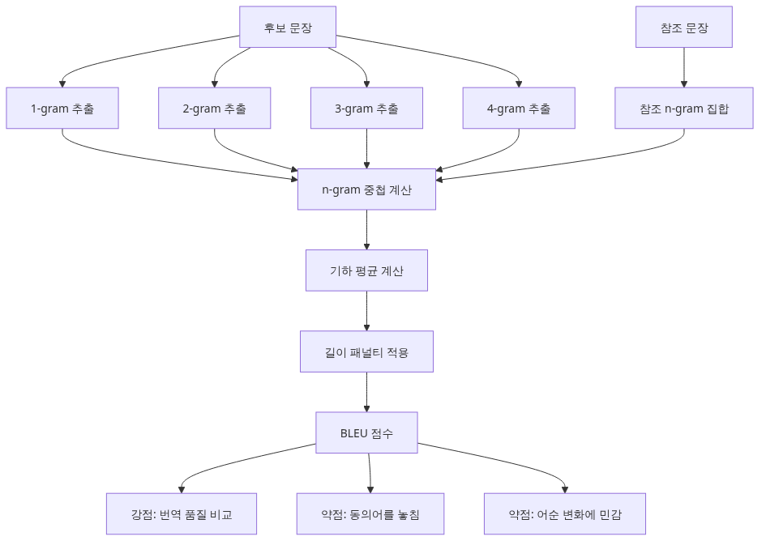

# 결정적 지표 — Exact Match, BLEU, ROUGE

평가를 자동화하려는 팀이 가장 먼저 찾는 것은 대개 싸고 빠른 지표입니다. 매번 사람을 붙일 수 없고, LLM judge를 돌리기에도 비용이 부담되기 때문입니다. 그래서 Exact Match, F1, BLEU, ROUGE 같은 결정적 지표가 자연스럽게 후보에 올라옵니다.

문제는 이 지표들이 유용한 영역과 위험한 영역이 생각보다 뚜렷하다는 점입니다. 짧고 닫힌 정답을 평가할 때는 강력하지만, 자유 형식 답변으로 넘어가는 순간 표현 차이만으로 점수가 크게 흔들립니다.

현업에서는 여기서 자주 오판이 생깁니다. BLEU가 낮으니 모델이 나쁘다고 결론 내렸는데 실제로는 문장 표현만 달라졌던 경우입니다. 반대로 Exact Match가 높으니 안전하다고 믿었는데, 사용자가 체감하는 설명 품질은 크게 떨어진 경우도 있습니다.

이 글은 AI Evaluation 101 시리즈의 3번째 글입니다.

여기서는 결정적 지표가 무엇인지, 각각이 어떤 문제에 맞는지, 그리고 언제 LLM-as-judge나 사람 검토로 넘어가야 하는지 기준을 세워 보겠습니다.

## 이 글에서 다룰 문제

- 결정적 지표는 왜 같은 입력과 답에 항상 같은 점수를 줄 수 있을까요?
- Exact Match는 어떤 태스크에서만 의미 있고, 왜 조금만 자유도가 생겨도 약해질까요?
- Token-level F1은 Exact Match보다 무엇을 더 잘 잡아낼까요?
- BLEU와 ROUGE는 왜 자유 형식 챗봇 답변의 단독 지표로 위험할까요?
- 닫힌 답 공간과 열린 답 공간을 구분해서 지표를 고르는 실무 기준은 무엇일까요?

## 왜 이 글이 중요한가

결정적 지표는 평가 비용을 크게 낮춰 줍니다. 같은 입력에 같은 점수를 주기 때문에 CI에 넣기도 쉽고, 분산이나 편차를 따로 설명하지 않아도 됩니다. 그래서 첫 자동화 단계에서 매우 매력적으로 보입니다.

하지만 이 편리함 때문에 지표를 과용하면 문제가 커집니다. 의미는 맞지만 표현이 다른 답이 전부 낮은 점수를 받으면 팀은 잘못된 최적화를 하게 됩니다. 그 결과 사용자에게 더 좋은 답을 주고도 지표는 나빠지는 역전 현상이 생깁니다.

결국 핵심은 도구의 한계를 정확히 아는 것입니다. 결정적 지표는 버려야 할 것이 아니라, 어디까지 믿을 수 있는지 경계를 알고 써야 하는 빠른 필터입니다.

## 결정적 지표를 이해하는 가장 좋은 방법: 빠른 필터로 쓰고 최종 심판으로 쓰지 않는 것입니다

이 주제는 개별 기법을 외우기보다 먼저 어떤 운영 문제를 풀기 위한 장치인지 붙잡아 두는 편이 이해가 빠릅니다. 결정적 지표는 평가 비용을 크게 낮춰 줍니다. 같은 입력에 같은 점수를 주기 때문에 CI에 넣기도 쉽고, 분산이나 편차를 따로 설명하지 않아도 됩니다. 그래서 첫 자동화 단계에서 매우 매력적으로 보입니다.

> 결정적 지표는 빠르고 재현 가능하지만, 자유 형식 응답의 의미를 완전히 이해하지는 못합니다. 닫힌 답 공간에서는 강력하지만 열린 답 공간에서는 보조 신호에 머물러야 합니다.

이 관점을 먼저 잡아 두면 뒤에 나오는 코드와 지표를 기능 설명이 아니라 운영 설계 관점에서 읽을 수 있습니다. 결국 중요한 것은 수치 이름보다, 그 수치가 어떤 의사결정을 가능하게 하느냐입니다.

## 핵심 개념



결정적 지표 - Exact Match, BLEU, ROUGE

### 결정적 지표가 무엇인가요?


결정적 지표가 무엇인가요
결정적 지표는 같은 입력과 같은 답이 주어지면 항상 같은 점수를 내는 지표입니다. LLM 호출 없이 문자열·토큰만 비교해서 계산하므로 빠르고 재현 가능합니다.

```python
def exact_match(pred: str, expected: str) -> int:
    return int(pred.strip() == expected.strip())

assert exact_match("Seoul", "Seoul") == 1
assert exact_match("Seoul.", "Seoul") == 0  # one period away from a zero
```

빠르다는 장점 뒤에는 큰 약점이 있습니다. "의미는 같지만 표현이 다른" 답이 모두 0점으로 깎입니다. 이 글에서는 4가지 결정적 지표를 다루고, 각각이 언제 쓸 만하고 언제 쓰면 안 되는지를 설명합니다.

### Exact Match — 가장 단순한 지표



Exact Match - 가장 단순한 지표
질문: "한국의 수도는?"
정답: "서울"
모델 응답: "한국의 수도는 서울입니다."

Exact match로는 0점입니다. 정답이 한 단어로 정해져 있을 때만 의미가 있습니다.

```python
def exact_match_normalized(pred: str, expected: str) -> int:
    def normalize(s: str) -> str:
        return s.lower().strip().rstrip(".!?")
    return int(normalize(pred) == normalize(expected))
```

정규화를 추가하면 조금 나아지지만, 본질적으로는 "정답이 1-2 단어로 고정된 QA"에서만 신뢰할 수 있습니다. SQuAD 같은 짧은 답 추출 작업에 적합합니다.

### Token-level F1 — Exact Match보다 유연한 비교



Token-level F1 - Exact Match보다 유연한 비교
F1은 예측과 정답을 토큰 집합으로 보고 정밀도(precision)와 재현율(recall)의 조화 평균을 계산합니다.

```python
from collections import Counter

def token_f1(pred: str, expected: str) -> float:
    pred_tokens = Counter(pred.lower().split())
    exp_tokens = Counter(expected.lower().split())
    common = pred_tokens & exp_tokens
    num_same = sum(common.values())
    if num_same == 0:
        return 0.0
    precision = num_same / sum(pred_tokens.values())
    recall = num_same / sum(exp_tokens.values())
    return 2 * precision * recall / (precision + recall)

print(token_f1("the capital is Seoul", "Seoul"))   # ~0.4 — partial credit
print(token_f1("Seoul", "Seoul"))                  # 1.0
```

"한국의 수도는 서울입니다" vs "서울" 같은 케이스에서 부분 점수를 줍니다. 하지만 단어 순서나 어순 변화는 잡지 못합니다. "Seoul is the capital"과 "the capital is Seoul"이 같은 점수를 받습니다.

### BLEU — 기계 번역에서 온 n-gram 중첩 지표



BLEU - 기계 번역에서 온 n-gram 중첩 지표
BLEU는 1-gram, 2-gram, 3-gram, 4-gram의 중첩 비율을 계산합니다. 기계 번역 평가에서 표준이지만, LLM 자유 형식 응답에는 한계가 큽니다.

```python
# pip install nltk
from nltk.translate.bleu_score import sentence_bleu

reference = [["the", "cat", "sat", "on", "the", "mat"]]
candidate1 = ["the", "cat", "sat", "on", "the", "mat"]
candidate2 = ["a", "cat", "is", "sitting", "on", "a", "mat"]

print(sentence_bleu(reference, candidate1))  # 1.0
print(sentence_bleu(reference, candidate2))  # ~0.0 — same meaning, near zero
```

BLEU의 약점:

1. **동의어를 모릅니다**: "car"와 "automobile"은 다른 토큰입니다.
2. **어순에 민감합니다**: 같은 의미라도 어순이 다르면 깎입니다.
3. **참조 답이 여러 개여야 합니다**: 답이 한 개면 점수가 부풀려지거나 깎입니다.

BLEU는 "여러 개의 참조 번역이 있는 기계 번역" 평가에는 유효하지만, "자유 형식 chatbot 답변" 평가에는 부적합합니다.

### ROUGE — 요약 평가에서 온 recall 기반 지표

ROUGE는 BLEU와 비슷하지만 recall 중심입니다. 특히 ROUGE-L은 longest common subsequence를 사용해 어순 일부 변화에 덜 민감합니다.

```python
# pip install rouge-score
from rouge_score import rouge_scorer

scorer = rouge_scorer.RougeScorer(["rouge1", "rougeL"], use_stemmer=True)
scores = scorer.score(
    "The cat sat on the mat",                    # reference
    "A cat is sitting on a mat",                 # prediction
)
print(scores["rouge1"].fmeasure)  # ~0.5
print(scores["rougeL"].fmeasure)  # ~0.5
```

ROUGE는 요약 task에서는 사람 평가와의 상관이 BLEU보다 높지만, 여전히 "사실이 틀렸는데 단어가 비슷하면 높은 점수"를 받는 약점이 있습니다.

### 결정적 지표를 언제 쓰고 언제 쓰면 안 되나요?

| 상황 | 적합한 지표 | 비고 |
|------|------------|------|
| 짧은 추출형 QA (SQuAD 형식) | Exact Match, Token F1 | 정답이 명확할 때 |
| Code generation | Exact Match (정규화 후) + 실행 테스트 | 컴파일·테스트가 ground truth |
| Classification (intent, sentiment) | Exact Match, Accuracy, F1 | 라벨 집합이 닫혀 있을 때 |
| 요약 (단일 reference) | ROUGE (참고만) + LLM-as-judge | ROUGE는 보조 지표로만 |
| 자유 형식 답변 (chatbot) | 결정적 지표 부적합 | LLM-as-judge / rubric 사용 |
| 기계 번역 (다중 reference) | BLEU, chrF | 참조가 여러 개일 때만 의미 있음 |

핵심 규칙: **답이 닫혀 있고 짧으면 결정적 지표가 잘 작동합니다. 답이 자유 형식이고 길면 LLM-as-judge나 rubric으로 가야 합니다.**

## 이 코드에서 먼저 봐야 할 점

- 가장 먼저 Exact Match 예제부터 보시면 좋습니다. 마침표 하나 때문에 0점이 되는 장면이 이 지표의 본질을 가장 선명하게 보여 줍니다.
- Token F1 예제는 부분 점수를 줄 수 있다는 장점을 보여 주지만, 어순과 의미 구조를 깊게 보지 못한다는 한계도 함께 드러냅니다.
- 결론 표는 실무 의사결정에 바로 쓰입니다. 닫힌 분류 문제인지, 자유 형식 답변인지 먼저 나눠야 이후 지표 선택이 흔들리지 않습니다.

이 세 지점을 먼저 읽고 나면 세부 구현과 지표 해석이 훨씬 빨라집니다. 코드가 길어 보여도 운영 질문은 대개 여기로 다시 돌아옵니다.

## 어디서 자주 헷갈릴까요?

1. **자유 형식 답변에 BLEU 사용**: 의미는 맞지만 표현이 다른 답이 모두 0점이 됩니다. 결과만 보면 "모델이 형편없다"는 잘못된 결론에 도달합니다.
2. **단일 reference로 ROUGE 평가**: ROUGE는 reference가 여럿일 때 의미가 있습니다. 하나만 있으면 paraphrase에 너무 가혹합니다.
3. **Normalization 안 함**: "Seoul"과 "seoul.", "Seoul " 모두 다른 답으로 처리됩니다. lowercase, strip, 마침표 제거를 기본으로 적용하세요.
4. **점수만 보고 케이스를 안 봄**: 평균 0.7이 나와도 어떤 케이스에서 깎였는지 보지 않으면 개선이 불가능합니다. 항상 최저 5건은 직접 읽으세요.
5. **결정적 지표 하나에만 의존**: BLEU 0.5와 ROUGE 0.5가 같이 떨어졌어도 사람 평가는 좋아질 수 있습니다. 항상 LLM-as-judge나 사람 spot check와 병행하세요.

현업에서 제가 가장 자주 보는 문제는 결과 숫자만 보고 원인 분해를 건너뛰는 습관입니다. 평가가 개선을 돕지 못하고 보고서용 숫자로만 남는 순간, 팀은 다시 감각에 의존하게 됩니다.

## 첫 번째 운영 체크리스트

- [ ] 평가 대상 태스크가 닫힌 답 공간인지 먼저 분류했는가
- [ ] 대소문자, 공백, 문장부호 정규화를 기본값으로 두었는가
- [ ] BLEU나 ROUGE를 단독 품질 지표로 쓰지 않는가
- [ ] 최하위 점수 사례를 사람이 직접 읽는 절차가 있는가
- [ ] 결정적 지표와 의미 기반 평가를 함께 보는가

## 실무에서는 이렇게 생각한다

실무에서는 지표 그 자체보다 '이 지표가 어떤 실수를 체계적으로 놓치는가'를 더 중요하게 봅니다. Exact Match는 엄격하고 빠르지만, 자유 형식 설명 태스크에는 지나치게 냉정합니다.

제가 본 강한 팀들은 결정적 지표를 초기 경보로 쓰고, 의미 판단은 LLM judge나 사람 샘플 검토로 보완했습니다. 빠른 필터와 느리지만 더 똑똑한 평가를 층으로 쌓는 방식입니다.

다음 글의 LLM-as-Judge는 바로 이 한계를 메우기 위해 등장합니다. 자유 형식 답변을 다뤄야 한다면 문자열 일치만으로는 운영 결정을 내리기 어렵습니다.

## 정리: 결정적 지표는 빨라서 유용하지만, 의미 판단까지 대신해 주지는 않습니다

- 결정적 지표는 빠르고 재현 가능하지만 "의미는 같고 표현이 다른" 답을 깎는 약점이 있습니다.
- Exact Match와 Token F1은 짧은 추출형 QA에 적합합니다.
- BLEU는 다중 reference 기계 번역에서만, ROUGE는 요약의 보조 지표로 쓰세요.
- 자유 형식 chatbot 응답에는 결정적 지표가 부적합합니다 — LLM-as-judge로 가세요.
- 결정적 지표 하나에만 의존하지 말고 LLM-as-judge나 사람 spot check와 항상 병행하세요.

다음 글에서는 LLM-as-judge — 강력한 LLM에게 채점을 맡기는 방법, judge prompt 설계, bias 통제, 사람 평가와의 일치도 측정을 다룹니다.

다음 글에서는 자유 형식 답변을 다루기 위해 강한 LLM에게 채점을 맡기는 방법을 다룹니다. 결정적 지표가 어디서 멈추는지 알아야 LLM-as-Judge를 왜 써야 하는지도 분명해집니다.

## 운영 체크리스트

- [ ] Exact Match는 짧고 닫힌 답 태스크에만 우선 적용하기
- [ ] BLEU와 ROUGE는 보조 신호로만 해석하기
- [ ] 정규화 규칙을 코드로 명시하기
- [ ] 하위 사례를 사람 눈으로 읽는 검토 루프 두기
- [ ] 자유 형식 태스크에는 LLM judge나 rubric 평가를 병행하기

<!-- toc:begin -->
## AI Evaluation 101 시리즈

- [왜 LLM 애플리케이션을 평가해야 하는가](./01-why-evaluate-llm-apps.md)
- [평가 데이터셋 설계하기](./02-evaluation-dataset-design.md)
- **결정적 지표 — Exact Match, BLEU, ROUGE (현재 글)**
- LLM-as-Judge — 모델로 모델을 평가하기 (예정)
- Rubric 기반 채점 설계 (예정)
- RAG 시스템 평가하기 (예정)
- 에이전트 평가하기 — 단일 응답이 아닌 trajectory (예정)
- 회귀 테스트 — 어제 잘 되던 게 오늘 망가지지 않게 (예정)
- LLM A/B 테스팅 — 어느 prompt가 더 나은가 (예정)
- 운영 환경에서의 지속적 평가 (예정)
<!-- toc:end -->

## 참고 자료

### 공식 문서

- [Hugging Face — A guide to LLM evaluation](https://huggingface.co/docs/evaluate/index)
- [Papineni et al. — BLEU paper](https://aclanthology.org/P02-1040/)
- [Lin — ROUGE paper](https://aclanthology.org/W04-1013/)
- [SQuAD — Exact Match and F1](https://rajpurkar.github.io/SQuAD-explorer/)

### 관련 시리즈

- [이전 글 — 평가 데이터셋 설계하기](./02-evaluation-dataset-design.md)
- [다음 글 — LLM-as-Judge — 모델로 모델을 평가하기](./04-llm-as-judge.md)
- [시리즈 현재 위치 다시 보기](./03-deterministic-metrics.md)

Tags: AI Evaluation, LLM, Metrics, BLEU
