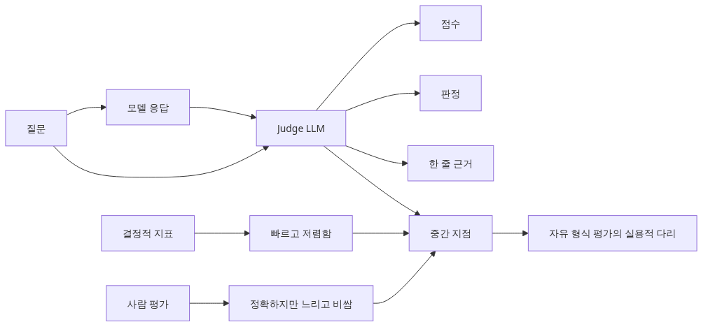
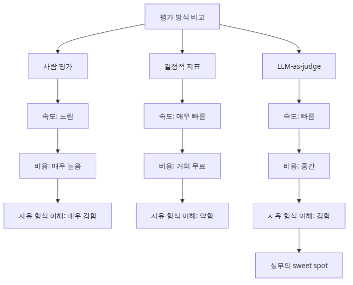
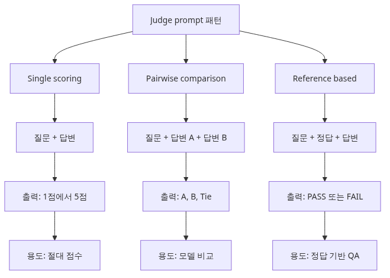
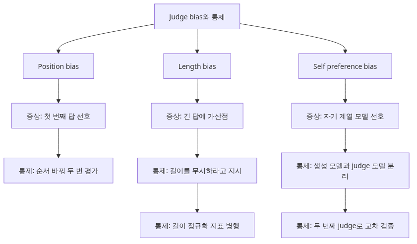

# LLM-as-Judge — 모델로 모델을 평가하기

자유 형식 답변을 평가하려고 하면 곧 한계가 드러납니다. BLEU와 ROUGE로는 의미가 맞는 답을 지나치게 깎고, 사람에게 전부 채점시키기에는 비용과 시간이 감당되지 않습니다. 이 사이를 메우는 대표적인 방법이 LLM-as-Judge입니다.

하지만 여기서 가장 흔한 오해는 강한 모델에게 점수만 시키면 곧바로 신뢰할 수 있다고 믿는 것입니다. 실제로는 judge 프롬프트, 위치 편향, 길이 편향, 자기 모델 선호 편향을 어떻게 통제하느냐가 결과를 크게 바꿉니다.

현업에서 저는 LLM judge를 붙인 뒤 오히려 더 자신 있게 잘못된 결론을 내리는 팀도 봤습니다. 사람 기준선 없이 judge 점수만 높다고 배포를 밀어붙였기 때문입니다. 반대로 프롬프트를 몇 차례 다듬고 사람과의 일치도를 재보는 팀은 놀랄 만큼 빠르게 품질 판단 속도를 끌어올립니다.

이 글은 AI Evaluation 101 시리즈의 4번째 글입니다.

여기서는 judge 프롬프트를 어떻게 쓰고, 어떤 편향을 통제하고, 사람 채점과 어느 정도 일치해야 실무에서 믿고 쓸 수 있는지 정리하겠습니다.

## 이 글에서 다룰 문제

- LLM-as-Judge는 어떤 유형의 자유 형식 평가에서 특히 강할까요?
- single scoring, pairwise, reference-based 세 패턴은 언제 각각 적합할까요?
- 위치 편향, 길이 편향, 자기 선호 편향은 실제 결과를 어떻게 왜곡할까요?
- Cohen's kappa는 왜 단순 정확도보다 더 중요한 신뢰도 지표일까요?
- judge 비용과 재현성을 함께 관리하려면 어떤 운영 규칙이 필요할까요?

## 왜 이 글이 중요한가

LLM judge를 제대로 설계하면 수천 건 규모의 자유 형식 응답도 실무 속도로 채점할 수 있습니다. 특히 모델 비교나 프롬프트 A/B 실험처럼 상대 평가가 필요한 상황에서는 사람보다 훨씬 빠른 피드백 루프를 만들 수 있습니다.

반면 설계를 잘못하면 편향이 그대로 자동화됩니다. 첫 번째 답을 더 자주 고르는 judge, 긴 답을 더 좋게 보는 judge, 자기 계열 모델을 편애하는 judge는 팀을 조용히 오판으로 이끕니다.

그래서 이 글의 핵심은 'judge를 쓸까 말까'가 아니라 'judge를 운영 가능한 평가자로 만들려면 무엇을 검증해야 하나'입니다. 사람 기준선과 편향 통제 없이 judge를 쓰는 것은 자동화가 아니라 자동 착시에 가깝습니다.

## LLM-as-Judge를 이해하는 가장 좋은 방법: 자동 채점기가 아니라 편향을 관리해야 하는 동료 평가자로 보는 것입니다

이 주제는 개별 기법을 외우기보다 먼저 어떤 운영 문제를 풀기 위한 장치인지 붙잡아 두는 편이 이해가 빠릅니다. LLM judge를 제대로 설계하면 수천 건 규모의 자유 형식 응답도 실무 속도로 채점할 수 있습니다. 특히 모델 비교나 프롬프트 A/B 실험처럼 상대 평가가 필요한 상황에서는 사람보다 훨씬 빠른 피드백 루프를 만들 수 있습니다.

> LLM judge는 사람을 완전히 대체하지 않습니다. 다만 사람이 다 볼 수 없는 규모에서, 명확한 프롬프트와 사람 기준선이 있을 때 일관된 1차 판정자로 매우 강력하게 작동합니다.

이 관점을 먼저 잡아 두면 뒤에 나오는 코드와 지표를 기능 설명이 아니라 운영 설계 관점에서 읽을 수 있습니다. 결국 중요한 것은 수치 이름보다, 그 수치가 어떤 의사결정을 가능하게 하느냐입니다.

## 핵심 개념



LLM-as-Judge - 모델로 모델을 평가하기

### LLM-as-judge가 필요한 이유



LLM-as-judge가 필요한 이유
Ep3에서 다룬 결정적 지표(BLEU, ROUGE, Exact Match)는 정답이 짧고 명확할 때만 잘 작동합니다. 하지만 실제 LLM 응답은 다음과 같은 경우가 많습니다.

- 정답이 여러 개인 자유 형식 답변 (예: "이 코드를 설명해 줘")
- 톤, 명확성, 유용성 같은 주관적 품질
- 사람이 직접 채점하기에는 너무 많은 데이터 (수천~수만 건)

이때 강력한 LLM(GPT-4, Claude Opus 등)에게 채점을 맡기는 방식이 LLM-as-judge입니다. 사람보다 빠르고, 결정적 지표보다 유연합니다.

| 평가 방식 | 속도 | 비용 | 자유 형식 처리 | 일관성 |
|----------|------|-----|--------------|--------|
| Human | 느림 | 매우 비쌈 | 우수 | 평가자별 편차 |
| Deterministic | 매우 빠름 | 거의 무료 | 약함 | 100% 재현 가능 |
| LLM-as-judge | 빠름 | 중간 | 우수 | 70~90% (prompt 의존) |

### Judge prompt 설계 — 3가지 패턴



Judge prompt 설계 - 3가지 패턴
### 패턴 1: Single scoring (1~5점 척도)

가장 단순한 방식입니다. judge에게 응답 하나를 보여주고 점수를 매기게 합니다.

```python
# eval/judge_single.py
from openai import OpenAI

client = OpenAI()

JUDGE_PROMPT = """You are a strict evaluator. Read the question and answer below and grade on a 1-5 scale.

Question: {question}
Answer: {answer}

Rubric:
- 5: Accurate, complete, clear
- 4: Accurate but missing minor details or slightly ambiguous
- 3: Partially accurate
- 2: Mostly inaccurate
- 1: Completely wrong or off-topic

Write a one-sentence reasoning first, then output only 'Score: N' on the last line.
"""

def judge_single(question: str, answer: str) -> tuple[int, str]:
    response = client.chat.completions.create(
        model="gpt-4o",
        messages=[{"role": "user", "content": JUDGE_PROMPT.format(
            question=question, answer=answer
        )}],
        temperature=0,  # reproducibility
    )
    text = response.choices[0].message.content
    last_line = text.strip().split("\n")[-1]
    score = int(last_line.replace("Score:", "").strip())
    return score, text

if __name__ == "__main__":
    score, reasoning = judge_single(
        "What is the difference between list and tuple in Python?",
        "Lists are mutable and tuples are immutable."
    )
    print(f"Score: {score}\nReasoning: {reasoning}")
```

장점: 단순합니다. 한 응답씩 독립 평가가 가능합니다.
단점: 점수 인플레이션이 발생합니다. judge가 대부분 4~5점을 줍니다.

### 패턴 2: Pairwise comparison (둘 중 하나)

두 응답을 동시에 보여주고 더 나은 쪽을 고르게 합니다. 모델 A vs 모델 B 비교에 적합합니다.

```python
# eval/judge_pairwise.py
PAIRWISE_PROMPT = """Pick the better answer to the question.

Question: {question}
Answer A: {answer_a}
Answer B: {answer_b}

Respond with one of: 'A', 'B', 'Tie'.
Write a one-sentence reasoning first, then output only 'Verdict: X' on the last line.
"""

def judge_pairwise(question: str, answer_a: str, answer_b: str) -> str:
    response = client.chat.completions.create(
        model="gpt-4o",
        messages=[{"role": "user", "content": PAIRWISE_PROMPT.format(
            question=question, answer_a=answer_a, answer_b=answer_b
        )}],
        temperature=0,
    )
    text = response.choices[0].message.content
    last_line = text.strip().split("\n")[-1]
    return last_line.replace("Verdict:", "").strip()
```

장점: 점수 인플레이션이 없습니다. 사람의 직관과 잘 맞습니다.
단점: 절대 품질을 알 수 없습니다 (둘 다 나빠도 하나는 뽑힘).

### 패턴 3: Reference-based (정답 비교)

정답이 있을 때, 응답이 정답과 의미적으로 일치하는지 묻습니다.

```python
# eval/judge_reference.py
REFERENCE_PROMPT = """Decide whether the answer is semantically equivalent to the reference.

Question: {question}
Reference: {reference}
Answer: {answer}

If the answer covers all the key points of the reference, output 'PASS'. Otherwise 'FAIL'.
Write a one-sentence reasoning, then output only 'Result: PASS' or 'Result: FAIL' on the last line.
"""
```

장점: 정답이 있는 QA 데이터셋에 적합합니다. BLEU/ROUGE보다 의미 비교가 잘 됩니다.
단점: 정답을 미리 만들어야 합니다.

### Bias 3가지와 통제 방법



Bias 3가지와 통제 방법
LLM judge는 사람과 다른 방식으로 편향됩니다. 다음 3가지 bias를 알아야 합니다.

### Bias 1: Position bias (위치 편향)

Pairwise 평가에서 judge는 **첫 번째 답변을 더 자주 선택**하는 경향이 있습니다 (GPT-4 기준 약 60% A 선택). 통제 방법은 **순서를 바꿔서 두 번 평가**하는 것입니다.

```python
# eval/debias_position.py
def judge_pairwise_debiased(question: str, ans_a: str, ans_b: str) -> str:
    v1 = judge_pairwise(question, ans_a, ans_b)  # A=ans_a, B=ans_b
    v2 = judge_pairwise(question, ans_b, ans_a)  # A=ans_b, B=ans_a (swapped)

    # In v2, "A" really means ans_b, so flip and compare
    flip = {"A": "B", "B": "A", "Tie": "Tie"}
    v2_normalized = flip[v2]

    if v1 == v2_normalized:
        return v1  # consistent
    return "Tie"  # if order changes the verdict, call it a tie
```

### Bias 2: Length bias (길이 편향)

긴 답변이 짧고 정확한 답변보다 높게 평가되는 경향이 있습니다. 통제 방법:

- Judge prompt에 명시: "답변 길이는 채점에 영향을 주지 않습니다. 핵심 정보의 정확성만 평가하세요."
- 길이를 정규화한 추가 metric을 함께 봄 (예: score / log(length))

### Bias 3: Self-preference bias (자기 선호 편향)

GPT-4가 GPT-4 응답을 채점하면, 다른 모델 응답보다 자기 모델 응답을 더 선호합니다. 통제 방법:

- Generator 모델과 judge 모델을 다르게 선택 (예: Claude로 생성, GPT-4로 평가)
- 가능하면 두 judge로 cross-validation

### 사람과의 일치도 측정 — Cohen's kappa


사람과의 일치도 측정 - Cohen's kappa
Judge가 실제로 믿을 만한지 어떻게 압니까? **사람이 채점한 50~100건과 judge 점수를 비교**해서 일치도를 측정합니다. 단순 정확도(percentage agreement)는 우연히 맞는 경우를 보정하지 못하므로, **Cohen's kappa**를 사용합니다.

```python
# eval/agreement.py
from sklearn.metrics import cohen_kappa_score

# Human grader scores 50 samples on a 1-5 scale
human_scores  = [5, 4, 3, 5, 2, 4, 5, 3, 4, 5, ...]  # len=50
judge_scores  = [5, 4, 4, 5, 2, 3, 5, 3, 4, 4, ...]  # len=50

# Cohen's kappa: -1 to 1 (1=perfect, 0=chance, <0=worse than random)
kappa = cohen_kappa_score(human_scores, judge_scores, weights="quadratic")
print(f"Cohen's kappa: {kappa:.3f}")

# Interpretation (Landis & Koch, 1977):
# 0.0-0.2: slight
# 0.2-0.4: fair
# 0.4-0.6: moderate
# 0.6-0.8: substantial
# 0.8-1.0: almost perfect
```

**경험적 기준**: kappa 0.6 이상이면 production에서 judge를 신뢰할 수 있습니다. 0.4 미만이면 prompt를 다시 설계해야 합니다.

### 비용 — judge는 공짜가 아닙니다

GPT-4o 기준 judge call 한 번에 약 $0.01~0.03 듭니다. 1만 건 평가 시 $100~300입니다. 비용 관리 전략:

- **CI에서는 샘플링**: 매 PR마다 전체 1만 건이 아닌 100건만 평가
- **Tier 분리**: 빠른 deterministic metrics → 의심스러운 샘플만 LLM judge로 재평가
- **Cheaper judge**: 단순 PASS/FAIL은 GPT-4o-mini로 충분 (10x 저렴)

## 이 코드에서 먼저 봐야 할 점

- 세 가지 judge 프롬프트 패턴을 나란히 보시면 어떤 평가 문제를 어떤 인터페이스로 바꿔야 하는지 감이 잡힙니다.
- `judge_pairwise_debiased` 예제는 위치 편향을 코드로 제어하는 가장 실용적인 방식입니다. 순서를 바꿔 두 번 평가하는 규칙은 이후 A/B 테스트에서도 그대로 이어집니다.
- Cohen's kappa 예제는 judge를 감으로 믿지 말고 사람과의 합의도로 검증해야 한다는 점을 가장 분명하게 보여 줍니다.

이 세 지점을 먼저 읽고 나면 세부 구현과 지표 해석이 훨씬 빨라집니다. 코드가 길어 보여도 운영 질문은 대개 여기로 다시 돌아옵니다.

## 어디서 자주 헷갈릴까요?

### Mistake 1: judge prompt를 한 번 쓰고 끝

Judge prompt는 평가 데이터셋만큼 중요한 자산입니다. 첫 prompt는 거의 항상 부족합니다. **사람 평가자 50건과의 kappa를 측정하면서 prompt를 3~5회 반복 개선**해야 합니다.

### Mistake 2: Position bias를 무시

Pairwise 평가에서 순서를 바꿔보지 않으면 결과의 절반이 위치 편향에서 옵니다. **반드시 양방향으로 평가**하세요.

### Mistake 3: 같은 모델로 생성하고 평가

GPT-4로 응답을 생성하고 GPT-4로 채점하면 점수가 부풀려집니다. **다른 family의 모델로 평가**하거나 사람 평가와 cross-check 하세요.

### Mistake 4: temperature를 0으로 설정하지 않음

Judge call에서 temperature가 0이 아니면, 같은 응답을 두 번 채점할 때 점수가 다릅니다. **재현성을 위해 항상 temperature=0**.

### Mistake 5: 사람 평가 baseline 없이 judge만 신뢰

Judge가 90점을 줬다고 좋은 응답이 아닙니다. **production 출시 전 반드시 50~100건을 사람이 직접 채점**하고 judge와의 kappa를 측정하세요.

현업에서 제가 가장 자주 보는 문제는 결과 숫자만 보고 원인 분해를 건너뛰는 습관입니다. 평가가 개선을 돕지 못하고 보고서용 숫자로만 남는 순간, 팀은 다시 감각에 의존하게 됩니다.

## 첫 번째 운영 체크리스트

- [ ] judge 프롬프트를 운영 자산으로 보고 버전 관리하는가
- [ ] pairwise 비교에서 답 순서를 항상 교차시키는가
- [ ] temperature=0을 기본값으로 고정했는가
- [ ] 사람이 직접 채점한 50~100건 기준선이 있는가
- [ ] judge 비용을 샘플링과 계층화로 통제하는가

## 실무에서는 이렇게 생각한다

실무에서는 judge 자체보다 judge를 둘러싼 검증 절차가 더 중요합니다. 좋은 팀은 judge 점수를 기능 지표로 쓰기 전에, 사람과 어느 정도 합의하는지부터 확인합니다.

또한 judge와 generator를 같은 계열로 두는 문제를 가볍게 보지 않습니다. 같은 모델 가족이 자기 스타일을 선호하는 경향은 생각보다 눈에 띄게 결과를 흔듭니다.

다음 글의 rubric 기반 채점은 여기서 한 단계 더 나갑니다. 점수 하나로 끝내지 않고 정확성, 완전성, 명확성처럼 차원별 판단을 분리해야 실제 개선 포인트가 보이기 시작합니다.

## 정리: LLM judge는 강력하지만, 사람 기준선과 편향 통제가 붙을 때만 믿을 수 있습니다

- LLM-as-judge는 자유 형식 응답 평가에 강력합니다. 단, judge prompt 품질이 결과를 좌우합니다.
- 3가지 패턴: single scoring(단순), pairwise(점수 인플레이션 없음), reference-based(정답 비교).
- 3가지 bias: position(순서 swap), length(prompt 명시), self-preference(다른 모델 사용)을 통제하세요.
- Cohen's kappa로 사람과의 일치도를 측정합니다. **0.6 이상이 production 신뢰 기준**입니다.
- Temperature=0, 비용 관리(샘플링/tier 분리), 사람 평가 baseline은 필수입니다.

이제 단일 점수의 한계를 넘어 차원별 채점으로 가 보겠습니다. 다음 글에서는 rubric을 설계해 무엇이 실제로 망가졌는지를 더 또렷하게 드러내는 방법을 다룹니다.

## 운영 체크리스트

- [ ] judge 패턴을 평가 목적에 맞게 single, pairwise, reference-based로 나누기
- [ ] 위치 편향 통제를 pairwise 코드에 기본 내장하기
- [ ] 사람 채점과의 kappa를 정기적으로 다시 측정하기
- [ ] judge 비용이 serving 비용을 잠식하지 않도록 샘플링하기
- [ ] judge 점수만으로 배포 결정을 내리지 않기

<!-- toc:begin -->
## AI Evaluation 101 시리즈

- [왜 LLM 애플리케이션을 평가해야 하는가](./01-why-evaluate-llm-apps.md)
- [평가 데이터셋 설계하기](./02-evaluation-dataset-design.md)
- [결정적 지표 — Exact Match, BLEU, ROUGE](./03-deterministic-metrics.md)
- **LLM-as-Judge — 모델로 모델을 평가하기 (현재 글)**
- Rubric 기반 채점 설계 (예정)
- RAG 시스템 평가하기 (예정)
- 에이전트 평가하기 — 단일 응답이 아닌 trajectory (예정)
- 회귀 테스트 — 어제 잘 되던 게 오늘 망가지지 않게 (예정)
- LLM A/B 테스팅 — 어느 prompt가 더 나은가 (예정)
- 운영 환경에서의 지속적 평가 (예정)
<!-- toc:end -->

## 참고 자료

### 공식 문서

- [Zheng et al. (2023). Judging LLM-as-a-Judge with MT-Bench and Chatbot Arena (NeurIPS)](https://arxiv.org/abs/2306.05685)
- [Anthropic — Evaluating Claude (judge prompting guide)](https://docs.anthropic.com/en/docs/build-with-claude/develop-tests)
- [OpenAI Evals — model-graded evaluations](https://github.com/openai/evals/blob/main/docs/eval-templates.md)
- [scikit-learn — Cohen's kappa score](https://scikit-learn.org/stable/modules/generated/sklearn.metrics.cohen_kappa_score.html)

### 관련 시리즈

- [이전 글 — 결정적 지표 — Exact Match, BLEU, ROUGE](./03-deterministic-metrics.md)
- [다음 글 — Rubric 기반 채점 설계](./05-rubric-based-scoring.md)
- [시리즈 현재 위치 다시 보기](./04-llm-as-judge.md)

Tags: AI Evaluation, LLM-as-Judge, Bias, Cohen Kappa
