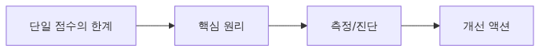
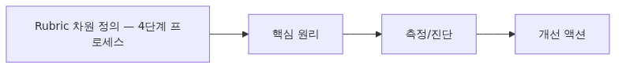
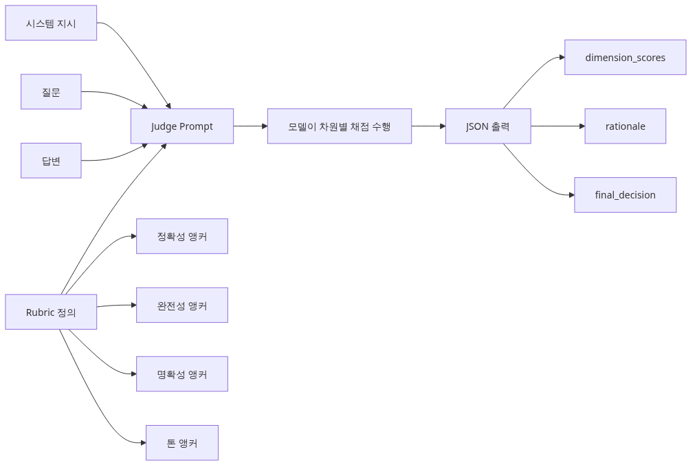
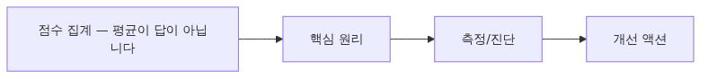

# Rubric 기반 채점 설계

LLM judge를 도입한 팀이 다음으로 맞닥뜨리는 문제는 '그래서 3점이 왜 3점인가'입니다. 단일 점수는 비교에는 편하지만, 실제 개선 작업에는 자주 모호합니다. 정확성이 낮아서 3점인지, 설명이 장황해서 3점인지 분간이 안 되기 때문입니다.

운영에서는 이 구분이 중요합니다. 사실이 틀린 답과 문체만 어색한 답은 처리 우선순위가 완전히 다릅니다. 그런데 둘 다 같은 3점으로 묶이면 팀은 잘못된 문제를 고치기 쉽습니다.

제가 본 강한 팀들은 이 지점에서 rubric으로 넘어갔습니다. 사용자 가치에 맞는 차원을 3~5개로 나누고, 각 차원마다 1점·3점·5점의 기준 예시를 써 두면 judge도 사람도 훨씬 일관되게 평가할 수 있습니다.

이 글은 AI Evaluation 101 시리즈의 5번째 글입니다.

여기서는 평가 차원을 어떻게 뽑고, anchor를 어떻게 쓰고, 평균 하나로 뭉개지지 않게 집계를 어떻게 설계해야 하는지 정리하겠습니다.

## 이 글에서 다룰 문제

- 단일 1~5 점수가 실제 개선 포인트를 숨기는 이유는 무엇일까요?
- 사용자 가치에서 평가 차원을 뽑을 때 어떤 질문부터 해야 할까요?
- 1점·3점·5점 anchor 예시가 judge와 사람의 일관성을 어떻게 높일까요?
- 차원 독립성 검사는 왜 rubric 설계에서 빠지면 안 될까요?
- 평균 점수 하나가 위험해지는 상황에서는 어떤 집계 전략을 써야 할까요?

## 왜 이 글이 중요한가

Rubric은 팀의 개선 우선순위를 또렷하게 만듭니다. 정확성은 충분한데 명확성이 낮다면 프롬프트 구조를 손봐야 하고, 정확성 자체가 낮다면 검색이나 모델 품질을 다시 봐야 합니다. 한 점수로는 이런 차이를 읽기 어렵습니다.

또한 운영 리뷰가 훨씬 실용적으로 바뀝니다. '전체 평균 4.1점'보다 '정확성 4.8, 명확성 3.4'가 훨씬 행동 가능하기 때문입니다. 무엇을 먼저 고쳐야 하는지가 즉시 드러납니다.

그래서 rubric은 점수를 더 복잡하게 만드는 장치가 아니라, 품질 논의를 문제 해결 가능한 단위로 쪼개는 설계입니다. 차원을 잘못 잡으면 평가가 무너지고, 잘 잡으면 개선 속도가 붙습니다.

## Rubric 채점을 이해하는 가장 좋은 방법: 한 점수로 끝내지 말고 고장 위치를 분해하는 것입니다

이 주제는 개별 기법을 외우기보다 먼저 어떤 운영 문제를 풀기 위한 장치인지 붙잡아 두는 편이 이해가 빠릅니다. Rubric은 팀의 개선 우선순위를 또렷하게 만듭니다. 정확성은 충분한데 명확성이 낮다면 프롬프트 구조를 손봐야 하고, 정확성 자체가 낮다면 검색이나 모델 품질을 다시 봐야 합니다. 한 점수로는 이런 차이를 읽기 어렵습니다.

> 단일 점수는 결과를 말해 주지만 원인을 말해 주지 않습니다. Rubric은 정확성, 완전성, 명확성, 톤처럼 품질 차원을 분리해서 팀이 어디를 고쳐야 하는지 바로 보이게 만듭니다.

이 관점을 먼저 잡아 두면 뒤에 나오는 코드와 지표를 기능 설명이 아니라 운영 설계 관점에서 읽을 수 있습니다. 결국 중요한 것은 수치 이름보다, 그 수치가 어떤 의사결정을 가능하게 하느냐입니다.

## 핵심 개념


Rubric 기반 채점 설계

### 단일 점수의 한계



단일 점수의 한계
Ep4의 single scoring은 응답에 1~5점을 매깁니다. 그런데 "3점"이 무슨 뜻일까요? 사실이 부정확해서 3점일 수도 있고, 정확하지만 톤이 어색해서 3점일 수도 있습니다. **단일 점수는 무엇이 잘못됐는지 알려주지 않습니다.**

Rubric 기반 채점은 응답을 여러 차원으로 나눠서 각각 점수를 매깁니다. 예를 들어 LLM 챗봇 응답을 다음 4가지로 평가합니다.

| 차원 | 의미 | 점수 |
|-----|------|-----|
| Correctness | 사실이 맞는가 | 1~5 |
| Completeness | 빠진 정보가 없는가 | 1~5 |
| Clarity | 이해하기 쉬운가 | 1~5 |
| Tone | 톤이 적절한가 | 1~5 |

이렇게 하면 "Correctness 5, Tone 2"처럼 **약점을 정확히 짚을 수 있습니다.**

### Rubric 차원 정의 — 4단계 프로세스



Rubric 차원 정의 - 4단계 프로세스
좋은 rubric은 즉흥적으로 만들 수 없습니다. 다음 4단계를 따릅니다.

### Step 1: 사용자 가치에서 차원 도출

"좋은 응답"이 무엇인지 사용자 관점으로 적습니다. 고객 지원 봇의 경우:

- 사용자는 "내 문제를 해결할 수 있나"를 보고 → **Correctness, Completeness**
- 사용자는 "이해할 수 있나"를 보고 → **Clarity**
- 사용자는 "기분 좋게 응대받았나"를 보고 → **Tone, Empathy**

도메인마다 다릅니다. 코드 리뷰 봇이면 Correctness, Specificity, Actionability를 씁니다.

### Step 2: 차원당 anchor 작성

각 차원에 대해 1점, 3점, 5점이 어떤 모습인지 **구체적인 예시**를 작성합니다.

```yaml
# rubric/clarity.yaml
dimension: Clarity
anchors:
  5: |
    Short and clear. Understood on first read.
    Example: "Set the API key in the OPENAI_API_KEY environment variable."
  3: |
    Understandable, but you have to re-read. Slightly verbose or vague.
    Example: "Configure the authentication credential appropriately in your environment settings."
  1: |
    Incomprehensible. Jargon dump or rambling.
    Example: "Leverage implicit context propagation for credential provisioning..."
```

Anchor가 없으면 judge LLM도 사람도 채점이 흔들립니다.

### Step 3: 차원이 독립적인지 검증

두 차원이 비슷한 것을 측정하면 중복입니다. 예: "Accuracy"와 "Correctness"는 같습니다. 50건 샘플로 차원 간 상관관계를 봅니다.

```python
# rubric/check_independence.py
import pandas as pd

df = pd.DataFrame({
    "correctness": [5, 4, 3, 5, 2, ...],
    "clarity":     [4, 3, 4, 5, 3, ...],
    "tone":        [5, 5, 3, 4, 4, ...],
})
print(df.corr())
# Correlation > 0.9 means the two dimensions are effectively the same
# → merge or drop one
```

### Step 4: 3~5개로 제한

차원이 10개를 넘으면 judge가 일관되게 채점하지 못합니다. **핵심 3~5개**로 줄이세요.

### Judge prompt에 rubric 넣기



Judge prompt에 rubric 넣기
Ep4의 single scoring prompt를 rubric으로 확장합니다.

```python
# rubric/judge_rubric.py
from openai import OpenAI
import json

client = OpenAI()

RUBRIC_PROMPT = """Grade the answer on each dimension from 1 to 5.

Question: {question}
Answer: {answer}

Dimensions:
1. Correctness — Are the facts right (5: all correct, 1: contains false info)
2. Completeness — Is the key information complete (5: complete, 1: more than half missing)
3. Clarity — Easy to understand (5: understood on first read, 1: incomprehensible)
4. Tone — Appropriate tone (5: polite and professional, 1: rude or off)

Respond with JSON only. No other text.
{{
  "correctness": <int>,
  "completeness": <int>,
  "clarity": <int>,
  "tone": <int>,
  "reasoning": "one-sentence justification"
}}
"""

def judge_rubric(question: str, answer: str) -> dict:
    response = client.chat.completions.create(
        model="gpt-4o",
        messages=[{"role": "user", "content": RUBRIC_PROMPT.format(
            question=question, answer=answer
        )}],
        temperature=0,
        response_format={"type": "json_object"},
    )
    return json.loads(response.choices[0].message.content)

if __name__ == "__main__":
    result = judge_rubric(
        "Where do I set the API key?",
        "Set it in the OPENAI_API_KEY environment variable."
    )
    print(result)
    # {'correctness': 5, 'completeness': 4, 'clarity': 5, 'tone': 5, 'reasoning': '...'}
```

`response_format={"type": "json_object"}`로 강제하면 파싱 실패가 거의 없습니다.

### 점수 집계 — 평균이 답이 아닙니다



점수 집계 - 평균이 답이 아닙니다
차원별 점수를 어떻게 하나로 합칠까요? 흔한 실수는 **단순 평균**입니다. 이는 약점을 가립니다.

| 응답 | Correct | Complete | Clarity | Tone | 평균 | 진실 |
|-----|---------|----------|---------|------|------|------|
| A | 5 | 5 | 5 | 5 | 5.0 | 우수 |
| B | 1 | 5 | 5 | 5 | 4.0 | **거짓 정보** |

B는 평균 4점이지만 실제로는 **사용 불가**입니다. Correctness 1점은 다른 차원이 무엇이든 fail이어야 합니다.

### 추천 집계 방식 3가지

**방식 1: 가중 평균 + 임계값**

```python
# rubric/aggregate.py
def aggregate_weighted(scores: dict) -> tuple[float, str]:
    weights = {"correctness": 0.5, "completeness": 0.2,
               "clarity": 0.15, "tone": 0.15}
    weighted = sum(scores[k] * weights[k] for k in weights)

    # Correctness < 3 is an automatic FAIL
    if scores["correctness"] < 3:
        return weighted, "FAIL"
    if weighted >= 4.0:
        return weighted, "PASS"
    return weighted, "REVIEW"
```

**방식 2: 최소값(weakest link)**

```python
def aggregate_min(scores: dict) -> int:
    return min(scores.values())
# The weakest dimension defines overall quality
```

**방식 3: 차원별로 따로 보고 (집계 없음)**

대시보드에서 4개 차원을 각각 봅니다. 평균을 안 내는 게 가장 정직합니다.

```python
# rubric/dashboard.py
import pandas as pd
df = pd.DataFrame(scored_responses)
print(df[["correctness","completeness","clarity","tone"]].describe())
#         correct  complete  clarity  tone
# mean      4.2      4.5      3.8      4.7
# min       1        2        1        3
```

### 사람과의 일치도 — 차원별로 측정

Ep4에서는 단일 점수에 대해 Cohen's kappa를 측정했습니다. Rubric은 **차원별로 따로** kappa를 측정합니다.

```python
# rubric/agreement_per_dim.py
from sklearn.metrics import cohen_kappa_score

dimensions = ["correctness", "completeness", "clarity", "tone"]
for dim in dimensions:
    h = [s[dim] for s in human_scores]
    j = [s[dim] for s in judge_scores]
    k = cohen_kappa_score(h, j, weights="quadratic")
    print(f"{dim}: kappa={k:.3f}")
# correctness: kappa=0.78  ← trustworthy
# completeness: kappa=0.65 ← trustworthy
# clarity:     kappa=0.42  ← fair, prompt needs work
# tone:        kappa=0.31  ← weak, rewrite anchors
```

차원별 kappa가 다르면 **약한 차원의 anchor를 다시 작성**하세요. 모든 차원이 0.6 이상이 될 때까지 반복합니다.

## 이 코드에서 먼저 봐야 할 점

- 가장 먼저 차원 표를 보시면 단일 점수가 왜 원인 분석에 약한지 금방 이해됩니다. 같은 4점이라도 실제 위험도는 전혀 다를 수 있습니다.
- YAML anchor 예제는 judge 프롬프트보다 더 중요할 때가 많습니다. 차원 이름만 있고 기준 예시가 없으면 사람도 모델도 제각각 해석합니다.
- 집계 전략 세 가지는 실무에서 자주 갈립니다. 특히 정확성 1점이 다른 차원 5점으로 덮이지 않게 막는 임계값 규칙을 꼭 보셔야 합니다.

이 세 지점을 먼저 읽고 나면 세부 구현과 지표 해석이 훨씬 빨라집니다. 코드가 길어 보여도 운영 질문은 대개 여기로 다시 돌아옵니다.

## 어디서 자주 헷갈릴까요?

### Mistake 1: 차원을 너무 많이 만듦

Correctness, Completeness, Clarity, Tone, Empathy, Conciseness, Helpfulness, Friendliness... 8개를 만들면 judge가 일관되게 채점하지 못합니다. **3~5개로 제한**하세요.

### Mistake 2: Anchor 없이 차원 이름만 적음

"Clarity (1~5)"만 적고 anchor를 안 쓰면, judge LLM도 사람도 매번 다르게 채점합니다. **차원당 1점/3점/5점 예시는 필수**입니다.

### Mistake 3: 단순 평균으로 집계

Correctness 1점, Tone 5점인 응답을 평균 3점으로 보고하면 거짓 정보를 통과시킵니다. **가중 평균 + 임계값 또는 차원별 따로 보기**를 쓰세요.

### Mistake 4: 모든 차원을 같은 가중치로 둠

도메인마다 우선순위가 다릅니다. 의료 챗봇은 Correctness가 70%, 마케팅 봇은 Tone이 30%일 수 있습니다. **사용 사례에 맞춰 가중치 조정**.

### Mistake 5: 차원 간 독립성을 검증하지 않음

Helpfulness와 Completeness가 0.95 상관관계면 사실상 한 차원입니다. **상관관계 0.9 이상이면 합치세요.**

현업에서 제가 가장 자주 보는 문제는 결과 숫자만 보고 원인 분해를 건너뛰는 습관입니다. 평가가 개선을 돕지 못하고 보고서용 숫자로만 남는 순간, 팀은 다시 감각에 의존하게 됩니다.

## 첫 번째 운영 체크리스트

- [ ] 평가 차원을 3~5개로 제한했는가
- [ ] 각 차원에 1점·3점·5점 anchor 예시가 있는가
- [ ] 중복 차원을 상관계수로 점검했는가
- [ ] 평균 점수만 보고 배포 결정을 내리지 않는가
- [ ] 차원별 사람-judge 일치도를 따로 측정하는가

## 실무에서는 이렇게 생각한다

실무에서는 rubric 이름보다 anchor 품질이 더 중요합니다. '명확성'이라고 써 두는 것만으로는 부족하고, 어떤 답이 5점인지 사례 수준으로 적어 둬야 일관성이 생깁니다.

또한 모든 차원을 같은 비중으로 두는 습관도 위험합니다. 의료, 금융처럼 사실 오류 비용이 큰 도메인에서는 정확성 가중치를 압도적으로 높게 두는 편이 맞습니다.

다음 글의 RAG 평가로 넘어가면 이 감각이 더 중요해집니다. 검색 품질과 생성 품질을 분리해 보지 않으면, 평균이 그럴듯해도 실제로 어디가 고장 났는지 계속 놓치게 됩니다.

## 정리: Rubric은 점수를 늘리는 것이 아니라 고장 위치를 드러내는 설계입니다

- 단일 점수는 약점을 숨깁니다. **3~5개 차원**으로 나누면 무엇이 문제인지 보입니다.
- Rubric 설계 4단계: 사용자 가치 → 차원 정의 → anchor 작성 → 독립성 검증.
- Judge prompt에 차원과 anchor를 넣고 **JSON 출력 강제**로 파싱 실패를 줄입니다.
- 단순 평균은 위험합니다. **가중 평균 + 임계값 또는 차원별 따로 보기**를 쓰세요.
- Cohen's kappa를 차원별로 측정하고, 0.6 미만 차원의 anchor를 다시 작성하세요.

다음 글에서는 RAG 파이프라인 평가 — retrieval, faithfulness, answer relevance — 를 다룹니다.

다음 글에서는 이 분해 감각을 RAG 파이프라인에 적용합니다. 검색이 문제인지 생성이 문제인지 구분하려면 차원별 시야가 먼저 필요합니다.

## 운영 체크리스트

- [ ] 차원 이름만 만들지 말고 anchor 예시까지 반드시 작성하기
- [ ] 정확성처럼 치명적 차원에는 별도 FAIL 임계값 두기
- [ ] 평균 대신 차원별 대시보드를 운영 기본 화면으로 삼기
- [ ] 상관이 높은 차원은 합치거나 삭제하기
- [ ] 사람-judge 일치도가 낮은 차원부터 anchor 다시 쓰기

<!-- toc:begin -->
## AI Evaluation 101 시리즈

- [왜 LLM 애플리케이션을 평가해야 하는가](./01-why-evaluate-llm-apps.md)
- [평가 데이터셋 설계하기](./02-evaluation-dataset-design.md)
- [결정적 지표 — Exact Match, BLEU, ROUGE](./03-deterministic-metrics.md)
- [LLM-as-Judge — 모델로 모델을 평가하기](./04-llm-as-judge.md)
- **Rubric 기반 채점 설계 (현재 글)**
- RAG 시스템 평가하기 (예정)
- 에이전트 평가하기 — 단일 응답이 아닌 trajectory (예정)
- 회귀 테스트 — 어제 잘 되던 게 오늘 망가지지 않게 (예정)
- LLM A/B 테스팅 — 어느 prompt가 더 나은가 (예정)
- 운영 환경에서의 지속적 평가 (예정)
<!-- toc:end -->

## 참고 자료

### 공식 문서

- [Liu et al. (2023). G-Eval — NLG Evaluation using GPT-4 with Better Human Alignment](https://arxiv.org/abs/2303.16634)
- [Anthropic — Multi-dimensional evaluation patterns](https://docs.anthropic.com/en/docs/build-with-claude/develop-tests)
- [LangSmith — Custom Evaluators with Rubrics](https://docs.smith.langchain.com/evaluation/how_to_guides/custom_evaluator)
- [Hugging Face — Evaluating LLMs with multi-dimensional criteria](https://huggingface.co/learn/cookbook/en/llm_judge)

### 관련 시리즈

- [이전 글 — LLM-as-Judge — 모델로 모델을 평가하기](./04-llm-as-judge.md)
- [다음 글 — RAG 시스템 평가하기](./06-rag-evaluation.md)
- [시리즈 현재 위치 다시 보기](./05-rubric-based-scoring.md)

Tags: AI Evaluation, Rubric, Multi-Dimensional, JSON Output
