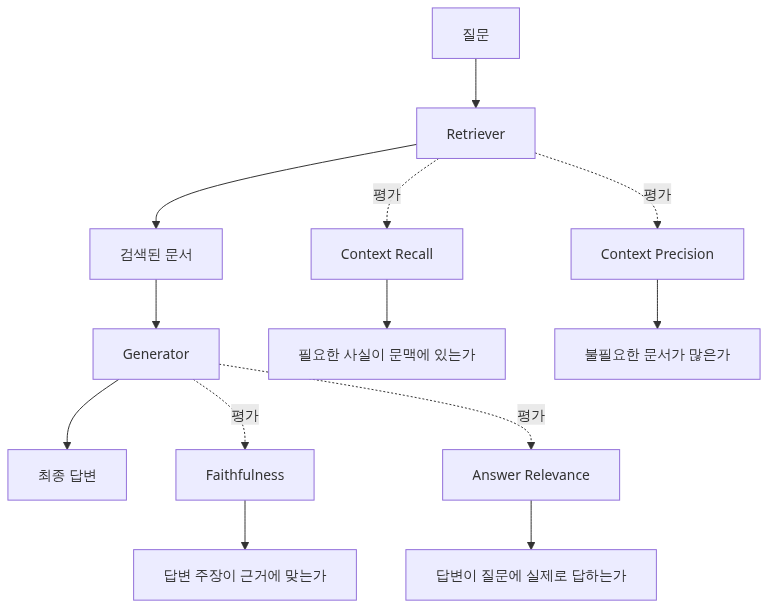
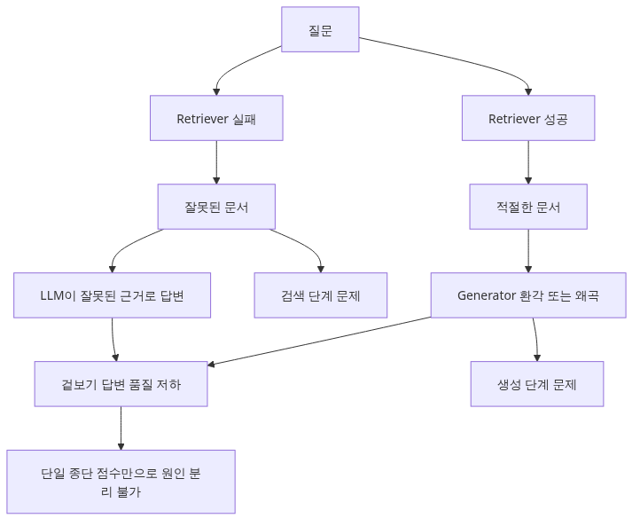
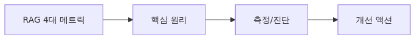
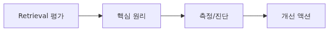
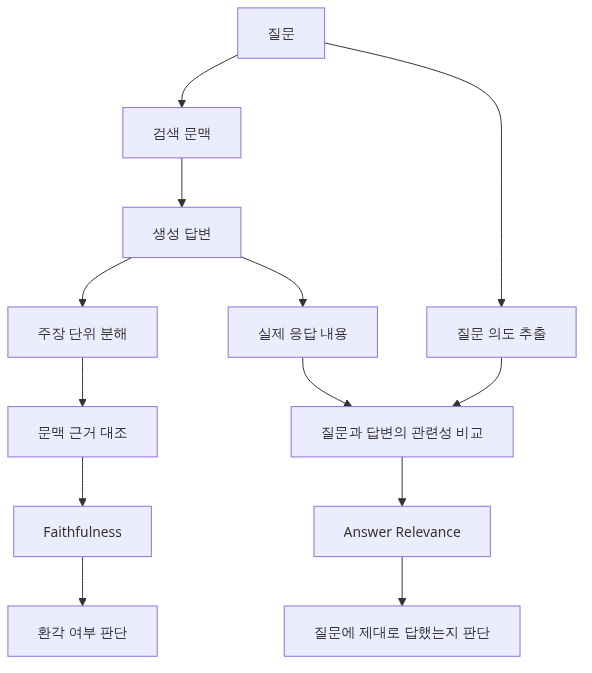

# RAG 시스템 평가하기

> AI Evaluation 101 시리즈 (6/10)

RAG는 retrieval과 generation 두 단계 모두를 평가해야 합니다. 이 글은 retrieval recall, context precision, faithfulness, answer relevance 같은 RAG 전용 지표를 다룹니다.

---


*RAG 시스템 평가하기*

## RAG는 단일 모델이 아니라 파이프라인입니다



*RAG는 단일 모델이 아니라 파이프라인*
RAG(Retrieval-Augmented Generation)는 두 단계로 동작합니다.

```text
질문 → [1. Retriever]  → 관련 문서 K개 → [2. Generator (LLM)] → 답변
        (vector DB)                       (context로 답변 생성)
```

이 두 단계는 **각각 따로 망가질 수 있습니다.**

- Retriever가 잘못된 문서를 가져오면 → LLM은 잘못된 context로 답변 (생성은 정상)
- Retriever가 올바른 문서를 가져왔는데 LLM이 무시하거나 hallucinate → 생성 단계가 문제

따라서 RAG 평가는 **단계별로 따로** 측정해야 합니다. "답변 정확도 70%"라는 단일 숫자는 어디가 망가졌는지 알려주지 않습니다.

---

## RAG 4대 메트릭



*RAG 4대 메트릭*
업계 표준은 다음 4가지입니다 (RAGAS, TruLens 등이 채택).

| 단계 | 메트릭 | 무엇을 묻는가 |
|-----|-------|--------------|
| Retrieval | **Context Recall** | 정답에 필요한 정보가 검색된 문서에 있는가 |
| Retrieval | **Context Precision** | 검색된 문서가 모두 관련 있는가 (노이즈 비율) |
| Generation | **Faithfulness** | 답변이 검색된 context에만 근거하는가 (hallucination 여부) |
| Generation | **Answer Relevance** | 답변이 질문에 실제로 답하는가 |

각각을 살펴봅니다.

---

## Retrieval 평가



*Retrieval 평가*
### Context Recall — 필요한 정보가 검색됐는가

정답을 만들 때 **반드시 알아야 하는 사실(claim)**들이 검색된 context에 모두 있는지 확인합니다.

```python
# rag/context_recall.py
from openai import OpenAI
import json

client = OpenAI()

RECALL_PROMPT = """정답을 만들기 위해 필요한 사실(claim)이 retrieved context에 모두 있는지 확인하세요.

질문: {question}
정답(reference): {reference}
검색된 context:
{context}

먼저 정답을 atomic claim 단위로 쪼개세요. 그리고 각 claim이 context에 있는지 (yes/no) 표시하세요.

JSON으로 출력:
{{
  "claims": [
    {{"claim": "...", "supported_by_context": true}},
    ...
  ]
}}
"""

def context_recall(question: str, reference: str, context: str) -> float:
    response = client.chat.completions.create(
        model="gpt-4o",
        messages=[{"role": "user", "content": RECALL_PROMPT.format(
            question=question, reference=reference, context=context
        )}],
        temperature=0,
        response_format={"type": "json_object"},
    )
    data = json.loads(response.choices[0].message.content)
    claims = data["claims"]
    if not claims:
        return 0.0
    supported = sum(1 for c in claims if c["supported_by_context"])
    return supported / len(claims)
```

**해석**: 0.8 = 정답의 80% 정보가 검색됨. 0.5 미만이면 retriever가 핵심 문서를 놓치고 있습니다.

### Context Precision — 검색된 문서가 노이즈인가

검색된 context 중 **실제로 관련 있는** 비율입니다. Top-K=10인데 그중 2개만 관련 있으면 precision=0.2입니다.

```python
# rag/context_precision.py
PRECISION_PROMPT = """다음 retrieved chunk가 질문에 답하는 데 필요한가요?

질문: {question}
Chunk: {chunk}

JSON으로: {{"relevant": true/false}}
"""

def context_precision(question: str, chunks: list[str]) -> float:
    relevant_count = 0
    for chunk in chunks:
        response = client.chat.completions.create(
            model="gpt-4o-mini",  # 단순 판정이라 cheaper model OK
            messages=[{"role": "user", "content": PRECISION_PROMPT.format(
                question=question, chunk=chunk
            )}],
            temperature=0,
            response_format={"type": "json_object"},
        )
        if json.loads(response.choices[0].message.content)["relevant"]:
            relevant_count += 1
    return relevant_count / len(chunks)
```

**해석**: precision이 낮으면 LLM이 노이즈에 휩쓸려 잘못된 답변을 생성할 위험이 큽니다.

---

## Generation 평가



*Generation 평가*
### Faithfulness — Hallucination 탐지

답변의 모든 주장이 검색된 context로 **뒷받침되는지** 확인합니다. Context에 없는 사실을 말하면 hallucination입니다.

```python
# rag/faithfulness.py
FAITHFULNESS_PROMPT = """답변을 atomic claim으로 쪼개고, 각 claim이 context로 뒷받침되는지 확인하세요.

질문: {question}
Context: {context}
답변: {answer}

JSON으로:
{{
  "claims": [
    {{"claim": "...", "supported_by_context": true/false}},
    ...
  ]
}}
"""

def faithfulness(question: str, context: str, answer: str) -> float:
    response = client.chat.completions.create(
        model="gpt-4o",
        messages=[{"role": "user", "content": FAITHFULNESS_PROMPT.format(
            question=question, context=context, answer=answer
        )}],
        temperature=0,
        response_format={"type": "json_object"},
    )
    data = json.loads(response.choices[0].message.content)
    claims = data["claims"]
    if not claims:
        return 0.0
    supported = sum(1 for c in claims if c["supported_by_context"])
    return supported / len(claims)
```

**해석**: 1.0 = 모든 주장이 context로 뒷받침됨. 0.7 미만이면 hallucination이 심각합니다. **production RAG의 최우선 metric**입니다.

### Answer Relevance — 질문에 진짜 답했는가

LLM은 가끔 질문과 무관한 내용을 답합니다. 답변에서 **역으로 질문을 생성**해 원 질문과의 유사도를 봅니다.

```python
# rag/answer_relevance.py
from sentence_transformers import SentenceTransformer
import numpy as np

model = SentenceTransformer("all-MiniLM-L6-v2")

REVERSE_PROMPT = """다음 답변을 만들어낸 것으로 보이는 질문 3개를 추측해서 한 줄씩 출력하세요.

답변: {answer}
"""

def answer_relevance(question: str, answer: str) -> float:
    response = client.chat.completions.create(
        model="gpt-4o",
        messages=[{"role": "user", "content": REVERSE_PROMPT.format(answer=answer)}],
        temperature=0,
    )
    generated_qs = response.choices[0].message.content.strip().split("\n")[:3]

    # 원 질문과 생성된 질문들의 cosine similarity 평균
    emb_orig = model.encode([question])[0]
    embs_gen = model.encode(generated_qs)
    sims = [np.dot(emb_orig, eg) / (np.linalg.norm(emb_orig) * np.linalg.norm(eg))
            for eg in embs_gen]
    return float(np.mean(sims))
```

**해석**: 1.0 = 답변이 정확히 그 질문에 대한 답. 0.6 미만이면 답변이 질문과 어긋남.

---

## 4개 메트릭으로 진단하기

4개 메트릭을 함께 보면 **어디가 망가졌는지** 진단할 수 있습니다.

| Recall | Precision | Faithfulness | Relevance | 진단 |
|--------|-----------|--------------|-----------|------|
| Low | High | High | High | Retriever가 핵심 문서를 놓침 → embedding 또는 chunking 개선 |
| High | Low | High | High | Retriever가 노이즈 너무 많이 가져옴 → top-K 줄이거나 reranker 추가 |
| High | High | Low | High | LLM이 hallucinate → prompt에 "context에만 근거" 명시 |
| High | High | High | Low | LLM이 질문 무시 → prompt 재설계 |
| High | High | High | High | RAG가 잘 동작 |

이 진단표 없이 "답변 정확도가 70%"라는 단일 숫자만 보면 무엇을 고쳐야 할지 알 수 없습니다.

---

## RAGAS — 위 4개를 묶어서 자동화

위 4개 metric을 직접 구현할 수도 있지만, [RAGAS](https://docs.ragas.io/) 라이브러리가 표준 구현을 제공합니다.

```python
# rag/with_ragas.py
from ragas import evaluate
from ragas.metrics import (
    context_recall, context_precision,
    faithfulness, answer_relevancy,
)
from datasets import Dataset

dataset = Dataset.from_dict({
    "question":     ["RAG가 뭔가요?", ...],
    "ground_truth": ["RAG는 검색과 생성을 결합한...", ...],
    "answer":       ["RAG는 검색 기반 생성 기법으로...", ...],
    "contexts":     [["RAG는...", "검색은..."], ...],
})

result = evaluate(
    dataset,
    metrics=[context_recall, context_precision, faithfulness, answer_relevancy],
)
print(result)
# {'context_recall': 0.85, 'context_precision': 0.72, 'faithfulness': 0.91, 'answer_relevancy': 0.88}
```

직접 구현할 시간이 없으면 RAGAS로 시작하세요. 단, 도메인 특화 평가가 필요하면 직접 구현이 더 정확합니다.

---

## Common Mistakes

### Mistake 1: 답변 정확도만 측정

"답변 70% 맞음"이라는 단일 숫자는 무엇이 망가졌는지 알려주지 않습니다. **반드시 4개 metric을 분리**해서 측정하세요.

### Mistake 2: Retrieval만 보고 만족

Recall=0.95, Precision=0.9면 retriever가 좋다고 끝내면 안 됩니다. **Faithfulness가 0.5면 LLM이 hallucinate**하고 있어서 RAG는 여전히 망가진 상태입니다.

### Mistake 3: Faithfulness 무시

Production RAG의 최대 위험은 **그럴듯한 거짓**입니다. Faithfulness 점수를 production alert에 연결하세요. 0.8 미만이면 즉시 조사.

### Mistake 4: Top-K를 무작정 늘림

"더 많은 context = 더 좋은 답"이 아닙니다. K=20이 되면 precision이 떨어지고 LLM이 혼란스러워집니다. **K=3~5에서 시작**해서 실험으로 최적값을 찾으세요.

### Mistake 5: Ground truth context 없이 Recall 측정

Context Recall은 reference 답변이 필요합니다. Reference 없이는 측정 불가입니다. **평가 데이터셋에 reference answer를 반드시 포함**하세요 (Ep2 참조).

---

## 핵심 요약

- RAG는 retrieval + generation 두 단계 파이프라인이고, **각각 따로 측정**해야 합니다.
- 4대 메트릭: **Context Recall** (검색 누락), **Context Precision** (노이즈), **Faithfulness** (hallucination), **Answer Relevance** (질문 적중).
- 4개 메트릭의 조합으로 **어디가 망가졌는지 진단**할 수 있습니다.
- Faithfulness는 production에서 **가장 중요한 metric**입니다. Hallucination을 잡습니다.
- 직접 구현 대신 [RAGAS](https://docs.ragas.io/)를 쓰면 빠르게 시작할 수 있습니다.

다음 글에서는 단일 응답이 아닌 **agent의 trajectory**를 평가하는 법을 다룹니다.

---

<!-- toc:begin -->
## AI Evaluation 101 시리즈

- [Ep1 LLM 앱은 왜 평가해야 하는가](./01-why-evaluate-llm-apps.md)
- [Ep2 평가 데이터셋 설계](./02-evaluation-dataset-design.md)
- [Ep3 결정론적 메트릭 — Exact Match, BLEU, ROUGE](./03-deterministic-metrics.md)
- [Ep4 LLM-as-Judge — 모델로 모델을 평가하기](./04-llm-as-judge.md)
- [Ep5 Rubric 기반 다차원 채점](./05-rubric-based-scoring.md)
- **Ep6 RAG 평가 (현재 글)**
- Ep7 Agent 평가 (예정)
- Ep8 회귀 테스트 (예정)
- Ep9 LLM A/B 테스트 (예정)
- Ep10 프로덕션 평가 (예정)
<!-- toc:end -->

## 참고 자료

- [RAGAS — Reference-Free Evaluation of RAG Pipelines (Es et al., 2023)](https://arxiv.org/abs/2309.15217)
- [RAGAS Documentation](https://docs.ragas.io/)
- [TruLens — Evaluation and Tracking for LLM Apps](https://www.trulens.org/)
- [LangChain — RAG Evaluation Guide](https://docs.smith.langchain.com/evaluation/tutorials/rag)

Tags: AI Evaluation, RAG, Faithfulness, Retrieval
