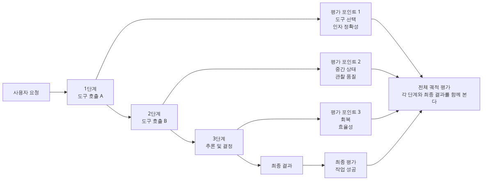
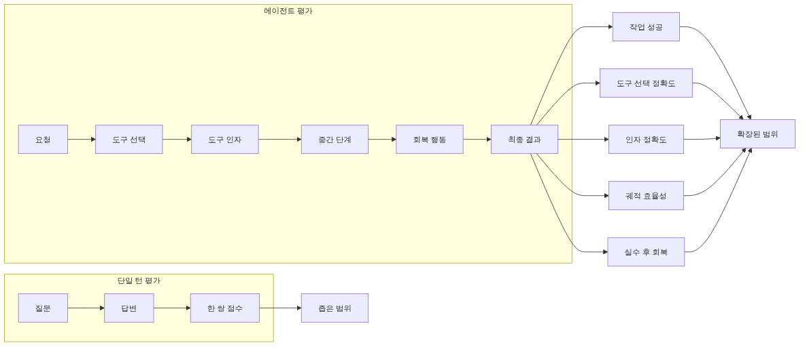
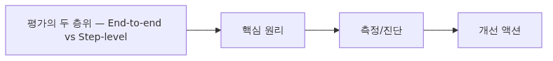
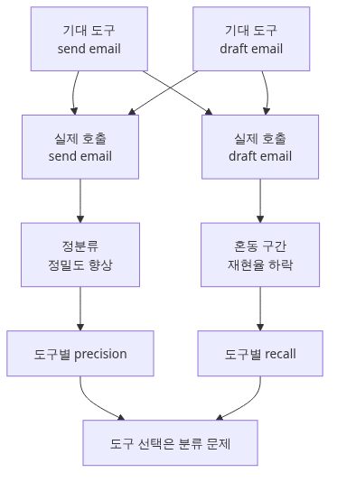
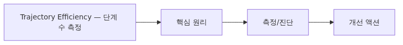

# Agent 평가하기 — 단일 응답이 아닌 trajectory

> AI Evaluation 101 시리즈 (7/10)

에이전트는 여러 단계를 거쳐 답을 만듭니다. 최종 응답만이 아니라 '어떤 도구를, 어떤 순서로, 몇 번 호출했는가'를 평가해야 합니다.

이 글은 AI Evaluation 101 시리즈의 7번째 글입니다. 여기서는 trajectory-level 평가 방법을 다룹니다.

---


Agent 평가하기 - 단일 응답이 아닌 trajectory

## Agent 평가는 왜 다른가



Agent 평가의 특수성
지금까지(Ep1~Ep6)는 **단일 응답** 평가였습니다. 질문 → 답변 한 쌍을 채점합니다.

Agent는 다릅니다. Agent는 여러 단계를 거쳐 작업을 완료합니다.

```text
사용자 요청: "이번 주 일정을 이메일로 정리해 줘"
  ↓
Step 1: read_calendar()  → [10건의 미팅]
Step 2: read_emails()    → [3건의 이메일]
Step 3: summarize(...)   → "이번 주 요약: ..."
Step 4: send_email(...)  → "전송 완료"
  ↓
최종 답변: "이메일을 보냈습니다."
```

Agent 평가는 **최종 답변만 보면 안 됩니다.** 다음 5가지를 함께 측정해야 합니다.

1. **Task success** — 사용자가 원한 결과가 나왔는가
2. **Tool selection** — 올바른 tool을 호출했는가
3. **Tool arguments** — tool 인자가 올바른가
4. **Trajectory efficiency** — 불필요한 단계 없이 최단 경로로 갔는가
5. **Recovery** — 도중 실패에서 복구했는가

각각을 살펴봅니다.

---

## 평가의 두 층위 — End-to-end vs Step-level



평가의 두 층위 - End-to-end vs Step-level
Agent 평가에는 두 가지 시점이 있습니다.

### End-to-end (전체 결과)

최종 결과만 봅니다. "이메일이 실제로 보내졌는가?" 하나만 묻습니다.

```python
def end_to_end_success(agent_run: dict) -> bool:
    return agent_run["final_state"]["email_sent"] is True
```

**장점**: 단순합니다. 사용자 가치와 직결됩니다.
**단점**: 실패해도 **어디서 망가졌는지** 모릅니다.

### Step-level (단계별)

각 step에서 **올바른 tool을 올바른 인자로 호출했는가**를 봅니다.

```python
expected_trajectory = [
    {"tool": "read_calendar", "args_match": lambda a: "week" in a.get("range", "")},
    {"tool": "read_emails",   "args_match": lambda a: a.get("limit", 0) <= 10},
    {"tool": "summarize",     "args_match": lambda a: True},
    {"tool": "send_email",    "args_match": lambda a: "@" in a.get("to", "")},
]

def step_match_score(actual: list[dict], expected: list[dict]) -> float:
    matches = 0
    for i, exp in enumerate(expected):
        if i >= len(actual):
            break
        a = actual[i]
        if a["tool"] == exp["tool"] and exp["args_match"](a["args"]):
            matches += 1
    return matches / len(expected)
```

**장점**: 어느 step이 망가졌는지 정확히 가리킵니다.
**단점**: 정답 trajectory가 여러 개일 수 있어 너무 엄격하면 false negative.

**실무 권장**: end-to-end로 큰 그림을 보고, 실패 케이스만 step-level로 분석.

---

## Tool Selection 평가 — Confusion Matrix



Tool Selection 평가 - Confusion Matrix
Agent가 tool을 잘못 고르는 경우는 흔합니다. "send_email" 대신 "draft_email"을 부르는 식입니다. Tool selection을 분류 문제로 보고 confusion matrix를 만듭니다.

```python
from sklearn.metrics import confusion_matrix, classification_report

# 테스트 케이스 100개
expected_tools = ["send_email", "read_calendar", "send_email", ...]
actual_tools   = ["draft_email","read_calendar", "send_email", ...]

print(classification_report(expected_tools, actual_tools))
# 특정 도구 항목의 재현율이 낮으면 오선택이 자주 일어나는 상황입니다.
```

**해석**: send_email의 recall이 0.70이면 30% 케이스에서 send 대신 draft를 부른다는 뜻입니다. **prompt에 "draft가 아니라 send를 사용하세요" 같은 예시 추가** 필요.

---

## Trajectory Efficiency — 단계 수 측정



Trajectory Efficiency - 단계 수 측정
같은 작업을 4단계로 끝낸 agent와 12단계 만에 끝낸 agent는 다릅니다. 12단계는 토큰 비용 3배, latency 3배, 실패 위험 3배입니다.

```python
def trajectory_metrics(agent_run: dict, expected_steps: int) -> dict:
    actual_steps = len(agent_run["steps"])
    return {
        "step_count":      actual_steps,
        "step_overhead":   actual_steps / expected_steps,  # 1.0 = optimal
        "total_latency_s": sum(s["latency_s"] for s in agent_run["steps"]),
        "total_tokens":    sum(s["tokens"] for s in agent_run["steps"]),
        "tool_calls":      sum(1 for s in agent_run["steps"] if "tool" in s),
    }

# 100건 평균
overheads = [trajectory_metrics(r, 4)["step_overhead"] for r in runs]
print(f"평균 step overhead: {sum(overheads)/len(overheads):.2f}")
# 평균 단계 오버헤드: 1.8  ← 에이전트가 거의 2배 단계를 사용함
```

**경험적 기준**: step overhead가 2.0을 넘으면 prompt 또는 tool 설계 재검토.

---

## Recovery 평가 — 실패에서 살아나는가

Production agent는 tool 실패에 부딪힙니다 (API rate limit, network error 등). Agent가 **재시도하거나 다른 경로를 찾는지** 봅니다.

```python
def evaluate_recovery(agent_run: dict) -> str:
    steps = agent_run["steps"]
    # 도구 호출이 실패한 단계를 찾기
    for i, s in enumerate(steps):
        if s.get("tool_result", {}).get("error"):
            # 실패 뒤에 어떻게 대응했는지 확인
            if i + 1 >= len(steps):
                return "GAVE_UP"  # 실패 직후 종료
            next_step = steps[i + 1]
            if next_step.get("tool") == s["tool"]:
                return "RETRIED"  # 같은 도구 재시도
            if "tool" in next_step:
                return "ALTERNATIVE"  # 다른 도구 시도
            return "GAVE_UP"
    return "NO_FAILURE"

# 의도적으로 실패를 주입한 50건의 결과
results = [evaluate_recovery(r) for r in fault_injected_runs]
from collections import Counter
print(Counter(results))
# 복구 결과 분포 예시
# → 16% 케이스에서 에이전트가 포기함. 복구 프롬프트 보강이 필요합니다.
```

**Fault injection 패턴**: 평가 시 일부 tool에 가짜 에러를 주입하고 agent가 어떻게 반응하는지 측정합니다 (Ep8에서 회귀 테스트로 자동화).

---

## 종합 — Agent 평가 대시보드

위 5개를 한 번에 보면 agent 품질을 한눈에 파악할 수 있습니다.

```python
import pandas as pd

results = []
for run in agent_runs:  # 100건
    results.append({
        "task_success":    end_to_end_success(run),
        "tool_f1":         step_match_score(run["steps"], expected),
        "step_overhead":   trajectory_metrics(run, 4)["step_overhead"],
        "recovered":       evaluate_recovery(run) in ("RETRIED", "ALTERNATIVE"),
    })

df = pd.DataFrame(results)
print(df.describe())
# 요약 통계로 전체 경향을 확인합니다.
```

**해석**:
- task_success 0.78 = 22% 실패. 너무 높음.
- tool_f1 0.85 = tool 선택 보통. 가능.
- step_overhead 1.6 = 60% 더 많은 단계. 비용 문제.
- recovered 0.72 = 28% 케이스에서 실패에 굴복. 개선 필요.

---

## Common Mistakes

### Mistake 1: 최종 답변만 평가

"이메일이 보내졌나"만 보면 agent가 5번 잘못된 이메일을 보낸 끝에 6번째에 성공해도 PASS로 나옵니다. **반드시 trajectory도 측정**하세요.

### Mistake 2: 정답 trajectory를 한 개만 인정

같은 작업도 여러 경로로 풀 수 있습니다. "send_email 먼저"든 "summarize 먼저"든 결과가 같으면 OK여야 합니다. **expected는 set 또는 partial order로 정의**하세요.

### Mistake 3: Step-level만 보고 만족

각 step이 통과해도 최종 결과가 틀릴 수 있습니다 (잘못된 인자 조합). **end-to-end success를 항상 함께 봅니다.**

### Mistake 4: Recovery 평가 안 함

Production에서는 API 실패가 빈번합니다. Recovery 평가 없이 출시하면 user-facing 에러가 폭증합니다. **fault injection으로 30% 케이스에 의도적 에러 주입** 후 측정.

### Mistake 5: Token 비용/latency 무시

같은 task가 1000 token vs 10000 token으로 풀린다면 둘 다 PASS여도 후자는 production 부적합. **step_overhead, token_count, latency_s를 dashboard에 포함**.

---

## 핵심 요약

- Agent 평가는 단일 응답 평가와 다릅니다. **Task success + trajectory** 둘 다 봅니다.
- 5가지 측정: task success, tool selection, tool arguments, trajectory efficiency, recovery.
- End-to-end로 큰 그림을, step-level로 실패 분석을 합니다.
- Tool selection은 **classification_report**로, recovery는 **fault injection**으로 평가합니다.
- Token cost와 latency는 정확도와 동등하게 중요한 production metric입니다.

다음 글에서는 평가를 **CI에 통합**해서 회귀를 자동으로 막는 법을 다룹니다.

---

<!-- toc:begin -->
## AI Evaluation 101 시리즈

- [Ep1 LLM 앱은 왜 평가해야 하는가](./01-why-evaluate-llm-apps.md)
- [Ep2 평가 데이터셋 설계](./02-evaluation-dataset-design.md)
- [Ep3 결정론적 메트릭 — Exact Match, BLEU, ROUGE](./03-deterministic-metrics.md)
- [Ep4 LLM-as-Judge — 모델로 모델을 평가하기](./04-llm-as-judge.md)
- [Ep5 Rubric 기반 다차원 채점](./05-rubric-based-scoring.md)
- [Ep6 RAG 평가](./06-rag-evaluation.md)
- **Ep7 Agent 평가 (현재 글)**
- Ep8 회귀 테스트 (예정)
- Ep9 LLM A/B 테스트 (예정)
- Ep10 프로덕션 평가 (예정)
<!-- toc:end -->

## 참고 자료

- [Yao et al. (2022). ReAct — Synergizing Reasoning and Acting in Language Models](https://arxiv.org/abs/2210.03629)
- [LangSmith — Agent Evaluation Patterns](https://docs.smith.langchain.com/evaluation/tutorials/agents)
- [AgentBench — Evaluating LLMs as Agents (Liu et al., 2023)](https://arxiv.org/abs/2308.03688)
- [scikit-learn — classification_report](https://scikit-learn.org/stable/modules/generated/sklearn.metrics.classification_report.html)

Tags: AI Evaluation, Agent, Trajectory, Tool Use
