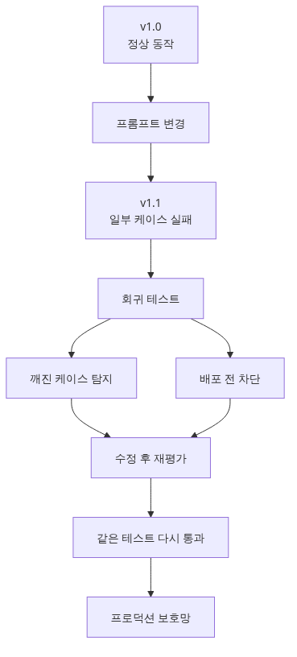
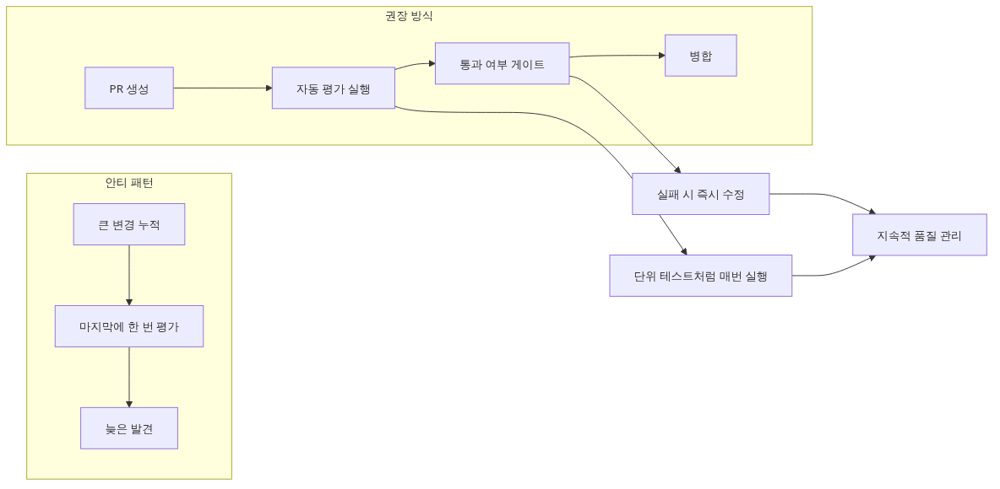
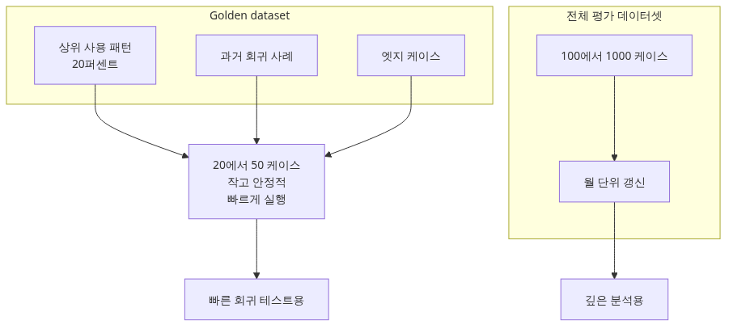
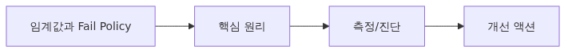
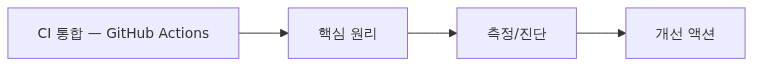

# 회귀 테스트 — 어제 잘 되던 게 오늘 망가지지 않게

> AI Evaluation 101 시리즈 (8/10)

Prompt 한 줄을 고치면 다른 케이스가 깨질 수 있습니다. 이 글은 CI에 통합되는 LLM 회귀 테스트 suite, 골든 데이터셋, threshold 기반 fail 정책을 다룹니다.

---


*회귀 테스트 - 어제 잘 되던 게 오늘 망가지지 않게*
## 평가는 한 번이 아니라 매번 합니다



*평가는 한 번이 아니라 매번*
Ep1~Ep7에서 평가 방법을 다뤘습니다. 그런데 평가를 **언제** 실행할까요? 흔한 패턴은:

- 큰 prompt 변경 직후 한 번 돌려보기
- 새 모델로 바꿀 때 한 번 돌려보기
- 그 외에는 잊어버리기

이 방식의 문제는 **회귀가 production에 도달**한다는 점입니다. 어제 잘 동작하던 답변이 오늘은 품질이 떨어지는데 아무도 모릅니다. **평가는 unit test처럼 매 PR마다 자동으로** 돌아야 합니다.

이번 글에서는 다음을 다룹니다.

- Golden dataset 설계
- 임계값(threshold) 정의와 fail policy
- GitHub Actions에 통합
- 회귀 발견 시 처리 절차

---

## Golden Dataset — 변하지 않는 핵심 케이스



*Golden Dataset - 변하지 않는 핵심 케이스*
Regression dataset은 production용 평가 데이터셋(Ep2)과 다릅니다.

| 구분 | Production eval (Ep2) | Regression (Ep8) |
|-----|----------------------|------------------|
| 크기 | 100~1000건 | 20~50건 |
| 변경 빈도 | 매월 추가 | 거의 안 바꿈 |
| 목적 | 전반적 품질 | 핵심 기능 회귀 방지 |
| 비용 | 한 번에 $10~100 | 매 PR마다 $0.5~5 |

**Golden dataset 선정 기준**:
1. **사용 빈도 top 20%** — 가장 많이 들어오는 질문 패턴
2. **과거 회귀가 있었던 케이스** — 한 번 망가진 적 있는 입력
3. **edge case** — 빈 입력, 매우 긴 입력, multilingual, 모호한 의도

```python
# regression/golden_dataset.py
import json

GOLDEN = [
    # 사용 빈도 top 케이스
    {"id": "freq-001", "input": "오늘 날씨", "expected_intent": "weather_query"},
    {"id": "freq-002", "input": "비밀번호 변경", "expected_intent": "account_password"},

    # 과거 회귀 케이스 (commit hash 메모)
    {"id": "reg-001", "input": "내 주문은?", "expected_contains": ["order", "status"],
     "note": "v1.2에서 'order'를 'item'으로 답했음 (PR #234)"},

    # Edge case
    {"id": "edge-001", "input": "", "expected_behavior": "ask_clarification"},
    {"id": "edge-002", "input": "ㅁㄴㅇㄹ", "expected_behavior": "ask_clarification"},
    {"id": "edge-003", "input": "안녕! 내 이름은 김철수야. 그런데 사실 영수야. 아니다, 영희다.",
     "expected_behavior": "ask_clarification"},
]

with open("regression/golden.jsonl", "w") as f:
    for item in GOLDEN:
        f.write(json.dumps(item, ensure_ascii=False) + "\n")
```

**원칙**: Golden은 **20~50건만** 유지합니다. 너무 많으면 매 PR이 느려지고 비싸집니다.

---

## 임계값과 Fail Policy



*임계값과 Fail Policy*
평가 점수가 나왔다고 끝이 아닙니다. **어떤 점수가 fail인지** 정해야 합니다.

```python
# regression/thresholds.py
THRESHOLDS = {
    "exact_match":  0.80,   # Ep3
    "bleu":         0.40,
    "judge_score":  4.0,    # Ep4 1~5 척도
    "faithfulness": 0.85,   # Ep6 RAG
    "task_success": 0.90,   # Ep7 agent
}

# 실패 정책
FAIL_POLICY = "any"  # "any" | "majority" | "weighted"
```

3가지 fail policy를 비교합니다.

| Policy | 의미 | 장점 | 단점 |
|--------|-----|------|------|
| `any` | 메트릭 1개라도 임계값 미만 → fail | 안전 | false positive 많음 |
| `majority` | 과반수 메트릭이 미만 → fail | 균형 | 한 메트릭 폭락을 놓침 |
| `weighted` | 가중 평균이 미만 → fail | 도메인 맞춤 | 가중치 조정 필요 |

**경험적 권장**: 처음에는 `any`로 시작. False positive가 많으면 `weighted`로 전환.

---

## CI 통합 — GitHub Actions



*CI 통합 - GitHub Actions*
매 PR마다 평가를 자동 실행하는 GitHub Actions workflow:

```yaml
# .github/workflows/eval.yml
name: Regression Eval
on:
  pull_request:
    paths:
      - "src/**"
      - "prompts/**"
      - "regression/**"

jobs:
  eval:
    runs-on: ubuntu-latest
    steps:
      - uses: actions/checkout@v4
      - uses: actions/setup-python@v5
        with:
          python-version: "3.11"
      - run: pip install -r requirements.txt

      - name: Run regression eval
        env:
          OPENAI_API_KEY: ${{ secrets.OPENAI_API_KEY }}
        run: |
          python -m regression.run > eval_report.json

      - name: Check thresholds
        run: |
          python -m regression.check_thresholds eval_report.json

      - name: Upload report
        if: always()
        uses: actions/upload-artifact@v4
        with:
          name: eval-report
          path: eval_report.json
```

```python
# regression/check_thresholds.py
import json, sys
from .thresholds import THRESHOLDS, FAIL_POLICY

def check(report_path: str) -> int:
    with open(report_path) as f:
        report = json.load(f)

    failures = []
    for metric, threshold in THRESHOLDS.items():
        if metric not in report:
            continue
        score = report[metric]
        if score < threshold:
            failures.append(f"{metric}: {score:.3f} < {threshold}")

    if FAIL_POLICY == "any" and failures:
        print("FAIL — threshold violations:")
        for f in failures:
            print(f"  - {f}")
        return 1

    print("PASS — all metrics above threshold")
    return 0

if __name__ == "__main__":
    sys.exit(check(sys.argv[1]))
```

**핵심**: PR이 평가를 fail하면 merge가 막힙니다. 회귀가 main 브랜치에 도달하기 전에 잡힙니다.

---

## 비결정성 처리 — Seed와 Tolerance

LLM 평가는 결정론적이지 않습니다. 같은 PR을 두 번 돌리면 점수가 0.02 정도 다를 수 있습니다. 두 가지 대응:

### 대응 1: Temperature와 seed 고정

```python
response = client.chat.completions.create(
    model="gpt-4o",
    messages=[...],
    temperature=0,
    seed=42,  # OpenAI seed parameter
)
```

`seed`는 best-effort라 100% 보장되지 않지만 변동을 크게 줄입니다.

### 대응 2: 임계값에 tolerance 추가

```python
# regression/thresholds.py
THRESHOLDS_WITH_TOLERANCE = {
    "exact_match":  (0.80, 0.02),  # 0.78 이상이면 통과 (0.02 tolerance)
    "judge_score":  (4.0,  0.1),
    "faithfulness": (0.85, 0.02),
}

def check_with_tolerance(metric: str, score: float) -> bool:
    threshold, tol = THRESHOLDS_WITH_TOLERANCE[metric]
    return score >= (threshold - tol)
```

**원칙**: tolerance는 **이전 main 브랜치 점수의 표준편차의 2배** 정도로 설정. 지나치게 크면 회귀를 놓치고, 작으면 false positive.

---

## 회귀 발견 시 처리 절차

PR이 fail했을 때 다음 절차를 따릅니다.

1. **재실행**: 비결정성 때문일 수 있음. 한 번 더 돌려봅니다.
2. **개별 케이스 확인**: 어느 입력이 회귀했는지 봅니다.
   ```python
   # regression/diff_report.py
   def diff_against_main(current: dict, main_baseline: dict) -> list[str]:
       regressed = []
       for case_id in current:
           if current[case_id]["score"] < main_baseline[case_id]["score"] - 0.1:
               regressed.append(case_id)
       return regressed
   ```
3. **두 가지 결정**:
   - **회귀가 의도된 것**: 임계값을 새 baseline으로 업데이트하고 PR description에 명시.
   - **버그**: 코드/prompt 수정 후 재시도.

---

## Common Mistakes

### Mistake 1: Golden dataset이 너무 큼

500건의 golden을 매 PR마다 돌리면 시간 30분, 비용 $20~50. **20~50건으로 제한**하고 production용 큰 dataset은 nightly로.

### Mistake 2: 임계값을 너무 높게 설정

"exact_match >= 0.95" 같은 임계값은 LLM의 자연스러운 변동에 항상 fail합니다. **현재 main 점수의 -2σ를 임계값으로** 시작하세요.

### Mistake 3: Threshold 한 번 정하고 안 봄

모델, prompt, 데이터가 발전하면 baseline도 올라가야 합니다. **분기마다 임계값을 재검토**하고 너무 느슨해진 것은 올리세요.

### Mistake 4: 평가 코드 자체를 테스트하지 않음

평가 함수에 버그가 있으면 모든 점수가 거짓입니다. **평가 함수에 unit test를 작성**하세요 (known input → expected score).

### Mistake 5: 비용 모니터링 안 함

매 PR마다 $5씩, 한 달 100 PR이면 $500입니다. **CI 비용을 매주 측정**하고 10% 이상 증가하면 sampling 도입.

---

## 핵심 요약

- 평가는 unit test처럼 **매 PR마다 자동**으로 돌아야 합니다. 그래야 회귀가 production에 도달하지 않습니다.
- Golden dataset은 **20~50건**의 핵심 + edge + 과거 회귀 케이스로 구성합니다.
- Fail policy 3가지(any/majority/weighted)와 tolerance를 통해 false positive를 통제합니다.
- GitHub Actions으로 PR마다 자동 실행하고, 임계값 미달 시 merge 차단.
- 회귀 발견 시 재실행 → diff → 의도된 변경인지 버그인지 결정.

다음 글에서는 두 모델/prompt 중 어느 것이 진짜 더 나은지 **A/B 테스트로 통계적으로** 판정하는 법을 다룹니다.

---

<!-- toc:begin -->
## AI Evaluation 101 시리즈

- [Ep1 LLM 앱은 왜 평가해야 하는가](./01-why-evaluate-llm-apps.md)
- [Ep2 평가 데이터셋 설계](./02-evaluation-dataset-design.md)
- [Ep3 결정론적 메트릭 — Exact Match, BLEU, ROUGE](./03-deterministic-metrics.md)
- [Ep4 LLM-as-Judge — 모델로 모델을 평가하기](./04-llm-as-judge.md)
- [Ep5 Rubric 기반 다차원 채점](./05-rubric-based-scoring.md)
- [Ep6 RAG 평가](./06-rag-evaluation.md)
- [Ep7 Agent 평가](./07-agent-evaluation.md)
- **Ep8 회귀 테스트 (현재 글)**
- Ep9 LLM A/B 테스트 (예정)
- Ep10 프로덕션 평가 (예정)
<!-- toc:end -->

## 참고 자료

- [OpenAI — Reproducible Outputs with seed parameter](https://platform.openai.com/docs/api-reference/chat/create#chat-create-seed)
- [GitHub Actions — Workflow syntax](https://docs.github.com/en/actions/using-workflows/workflow-syntax-for-github-actions)
- [LangSmith — Regression Testing for LLM Apps](https://docs.smith.langchain.com/evaluation/tutorials/regression)
- [Continuous Eval — Eus, M. (2024). Patterns for LLM Eval in CI](https://eugeneyan.com/writing/llm-evaluators/)

Tags: AI Evaluation, Regression Testing, CI, GitHub Actions
