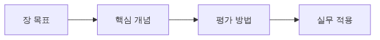
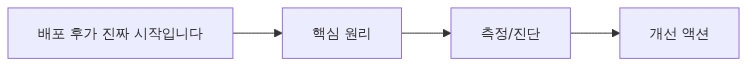
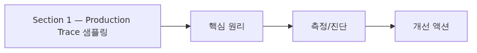
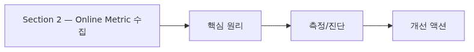
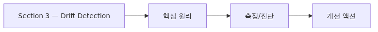

# 운영 환경에서의 지속적 평가

> AI Evaluation 101 시리즈 (10/10)

Eval은 배포 전 한 번이 아니라 운영 중에도 계속 돌아야 합니다. 이 글은 production trace에서 평가 샘플을 추출하고, online metrics를 모니터링하고, drift를 감지하는 패턴을 다룹니다.

---

## 배포 후가 진짜 시작입니다


배포 전 평가는 통제된 환경에서의 시뮬레이션입니다. 진짜 사용자는 예상치 못한 입력을 던지고, 모델 공급사는 조용히 모델을 업데이트하고, 데이터 분포는 시간에 따라 흘러갑니다. 운영 환경에서 평가가 멈추면 품질 저하를 누구도 알아채지 못합니다.

이 글에서는 다음을 다룹니다.

- Production trace 샘플링 전략
- Online metric 수집 (피드백, 지연시간, 재질문율)
- Drift detection으로 분포 변화 감지
- Shadow mode로 신규 모델 안전 검증
- Baseline 대비 alert threshold 설계
- 평가 자체의 비용 모니터링

이전 9개 에피소드를 운영 단계로 연결하는 마지막 글입니다.

---

## Section 1 — Production Trace 샘플링


운영 트래픽 전체를 평가하면 비용이 폭발합니다. 일부만 샘플링하되, 편향되지 않게 추출해야 합니다.

### 균등 샘플링 (uniform sampling)

```python
import random

def uniform_sample(traces: list[dict], rate: float = 0.01) -> list[dict]:
    """전체 trace 중 rate 비율을 무작위 추출합니다."""
    return [t for t in traces if random.random() < rate]

# 하루 100,000건 중 1% = 1,000건을 평가용으로 추출
sampled = uniform_sample(today_traces, rate=0.01)
```

가장 단순하지만, 희소한 케이스 (예: 의료 질문, 법률 질문)는 거의 잡히지 않습니다.

### 계층 샘플링 (stratified sampling)

카테고리별로 최소 N건을 보장합니다.

```python
from collections import defaultdict

def stratified_sample(traces: list[dict], per_category: int = 50) -> list[dict]:
    buckets = defaultdict(list)
    for t in traces:
        buckets[t["category"]].append(t)
    sampled = []
    for cat, items in buckets.items():
        n = min(per_category, len(items))
        sampled.extend(random.sample(items, n))
    return sampled
```

이렇게 하면 희소 카테고리의 품질도 추적할 수 있습니다.

### 실패 우선 샘플링

낮은 confidence, 짧은 응답, 사용자가 thumbs-down을 누른 trace를 우선 샘플링합니다. 문제가 있을 가능성이 높은 trace에 평가 예산을 집중하는 전략입니다.

```python
def failure_biased_sample(traces, rate_pass=0.005, rate_fail=0.5):
    sampled = []
    for t in traces:
        threshold = rate_fail if t.get("user_feedback") == "down" else rate_pass
        if random.random() < threshold:
            sampled.append(t)
    return sampled
```

---

## Section 2 — Online Metric 수집


배포 후에는 LLM-as-judge 같은 무거운 평가뿐 아니라, 가벼운 online signal을 실시간으로 모아야 합니다.

| Metric | 의미 | 측정 방법 |
| --- | --- | --- |
| Thumbs up/down rate | 사용자 직접 피드백 | UI 버튼 클릭 로깅 |
| Re-ask rate | 같은 사용자가 5분 내 같은 질문 재시도 | session id + query similarity |
| Conversation length | 한 task를 끝내는 데 걸린 turn 수 | session log 집계 |
| Latency p50 / p95 | 응답 속도 | 요청별 timestamp |
| Cost per request | 호출당 토큰 비용 | usage 필드 합산 |

```python
from dataclasses import dataclass
from datetime import datetime

@dataclass
class TraceMetric:
    trace_id: str
    timestamp: datetime
    latency_ms: int
    input_tokens: int
    output_tokens: int
    user_feedback: str | None  # "up", "down", None
    re_asked: bool

def daily_summary(metrics: list[TraceMetric]) -> dict:
    n = len(metrics)
    return {
        "total": n,
        "thumbs_down_rate": sum(1 for m in metrics if m.user_feedback == "down") / n,
        "re_ask_rate": sum(1 for m in metrics if m.re_asked) / n,
        "p95_latency_ms": sorted(m.latency_ms for m in metrics)[int(n * 0.95)],
        "avg_cost_usd": sum(m.input_tokens * 0.000005 + m.output_tokens * 0.000015 for m in metrics) / n,
    }
```

Online metric은 **early warning system** 역할을 합니다. judge 평가는 비싸서 일 단위로 돌리지만, online metric은 분 단위로 추적합니다.

---

## Section 3 — Drift Detection


입력 분포가 바뀌면 (사용자 질문 패턴 변화, 신규 사용자 유입), 기존 평가 데이터셋의 결과가 운영 품질을 더 이상 반영하지 못합니다.

### 입력 분포 비교 — KL divergence

```python
import math
from collections import Counter

def kl_divergence(p: dict[str, float], q: dict[str, float], eps: float = 1e-9) -> float:
    """KL(P || Q): P가 Q에서 얼마나 벗어났는지 측정합니다."""
    total = 0.0
    for key, p_val in p.items():
        q_val = q.get(key, eps)
        total += p_val * math.log((p_val + eps) / (q_val + eps))
    return total

def category_distribution(traces: list[dict]) -> dict[str, float]:
    counts = Counter(t["category"] for t in traces)
    n = sum(counts.values())
    return {k: v / n for k, v in counts.items()}

baseline = category_distribution(traces_last_week)
current = category_distribution(traces_today)
drift = kl_divergence(current, baseline)

if drift > 0.1:
    alert("Input distribution drift detected")
```

KL divergence 0.1 이상이면 분포가 의미 있게 달라졌다고 판단합니다. 임계값은 baseline 변동성을 30일 정도 측정해서 잡아야 합니다.

### Output drift

같은 입력 카테고리에 대해 응답 길이, 응답 거절율 (refusal rate), tone이 갑자기 달라지면 모델 공급사가 조용히 업데이트했을 가능성이 있습니다.

```python
def refusal_rate(traces: list[dict]) -> float:
    refusals = sum(1 for t in traces if "I cannot" in t["output"] or "죄송" in t["output"])
    return refusals / len(traces)
```

모델 공급사의 silent update는 모니터링하지 않으면 알 수 없습니다.

---

## Section 4 — Shadow Mode와 Canary

신규 모델이나 새 프롬프트를 운영에 투입하기 전, **shadow mode**로 기존 모델과 병렬로 호출해서 응답을 비교합니다.

```python
async def shadow_call(input_text: str):
    """기존 모델로 응답하면서, 신규 모델 응답도 로깅합니다."""
    primary = await call_model("gpt-4o", input_text)
    # 사용자에게는 primary만 보여줍니다
    asyncio.create_task(log_shadow(input_text, primary))
    return primary

async def log_shadow(input_text: str, primary_output: str):
    shadow = await call_model("gpt-4o-mini", input_text)
    await db.insert_shadow_comparison({
        "input": input_text,
        "primary": primary_output,
        "shadow": shadow,
        "timestamp": datetime.utcnow(),
    })
```

수집된 shadow 응답은 Ep4의 LLM-as-judge로 pairwise 비교하면 신규 모델의 win rate를 사용자 영향 없이 측정할 수 있습니다. Canary는 한 단계 더 나아가 트래픽의 5%를 신규 모델로 보내고 online metric을 비교합니다.

---

## Section 5 — Alert Threshold 설계

고정 임계값 (`thumbs_down_rate > 5%`)은 위험합니다. 카테고리별로 baseline이 다르고, 요일/시간대 패턴도 있습니다.

### Baseline 대비 상대 임계값

```python
def relative_alert(current: float, baseline_mean: float, baseline_std: float, k: float = 3.0) -> bool:
    """현재 값이 baseline 평균 ± k * std를 벗어나면 alert."""
    return abs(current - baseline_mean) > k * baseline_std

# 지난 30일의 thumbs_down_rate 평균과 표준편차로 baseline 학습
baseline_mean = 0.03
baseline_std = 0.008
if relative_alert(today_rate, baseline_mean, baseline_std):
    page_oncall("thumbs_down_rate anomaly")
```

3-sigma 기준은 정상 분포 가정에서 0.27% 확률로만 발생하므로 false positive를 줄여 줍니다.

### Alert fatigue 방지

같은 alert이 1시간 내 반복되면 묶어서 한 번만 보냅니다. severity 분리 (warning vs page)도 필수입니다. on-call이 모든 alert에 깨어나면 결국 모든 alert을 무시하게 됩니다.

---

## Section 6 — 평가 비용 모니터링

LLM-as-judge는 호출당 비용이 발생합니다. 모니터링하지 않으면 평가 비용이 운영 비용을 추월합니다.

```python
@dataclass
class JudgeUsage:
    date: str
    judge_calls: int
    judge_cost_usd: float
    serving_cost_usd: float

def cost_ratio_alert(usage: JudgeUsage, max_ratio: float = 0.1):
    ratio = usage.judge_cost_usd / usage.serving_cost_usd
    if ratio > max_ratio:
        alert(f"Judge cost is {ratio:.1%} of serving cost — exceeds {max_ratio:.0%} budget")
```

평가 비용이 운영 비용의 10%를 넘으면 sampling rate를 낮추거나 더 작은 judge 모델로 교체해야 합니다.

---

## Section 7 — Production Failure를 다시 평가 데이터셋으로

운영에서 발견된 실패 케이스 (low rating, re-ask, escalation)는 가장 가치 있는 평가 데이터입니다. Ep8의 regression dataset에 추가해서 다음 배포 전에 자동으로 검증되게 해야 합니다.

```python
def harvest_failures_to_regression_set(failed_traces: list[dict], regression_path: str):
    new_cases = [
        {
            "input": t["input"],
            "expected": t.get("ground_truth") or "TBD - human label needed",
            "category": t["category"],
            "source": "production_failure",
            "harvested_at": datetime.utcnow().isoformat(),
        }
        for t in failed_traces
    ]
    with open(regression_path, "a") as f:
        for case in new_cases:
            f.write(json.dumps(case) + "\n")
```

이 사이클이 닫히면 운영 → 평가 데이터셋 → 다음 배포 → 운영의 순환이 자동화됩니다. 모든 실패가 시스템을 학습시키는 자산이 됩니다.

---

## 흔한 실수

1. **균등 샘플링만 사용** — 희소 카테고리 품질이 보이지 않습니다. Stratified + failure-biased를 조합하세요.
2. **고정 임계값 alert** — 카테고리/시간대 패턴을 무시하면 false positive로 신뢰를 잃습니다.
3. **Online metric 없이 judge에만 의존** — judge는 분 단위 모니터링이 불가능합니다. thumbs/re-ask 같은 가벼운 신호와 결합해야 합니다.
4. **Shadow mode 결과를 분석하지 않음** — 로깅만 하고 비교를 안 하면 무용지물입니다. 주간 win rate 리뷰를 정례화하세요.
5. **평가 비용을 추적하지 않음** — judge 호출 비용이 어느 순간 운영 비용을 넘는 일이 흔합니다. 비용도 metric입니다.

---

## 핵심 요약

- **Production trace 샘플링**은 균등 + stratified + failure-biased를 조합합니다.
- **Online metric** (thumbs, re-ask, latency, cost)은 judge 평가의 early warning system입니다.
- **Drift detection**은 입력/출력 분포 변화를 KL divergence와 refusal rate로 추적합니다.
- **Shadow mode와 canary**는 신규 모델을 사용자 영향 없이 검증하는 표준 패턴입니다.
- **상대 임계값 alert** (baseline ± 3σ)이 고정 임계값보다 안정적입니다.
- **Production failure를 regression dataset으로 환류**해서 평가-배포 순환을 닫아야 합니다.

평가는 배포 전 한 번이 아니라 운영 중 계속되는 활동입니다. AI Evaluation 101 시리즈를 마칩니다.

---

<!-- toc:begin -->
## AI Evaluation 101 시리즈

- [LLM 앱을 왜 평가해야 하는가](./01-why-evaluate-llm-apps.md)
- [평가 데이터셋 설계](./02-evaluation-dataset-design.md)
- [결정론적 메트릭 — Exact Match, BLEU, ROUGE](./03-deterministic-metrics.md)
- [LLM-as-Judge — 모델로 모델 평가하기](./04-llm-as-judge.md)
- [Rubric 기반 다차원 채점](./05-rubric-based-scoring.md)
- [RAG 평가](./06-rag-evaluation.md)
- [에이전트 평가](./07-agent-evaluation.md)
- [회귀 테스트](./08-regression-testing.md)
- [LLM A/B 테스트](./09-ab-testing-llms.md)
- **운영 환경에서의 지속적 평가 (현재 글)**
<!-- toc:end -->

## 참고 자료

- [OpenAI Evals — Production Monitoring Patterns](https://github.com/openai/evals)
- [LangSmith Online Evaluations](https://docs.smith.langchain.com/observability/how_to_guides/online_evaluations)
- [Google SRE Book — Monitoring Distributed Systems](https://sre.google/sre-book/monitoring-distributed-systems/)
- [Evidently AI — Data Drift Detection](https://docs.evidentlyai.com/presets/data-drift)

Tags: AI Evaluation, Production, Drift Detection, Monitoring
