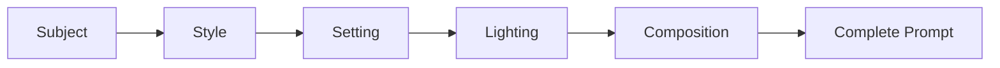

# AI Image Generation 101 (2/10): The Structure of a Good Prompt

"Draw me a cool robot." Result appears but it's not what you imagined. "Make a pretty landscape." It's a landscape, but something feels off. "Create an amazing image." It looks impressive, but this isn't what you wanted.

Sound familiar? The problem isn't what you put in your prompt — it's how you put it. Words like "beautiful," "amazing," and "stunning" give AI almost zero actionable information. AI needs concrete instructions.

This is post 2 in the AI Image Generation 101 series. Here, we'll learn the specific structure of an effective prompt and experiment with adding elements one by one to see exactly how results change.

---



*The layering structure of prompt elements*

## Questions to Keep in Mind

- How does the image change each time you add a new element to your prompt?
- Do more adjectives like "beautiful" and "amazing" produce better images?
- Does the order of elements in your prompt affect the result?

---

## The Prompt Formula: Layering

A good prompt isn't about writing more — it's about writing precisely. The key is layering: adding one element at a time.

```
[Subject] + [Style] + [Setting/Background] + [Lighting] + [Composition/Angle]
```

Let's test this formula using a robot as our subject. We'll add one element at a time and watch the image transform.

---

## Experiment: Stacking Elements One by One

### Layer 1: Subject Only

> a robot


*Subject only: AI decides the robot's form, color, background, and mood arbitrarily.*

A robot appeared, but what style? Where is it? What's the mood? All decided by the AI.

### Layer 2: Subject + Style

> a robot, watercolor painting style


*Adding style changed the entire feel. The soft edges and color blending characteristic of watercolor appeared.*

One element added, and the same robot becomes a completely different image. Style is that powerful.

### Layer 3: Subject + Style + Setting

> a robot, watercolor painting style, standing in a flower garden


*Setting gives the image a story. "A robot exists" becomes "a robot is in a flower garden."*

When you give the subject a place, the image gains narrative. The viewer wonders why the robot is there — that's engagement.

### Layer 4: Subject + Style + Setting + Lighting

> a robot, watercolor painting style, standing in a flower garden, golden hour sunlight casting long shadows


*Lighting shifts the temperature of the entire image. Long shadows add depth and drama.*

Lighting can completely transform the mood of an image. The same scene under "noon," "night," or "neon glow" produces entirely different results.

### Layer 5: Complete Prompt (All 5 Elements)

> a friendly robot with round eyes and a small antenna, watercolor painting style, standing in a flower garden surrounded by sunflowers and daisies, golden hour sunlight casting long soft shadows, gentle warm atmosphere, wide shot showing the full scene


*All 5 elements specified. Subject personality (friendly), setting details (sunflowers, daisies), and composition (wide shot) are all defined.*

With all five elements in place, the AI has almost no room for arbitrary decisions. The result is much closer to your actual vision.

---

## Common Mistake: Adjective Dumping

Many people think: "If I want better results, shouldn't I add more praise?" Let's test that theory.

> a beautiful amazing stunning incredible gorgeous wonderful fantastic robot in a nice pretty lovely amazing place with great lighting and awesome colors


*Dumping adjectives: flashy perhaps, but lacking specificity.*

Compare this to the Layer 5 result above. No matter how many adjectives you pile on, AI can't interpret them as concrete instructions. "Stunning" means nothing specific. "Round eyes and a small antenna" means everything.

| Ineffective | Effective |
|-------------|-----------|
| beautiful, amazing, stunning | round eyes, small antenna |
| nice pretty lovely place | flower garden with sunflowers and daisies |
| great lighting | golden hour sunlight casting long shadows |
| awesome colors | warm orange tones |

The rule is simple: **use nouns and verbs instead of adjectives.** "Beautiful cat" tells AI nothing. "Fluffy orange Persian with bright green eyes" tells it everything.

---

## Does Order Matter?

Does the sequence of elements in your prompt affect the output? Let's compare the same content in two different orders.

**Setting first**:

> In a dimly lit cyberpunk alley at night, a small delivery robot with glowing blue eyes navigates through puddles reflecting neon signs, cinematic photography style

**Subject first**:

> A small delivery robot with glowing blue eyes, cinematic photography style, navigating through puddles in a dimly lit cyberpunk alley at night, neon signs reflecting in the water

| Setting first | Subject first |
|:---:|:---:|
|  |  |

*Same elements, different order*

Both produce similar results, but there are subtle differences. Two general patterns:

| Order | Tendency | Best For |
|-------|----------|----------|
| Subject first | Subject larger and centered | Product shots, character focus |
| Setting first | Environment more prominent | Landscapes, mood-driven scenes |

Practical tip: **put the most important element first.** AI tends to give slightly more weight to what comes at the beginning of your prompt.

---

## Three Ready-to-Use Templates

Now that you know the formula, here are practical templates for common use cases.

### Blog Thumbnail Template

```
[Blog topic icon or metaphor], flat illustration style, 
clean white background, vibrant [brand color] accents, 
centered composition, soft even lighting
```

Example: "A magnifying glass examining lines of code, flat illustration style, clean white background, vibrant blue and purple accents, centered composition, soft even lighting"

### Social Media Post Template

```
[Main subject doing action], [photography style], 
[specific location], [time of day] lighting, 
[angle] shot, [mood] atmosphere
```

Example: "A person reading a book in a cozy window seat, lifestyle photography style, modern minimalist apartment, afternoon golden light, medium shot, peaceful calm atmosphere"

### Presentation Illustration Template

```
[Concept or process as visual metaphor], 
isometric illustration style, pastel color palette, 
clean minimal background, soft shadows, 
slightly above eye-level perspective
```

Example: "A conveyor belt transforming raw materials into finished products as visual metaphor for data pipeline, isometric illustration style, pastel blue and mint color palette, clean minimal background, soft shadows"

---

## Summary: The Core of Prompt Structure

What we learned today:

1. **Layering**: Stack elements in order — subject, style, setting, lighting, composition
2. **Specificity**: Use nouns and verbs instead of adjectives
3. **Priority**: Put the most important element first

In the next post, we'll dive deep into "style" — the single element that most dramatically transforms the overall mood of your image.

---

## Answering the Opening Questions

**How does the image change each time you add a new element?**

With subject only, AI decides everything else. Adding style sets the mood, setting creates narrative, lighting shifts temperature, and composition controls the viewer's eye. Each layer reduces AI's arbitrary decisions.

**Do more adjectives produce better images?**

No. "Beautiful amazing stunning" gives AI no concrete direction. "Round eyes, small antenna, surrounded by sunflowers" gives it everything it needs. Replace adjectives with specific nouns and verbs.

**Does element order affect the result?**

Slightly. AI tends to give more weight to content that appears first. Place your most important element at the beginning — subject first for character focus, setting first for mood-driven scenes.

---

<!-- toc:begin -->
## Series Index

- [AI Image Generation 101 (1/10): Creating Your First Image](./01-first-image-generation.md)
- **AI Image Generation 101 (2/10): The Structure of a Good Prompt (current)**
- AI Image Generation 101 (3/10): Mastering Styles (upcoming)
- AI Image Generation 101 (4/10): Composition and Perspective (upcoming)
- AI Image Generation 101 (5/10): Color and Lighting (upcoming)
- AI Image Generation 101 (6/10): Designing Complex Scenes (upcoming)
- AI Image Generation 101 (7/10): Maintaining Consistency (upcoming)
- AI Image Generation 101 (8/10): Text and Typography (upcoming)
- AI Image Generation 101 (9/10): Working with Reference Images (upcoming)
- AI Image Generation 101 (10/10): Production Workflows (upcoming)
<!-- toc:end -->

## References

- [OpenAI DALL-E Prompt Guide](https://platform.openai.com/docs/guides/images)
- [god-tibo-imagen GitHub Repository](https://github.com/NomaDamas/god-tibo-imagen)

Tags: AI, ChatGPT, Image Generation, Prompt Engineering
