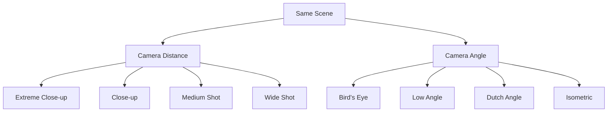

# AI Image Generation 101 (4/10): Composition and Perspective

You know a close-up works better for thumbnails and a wide shot suits travel headers. But when writing prompts, you keep getting whatever angle the AI randomly picks because you don't know the specific keywords that control the camera.

Today we take one scene — a medieval castle on a sea cliff — and shoot it at 4 distances and 4 angles. After this post, you'll control the virtual camera on the first try.

This is post 4 in the AI Image Generation 101 series.

---

*Two axes of composition: camera distance and camera angle*

## Questions to Keep in Mind

- How do close-up and wide shot create different emotions from the same scene?
- How does camera angle (above/below/tilted) change the mood?
- Which composition works best for thumbnails, banners, and diagrams respectively?

---

## Experiment Design

Shared scene:

> A medieval stone castle perched on a dramatic sea cliff, crashing waves below, cloudy sky.

We change only the **distance** or **angle** keyword. Everything else stays the same.

---

## Part 1: Camera Distance — How Close Is the Lens

### 1. Extreme Close-up

> ...extreme close-up of weathered stone wall texture with moss and cracks

*Extreme close-up: moss-covered stone texture fills the entire frame. Context disappears — only material remains.*

**Effect**: Isolates texture and detail. Removes all surrounding context, making the material itself the subject.

**Use cases**: Product detail shots, texture showcases, sensory social media content.

**Keywords**: `extreme close-up`, `macro shot`, `texture detail`, `filling the frame`

---

### 2. Close-up

> ...close-up shot focusing on the castle entrance gate with iron portcullis

*Close-up: the gate and portcullis are the clear subject, while minimal context (stone walls, sky) anchors location.*

**Effect**: Locks the viewer's eye on a single element while maintaining just enough context to establish meaning.

**Use cases**: YouTube thumbnails, portraits, product hero shots.

**Keywords**: `close-up`, `portrait shot`, `head shot`, `detail shot`

---

### 3. Medium Shot

> ...medium shot showing the full castle tower and surrounding walls

*Medium shot: the main tower and walls are fully visible. Form is clear while detail remains present.*

**Effect**: Shows the full form of the subject while revealing its relationship to surroundings. The most "neutral" distance.

**Use cases**: Blog body images, explanatory illustrations, general scene depiction.

**Keywords**: `medium shot`, `mid shot`, `waist shot`, `full body shot`

---

### 4. Wide Shot

> ...wide shot showing the entire castle complex with the cliff and ocean below

*Wide shot: castle, cliff, and ocean all visible. Environment dominates over the subject itself.*

**Effect**: Reveals the full environment. The subject becomes part of a larger story — atmosphere and narrative take over.

**Use cases**: Travel blog heroes, wallpapers, landing page banners, environment introductions.

**Keywords**: `wide shot`, `establishing shot`, `landscape`, `full scene`, `panoramic`

---

### Distance Comparison Summary

| Distance | What's Visible | Feel | Best For |
|----------|---------------|------|----------|
| Extreme Close-up | Texture/detail only | Sensory, abstract | Texture emphasis, social |
| Close-up | One subject | Focused, impactful | Thumbnails, portraits |
| Medium Shot | Subject + some background | Neutral, explanatory | Body images, general |
| Wide Shot | Full environment | Narrative, atmospheric | Banners, wallpapers, travel |

---

## Part 2: Camera Angle — Where You're Looking From

### 5. Bird's Eye View

> ...bird's eye view directly from above looking down, aerial photography

*Bird's eye view: the castle and cliff from directly above. Structure and layout are immediately legible, like reading a map.*

**Effect**: Looking straight down reveals spatial relationships and overall structure. Provides a god-like, objective perspective.

**Use cases**: Maps/floor plans, architectural overviews, infographics, structural explanations.

**Keywords**: `bird's eye view`, `top-down view`, `aerial photography`, `overhead shot`, `drone shot`

---

### 6. Low Angle (Worm's Eye)

> ...worm's eye view from the base of the cliff looking up at the castle towering above, dramatic low angle

*Low angle: looking up from the cliff base, the castle looms massive and imposing above.*

**Effect**: Looking up makes the subject appear larger, more powerful, and imposing. Conveys authority, grandeur, or threat.

**Use cases**: Building/monument emphasis, heroic feel, dramatic posters, conveying power.

**Keywords**: `worm's eye view`, `low angle`, `looking up`, `dramatic perspective`, `towering`

---

### 7. Dutch Angle

> ...Dutch angle tilted 30 degrees creating tension and unease, dramatic atmosphere

*Dutch angle: 30-degree tilt creates instability and tension. The same scene now feels uneasy.*

**Effect**: Intentional tilt introduces visual instability and psychological tension. A classic technique from horror and thriller cinematography.

**Use cases**: Horror/thriller mood, dynamic action, unstable situations, creative compositions.

**Keywords**: `Dutch angle`, `tilted camera`, `canted angle`, `diagonal composition`

---

### 8. Isometric

> ...isometric perspective as if viewing a 3D model, clean architectural visualization style

*Isometric: uniform scale with no perspective distortion. Clean, technical, map-like clarity.*

**Effect**: No perspective distortion means uniform scale throughout the image. Feels like a technical diagram or game map — optimized for conveying spatial information clearly.

**Use cases**: Architectural visualization, game map design, infographics, technical diagrams, presentations.

**Keywords**: `isometric`, `isometric view`, `axonometric`, `no perspective distortion`, `architectural visualization`

---

### Angle Comparison Summary

| Angle | Viewing Direction | Feel | Best For |
|-------|------------------|------|----------|
| Bird's Eye | Top to bottom | Objective, structural | Maps, layout explanations |
| Low Angle | Bottom to top | Imposing, grand | Building emphasis, heroic |
| Dutch Angle | Tilted diagonal | Uneasy, tense, dynamic | Horror, action, creative |
| Isometric | 45-degree elevated | Orderly, technical | Diagrams, games |

---

## Combining Distance and Angle

Specify both simultaneously for precise control.

| Combination | Prompt Example | Result |
|-------------|---------------|--------|
| Close-up + Low Angle | `close-up, low angle looking up` | Makes a person look heroic |
| Wide + Bird's Eye | `wide shot, aerial bird's eye view` | Full terrain at a glance |
| Medium + Dutch Angle | `medium shot, Dutch angle tilt` | Tense character scene |
| Wide + Isometric | `wide isometric view` | Clean structural visualization |

---

## Key Takeaway

After shooting the same castle in 8 compositions:

- Camera distance determines "what to focus on" — detail vs atmosphere
- Camera angle determines "what emotion to evoke" — imposing vs stable vs tense
- Combining distance and angle gives you precise control over the final feeling

In the next post, we'll explore color and lighting — changing the time of day and light source to completely transform the mood of the same scene.

---

## Answering the Opening Questions

**How do close-up and wide shot create different emotions?**

Close-up locks the viewer's attention on a single element, creating focus and impact. Wide shot reveals the full environment, creating narrative and atmosphere. Same castle, but in close-up "stone texture" is the story, while in wide shot "a lonely castle on a cliff" is the story.

**How does camera angle change the mood?**

Low angle creates imposing grandeur. Bird's eye creates objectivity and structural clarity. Dutch angle creates unease and tension. Isometric creates order and precision. One angle change turns the same scene from a horror movie frame to an architectural blueprint.

**Which composition for thumbnails, banners, and diagrams?**

Thumbnails: close-up (impact). Banners/wallpapers: wide shot (atmosphere). Diagrams: isometric (clarity). Dramatic posters: low angle (grandeur). The answer isn't "what to show" — it's "what emotion to give."

---

<!-- toc:begin -->
## Series Index

- [AI Image Generation 101 (1/10): Creating Your First Image](./01-first-image-generation.md)
- [AI Image Generation 101 (2/10): The Structure of a Good Prompt](./02-prompt-structure.md)
- [AI Image Generation 101 (3/10): Mastering Styles](./03-mastering-styles.md)
- **AI Image Generation 101 (4/10): Composition and Perspective (current)**
- AI Image Generation 101 (5/10): Color and Lighting (upcoming)
- AI Image Generation 101 (6/10): Designing Complex Scenes (upcoming)
- AI Image Generation 101 (7/10): Maintaining Consistency (upcoming)
- AI Image Generation 101 (8/10): Text and Typography (upcoming)
- AI Image Generation 101 (9/10): Working with Reference Images (upcoming)
- AI Image Generation 101 (10/10): Production Workflows (upcoming)
<!-- toc:end -->

## References

- [OpenAI Image Generation Guide](https://platform.openai.com/docs/guides/images)
- [god-tibo-imagen GitHub Repository](https://github.com/NomaDamas/god-tibo-imagen)
- [Photography Composition Techniques (Digital Photography School)](https://digital-photography-school.com/composition/)

Tags: AI, ChatGPT, Image Generation, Prompt Engineering
