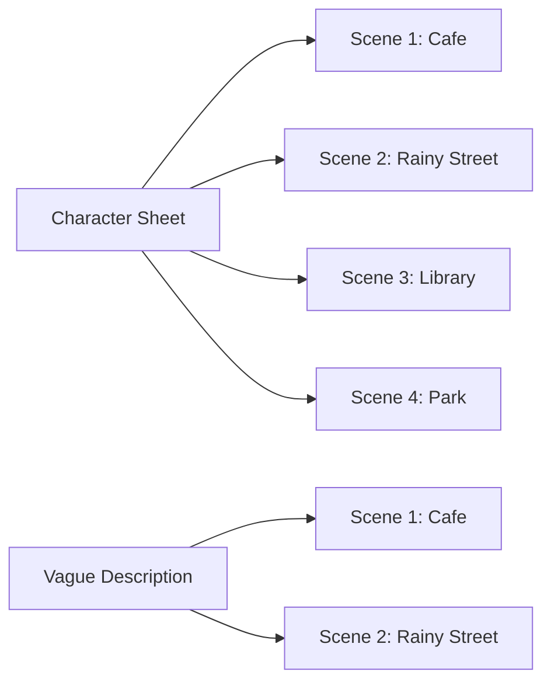

# AI Image Generation 101 (7/10): Maintaining Consistency

Your blog series needs the same character appearing across multiple posts. But every generation gives you a different person — hair changes, outfit swaps, sometimes even the gender shifts. **Consistency** is one of AI image generation's hardest challenges.

Today we build a detailed character sheet, generate the same character in 4 different scenes, and compare against vague descriptions to see exactly how much detail matters.

This is post 7 in the AI Image Generation 101 series.

---



*Same character sheet across 4 scenes vs vague description across 2 scenes*

## Questions to Keep in Mind

- Which elements in a character description maintain consistency most reliably?
- How different are results between vague and detailed descriptions?
- Can a character remain recognizable when the art style changes?

---

## Building a Character Sheet

The key to consistency is a **Character Sheet** — a fixed description you copy-paste into every prompt.

Our character:

```
a young woman with short black bob haircut, round glasses, 
wearing a yellow raincoat over a striped navy and white shirt, 
carrying a brown leather satchel
```

This description contains 5 core identification elements:

| Element | Specific Description | Why It Matters |
|---------|---------------------|----------------|
| Hairstyle | short black bob haircut | Strongest identifier |
| Facial feature | round glasses | Face recognition anchor |
| Outer layer | yellow raincoat | Instant color identification |
| Inner layer | striped navy and white shirt | Layered detail |
| Accessory | brown leather satchel | Additional identifier |

---

## Experiment 1: Character Sheet Across 4 Scenes

### Scene 1: Cafe


*Character reading at a cafe. Black bob, round glasses, yellow raincoat — all consistent.*

### Scene 2: Rainy Street


*Walking through rain. Environment completely changed, but core features persist.*

### Scene 3: Library


*Browsing books in a library. Different lighting, but outfit and hairstyle remain.*

### Scene 4: Park


*Feeding pigeons in an autumn park. Golden hour lighting, character still identifiable.*

**Analysis**: All 4 scenes maintain the three core identifiers — black bob, round glasses, yellow raincoat. Faces aren't pixel-identical, but the character is recognizable as "the same person" across scenes.

---

## Experiment 2: Vague Description Comparison

What happens with **no specific features**?

### Vague Cafe: "a young woman at a coffee shop"


*Vague description: "young woman" alone gives AI free reign to create anyone.*

### Vague Rain: "a girl walking in the rain with an umbrella"


*Vague description: hair, clothing, build — everything changes. Unrecognizable as the same person.*

**Detailed vs Vague comparison**:

| Aspect | With Character Sheet | Vague Description |
|--------|---------------------|-------------------|
| Hairstyle | Black bob in all 4 | Different each time |
| Glasses | Round glasses in all 4 | Present or absent randomly |
| Outfit | Yellow raincoat maintained | Different clothing each time |
| Overall | Recognizable as same person | Clearly different people |

---

## Experiment 3: Consistency Across Styles

What happens when we keep the character sheet but change the art style?

### Watercolor Style


*Watercolor: rendering technique changed entirely, but bob + glasses + yellow coat persist.*

### Anime Style


*Anime: completely different rendering, yet yellow raincoat + bob + glasses = same character.*

**Key finding**: Style changes alter facial details significantly, but **color-based identifiers** (yellow coat) and **shape-based identifiers** (bob haircut, round glasses) survive across styles.

---

## Character Sheet Formula

```
[Gender/Age] + [Hairstyle + Color] + [Facial Feature] + 
[Upper Body Color + Shape] + [Lower Body] + [Accessory]
```

**Consistency strength by element**:

| Element | Consistency | Notes |
|---------|------------|-------|
| Clothing color | Very high | "Yellow coat" almost always maintained |
| Hairstyle shape | High | "Bob cut" mostly maintained |
| Glasses/hat | High | Clear-shaped accessories |
| Body type/height | Medium | Only effective in full-body shots |
| Facial details | Low | AI's most frequent change |

**Practical advice**:
- Don't fixate on facial consistency — it's a current AI limitation
- Focus on color + shape identifiers
- Save your character sheet as a text snippet for copy-paste
- 3+ combined identifiers are sufficient for "same character" recognition

---

## World Consistency

Sometimes you need consistent settings across images, not just characters.

**World sheet example**:

```
Setting: 1920s Art Deco city, brass and copper tones, 
geometric architecture, steam-powered vehicles, 
gas lamps with warm amber glow, cobblestone streets
```

Combine with your character sheet:

```
[Character sheet] + [World sheet] + [This scene's specific action]
```

Prompts get longer, but for a coherent series, the length is justified.

---

## Consistency Checklist

Use this when creating series imagery:

1. Did you write a character sheet first?
2. Does it include 2+ color-based identifiers?
3. Does it include 1+ shape-based identifiers?
4. Are you using the identical sheet in every prompt?
5. If world-building is needed, did you create a separate world sheet?

---

## Key Takeaway

After generating the same character across multiple scenes:

- A detailed character sheet is the foundation of consistency
- Color and shape identifiers are the most reliably maintained
- Facial details are a current AI limitation — aim for recognizable, not identical
- Core identifiers survive even across different art styles

In the next post, we'll tackle text and typography — putting readable words inside generated images.

---

## Answering the Opening Questions

**Which elements maintain consistency most reliably?**

Clothing color (yellow coat), hairstyle shape (bob), and clear accessories (round glasses) — elements with distinct color and shape. Focus on "visible at a glance" features rather than facial minutiae.

**How different are vague vs detailed results?**

"Young woman" alone produces a completely different person every time. Five specific features produce a recognizably consistent character across 4 scenes. The difference is between "random strangers" and "the same person in different places."

**Can a character survive style changes?**

Yes. Color-based identifiers (yellow coat) and shape-based identifiers (bob, round glasses) persist from photorealistic through watercolor to anime. Combine 3+ strong identifiers and the character reads as "the same person" regardless of rendering style.

---

<!-- toc:begin -->
## Series Index

- [AI Image Generation 101 (1/10): Creating Your First Image](./01-first-image-generation.md)
- [AI Image Generation 101 (2/10): The Structure of a Good Prompt](./02-prompt-structure.md)
- [AI Image Generation 101 (3/10): Mastering Styles](./03-mastering-styles.md)
- [AI Image Generation 101 (4/10): Composition and Perspective](./04-composition-and-perspective.md)
- [AI Image Generation 101 (5/10): Color and Lighting](./05-color-and-lighting.md)
- [AI Image Generation 101 (6/10): Designing Complex Scenes](./06-complex-scene-design.md)
- **AI Image Generation 101 (7/10): Maintaining Consistency (current)**
- AI Image Generation 101 (8/10): Text and Typography (upcoming)
- AI Image Generation 101 (9/10): Working with Reference Images (upcoming)
- AI Image Generation 101 (10/10): Production Workflows (upcoming)
<!-- toc:end -->

## References

- [OpenAI Image Generation Guide](https://platform.openai.com/docs/guides/images)
- [god-tibo-imagen GitHub Repository](https://github.com/NomaDamas/god-tibo-imagen)

Tags: AI, ChatGPT, Image Generation, Prompt Engineering
