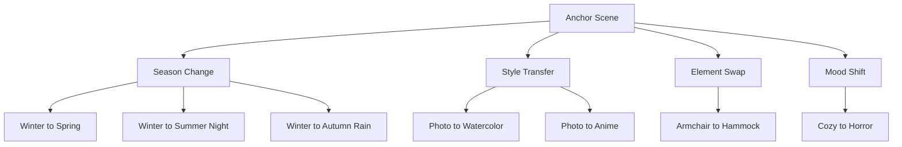

# AI Image Generation 101 (9/10): Working with Reference Images

You generated an image you love. Now you want "this exact feeling, but in spring" or "same space, different style." While uploading reference images for direct editing is one approach, you can create compelling variations through prompt manipulation alone.

Today we build one "anchor scene" and transform it along 4 axes: season change, style transfer, element swap, and mood shift. This is the art of prompt-based variation.

This is post 9 in the AI Image Generation 101 series.

---



*Four variation axes from one anchor scene*

## Questions to Keep in Mind

- If you keep the base prompt and only change the season, does it still read as the same space?
- How well do composition and elements survive a style transfer?
- Can a mood shift alone tell a completely different story?

---

## Building the Anchor Scene

The starting point for all variations:

```
A cozy reading nook with a large window overlooking a snowy forest, 
a plush armchair with a wool blanket, 
a cup of hot cocoa on the side table, 
warm interior lighting, photorealistic, medium shot
```


*Anchor scene: a cozy window reading nook overlooking a snowy forest. This prompt is the foundation for all variations.*

Breaking down the structural elements:

| Element | Description | Modifiable? |
|---------|------------|-------------|
| Space | Reading nook + large window | Fixed (anchor) |
| Window view | Snowy forest | Season changeable |
| Furniture | Armchair + blanket | Element swappable |
| Props | Hot cocoa | Season-adaptive |
| Lighting | Warm interior | Mood-adaptive |
| Style | Photorealistic | Style transferable |

---

## Variation 1: Season Change

### Spring Version


*Spring: snowy forest becomes cherry blossom garden, wool blanket becomes cotton throw, hot cocoa becomes iced tea.*

**Changed**: Window view (snow to cherry blossoms), blanket (wool to cotton), drink (cocoa to iced tea), lighting (warm to bright natural)

### Summer Night Version


*Summer night: fireflies and stars through the window, linen blanket, lemonade. Same space, completely different season.*

**Changed**: Window view (snow to fireflies/stars), blanket (wool to linen), drink (cocoa to lemonade), lighting (interior to moonlight mix)

### Autumn Rain Version


*Autumn rain: golden-red foliage and raindrops on glass. Thick knit blanket and spiced cider.*

**Changed**: Window view (snow to fall foliage/rain), blanket (wool to knit), drink (cocoa to cider), weather (clear to rainy)

**Season change formula**:

```
[Keep space structure] + [Change window view] + [Adapt props to season] + [Adjust lighting]
```

---

## Variation 2: Style Transfer

Same scene description, only the style keyword changes.

### Watercolor Version


*Watercolor: the same space becomes soft and dreamlike. Composition and element placement stay similar.*

### Anime Version


*Anime: Ghibli-style rendering. Warm colors and detailed backgrounds create a different world.*

**Style transfer key**: Replace `photorealistic` with a different style keyword.

| Original | Target | Replacement Keywords |
|----------|--------|---------------------|
| photorealistic | Watercolor | `watercolor painting style, soft washes` |
| photorealistic | Anime | `anime illustration style, Studio Ghibli` |
| photorealistic | Oil painting | `oil painting style, thick brushstrokes` |
| photorealistic | Pixel art | `pixel art style, 16-bit` |

---

## Variation 3: Element Swap

Keep the spatial structure, change one key element.

### Armchair to Hanging Hammock


*Element swap: armchair replaced with a macrame hanging chair shifts the vibe to bohemian.*

**Element swap technique**: Substitute one noun in the prompt for another.

| Original Element | Replacement | Mood Shift |
|-----------------|-------------|------------|
| Armchair | Hanging hammock | Classic to bohemian |
| Hot cocoa | Wine glass | Cozy to sophisticated |
| Wool blanket | Fur rug | Casual to luxury |
| Side table | Tree stump | Indoor to natural |

---

## Variation 4: Mood Shift

Keep the same spatial structure, dramatically invert the mood.

### Cozy to Horror


*Horror version: the same reading nook, abandoned and decayed. Structure is identical but the story is completely different.*

**What changed**:

| Element | Cozy Original | Horror Version |
|---------|---------------|----------------|
| Window | Large window | Cracked window |
| View | Snowy forest | Dark dead forest, fog |
| Chair | Plush armchair | Dusty torn chair, cobwebs |
| Props | Hot cocoa | Overturned cup, dried stains |
| Lighting | Warm interior | Cold blue-grey |
| Added | (none) | Cobwebs |

**Mood shift key**: Apply opposite adjectives and states to the same structures. "Plush" becomes "dusty torn." "Warm" becomes "cold blue-grey." "Snowy" becomes "dark dead."

---

## Combining Variations

You can apply multiple axes simultaneously:

```
Season + Style:
"Same space, autumn, watercolor style"

Element swap + Mood:
"Hammock chair, horror atmosphere"
```

More combined axes means more departure from the original, but as long as the **core structure** (window reading nook) remains, the result reads as "a different version of the same space."

---

## Prompt Variation Practical Guide

1. **Lock the anchor prompt first**: Refine until you get a result you like
2. **Define what's fixed**: The core structure that never changes (space, composition, subject)
3. **Change one axis at a time**: Multiple simultaneous changes break the connection to the original
4. **Save successful variations**: Reuse them as templates

---

## Key Takeaway

Creating 4 variations from one anchor scene:

- Keeping spatial structure as anchor makes the space recognizable across season/style/mood changes
- Style transfer is simplest — swap one keyword
- Mood shift works by applying opposite adjectives to the same structures
- Change one axis at a time to maintain connection with the original

In the final post, we'll bring everything together — a production workflow for creating thumbnails, social posts, and presentations at scale.

---

## Answering the Opening Questions

**Does changing only the season keep it recognizable as the same space?**

Yes. When the spatial structure (window reading nook) stays as anchor and only window view, props, and lighting change seasonally, it reads as "same space, different season." The key is fixing the structure and varying only the details.

**How well do composition and elements survive style transfer?**

With identical scene descriptions, composition and element placement stay similar. Proportions and detail levels may vary by style, so results aren't pixel-identical, but they're recognizably the same scene.

**Can a mood shift alone tell a different story?**

Absolutely. The same reading nook goes from "cozy winter afternoon" to "abandoned horror space" with adjective and state changes alone. The shared structure actually makes the contrast more dramatic.

---

<!-- toc:begin -->
## Series Index

- [AI Image Generation 101 (1/10): Creating Your First Image](./01-first-image-generation.md)
- [AI Image Generation 101 (2/10): The Structure of a Good Prompt](./02-prompt-structure.md)
- [AI Image Generation 101 (3/10): Mastering Styles](./03-mastering-styles.md)
- [AI Image Generation 101 (4/10): Composition and Perspective](./04-composition-and-perspective.md)
- [AI Image Generation 101 (5/10): Color and Lighting](./05-color-and-lighting.md)
- [AI Image Generation 101 (6/10): Designing Complex Scenes](./06-complex-scene-design.md)
- [AI Image Generation 101 (7/10): Maintaining Consistency](./07-consistency-across-images.md)
- [AI Image Generation 101 (8/10): Text and Typography](./08-text-and-typography.md)
- **AI Image Generation 101 (9/10): Working with Reference Images (current)**
- AI Image Generation 101 (10/10): Production Workflows (upcoming)
<!-- toc:end -->

## References

- [OpenAI Image Generation Guide](https://platform.openai.com/docs/guides/images)
- [god-tibo-imagen GitHub Repository](https://github.com/NomaDamas/god-tibo-imagen)

Tags: AI, ChatGPT, Image Generation, Prompt Engineering
