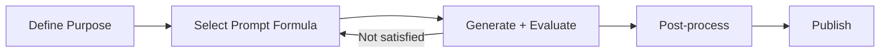

# AI Image Generation 101 (10/10): Production Workflows

Over 9 posts, we've covered prompt structure, style, composition, lighting, complex scenes, consistency, text, and variations. Now the final question: "How do I actually use all this when creating real content?"

Today we build ready-to-use templates for blog thumbnails, YouTube thumbnails, Instagram posts, presentation backgrounds, icon sets, and newsletter headers. We also compare a bad prompt against a good one to crystallize the series' core lesson.

This is the final post in the AI Image Generation 101 series.

---



*Production image creation workflow*

## Questions to Keep in Mind

- What's the optimal prompt formula for each content type?
- How much difference does a "bad prompt" vs "good prompt" actually make?
- How does an open-source tool change the workflow?

---

## Template 1: Blog Thumbnail


*Blog thumbnail: topic as visual metaphor, flat style, clean background.*

**Prompt formula**:

```
[Topic as visual metaphor] + flat illustration style + 
clean white background + [brand color] accents + 
centered composition + soft even lighting
```

**Techniques applied**: Style (Ep.3 flat vector) + Composition (Ep.4 centered) + Lighting (Ep.5 even)

---

## Template 2: YouTube Thumbnail


*YouTube thumbnail: expressive person + dramatic lighting + close-up.*

**Prompt formula**:

```
[Person + strong emotional expression] + cinematic photography style + 
dramatic [color] lighting + close-up shot + 
high energy composition
```

**Techniques applied**: Composition (Ep.4 close-up) + Lighting (Ep.5 cinematic) + Style (Ep.3 photorealistic)

---

## Template 3: Instagram Post


*Instagram flat lay: overhead minimal workspace.*

**Prompt formula**:

```
[Prop arrangement description] + flat lay composition + bird's eye view + 
clean bright photography + warm natural light + 
pastel color palette
```

**Techniques applied**: Composition (Ep.4 bird's eye) + Lighting (Ep.5 natural) + Complex scene (Ep.6 element placement)

---

## Template 4: Presentation Background


*Presentation background: abstract gradient + text space reserved.*

**Prompt formula**:

```
abstract flowing gradient shapes in [colors] + 
minimalist design + clean and modern + 
plenty of empty space for text placement + 
corporate aesthetic
```

**Key**: `plenty of empty space for text placement` ensures room for slide text.

---

## Template 5: Icon Set


*Icon set: 4 icons in consistent style.*

**Prompt formula**:

```
a set of [N] consistent [subject] icons in a grid + 
same [style] style + consistent [color] palette + 
white background + clean geometric shapes
```

**Techniques applied**: Consistency (Ep.7 style lock) + Style (Ep.3 flat vector)

---

## Template 6: Newsletter Header


*Newsletter header: visual metaphor + text space.*

**Prompt formula**:

```
[Topic as visual scene] + [style] style + 
centered composition with space for text at the top + 
warm [lighting] lighting + soft bokeh background
```

---

## Before and After: Bad Prompt vs Good Prompt

The series' core lesson, distilled into one comparison.

### Bad Prompt

> a nice pretty beautiful photo of something cool and awesome, amazing image


*Bad prompt: adjective dump — "nice," "pretty," "beautiful," "awesome." AI decides everything.*

### Good Prompt

> A professional food photographer setup: a golden-brown sourdough loaf on a rustic wooden cutting board, scattered flour, a linen napkin, and a vintage bread knife, overhead bird eye view composition, photorealistic style, soft natural window light from the left, warm earthy color palette, shallow depth of field


*Good prompt: subject (bread), props (cutting board, flour, napkin), composition (bird's eye), style (photorealistic), lighting (left-side natural), color (warm earth tones) — all specified.*

**What makes the difference**:

| Element | Bad Prompt | Good Prompt |
|---------|-----------|-------------|
| Subject | "something cool" | "sourdough loaf on cutting board" |
| Style | (none) | "photorealistic" |
| Composition | (none) | "overhead bird eye view" |
| Lighting | (none) | "soft natural window light from left" |
| Color | (none) | "warm earthy color palette" |
| Detail | (none) | "scattered flour, linen napkin, bread knife" |

---

## Batch Generation with Open-Source Tools

Every image in this series was generated using [god-tibo-imagen](https://github.com/NomaDamas/god-tibo-imagen), an open-source tool. Compared to ChatGPT's web interface:

| Method | Pros | Cons |
|--------|------|------|
| ChatGPT web | Intuitive, instant | One at a time, no automation |
| Open-source (god-tibo-imagen) | Script-driven batch generation | Initial setup required |

**Batch generation example** (Python):

```python
from gti import Client

client = Client()

# Generate same subject in 8 styles at once
styles = ['photorealistic', 'watercolor', 'oil painting', 'pixel art',
          'anime', '3D render', 'flat vector', 'pencil sketch']

for style in styles:
    client.generate_image(
        prompt=f'a cozy bookshop interior, {style} style',
        output_path=f'output/bookshop-{style}.png'
    )
```

Build this script once, swap the subject when needed, and generate complete style comparison sets automatically.

---

## Full Series Summary: Core Principles from 10 Posts

| Post | Key Lesson |
|------|-----------|
| 1. First Image | Specific vs vague prompts |
| 2. Prompt Structure | 5-element layering: subject + style + setting + lighting + composition |
| 3. Style | One style keyword determines overall mood |
| 4. Composition | Camera distance + angle = emotion control |
| 5. Color and Lighting | One lighting keyword transforms the entire scene |
| 6. Complex Scenes | Anchor structure + individual actions + layered depth |
| 7. Consistency | Character sheet: color + shape identifiers |
| 8. Text | Short English, uppercase, environment text is safest |
| 9. Reference Variations | Anchor prompt + vary one axis at a time |
| 10. Production | Purpose-specific templates + open-source automation |

**The one principle that runs through everything**: **Use nouns and verbs, not adjectives.** Not "a beautiful image" but "what subject, in what style, where, under what light, from what angle." Give AI concrete instructions and it understands your intent.

---

## Answering the Opening Questions

**What's the optimal prompt formula for each type?**

Blog: flat illustration + centered. YouTube: close-up + cinematic lighting. Instagram: flat lay + natural light. Presentation: abstract gradient + text space. Each template in this post is ready to copy-paste for immediate use.

**How much difference between bad and good prompts?**

The gap between "nice pretty beautiful awesome" and "golden-brown sourdough, rustic cutting board, bird's eye view, left-side natural light." Adjective dumps give AI zero actionable information. Specific nouns produce specific results.

**How does an open-source tool change the workflow?**

From manual one-at-a-time generation to script-driven batch creation. Generate the same subject in 8 styles or the same character in 4 scenes in one run. Comparison and selection become dramatically faster.

---

<!-- toc:begin -->
## Series Index

- [AI Image Generation 101 (1/10): Creating Your First Image](./01-first-image-generation.md)
- [AI Image Generation 101 (2/10): The Structure of a Good Prompt](./02-prompt-structure.md)
- [AI Image Generation 101 (3/10): Mastering Styles](./03-mastering-styles.md)
- [AI Image Generation 101 (4/10): Composition and Perspective](./04-composition-and-perspective.md)
- [AI Image Generation 101 (5/10): Color and Lighting](./05-color-and-lighting.md)
- [AI Image Generation 101 (6/10): Designing Complex Scenes](./06-complex-scene-design.md)
- [AI Image Generation 101 (7/10): Maintaining Consistency](./07-consistency-across-images.md)
- [AI Image Generation 101 (8/10): Text and Typography](./08-text-and-typography.md)
- [AI Image Generation 101 (9/10): Working with Reference Images](./09-reference-image-editing.md)
- **AI Image Generation 101 (10/10): Production Workflows (current)**
<!-- toc:end -->

## References

- [OpenAI Image Generation Guide](https://platform.openai.com/docs/guides/images)
- [god-tibo-imagen GitHub Repository](https://github.com/NomaDamas/god-tibo-imagen)

Tags: AI, ChatGPT, Image Generation, Prompt Engineering
