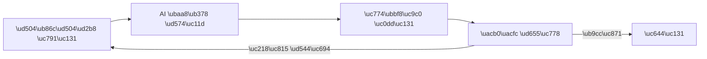

# AI \uc774\ubbf8\uc9c0 \uc0dd\uc131 101 (1/10): \uccab \uc774\ubbf8\uc9c0 \uc0dd\uc131\ud558\uae30

\ube14\ub85c\uadf8 \uc378\ub124\uc77c\uc774 \ud544\uc694\ud55c\ub370 \ub514\uc790\uc774\ub108\uc5d0\uac8c \uc758\ub8b0\ud560 \uc608\uc0b0\uc774 \uc5c6\uc2b5\ub2c8\ub2e4. SNS\uc5d0 \uc62c\ub9b4 \uc774\ubbf8\uc9c0\uac00 \ud544\uc694\ud55c\ub370 \uc2a4\ud1a1 \uc0ac\uc9c4\uc73c\ub85c\ub294 \ubd84\uc704\uae30\uac00 \uc548 \ub098\uc635\ub2c8\ub2e4. \ud504\ub808\uc820\ud14c\uc774\uc158\uc5d0 \ub123\uc744 \uc77c\ub7ec\uc2a4\ud2b8\uac00 \ud544\uc694\ud55c\ub370 \ubb34\ub8cc \uc774\ubbf8\uc9c0 \uc0ac\uc774\ud2b8\uc5d0\uc11c\ub294 \ub531 \ub9de\ub294 \uac78 \ucc3e\uae30 \uc5b4\ub835\uc2b5\ub2c8\ub2e4.

ChatGPT\uc758 \uc774\ubbf8\uc9c0 \uc0dd\uc131 \uae30\ub2a5\uc740 \uc774\ub7f0 \uc21c\uac04\uc5d0 \uc4f8 \uc218 \uc788\ub294 \ub3c4\uad6c\uc785\ub2c8\ub2e4. \ud14d\uc2a4\ud2b8\ub85c \uc6d0\ud558\ub294 \uc774\ubbf8\uc9c0\ub97c \uc124\uba85\ud558\uba74, AI\uac00 \uadf8 \uc124\uba85\uc5d0 \ub9de\ub294 \uc774\ubbf8\uc9c0\ub97c \ub9cc\ub4e4\uc5b4 \uc90d\ub2c8\ub2e4. \ub2e4\ub9cc \uac19\uc740 \ub3c4\uad6c\ub77c\ub3c4 \uc5b4\ub5bb\uac8c \uc124\uba85\ud558\ub290\ub0d0\uc5d0 \ub530\ub77c \uacb0\uacfc\uac00 \ud06c\uac8c \ub2ec\ub77c\uc9d1\ub2c8\ub2e4.

\uc774 \uae00\uc740 AI \uc774\ubbf8\uc9c0 \uc0dd\uc131 101 \uc2dc\ub9ac\uc988\uc758 \uccab \ubc88\uc9f8 \uae00\uc785\ub2c8\ub2e4. \uc5ec\uae30\uc11c\ub294 ChatGPT\ub85c \uccab \uc774\ubbf8\uc9c0\ub97c \ub9cc\ub4e4\uc5b4\ubcf4\uace0, \ud504\ub86c\ud504\ud2b8\ub97c \uc870\uae08\ub9cc \ubc14\uafc0 \ub54c \uacb0\uacfc\uac00 \uc5b4\ub5bb\uac8c \ub2ec\ub77c\uc9c0\ub294\uc9c0 \uc9c1\uc811 \ube44\uad50\ud574 \ubcf4\uaca0\uc2b5\ub2c8\ub2e4.

---



*\ud504\ub86c\ud504\ud2b8 \uc791\uc131\ubd80\ud130 \uacb0\uacfc \ud655\uc778\uae4c\uc9c0\uc758 \uc774\ubbf8\uc9c0 \uc0dd\uc131 \ud750\ub984*

## \uba3c\uc800 \ub358\uc9c0\ub294 \uc9c8\ubb38

- ChatGPT\uc5d0\uac8c \uc774\ubbf8\uc9c0\ub97c \uadf8\ub824\ub2ec\ub77c\uace0 \ud560 \ub54c, \uc5b4\ub514\uae4c\uc9c0 \uc790\uc138\ud558\uac8c \uc368\uc57c \uc6d0\ud558\ub294 \uacb0\uacfc\uac00 \ub098\uc62c\uae4c\uc694?
- "\uace0\uc591\uc774 \uadf8\ub824\uc918"\ub77c\uace0 \ud558\uba74 \uc5b4\ub5a4 \uace0\uc591\uc774\uac00 \ub098\uc62c\uae4c\uc694? \ub0b4\uac00 \uc0c1\uc0c1\ud55c \uace0\uc591\uc774\uc640 \uac19\uc744\uae4c\uc694?
- \ud504\ub86c\ud504\ud2b8\ub97c \ubc14\uafc0 \ub54c\ub9c8\ub2e4 \uacb0\uacfc\uac00 \ub2ec\ub77c\uc9c0\ub294\ub370, \uc5b4\ub5a4 \uc694\uc18c\uac00 \uac00\uc7a5 \ud070 \uc601\ud5a5\uc744 \uc904\uae4c\uc694?

---

## ChatGPT \uc774\ubbf8\uc9c0 \uc0dd\uc131\uc774\ub780?

ChatGPT\uc758 \uc774\ubbf8\uc9c0 \uc0dd\uc131 \uae30\ub2a5\uc740 \ud14d\uc2a4\ud2b8 \uc124\uba85\uc744 \ubc1b\uc544 \uc774\ubbf8\uc9c0\ub97c \ub9cc\ub4e4\uc5b4\ub0b4\ub294 AI \uae30\uc220\uc785\ub2c8\ub2e4. \uc804\ubb38 \ub514\uc790\uc778 \ub3c4\uad6c\ub97c \ub2e4\ub8f0 \uc904 \ubab0\ub77c\ub3c4, \ud55c\uad6d\uc5b4\ub098 \uc601\uc5b4\ub85c \uc6d0\ud558\ub294 \uc7a5\uba74\uc744 \uc124\uba85\ud558\uba74 \ub429\ub2c8\ub2e4.

\uc774 \uae30\ub2a5\uc744 \uc4f0\ub294 \ubc29\ubc95\uc740 \ub450 \uac00\uc9c0\uc785\ub2c8\ub2e4.

| \ubc29\ubc95 | \uc124\uba85 | \uc801\ud569\ud55c \uc0ac\ub78c |
|------|------|------------|
| ChatGPT \uc6f9/\uc571 | \ub300\ud654\ucc3d\uc5d0\uc11c \ubc14\ub85c \uc694\uccad | \ubaa8\ub4e0 \uc0ac\ub78c |
| \uc624\ud508\uc18c\uc2a4 \ub3c4\uad6c (god-tibo-imagen) | \ucf54\ub4dc\ub85c \uc790\ub3d9\ud654 | \ubc18\ubcf5 \uc791\uc5c5\uc774 \ub9ce\uc740 \uc0ac\ub78c |

\uc774 \uc2dc\ub9ac\uc988\uc5d0\uc11c\ub294 \ub450 \ubc29\ubc95 \ubaa8\ub450 \ub2e4\ub8f9\ub2c8\ub2e4. \ud504\ub86c\ud504\ud2b8 \uc791\uc131\ubc95 \uc790\uccb4\ub294 \ub3d9\uc77c\ud558\uace0, \ub3c4\uad6c\ub9cc \ub2e4\ub97c \ubfd0\uc774\ub2c8\uae4c\uc694.

---

## \uccab \ubc88\uc9f8 \uc2e4\ud5d8: \ub2e8\uc21c\ud55c \ud504\ub86c\ud504\ud2b8 vs \uc790\uc138\ud55c \ud504\ub86c\ud504\ud2b8

\uac19\uc740 \uc8fc\uc81c\ub85c \ub450 \ubc88 \uc774\ubbf8\uc9c0\ub97c \ub9cc\ub4e4\uc5b4 \ubcf4\uaca0\uc2b5\ub2c8\ub2e4.

### \uc2e4\ud5d8 1: \uace0\uc591\uc774

**\ud504\ub86c\ud504\ud2b8 A** (2\ub2e8\uc5b4):

> a cat

**\ud504\ub86c\ud504\ud2b8 B** (\uc0c1\uc138 \uc124\uba85):

> A fluffy orange tabby cat sitting on a windowsill at golden hour, soft warm sunlight streaming through the window, bokeh background of a cozy living room, photorealistic style, shallow depth of field

\uacb0\uacfc\ub97c \ube44\uad50\ud574 \ubcf4\uc138\uc694.

| \ud504\ub86c\ud504\ud2b8 A: "a cat" | \ud504\ub86c\ud504\ud2b8 B: \uc0c1\uc138 \uc124\uba85 |
|:---:|:---:|
|  |  |

*\uc67c\ucabd: AI\uac00 \uc784\uc758\ub85c \uacb0\uc815\ud55c \uace0\uc591\uc774. \uc624\ub978\ucabd: \ud504\ub86c\ud504\ud2b8\uc5d0\uc11c \uc9c0\uc815\ud55c \ub300\ub85c \uc624\ub80c\uc9c0 \ud138 \uace0\uc591\uc774, \ucc3d\uac00, \uace8\ub4e0\uc544\uc6cc \uc870\uba85.*

\uc5ec\uae30\uc11c \uc911\uc694\ud55c \ucc28\uc774\uac00 \ubcf4\uc785\ub2c8\ub2e4. "a cat"\ub9cc \uc37c\uc744 \ub54c AI\ub294 \uace0\uc591\uc774\uc758 \uc885\ub958, \uc0c9\uc0c1, \ud3ec\uc988, \ubc30\uacbd, \uc870\uba85\uc744 \ubaa8\ub450 \uc784\uc758\ub85c \uacb0\uc815\ud569\ub2c8\ub2e4. \uc8fc\uc0ac\uc704\ub97c \ub358\uc838\uc11c \ub098\uc628 \uacb0\uacfc\uc640 \uac19\uc2b5\ub2c8\ub2e4. \ubc18\uba74 \uc0c1\uc138 \ud504\ub86c\ud504\ud2b8\ub294 \uc6d0\ud558\ub294 \uacb0\uacfc\uc5d0 \ud6e8\uc52c \uac00\uae4c\uc6cc\uc9d1\ub2c8\ub2e4.

### \uc2e4\ud5d8 2: \uc0b0

**\ud504\ub86c\ud504\ud2b8 A** (2\ub2e8\uc5b4):

> a mountain

**\ud504\ub86c\ud504\ud2b8 B** (\uc0c1\uc138 \uc124\uba85):

> A snow-capped mountain peak at sunrise, dramatic pink and orange clouds reflecting in a crystal-clear alpine lake in the foreground, pine trees framing the edges, landscape photography style, wide-angle lens

| \ud504\ub86c\ud504\ud2b8 A: "a mountain" | \ud504\ub86c\ud504\ud2b8 B: \uc0c1\uc138 \uc124\uba85 |
|:---:|:---:|
|  |  |

*\uc67c\ucabd: AI\uac00 \uc784\uc758\ub85c \uadf8\ub9b0 \uc0b0. \uc624\ub978\ucabd: \uc77c\ucd9c, \ud638\uc218 \ubc18\uc601, \uc18c\ub098\ubb34 \ud504\ub808\uc774\ubc0d\uc744 \uc9c0\uc815\ud55c \uacb0\uacfc.*

\ud328\ud134\uc774 \ubcf4\uc774\uc2dc\ub098\uc694? \ub2e8\uc21c\ud55c \ud504\ub86c\ud504\ud2b8\ub294 AI\uc5d0\uac8c \uac70\uc758 \ubaa8\ub4e0 \uacb0\uc815\uc744 \ub9e1\uae30\ub294 \uac83\uc774\uace0, \uc0c1\uc138\ud55c \ud504\ub86c\ud504\ud2b8\ub294 \ub0b4\uac00 \uc6d0\ud558\ub294 \ubc29\ud5a5\uc73c\ub85c AI\ub97c \uc548\ub0b4\ud558\ub294 \uac83\uc785\ub2c8\ub2e4.

---

## \ud504\ub86c\ud504\ud2b8\uc758 \uae30\ubcf8 \uc694\uc18c 5\uac00\uc9c0

\uc0c1\uc138\ud55c \ud504\ub86c\ud504\ud2b8\uac00 \ub354 \uc88b\uc740 \uacb0\uacfc\ub97c \ub0b8\ub2e4\ub294 \uac78 \ud655\uc778\ud588\uc2b5\ub2c8\ub2e4. \uadf8\ub7fc \ud504\ub86c\ud504\ud2b8\uc5d0 \uc5b4\ub5a4 \uc694\uc18c\ub97c \ub123\uc5b4\uc57c \ud560\uae4c\uc694?

| \uc694\uc18c | \uc124\uba85 | \uc608\uc2dc |
|------|------|------|
| **\uc8fc\uc81c** (Subject) | \ubb34\uc5c7\uc744 \uadf8\ub9b4\uc9c0 | \uc624\ub80c\uc9c0\uc0c9 \ud138 \uace0\uc591\uc774 |
| **\uc2a4\ud0c0\uc77c** (Style) | \uc5b4\ub5a4 \ubd84\uc704\uae30\ub85c \uadf8\ub9b4\uc9c0 | \uc0ac\uc9c4\ucc98\ub7fc, \uc218\ucc44\ud654\ucc98\ub7fc |
| **\uad6c\ub3c4** (Composition) | \uc5b4\ub5a4 \uac01\ub3c4\uc5d0\uc11c \ubcfc\uc9c0 | \ud074\ub85c\uc988\uc5c5, \uc704\uc5d0\uc11c \ub0b4\ub824\ub2e4\ubcf4\ub294 \uc2dc\uc810 |
| **\uc870\uba85** (Lighting) | \ube5b\uc774 \uc5b4\ub5bb\uac8c \ub4e4\uc5b4\uc624\ub294\uc9c0 | \ub530\ub73b\ud55c \uc624\ud6c4 \ud587\uc0b4, \ub124\uc628 \uc870\uba85 |
| **\ubc30\uacbd** (Background) | \uc8fc\uc81c \ub4a4\uc5d0 \ubb54\uac00 \uc788\ub294\uc9c0 | \uc544\ub298\ud55c \uac70\uc2e4, \ub3c4\uc2ec \uc57c\uacbd |

\uc774 \ub2e4\uc12f \uc694\uc18c\ub97c \ubaa8\ub450 \ub123\uc744 \ud544\uc694\ub294 \uc5c6\uc2b5\ub2c8\ub2e4. \uc8fc\uc81c\ub9cc\uc73c\ub85c\ub3c4 \uc774\ubbf8\uc9c0\ub294 \ub098\uc635\ub2c8\ub2e4. \ud558\uc9c0\ub9cc \uc694\uc18c\ub97c \ub354\ud560\uc218\ub85d \uc6d0\ud558\ub294 \uacb0\uacfc\uc5d0 \uac00\uae4c\uc6cc\uc9d1\ub2c8\ub2e4.

### \uc2e4\ud5d8 3: \ucee4\ud53c \ud55c \uc794

\uc774\ubc88\uc5d0\ub294 \uc694\uc18c\ub97c \ud558\ub098\uc529 \ucd94\uac00\ud558\uba74\uc11c \ucc28\uc774\ub97c \ubd10\ubcf4\uaca0\uc2b5\ub2c8\ub2e4.

**\ud504\ub86c\ud504\ud2b8 A** (\uc8fc\uc81c\ub9cc):

> a coffee cup on a table

**\ud504\ub86c\ud504\ud2b8 B** (5\uac00\uc9c0 \uc694\uc18c \ubaa8\ub450 \ud3ec\ud568):

> A steaming latte with beautiful latte art in a ceramic cup, sitting on a rustic wooden table in a cozy cafe, morning light coming through the window, warm tones, overhead shot, food photography style

| \uc8fc\uc81c\ub9cc | 5\uac00\uc9c0 \uc694\uc18c \ubaa8\ub450 |
|:---:|:---:|
|  |  |

*\uc67c\ucabd: \uc8fc\uc81c\ub9cc \uc9c0\uc815. \uc624\ub978\ucabd: \uc2a4\ud0c0\uc77c(\ud478\ub4dc \ud3ec\ud1a0), \uad6c\ub3c4(\uc624\ubc84\ud5e4\ub4dc), \uc870\uba85(\uc544\uce68 \uc790\uc5f0\uad11), \ubc30\uacbd(\uce74\ud398)\uc744 \ubaa8\ub450 \uc9c0\uc815.*

\uc624\ub978\ucabd \uc774\ubbf8\uc9c0\ub294 \uc778\uc2a4\ud0c0\uadf8\ub7a8\uc774\ub098 \ube14\ub85c\uadf8\uc5d0 \ubc14\ub85c \uc62c\ub9b4 \uc218 \uc788\ub294 \uc218\uc900\uc785\ub2c8\ub2e4. \ud504\ub86c\ud504\ud2b8\uc5d0 30\ucd08\ub9cc \ub354 \ud22c\uc790\ud588\uc744 \ubfd0\uc778\ub370 \uacb0\uacfc\uc758 \ucc28\uc774\ub294 \ud06d\ub2c8\ub2e4.

---

## \ud504\ub86c\ud504\ud2b8 \uc791\uc131 \ud301 3\uac00\uc9c0

\uccab \uc774\ubbf8\uc9c0\ub97c \ub9cc\ub4e4\uc5b4\ubcf4\uba74\uc11c \ub290\ub080 \uc810\uc744 \uc815\ub9ac\ud558\uba74 \uc774\ub807\uc2b5\ub2c8\ub2e4.

### 1. \uad6c\uccb4\uc801\uc73c\ub85c \uc4f0\uc138\uc694

"\uc608\uc05c \uaf43"\ubcf4\ub2e4 "\ubd84\ud64d\uc0c9 \ubca9\uaf43\uc774 \ud754\ub0a0\ub9ac\ub294 \ubd04\ub0a0\uc758 \uac00\ub85c\uc218\uae38"\uc774 \ub0ab\uc2b5\ub2c8\ub2e4. AI\ub294 \uc6b0\ub9ac \uba38\ub9bf\uc18d \uc774\ubbf8\uc9c0\ub97c \ubcfc \uc218 \uc5c6\uc73c\ub2c8\uae4c, \ubb38\uc790\ub85c \uc804\ub2ec\ud560 \uc218 \uc788\ub294 \ub9cc\ud07c\ub9cc \uc774\ud574\ud569\ub2c8\ub2e4.

### 2. \uc2a4\ud0c0\uc77c\uc744 \uba85\uc2dc\ud558\uc138\uc694

"\uc0ac\uc9c4\ucc98\ub7fc", "\uc218\ucc44\ud654\ucc98\ub7fc", "\ud53d\uc0ac \uc560\ub2c8\uba54\uc774\uc158 \uc2a4\ud0c0\uc77c\ub85c" \uac19\uc740 \ud45c\ud604\uc744 \ub123\uc73c\uba74 AI\uac00 \uc804\uccb4 \ubd84\uc704\uae30\ub97c \uacb0\uc815\ud558\ub294 \ub370 \ud070 \ub3c4\uc6c0\uc774 \ub429\ub2c8\ub2e4.

### 3. \ud55c \ubc88\uc5d0 \uc644\ubcbd\ud560 \ud544\uc694 \uc5c6\uc2b5\ub2c8\ub2e4

\uccab \uacb0\uacfc\uac00 \ub9c8\uc74c\uc5d0 \uc548 \ub4e4\uba74, \ud504\ub86c\ud504\ud2b8\ub97c \uc218\uc815\ud574\uc11c \ub2e4\uc2dc \ub9cc\ub4e4\uba74 \ub429\ub2c8\ub2e4. \uc774\ubbf8\uc9c0 \uc0dd\uc131\uc740 \ubc18\ubcf5\uc801\uc778 \uacfc\uc815\uc774\uc9c0, \ud55c \ubc88\uc5d0 \uc644\uc131\ud558\ub294 \uacfc\uc815\uc774 \uc544\ub2d9\ub2c8\ub2e4. "\uc870\uae08 \ub354 \ubc1d\uac8c", "\ubc30\uacbd\uc744 \ub2e8\uc21c\ud558\uac8c", "\uc880 \ub354 \uc67c\ucabd\uc73c\ub85c" \uac19\uc740 \uc218\uc815 \uc9c0\uc2dc\ub97c \uc774\uc5b4\uc11c \uc904 \uc218\ub3c4 \uc788\uc2b5\ub2c8\ub2e4.

---

## \uc624\ud508\uc18c\uc2a4 \ub3c4\uad6c\ub85c \uc774\ubbf8\uc9c0 \uc0dd\uc131\ud558\uae30

\uc774 \uc2dc\ub9ac\uc988\uc758 \uc608\uc81c \uc774\ubbf8\uc9c0\ub294 \ubaa8\ub450 [god-tibo-imagen](https://github.com/NomaDamas/god-tibo-imagen)\uc774\ub77c\ub294 \uc624\ud508\uc18c\uc2a4 \ub3c4\uad6c\ub85c \uc0dd\uc131\ud588\uc2b5\ub2c8\ub2e4. \uc774 \ub3c4\uad6c\ub97c \uc0ac\uc6a9\ud558\uba74 ChatGPT\uc758 \uc774\ubbf8\uc9c0 \uc0dd\uc131 \uae30\ub2a5\uc744 \ucf54\ub4dc\ub85c \uc790\ub3d9\ud654\ud560 \uc218 \uc788\uc2b5\ub2c8\ub2e4.

```python
from gti import Client

client = Client()
result = client.generate_image(
    prompt="A fluffy orange tabby cat sitting on a windowsill at golden hour",
    output_path="my-cat.png"
)
print(f"\uc774\ubbf8\uc9c0 \uc800\uc7a5 \uc704\uce58: {result.saved_path}")
```

\uc774 \ub3c4\uad6c\uac00 \uc788\uc73c\uba74 \uac19\uc740 \ud504\ub86c\ud504\ud2b8\ub85c \uc5ec\ub7ec \ubc88 \uc0dd\uc131\ud574\ubcf4\uac70\ub098, \ud504\ub86c\ud504\ud2b8\ub97c \uc870\uae08\uc529 \ubc14\uafc0 \ub54c\ub9c8\ub2e4 \uacb0\uacfc\ub97c \ube44\uad50\ud558\ub294 \uc2e4\ud5d8\uc744 \uc27d\uac8c \ud560 \uc218 \uc788\uc2b5\ub2c8\ub2e4. \uc774 \uc2dc\ub9ac\uc988 \ub4a4\ucabd\uc5d0\uc11c \uc790\uc138\ud788 \ub2e4\ub8e8\uaca0\uc2b5\ub2c8\ub2e4.

\ucf54\ub4dc \uc5c6\uc774 ChatGPT \uc6f9\uc0ac\uc774\ud2b8\uc5d0\uc11c \ub3d9\uc77c\ud55c \ud504\ub86c\ud504\ud2b8\ub97c \uc785\ub825\ud574\ub3c4 \uac19\uc740 \uacb0\uacfc\ub97c \uc5bb\uc744 \uc218 \uc788\uc2b5\ub2c8\ub2e4. \ud504\ub86c\ud504\ud2b8 \uc791\uc131\ubc95\uc774 \ud575\uc2ec\uc774\uc9c0, \ub3c4\uad6c\uac00 \ud575\uc2ec\uc774 \uc544\ub2d9\ub2c8\ub2e4.

---

## \uc815\ub9ac: \uccab \uc774\ubbf8\uc9c0\ub97c \ub9cc\ub4e4\uc5b4\ubcf4\uba74\uc11c \ubc30\uc6b4 \uac83

\uc624\ub298 \uc138 \ubc88\uc758 \uc2e4\ud5d8\uc744 \ud1b5\ud574 \ud655\uc778\ud55c \uac83\uc740 \uac04\ub2e8\ud569\ub2c8\ub2e4.

- \ub2e8\uc21c\ud55c \ud504\ub86c\ud504\ud2b8\ub294 AI\uc5d0\uac8c \uac70\uc758 \ubaa8\ub4e0 \uacb0\uc815\uc744 \ub9e1\uae34\ub2e4
- \uc0c1\uc138\ud55c \ud504\ub86c\ud504\ud2b8\ub294 \ub0b4\uac00 \uc6d0\ud558\ub294 \ubc29\ud5a5\uc73c\ub85c \uc548\ub0b4\ud55c\ub2e4
- \uc8fc\uc81c, \uc2a4\ud0c0\uc77c, \uad6c\ub3c4, \uc870\uba85, \ubc30\uacbd\uc758 5\uac00\uc9c0 \uc694\uc18c\uac00 \uacb0\uacfc\ub97c \uc88c\uc6b0\ud55c\ub2e4

\ub2e4\uc74c \uae00\uc5d0\uc11c\ub294 \uc774 5\uac00\uc9c0 \uc694\uc18c \uc911 \uac00\uc7a5 \uc601\ud5a5\ub825\uc774 \ud070 "\ud504\ub86c\ud504\ud2b8 \uad6c\uc870"\ub97c \ub354 \uae4a\uc774 \ud30c\uace0\ub4e4\uaca0\uc2b5\ub2c8\ub2e4.

---

## \ucc98\uc74c \uc9c8\ubb38\uc73c\ub85c \ub3cc\uc544\uac00\uae30

**ChatGPT\uc5d0\uac8c \uc774\ubbf8\uc9c0\ub97c \uadf8\ub824\ub2ec\ub77c\uace0 \ud560 \ub54c, \uc5b4\ub514\uae4c\uc9c0 \uc790\uc138\ud558\uac8c \uc368\uc57c \uc6d0\ud558\ub294 \uacb0\uacfc\uac00 \ub098\uc62c\uae4c\uc694?**

\uc8fc\uc81c, \uc2a4\ud0c0\uc77c, \uad6c\ub3c4, \uc870\uba85, \ubc30\uacbd\uc758 5\uac00\uc9c0 \uc694\uc18c\ub97c \uad6c\uccb4\uc801\uc73c\ub85c \uba85\uc2dc\ud558\uba74 \uc6d0\ud558\ub294 \uacb0\uacfc\uc5d0 \uac00\uae5d\uc2b5\ub2c8\ub2e4. \ubaa8\ub450 \ub123\uc744 \ud544\uc694\ub294 \uc5c6\uc9c0\ub9cc, \ub9ce\uc774 \uba85\uc2dc\ud560\uc218\ub85d \ub0b4 \uc758\ub3c4\uc5d0 \uac00\uae4c\uc6cc\uc9d1\ub2c8\ub2e4.

**"\uace0\uc591\uc774 \uadf8\ub824\uc918"\ub77c\uace0 \ud558\uba74 \uc5b4\ub5a4 \uace0\uc591\uc774\uac00 \ub098\uc62c\uae4c\uc694?**

AI\uac00 \uc784\uc758\ub85c \uacb0\uc815\ud55c \uace0\uc591\uc774\uac00 \ub098\uc635\ub2c8\ub2e4. \uc885\ub958, \uc0c9\uc0c1, \ud3ec\uc988, \ubc30\uacbd \ubaa8\ub450 AI \uc7ac\ub7c9\uc785\ub2c8\ub2e4. \ub0b4\uac00 \uc0c1\uc0c1\ud55c \uace0\uc591\uc774\uc640 \uac19\uc744 \ud655\ub960\uc740 \ub0ae\uc2b5\ub2c8\ub2e4.

**\ud504\ub86c\ud504\ud2b8\ub97c \ubc14\uafc0 \ub54c\ub9c8\ub2e4 \uacb0\uacfc\uac00 \ub2ec\ub77c\uc9c0\ub294\ub370, \uc5b4\ub5a4 \uc694\uc18c\uac00 \uac00\uc7a5 \ud070 \uc601\ud5a5\uc744 \uc904\uae4c\uc694?**

\uc2a4\ud0c0\uc77c\uacfc \uc870\uba85\uc774 \uc804\uccb4 \ubd84\uc704\uae30\ub97c \uac00\uc7a5 \ud06c\uac8c \ubc14\uafc9\ub2c8\ub2e4. \uac19\uc740 \uace0\uc591\uc774\ub77c\ub3c4 "\uc0ac\uc9c4\ucc98\ub7fc"\uacfc "\uc218\ucc44\ud654\ucc98\ub7fc"\uc740 \uc644\uc804\ud788 \ub2e4\ub978 \uc774\ubbf8\uc9c0\ub97c \ub9cc\ub4e4\uc5b4\ub0c5\ub2c8\ub2e4. \uc2a4\ud0c0\uc77c\uc5d0 \ub300\ud574\uc11c\ub294 3\ubc88\uc9f8 \uae00\uc5d0\uc11c \uc790\uc138\ud788 \ub2e4\ub8f9\ub2c8\ub2e4.

---

<!-- toc:begin -->
## \uc774 \uc2dc\ub9ac\uc988\uc5d0\uc11c \ub2e4\ub8e8\ub294 \uae00

- **AI \uc774\ubbf8\uc9c0 \uc0dd\uc131 101 (1/10): \uccab \uc774\ubbf8\uc9c0 \uc0dd\uc131\ud558\uae30 (\ud604\uc7ac \uae00)**
- AI \uc774\ubbf8\uc9c0 \uc0dd\uc131 101 (2/10): \uc88b\uc740 \ud504\ub86c\ud504\ud2b8\uc758 \uad6c\uc870 (\uc608\uc815)
- AI \uc774\ubbf8\uc9c0 \uc0dd\uc131 101 (3/10): \uc2a4\ud0c0\uc77c \ub9c8\uc2a4\ud130\ud558\uae30 (\uc608\uc815)
- AI \uc774\ubbf8\uc9c0 \uc0dd\uc131 101 (4/10): \uad6c\ub3c4\uc640 \uc2dc\uc810 (\uc608\uc815)
- AI \uc774\ubbf8\uc9c0 \uc0dd\uc131 101 (5/10): \uc0c9\uac10\uacfc \uc870\uba85 (\uc608\uc815)
- AI \uc774\ubbf8\uc9c0 \uc0dd\uc131 101 (6/10): \ubcf5\uc7a1\ud55c \uc7a5\uba74 \uc124\uacc4\ud558\uae30 (\uc608\uc815)
- AI \uc774\ubbf8\uc9c0 \uc0dd\uc131 101 (7/10): \uc77c\uad00\uc131 \uc720\uc9c0\ud558\uae30 (\uc608\uc815)
- AI \uc774\ubbf8\uc9c0 \uc0dd\uc131 101 (8/10): \ud14d\uc2a4\ud2b8\uc640 \ud0c0\uc774\ud3ec\uadf8\ub798\ud53c (\uc608\uc815)
- AI \uc774\ubbf8\uc9c0 \uc0dd\uc131 101 (9/10): \ub808\ud37c\ub7f0\uc2a4 \uc774\ubbf8\uc9c0 \ud65c\uc6a9 (\uc608\uc815)
- AI \uc774\ubbf8\uc9c0 \uc0dd\uc131 101 (10/10): \uc2e4\uc804 \uc6cc\ud06c\ud50c\ub85c\uc6b0 (\uc608\uc815)
<!-- toc:end -->

## \ucc38\uace0 \uc790\ub8cc

- [ChatGPT \uc774\ubbf8\uc9c0 \uc0dd\uc131 \uacf5\uc2dd \uac00\uc774\ub4dc](https://help.openai.com/en/articles/9055440-using-dall-e-and-browsing-in-chatgpt)
- [god-tibo-imagen GitHub \uc800\uc7a5\uc18c](https://github.com/NomaDamas/god-tibo-imagen)

Tags: AI, ChatGPT, \uc774\ubbf8\uc9c0 \uc0dd\uc131, \ud504\ub86c\ud504\ud2b8 \uc5d4\uc9c0\ub2c8\uc5b4\ub9c1
