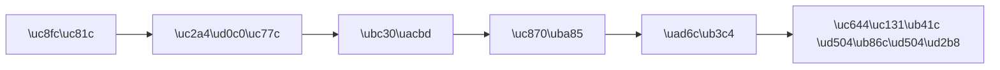

# AI \uc774\ubbf8\uc9c0 \uc0dd\uc131 101 (2/10): \uc88b\uc740 \ud504\ub86c\ud504\ud2b8\uc758 \uad6c\uc870

"\uc774\uc05c \ub85c\ubd07 \uc88c \uadf8\ub824\uc918." \uacb0\uacfc\ub294 \ub098\uc624\ub294\ub370 \ub0b4\uac00 \uc0c1\uc0c1\ud55c \uac83\uacfc\ub294 \ub2e4\ub985\ub2c8\ub2e4. "\uc608\uc05c \ud48d\uacbd \uadf8\ub824\uc918." \ud48d\uacbd\uc740 \ub098\uc624\ub294\ub370 \uc5b4\ub518\uac00 \uc774\uc0c1\ud569\ub2c8\ub2e4. "\uba4b\uc788\ub294 \uc774\ubbf8\uc9c0 \ub9cc\ub4e4\uc5b4\uc918." \uba4b\uc788\uae34 \ud55c\ub370 \uc6d0\ud55c \uac8c \uc774\uac8c \uc544\ub2d9\ub2c8\ub2e4.

\uc774\ub7f0 \uacbd\ud5d8, \uc775\uc219\ud558\uc2dc\uc8e0? \ubb38\uc81c\ub294 \ud504\ub86c\ud504\ud2b8\uc5d0 \"\ubb34\uc5c7\uc744\" \ub123\uc5c8\ub290\ub0d0\uac00 \uc544\ub2c8\ub77c \"\uc5b4\ub5bb\uac8c\" \ub123\uc5c8\ub290\ub0d0\uc5d0 \uc788\uc2b5\ub2c8\ub2e4. \"\uc608\uc058\ub2e4\", \"\uba4b\uc788\ub2e4\", \"\ub180\ub77c\uc6b4\" \uac19\uc740 \ud615\uc6a9\uc0ac\ub294 AI\uc5d0\uac8c \uac70\uc758 \uc815\ubcf4\ub97c \uc8fc\uc9c0 \ubabb\ud569\ub2c8\ub2e4. AI\ub294 \uad6c\uccb4\uc801\uc778 \uc9c0\uc2dc\uac00 \ud544\uc694\ud569\ub2c8\ub2e4.

\uc774 \uae00\uc740 AI \uc774\ubbf8\uc9c0 \uc0dd\uc131 101 \uc2dc\ub9ac\uc988\uc758 2\ubc88\uc9f8 \uae00\uc785\ub2c8\ub2e4. \uc5ec\uae30\uc11c\ub294 \uc88b\uc740 \ud504\ub86c\ud504\ud2b8\uc758 \uad6c\uccb4\uc801\uc778 \uad6c\uc870\ub97c \ubc30\uc6b0\uace0, \uc694\uc18c\ub97c \ud558\ub098\uc529 \ucd94\uac00\ud558\uba74\uc11c \uacb0\uacfc\uac00 \uc5b4\ub5bb\uac8c \ub2ec\ub77c\uc9c0\ub294\uc9c0 \uc2e4\ud5d8\ud574 \ubcf4\uaca0\uc2b5\ub2c8\ub2e4.

---



*\ud504\ub86c\ud504\ud2b8 \uad6c\uc131 \uc694\uc18c\uc758 \ub808\uc774\uc5b4\ub9c1 \uad6c\uc870*

## \uba3c\uc800 \ub358\uc9c0\ub294 \uc9c8\ubb38

- \ud504\ub86c\ud504\ud2b8\uc5d0 \uc694\uc18c\ub97c \ud558\ub098\uc529 \ub354\ud560 \ub54c\ub9c8\ub2e4 \uc774\ubbf8\uc9c0\uac00 \uc5b4\ub5bb\uac8c \ub2ec\ub77c\uc9c8\uae4c\uc694?
- "\uc608\uc05c", "\uba4b\uc788\ub294" \uac19\uc740 \ud615\uc6a9\uc0ac\ub97c \ub9ce\uc774 \ub123\uc73c\uba74 \ub354 \uc88b\uc740 \uc774\ubbf8\uc9c0\uac00 \ub098\uc62c\uae4c\uc694?
- \ud504\ub86c\ud504\ud2b8\uc5d0\uc11c \uc694\uc18c\uc758 \uc21c\uc11c\uac00 \uacb0\uacfc\uc5d0 \uc601\ud5a5\uc744 \uc904\uae4c\uc694?

---

## \ud504\ub86c\ud504\ud2b8 \uacf5\uc2dd: \ub808\uc774\uc5b4\ub9c1 \ubc29\uc2dd

\uc88b\uc740 \ud504\ub86c\ud504\ud2b8\ub294 \"\ub9ce\uc774 \uc4f0\ub294 \uac83\"\uc774 \uc544\ub2c8\ub77c \"\uc815\ud655\ud558\uac8c \uc4f0\ub294 \uac83\"\uc785\ub2c8\ub2e4. \ud575\uc2ec\uc740 \ub808\uc774\uc5b4\ub9c1\u2014\uc694\uc18c\ub97c \ud558\ub098\uc529 \ucde8\ud558\ub294 \uac83\uc785\ub2c8\ub2e4.

```
[\uc8fc\uc81c] + [\uc2a4\ud0c0\uc77c] + [\ubc30\uacbd/\uc7a5\uc18c] + [\uc870\uba85] + [\uad6c\ub3c4/\uc559\uae00]
```

\uc774 \uacf5\uc2dd\uc744 \ub85c\ubd07\uc744 \uc8fc\uc81c\ub85c \uc2e4\ud5d8\ud574 \ubcf4\uaca0\uc2b5\ub2c8\ub2e4. \uc694\uc18c\ub97c \ud558\ub098\uc529 \ucd94\uac00\ud558\uba74\uc11c \uc774\ubbf8\uc9c0\uac00 \uc5b4\ub5bb\uac8c \ubcc0\ud558\ub294\uc9c0 \ub208\uc73c\ub85c \ud655\uc778\ud569\ub2c8\ub2e4.

---

## \uc2e4\ud5d8: \uc694\uc18c\ub97c \ud558\ub098\uc529 \uc313\uc544\ubcf4\uae30

### \ub2e8\uacc4 1: \uc8fc\uc81c\ub9cc

> a robot


*\uc8fc\uc81c\ub9cc \uc37c\uc744 \ub54c: AI\uac00 \ub85c\ubd07\uc758 \ud615\ud0dc, \uc0c9\uc0c1, \ubc30\uacbd, \ubd84\uc704\uae30\ub97c \ubaa8\ub450 \uc784\uc758\ub85c \uacb0\uc815\ud55c\ub2e4.*

\ub85c\ubd07\uc740 \ub098\uc654\uc9c0\ub9cc, \uc5b4\ub5a4 \uc2a4\ud0c0\uc77c\uc778\uc9c0, \uc5b4\ub514\uc5d0 \uc788\ub294\uc9c0, \ubd84\uc704\uae30\uac00 \uc5b4\ub5a4\uc9c0 \ubaa8\ub450 AI \uc7ac\ub7c9\uc785\ub2c8\ub2e4.

### \ub2e8\uacc4 2: \uc8fc\uc81c + \uc2a4\ud0c0\uc77c

> a robot, watercolor painting style


*\uc2a4\ud0c0\uc77c\uc744 \ucd94\uac00\ud558\uc790 \uc804\uccb4 \ubd84\uc704\uae30\uac00 \ubc14\ub00c\uc5c8\ub2e4. \uc218\ucc44\ud654 \ud2b9\uc720\uc758 \ubd80\ub4dc\ub7ec\uc6c0\uacfc \ubc88\uc9d0 \ud6a8\uacfc\uac00 \ub098\ud0c0\ub09c\ub2e4.*

\uc2a4\ud0c0\uc77c \ud558\ub098\ub9cc \ucd94\uac00\ud588\uc744 \ubfd0\uc778\ub370, \uac19\uc740 \ub85c\ubd07\uc774\ub77c\ub3c4 \uc644\uc804\ud788 \ub2e4\ub978 \ub290\ub08c\uc758 \uc774\ubbf8\uc9c0\uac00 \ub429\ub2c8\ub2e4.

### \ub2e8\uacc4 3: \uc8fc\uc81c + \uc2a4\ud0c0\uc77c + \ubc30\uacbd

> a robot, watercolor painting style, standing in a flower garden


*\ubc30\uacbd\uc744 \uc9c0\uc815\ud558\uc790 \ub85c\ubd07\uc774 \ud654\uc6d0\uc5d0 \ub193\uc600\ub2e4. \uc774\uc57c\uae30\uac00 \uc0dd\uae34\ub2e4.*

\uc8fc\uc81c\uc5d0 \uc7a5\uc18c\ub97c \uc8fc\uba74 \uc774\ubbf8\uc9c0\uc5d0 \uc774\uc57c\uae30\uac00 \uc0dd\uae41\ub2c8\ub2e4. "\ub85c\ubd07\uc774 \uc788\ub2e4"\uc5d0\uc11c "\ub85c\ubd07\uc774 \ud654\uc6d0\uc5d0 \uc788\ub2e4"\ub85c \ubc14\ub00c\uba74\uc11c \ubcf4\ub294 \uc0ac\ub78c\uc774 \uad81\uae08\ud574\ud558\ub294 \uc7a5\uba74\uc774 \ub429\ub2c8\ub2e4.

### \ub2e8\uacc4 4: \uc8fc\uc81c + \uc2a4\ud0c0\uc77c + \ubc30\uacbd + \uc870\uba85

> a robot, watercolor painting style, standing in a flower garden, golden hour sunlight casting long shadows


*\uc870\uba85\uc744 \ucd94\uac00\ud558\uc790 \ud654\uba74 \uc804\uccb4\uc758 \uc628\ub3c4\uac10\uc774 \ub2ec\ub77c\uc84c\ub2e4. \uae34 \uadf8\ub9bc\uc790\uac00 \uae4a\uc774\uac10\uc744 \ub354\ud55c\ub2e4.*

\uc870\uba85\uc740 \uc774\ubbf8\uc9c0\uc758 \ubd84\uc704\uae30\ub97c \uc644\uc804\ud788 \ubc14\uafc0 \uc218 \uc788\ub294 \uc694\uc18c\uc785\ub2c8\ub2e4. \uac19\uc740 \uc7a5\uba74\uc774\ub77c\ub3c4 "\ub0ae", "\ubc24", "\ub124\uc628 \uc870\uba85"\uc5d0 \ub530\ub77c \uc644\uc804\ud788 \ub2e4\ub978 \uc774\ubbf8\uc9c0\uac00 \ub429\ub2c8\ub2e4.

### \ub2e8\uacc4 5: \uc644\uc131\ub41c \ud504\ub86c\ud504\ud2b8 (5\uac00\uc9c0 \uc694\uc18c \uc804\uccb4)

> a friendly robot with round eyes and a small antenna, watercolor painting style, standing in a flower garden surrounded by sunflowers and daisies, golden hour sunlight casting long soft shadows, gentle warm atmosphere, wide shot showing the full scene


*5\uac00\uc9c0 \uc694\uc18c\ub97c \ubaa8\ub450 \ub123\uc740 \uacb0\uacfc. \uc8fc\uc81c\uc758 \uc131\uaca9(\uce5c\uadfc\ud55c), \ubc30\uacbd\uc758 \ub514\ud14c\uc77c(\ud574\ubc14\ub77c\uae30, \ub370\uc774\uc9c0), \uad6c\ub3c4(\uc640\uc774\ub4dc\uc0f7)\uae4c\uc9c0 \uc9c0\uc815.*

5\uac00\uc9c0 \uc694\uc18c\ub97c \ubaa8\ub450 \ub123\uc73c\ub2c8 AI\uac00 \uc81c \ub9c8\uc74c\ub300\ub85c \uacb0\uc815\ud560 \uc5ec\uc9c0\uac00 \uac70\uc758 \uc5c6\uc5b4\uc84c\uc2b5\ub2c8\ub2e4. \ub0b4\uac00 \uc6d0\ud558\ub294 \uc7a5\uba74\uc5d0 \ud6e8\uc52c \uac00\uae5d\uc2b5\ub2c8\ub2e4.

---

## \ud754\ud55c \uc2e4\uc218: \ube08 \ud615\uc6a9\uc0ac \ub098\uc5f4

\ub9ce\uc740 \uc0ac\ub78c\uc774 "\ub354 \uc88b\uc740 \uacb0\uacfc\ub97c \uc5bb\uc73c\ub824\uba74 \uce6d\ucc2c\uc744 \ub9ce\uc774 \ub123\uc73c\uba74 \ub418\uc9c0 \uc54a\uc744\uae4c?" \uc0dd\uac01\ud569\ub2c8\ub2e4. \uc2e4\ud5d8\ud574 \ubcf4\uaca0\uc2b5\ub2c8\ub2e4.

> a beautiful amazing stunning incredible gorgeous wonderful fantastic robot in a nice pretty lovely amazing place with great lighting and awesome colors


*\ud615\uc6a9\uc0ac\ub97c \uc5ec\ub7ec \uac1c \ub098\uc5f4\ud55c \uacb0\uacfc. \ud654\ub824\ud558\uc9c0\ub9cc \uad6c\uccb4\uc131\uc774 \uc5c6\ub2e4.*

\uc704\uc758 \ub2e8\uacc4 5 \uacb0\uacfc\uc640 \ube44\uad50\ud574 \ubcf4\uc138\uc694. \ud615\uc6a9\uc0ac\ub97c \uc544\ubb34\ub9ac \ub9ce\uc774 \ub123\uc5b4\ub3c4 AI\ub294 \uad6c\uccb4\uc801\uc778 \uc9c0\uce68\uc73c\ub85c \ud574\uc11d\ud558\uc9c0 \ubabb\ud569\ub2c8\ub2e4. "\ub180\ub77c\uc6b4"\ubcf4\ub2e4\ub294 "\ub465\uae00\uace0 \ud070 \ub208\uc744 \uac00\uc9c4", "\uc608\uc05c \uacf3"\ubcf4\ub2e4\ub294 "\ud574\ubc14\ub77c\uae30\uc640 \ub370\uc774\uc9c0\uac00 \uc788\ub294 \ud654\uc6d0"\uc774 \ud6e8\uc52c \ud6a8\uacfc\uc801\uc785\ub2c8\ub2e4.

| \ube44\ud6a8\uacfc\uc801 | \ud6a8\uacfc\uc801 |
|----------|---------|
| beautiful, amazing, stunning | \ub465\uae00\uace0 \ud070 \ub208\uc744 \uac00\uc9c4 |
| nice pretty lovely place | \ud574\ubc14\ub77c\uae30\uc640 \ub370\uc774\uc9c0\uac00 \uc788\ub294 \ud654\uc6d0 |
| great lighting | \uace8\ub4e0\uc544\uc6cc \ud587\uc0b4\uc774 \uae34 \uadf8\ub9bc\uc790\ub97c \ub9cc\ub4dc\ub294 |
| awesome colors | \ub530\ub73b\ud55c \uc8fc\ud669\uc0c9 \ud1a4 |

\uaddc\uce59\uc740 \uac04\ub2e8\ud569\ub2c8\ub2e4: **\ud615\uc6a9\uc0ac\ubcf4\ub2e4 \uba85\uc0ac\uc640 \ub3d9\uc0ac\ub85c \uc4f0\uc138\uc694.** "\uc608\uc05c \uace0\uc591\uc774"\ubcf4\ub2e4 "\ud138\uc774 \ub36e\uc778 \uc624\ub80c\uc9c0\uc0c9 \ud398\ub974\uc2dc\uc548"\uc774 AI\uc5d0\uac8c \ud6e8\uc52c \uba85\ud655\ud55c \uc9c0\uc2dc\uc785\ub2c8\ub2e4.

---

## \uc21c\uc11c\uac00 \uc911\uc694\ud560\uae4c?

\ud504\ub86c\ud504\ud2b8\uc5d0\uc11c \uc694\uc18c\ub97c \uc4f0\ub294 \uc21c\uc11c\uac00 \uacb0\uacfc\uc5d0 \uc601\ud5a5\uc744 \uc904\uae4c\uc694? \uac19\uc740 \ub0b4\uc6a9\uc744 \ub2e4\ub978 \uc21c\uc11c\ub85c \uc8fc\uc5b4 \ubcf4\uaca0\uc2b5\ub2c8\ub2e4.

**\ubc30\uacbd \uba3c\uc800**:

> In a dimly lit cyberpunk alley at night, a small delivery robot with glowing blue eyes navigates through puddles reflecting neon signs, cinematic photography style

**\uc8fc\uc81c \uba3c\uc800**:

> A small delivery robot with glowing blue eyes, cinematic photography style, navigating through puddles in a dimly lit cyberpunk alley at night, neon signs reflecting in the water

| \ubc30\uacbd \uba3c\uc800 | \uc8fc\uc81c \uba3c\uc800 |
|:---:|:---:|
|  |  |

*\uac19\uc740 \uc694\uc18c\ub97c \ub2e4\ub978 \uc21c\uc11c\ub85c \uc37c\uc744 \ub54c\uc758 \ube44\uad50*

\ub458 \ub2e4 \ube44\uc2b7\ud55c \ub290\ub08c\uc774\uc9c0\ub9cc \ubbf8\ubb18\ud55c \ucc28\uc774\uac00 \uc788\uc2b5\ub2c8\ub2e4. \uc77c\ubc18\uc801\uc73c\ub85c \ub450 \uac00\uc9c0 \ud328\ud134\uc774 \uc788\uc2b5\ub2c8\ub2e4.

| \uc21c\uc11c | \ud2b9\uc9d5 | \uc801\ud569\ud55c \uc0c1\ud669 |
|------|------|----------|
| \uc8fc\uc81c \uba3c\uc800 | \uc8fc\uc81c\uac00 \ud654\uba74 \uc911\uc2ec\uc5d0 \ud06c\uac8c | \uc81c\ud488 \uc0ac\uc9c4, \uce90\ub9ad\ud130 \uc911\uc2ec |
| \ubc30\uacbd \uba3c\uc800 | \ubc30\uacbd\uc774 \ub354 \uac15\uc870\ub428 | \ud48d\uacbd, \ubd84\uc704\uae30 \uc911\uc2ec |

\uc2e4\uc6a9\uc801 \ud301: **\uac00\uc7a5 \uc911\uc694\ud55c \uc694\uc18c\ub97c \ub9e8 \uc55e\uc5d0 \uc4f0\uc138\uc694.** AI\ub294 \uc55e\ucabd\uc5d0 \ub098\uc628 \ub0b4\uc6a9\uc744 \uc57d\uac04 \ub354 \uac15\uc870\ud558\ub294 \uacbd\ud5a5\uc774 \uc788\uc2b5\ub2c8\ub2e4.

---

## \uc2e4\uc804 \ud15c\ud50c\ub9bf 3\uac00\uc9c0

\uc774\uc81c \uacf5\uc2dd\uc744 \uc54c\uc558\uc73c\ub2c8, \uc2e4\uc804\uc5d0\uc11c \ubc14\ub85c \uc4f8 \uc218 \uc788\ub294 \ud15c\ud50c\ub9bf\uc744 \ub4dc\ub9bd\ub2c8\ub2e4.

### \ube14\ub85c\uadf8 \uc378\ub124\uc77c\uc6a9

```
[Blog topic icon or metaphor], flat illustration style, 
clean white background, vibrant [brand color] accents, 
centered composition, soft even lighting
```

\uc608: "A magnifying glass examining lines of code, flat illustration style, clean white background, vibrant blue and purple accents, centered composition, soft even lighting"

### SNS \ud3ec\uc2a4\ud2b8\uc6a9

```
[Main subject doing action], [photography style], 
[specific location], [time of day] lighting, 
[angle] shot, [mood] atmosphere
```

\uc608: "A person reading a book in a cozy window seat, lifestyle photography style, modern minimalist apartment, afternoon golden light, medium shot, peaceful calm atmosphere"

### \ud504\ub808\uc824\ud14c\uc774\uc158 \uc77c\ub7ec\uc2a4\ud2b8\uc6a9

```
[Concept or process as visual metaphor], 
isometric illustration style, pastel color palette, 
clean minimal background, soft shadows, 
slightly above eye-level perspective
```

\uc608: "A conveyor belt transforming raw materials into finished products as visual metaphor for data pipeline, isometric illustration style, pastel blue and mint color palette, clean minimal background, soft shadows"

---

## \uc815\ub9ac: \ud504\ub86c\ud504\ud2b8 \uad6c\uc870\uc758 \ud575\uc2ec

\uc624\ub298 \ubc30\uc6b4 \uac83\uc744 \uc815\ub9ac\ud558\uba74:

1. **\ub808\uc774\uc5b4\ub9c1**: \uc8fc\uc81c \u2192 \uc2a4\ud0c0\uc77c \u2192 \ubc30\uacbd \u2192 \uc870\uba85 \u2192 \uad6c\ub3c4 \uc21c\uc11c\ub85c \uc313\ub294\ub2e4
2. **\uad6c\uccb4\uc131**: \ud615\uc6a9\uc0ac \ub300\uc2e0 \uba85\uc0ac\uc640 \ub3d9\uc0ac\ub85c \uc4f4\ub2e4
3. **\uc21c\uc11c**: \uac00\uc7a5 \uc911\uc694\ud55c \uc694\uc18c\ub97c \uc55e\uc5d0 \ub454\ub2e4

\ub2e4\uc74c \uae00\uc5d0\uc11c\ub294 5\uac00\uc9c0 \uc694\uc18c \uc911 \uc774\ubbf8\uc9c0\uc758 \uc804\uccb4 \ubd84\uc704\uae30\ub97c \uac00\uc7a5 \ud06c\uac8c \ubc14\uafb8\ub294 "\uc2a4\ud0c0\uc77c"\uc744 \uae4a\uc774 \ud30c\uace0\ub4e4\uaca0\uc2b5\ub2c8\ub2e4.

---

## \ucc98\uc74c \uc9c8\ubb38\uc73c\ub85c \ub3cc\uc544\uac00\uae30

**\ud504\ub86c\ud504\ud2b8\uc5d0 \uc694\uc18c\ub97c \ud558\ub098\uc529 \ub354\ud560 \ub54c\ub9c8\ub2e4 \uc774\ubbf8\uc9c0\uac00 \uc5b4\ub5bb\uac8c \ub2ec\ub77c\uc9c0\ub098\uc694?**

\uc8fc\uc81c\ub9cc \uc788\uc744 \ub54c\ub294 AI\uac00 \ub098\uba38\uc9c0\ub97c \uc804\ubd80 \uacb0\uc815\ud569\ub2c8\ub2e4. \uc2a4\ud0c0\uc77c\uc744 \uc8fc\uba74 \ubd84\uc704\uae30\uac00, \ubc30\uacbd\uc744 \uc8fc\uba74 \uc774\uc57c\uae30\uac00, \uc870\uba85\uc744 \uc8fc\uba74 \uc628\ub3c4\uac10\uc774, \uad6c\ub3c4\ub97c \uc8fc\uba74 \uc2dc\uc120\uc774 \ub2ec\ub77c\uc9d1\ub2c8\ub2e4.

**\ud615\uc6a9\uc0ac\ub97c \ub9ce\uc774 \ub123\uc73c\uba74 \ub354 \uc88b\uc740 \uc774\ubbf8\uc9c0\uac00 \ub098\uc62c\uae4c\uc694?**

\uc544\ub2d9\ub2c8\ub2e4. "beautiful amazing stunning"\uc740 AI\uc5d0\uac8c \uad6c\uccb4\uc801 \uc815\ubcf4\ub97c \uc8fc\uc9c0 \ubabb\ud569\ub2c8\ub2e4. "\ub465\uae00\uace0 \ud070 \ub208\uc744 \uac00\uc9c4" \uac19\uc740 \uad6c\uccb4\uc801 \uc124\uba85\uc774 \ud6e8\uc52c \ud6a8\uacfc\uc801\uc785\ub2c8\ub2e4.

**\ud504\ub86c\ud504\ud2b8\uc5d0\uc11c \uc694\uc18c\uc758 \uc21c\uc11c\uac00 \uacb0\uacfc\uc5d0 \uc601\ud5a5\uc744 \uc904\uae4c\uc694?**

\uc57d\uac04\uc758 \uc601\ud5a5\uc740 \uc788\uc2b5\ub2c8\ub2e4. AI\ub294 \uc55e\ucabd \ub0b4\uc6a9\uc744 \uc870\uae08 \ub354 \uac15\uc870\ud558\ub294 \uacbd\ud5a5\uc774 \uc788\uc5b4\uc11c, \uac00\uc7a5 \uc911\uc694\ud55c \uc694\uc18c\ub97c \uc55e\uc5d0 \ub193\ub294 \uac83\uc774 \uc88b\uc2b5\ub2c8\ub2e4.

---

<!-- toc:begin -->
## \uc774 \uc2dc\ub9ac\uc988\uc5d0\uc11c \ub2e4\ub8e8\ub294 \uae00

- [AI \uc774\ubbf8\uc9c0 \uc0dd\uc131 101 (1/10): \uccab \uc774\ubbf8\uc9c0 \uc0dd\uc131\ud558\uae30](./01-first-image-generation.md)
- **AI \uc774\ubbf8\uc9c0 \uc0dd\uc131 101 (2/10): \uc88b\uc740 \ud504\ub86c\ud504\ud2b8\uc758 \uad6c\uc870 (\ud604\uc7ac \uae00)**
- AI \uc774\ubbf8\uc9c0 \uc0dd\uc131 101 (3/10): \uc2a4\ud0c0\uc77c \ub9c8\uc2a4\ud130\ud558\uae30 (\uc608\uc815)
- AI \uc774\ubbf8\uc9c0 \uc0dd\uc131 101 (4/10): \uad6c\ub3c4\uc640 \uc2dc\uc810 (\uc608\uc815)
- AI \uc774\ubbf8\uc9c0 \uc0dd\uc131 101 (5/10): \uc0c9\uac10\uacfc \uc870\uba85 (\uc608\uc815)
- AI \uc774\ubbf8\uc9c0 \uc0dd\uc131 101 (6/10): \ubcf5\uc7a1\ud55c \uc7a5\uba74 \uc124\uacc4\ud558\uae30 (\uc608\uc815)
- AI \uc774\ubbf8\uc9c0 \uc0dd\uc131 101 (7/10): \uc77c\uad00\uc131 \uc720\uc9c0\ud558\uae30 (\uc608\uc815)
- AI \uc774\ubbf8\uc9c0 \uc0dd\uc131 101 (8/10): \ud14d\uc2a4\ud2b8\uc640 \ud0c0\uc774\ud3ec\uadf8\ub798\ud53c (\uc608\uc815)
- AI \uc774\ubbf8\uc9c0 \uc0dd\uc131 101 (9/10): \ub808\ud37c\ub7f0\uc2a4 \uc774\ubbf8\uc9c0 \ud65c\uc6a9 (\uc608\uc815)
- AI \uc774\ubbf8\uc9c0 \uc0dd\uc131 101 (10/10): \uc2e4\uc804 \uc6cc\ud06c\ud50c\ub85c\uc6b0 (\uc608\uc815)
<!-- toc:end -->

## \ucc38\uace0 \uc790\ub8cc

- [OpenAI DALL-E \ud504\ub86c\ud504\ud2b8 \uac00\uc774\ub4dc](https://platform.openai.com/docs/guides/images)
- [god-tibo-imagen GitHub \uc800\uc7a5\uc18c](https://github.com/NomaDamas/god-tibo-imagen)

Tags: AI, ChatGPT, \uc774\ubbf8\uc9c0 \uc0dd\uc131, \ud504\ub86c\ud504\ud2b8 \uc5d4\uc9c0\ub2c8\uc5b4\ub9c1
