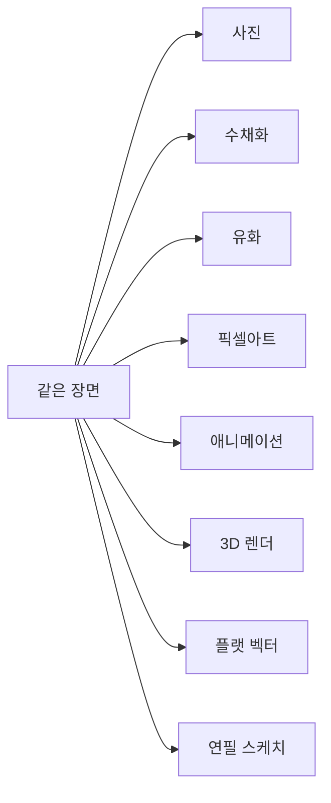

# AI 이미지 생성 101 (3/10): 스타일 마스터하기

블로그용 이미지를 만들려는데 "사진 같은 느낌"이 필요할 때가 있고, "일러스트 느낌"이 필요할 때가 있습니다. 같은 주제라도 스타일에 따라 완전히 다른 인상을 주는데, 문제는 "어떤 스타일이 있는지" 모르니까 항상 비슷한 결과만 나온다는 것입니다.

오늘은 같은 장면을 8가지 스타일로 생성해서 각각의 차이를 눈으로 확인해 보겠습니다. 이 한 글만 읽어도 앞으로 어떤 스타일을 썰야 할지 바로 판단할 수 있게 됩니다.

이 글은 AI 이미지 생성 101 시리즈의 3번째 글입니다.

---

*같은 장면을 8가지 스타일로 변환하는 것이 오늘의 실험*

## 먼저 던지는 질문

- 사진 스타일과 일러스트 스타일은 어떤 장면에서 각각 더 적합할까요?
- "수채화"와 "유화"는 같은 그림 스타일 아닌가요? 실제로 어떻게 다를까요?
- 블로그, SNS, 프레젤테이션 각각에 가장 잘 맞는 스타일은 무엇일까요?

---

## 실험 설계: 하나의 장면, 8가지 스타일

동일한 장면을 8가지 스타일로 생성합니다. 공통 장면:

> 비 오는 저녁, 따뜻한 조명이 켜진 아늴한 독립 서점. 젖은 자갈길에 불빛이 반사됨.

스타일만 바꾸고 나머지는 같게 유지합니다.

---

## 1. 사진 (Photorealistic)

> ...photorealistic photography style, 35mm film grain

*사진 스타일: 실제 카메라로 찍은 듯한 질감. 조명의 자연스러움, 물의 반사, 재질 표현이 사실적이다.*

**특징**: 실제 사진처럼 보입니다. 재질감, 반사, 빛의 번짐이 자연스럽습니다.

**사용처**: 제품 사진, 여행 블로그, 음식 사진, SNS 포스트

**키워드**: `photorealistic`, `photography`, `35mm film`, `DSLR`, `Canon EOS`, `shallow depth of field`

---

## 2. 수채화 (Watercolor)

> ...watercolor painting style, soft edges and color bleeding

*수채화 스타일: 경계가 부드럽고 색이 번지는 특유의 질감. 따뜻하고 몰입적이다.*

**특징**: 경계가 부드럽고 색이 번집니다. 따뜻하고 몰입적인 느낌을 줍니다.

**사용처**: 초대장, 엽서, 이뜨 검색 썸네일, 감성적인 SNS

**키워드**: `watercolor`, `watercolour painting`, `soft washes`, `color bleeding`, `wet-on-wet`

---

## 3. 유화 (Oil Painting)

> ...oil painting style, thick impasto brushstrokes, rich saturated colors

*유화 스타일: 두꺼운 붓터치와 진한 색감. 수채화와 달리 무게감과 질감이 느껴진다.*

**특징**: 두꺼운 붓터치가 보이고 색이 진합니다. 수채화와 비교하면 훨씬 무겝고 질감이 느껴집니다.

**수채화 vs 유화 비교**:

| 특성 | 수채화 | 유화 |
|------|--------|------|
| 경계 | 부드럽고 번짐 | 뛚렷하지만 질감이 있음 |
| 색감 | 투명하고 밝음 | 진하고 밀도 있음 |
| 분위기 | 가볍고 몴에적 | 무겁고 입체적 |
| 적합한 장면 | 꽃, 풍경, 경쾌한 장면 | 인물, 도시, 드라마틱한 장면 |

**키워드**: `oil painting`, `impasto`, `thick brushstrokes`, `rich colors`, `gallery painting`

---

## 4. 픽셀아트 (Pixel Art)

> ...pixel art style, 16-bit retro game aesthetic, limited color palette

*픽셀아트 스타일: 복고 게임 느낌의 도트 그래픽. 단순하지만 독특한 매력이 있다.*

**특징**: 레트로 게임 느낌. 제한된 색상 팔레트로 단순하지만 특유의 매력이 있습니다.

**사용처**: 게임 관련 콘텐츠, IT 블로그, 테크 커뮤니티, 독특한 썸네일

**키워드**: `pixel art`, `8-bit`, `16-bit`, `retro game`, `sprite`, `limited palette`

---

## 5. 애니메이션/만화 (Anime)

> ...anime illustration style, Studio Ghibli inspired, soft pastel colors

*애니메이션 스타일: 부드러운 파스텔 톤과 세밀한 배경 묘사. 따뜻하고 향수 어린 분위기.*

**특징**: 비셀의 배경 묘사와 부드러운 색감. 따뜻하고 괸라운 분위기를 만듭니다.

**사용처**: 유튜브 썸네일, 스토리텔링, 캐릭터 중심 콘텐츠

**키워드**: `anime style`, `manga illustration`, `Studio Ghibli`, `Makoto Shinkai`, `cel shading`, `pastel colors`

---

## 6. 3D 렌더 (3D Render)

> ...3D render style, Pixar-like aesthetic, smooth surfaces, volumetric lighting

*3D 렌더 스타일: 매끄러운 표면과 부드러운 조명. 픽사/디즈니 애니메이션 느낌.*

**특징**: 매끄러운 표면, 부드러운 조명, 귀여운 느낌. 픽사 애니메이션을 떠올리는 분위기입니다.

**사용처**: 앞/UI 목업, 귀여운 브랜딩, 어린이 콘텐츠, 제품 소개

**키워드**: `3D render`, `Pixar style`, `Blender`, `Cinema 4D`, `smooth`, `volumetric lighting`, `octane render`

---

## 7. 플랫 벡터 (Flat Vector)

> ...flat vector illustration style, clean geometric shapes, limited flat color palette, no gradients

*플랫 벡터 스타일: 깨끗한 기하학적 형태와 단순한 색상. 디지털 콘텐츠에 최적화.*

**특징**: 깨끗하고 단순합니다. 그라데이션 없이 평면적인 색면으로 구성됩니다.

**사용처**: 웹사이트 일러스트, 앱 아이콘, 인포그래픽, 프레젤테이션 도해

**키워드**: `flat vector`, `flat design`, `geometric`, `minimal illustration`, `no gradients`, `SVG style`

---

## 8. 연필 스케치 (Pencil Sketch)

> ...pencil sketch style, detailed line work, cross-hatching for shadows, black and white

*연필 스케치 스타일: 선의 디테일과 해칭 기법으로 명암을 표현. 전통적이고 지적인 느낌.*

**특징**: 흡백의 선 드로잉. 해칭(교차 빗금)으로 명암을 표현합니다. 전통적이고 지적인 느낌입니다.

**사용처**: 건축 시각화, 컨셉 아트, 아카데믹한 콘텐츠, 노트/저널 스타일

**키워드**: `pencil sketch`, `pencil drawing`, `line art`, `cross-hatching`, `graphite`, `black and white`

---

## 스타일 선택 가이드

상황별로 어떤 스타일이 적합한지 정리했습니다.

| 사용 목적 | 추천 스타일 | 이유 |
|----------|----------|------|
| 제품 소개, 음식 사진 | 사진 | 실제감이 중요 |
| 감성 블로그, 초대장 | 수채화 | 부드럽고 따뜻한 느낌 |
| 포트폴리오, 예술적 | 유화 | 무게감과 깊이감 |
| IT/게임 블로그 | 픽셀아트 | 독특하고 눈길 끔 |
| 캐릭터 콘텐츠 | 애니메이션 | 친근하고 풍부한 표현 |
| 앱/웹 디자인 | 3D 렌더 / 플랫 | 매끄럽고 현대적 |
| 학술/컨셉 | 연필 스케치 | 전문적이고 지적 |

---

## 스타일 조합하기

한 가지 스타일만 쓰라는 법은 없습니다. 스타일을 조합하면 더 독특한 결과를 얻을 수 있습니다.

효과적인 조합 예시:

| 조합 | 프롬프트 키워드 | 결과 |
|------|-----------|------|
| 사진 + 영화 | `cinematic photography, anamorphic lens` | 영화 한 장면 같은 드라마틱한 느낌 |
| 수채화 + 디지털 | `digital watercolor, clean edges` | 수채화 분위기를 유지하면서 더 선명 |
| 픽셀 + 애니메이션 | `pixel art anime style` | 박스에 가렜비기한 느낌 |
| 3D + 이소메트릭 | `3D isometric render` | 안내도/다이어그램 느낌 |

---

## 정리: 스타일 선택의 핵심

오늘 8가지 스타일을 바이깰의 동일한 장면에 적용해 보면서 확인한 것:

- 스타일은 이미지의 전체 분위기를 결정하는 가장 강력한 요소다
- 각 스타일에는 고유한 특징과 적합한 사용처가 있다
- 스타일을 조합하면 더 독특한 결과를 얻을 수 있다

다음 글에서는 구도와 시점—이미지를 어떤 각도에서 보여줄지를 다룹니다.

---

## 처음 질문으로 돌아가기

**사진과 일러스트 스타일은 어떤 장면에서 각각 더 적합한가요?**

사진은 제품, 음식, 여행처럼 "진짜 같아 보여야 하는" 경우에 적합합니다. 일러스트는 추상적 개념, 감성적 분위기, 디자인 요소가 필요할 때 적합합니다.

**"수채화"와 "유화"는 어떻게 다르가요?**

수채화는 경계가 부드럽고 색이 투명하며 가벽습니다. 유화는 붓터치가 두께고 색이 진하며 무겁습니다. 감성적인 장면에는 수채화, 드라마틱한 장면에는 유화가 맞습니다.

**블로그, SNS, 프레젤테이션 각각에 가장 잘 맞는 스타일은?**

블로그: 사진(제품/리뷰) 또는 플랫 벡터(기술 설명). SNS: 애니메이션(캐릭터 중심) 또는 수채화(감성적). 프레젤테이션: 플랫 벡터(다이어그램) 또는 3D 렌더(목업).

---

<!-- toc:begin -->
## 이 시리즈에서 다루는 글

- [AI 이미지 생성 101 (1/10): 첫 이미지 생성하기](./01-first-image-generation.md)
- [AI 이미지 생성 101 (2/10): 좋은 프롬프트의 구조](./02-prompt-structure.md)
- **AI 이미지 생성 101 (3/10): 스타일 마스터하기 (현재 글)**
- AI 이미지 생성 101 (4/10): 구도와 시점 (예정)
- AI 이미지 생성 101 (5/10): 색감과 조명 (예정)
- AI 이미지 생성 101 (6/10): 복잡한 장면 설계하기 (예정)
- AI 이미지 생성 101 (7/10): 일관성 유지하기 (예정)
- AI 이미지 생성 101 (8/10): 텍스트와 타이포그래피 (예정)
- AI 이미지 생성 101 (9/10): 레퍼런스 이미지 활용 (예정)
- AI 이미지 생성 101 (10/10): 실전 워크플로우 (예정)
<!-- toc:end -->

## 참고 자료

- [OpenAI 이미지 생성 가이드](https://platform.openai.com/docs/guides/images)
- [god-tibo-imagen GitHub 저장소](https://github.com/NomaDamas/god-tibo-imagen)

Tags: AI, ChatGPT, 이미지 생성, 프롬프트 엔지니어링
