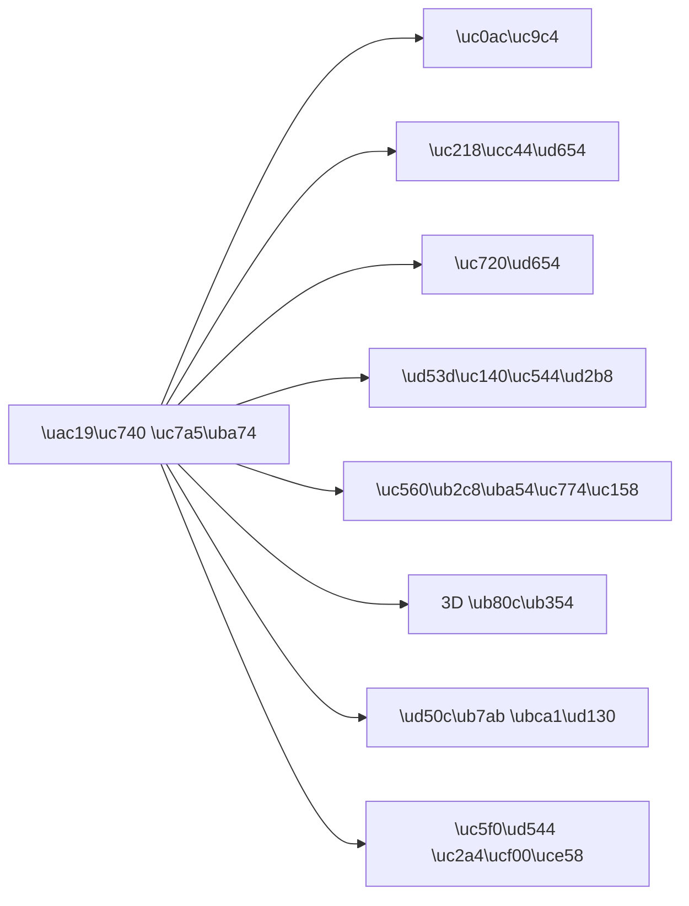

# AI \uc774\ubbf8\uc9c0 \uc0dd\uc131 101 (3/10): \uc2a4\ud0c0\uc77c \ub9c8\uc2a4\ud130\ud558\uae30

\ube14\ub85c\uadf8\uc6a9 \uc774\ubbf8\uc9c0\ub97c \ub9cc\ub4e4\ub824\ub294\ub370 "\uc0ac\uc9c4 \uac19\uc740 \ub290\ub08c"\uc774 \ud544\uc694\ud560 \ub54c\uac00 \uc788\uace0, "\uc77c\ub7ec\uc2a4\ud2b8 \ub290\ub08c"\uc774 \ud544\uc694\ud560 \ub54c\uac00 \uc788\uc2b5\ub2c8\ub2e4. \uac19\uc740 \uc8fc\uc81c\ub77c\ub3c4 \uc2a4\ud0c0\uc77c\uc5d0 \ub530\ub77c \uc644\uc804\ud788 \ub2e4\ub978 \uc778\uc0c1\uc744 \uc8fc\ub294\ub370, \ubb38\uc81c\ub294 "\uc5b4\ub5a4 \uc2a4\ud0c0\uc77c\uc774 \uc788\ub294\uc9c0" \ubaa8\ub974\ub2c8\uae4c \ud56d\uc0c1 \ube44\uc2b7\ud55c \uacb0\uacfc\ub9cc \ub098\uc628\ub2e4\ub294 \uac83\uc785\ub2c8\ub2e4.

\uc624\ub298\uc740 \uac19\uc740 \uc7a5\uba74\uc744 8\uac00\uc9c0 \uc2a4\ud0c0\uc77c\ub85c \uc0dd\uc131\ud574\uc11c \uac01\uac01\uc758 \ucc28\uc774\ub97c \ub208\uc73c\ub85c \ud655\uc778\ud574 \ubcf4\uaca0\uc2b5\ub2c8\ub2e4. \uc774 \ud55c \uae00\ub9cc \uc77d\uc5b4\ub3c4 \uc55e\uc73c\ub85c \uc5b4\ub5a4 \uc2a4\ud0c0\uc77c\uc744 \uc370\uc57c \ud560\uc9c0 \ubc14\ub85c \ud310\ub2e8\ud560 \uc218 \uc788\uac8c \ub429\ub2c8\ub2e4.

\uc774 \uae00\uc740 AI \uc774\ubbf8\uc9c0 \uc0dd\uc131 101 \uc2dc\ub9ac\uc988\uc758 3\ubc88\uc9f8 \uae00\uc785\ub2c8\ub2e4.

---

*\uac19\uc740 \uc7a5\uba74\uc744 8\uac00\uc9c0 \uc2a4\ud0c0\uc77c\ub85c \ubcc0\ud658\ud558\ub294 \uac83\uc774 \uc624\ub298\uc758 \uc2e4\ud5d8*

## \uba3c\uc800 \ub358\uc9c0\ub294 \uc9c8\ubb38

- \uc0ac\uc9c4 \uc2a4\ud0c0\uc77c\uacfc \uc77c\ub7ec\uc2a4\ud2b8 \uc2a4\ud0c0\uc77c\uc740 \uc5b4\ub5a4 \uc7a5\uba74\uc5d0\uc11c \uac01\uac01 \ub354 \uc801\ud569\ud560\uae4c\uc694?
- "\uc218\ucc44\ud654"\uc640 "\uc720\ud654"\ub294 \uac19\uc740 \uadf8\ub9bc \uc2a4\ud0c0\uc77c \uc544\ub2cc\uac00\uc694? \uc2e4\uc81c\ub85c \uc5b4\ub5bb\uac8c \ub2e4\ub97c\uae4c\uc694?
- \ube14\ub85c\uadf8, SNS, \ud504\ub808\uc824\ud14c\uc774\uc158 \uac01\uac01\uc5d0 \uac00\uc7a5 \uc798 \ub9de\ub294 \uc2a4\ud0c0\uc77c\uc740 \ubb34\uc5c7\uc77c\uae4c\uc694?

---

## \uc2e4\ud5d8 \uc124\uacc4: \ud558\ub098\uc758 \uc7a5\uba74, 8\uac00\uc9c0 \uc2a4\ud0c0\uc77c

\ub3d9\uc77c\ud55c \uc7a5\uba74\uc744 8\uac00\uc9c0 \uc2a4\ud0c0\uc77c\ub85c \uc0dd\uc131\ud569\ub2c8\ub2e4. \uacf5\ud1b5 \uc7a5\uba74:

> \ube44 \uc624\ub294 \uc800\ub141, \ub530\ub73b\ud55c \uc870\uba85\uc774 \ucf1c\uc9c4 \uc544\ub2b4\ud55c \ub3c5\ub9bd \uc11c\uc810. \uc816\uc740 \uc790\uac08\uae38\uc5d0 \ubd88\ube5b\uc774 \ubc18\uc0ac\ub428.

\uc2a4\ud0c0\uc77c\ub9cc \ubc14\uafb8\uace0 \ub098\uba38\uc9c0\ub294 \uac19\uac8c \uc720\uc9c0\ud569\ub2c8\ub2e4.

---

## 1. \uc0ac\uc9c4 (Photorealistic)

> ...photorealistic photography style, 35mm film grain

*\uc0ac\uc9c4 \uc2a4\ud0c0\uc77c: \uc2e4\uc81c \uce74\uba54\ub77c\ub85c \ucc0d\uc740 \ub4ef\ud55c \uc9c8\uac10. \uc870\uba85\uc758 \uc790\uc5f0\uc2a4\ub7ec\uc6c0, \ubb3c\uc758 \ubc18\uc0ac, \uc7ac\uc9c8 \ud45c\ud604\uc774 \uc0ac\uc2e4\uc801\uc774\ub2e4.*

**\ud2b9\uc9d5**: \uc2e4\uc81c \uc0ac\uc9c4\ucc98\ub7fc \ubcf4\uc785\ub2c8\ub2e4. \uc7ac\uc9c8\uac10, \ubc18\uc0ac, \ube5b\uc758 \ubc88\uc9d0\uc774 \uc790\uc5f0\uc2a4\ub7fd\uc2b5\ub2c8\ub2e4.

**\uc0ac\uc6a9\ucc98**: \uc81c\ud488 \uc0ac\uc9c4, \uc5ec\ud589 \ube14\ub85c\uadf8, \uc74c\uc2dd \uc0ac\uc9c4, SNS \ud3ec\uc2a4\ud2b8

**\ud0a4\uc6cc\ub4dc**: `photorealistic`, `photography`, `35mm film`, `DSLR`, `Canon EOS`, `shallow depth of field`

---

## 2. \uc218\ucc44\ud654 (Watercolor)

> ...watercolor painting style, soft edges and color bleeding

*\uc218\ucc44\ud654 \uc2a4\ud0c0\uc77c: \uacbd\uacc4\uac00 \ubd80\ub4dc\ub7fd\uace0 \uc0c9\uc774 \ubc88\uc9c0\ub294 \ud2b9\uc720\uc758 \uc9c8\uac10. \ub530\ub73b\ud558\uace0 \ubab0\uc785\uc801\uc774\ub2e4.*

**\ud2b9\uc9d5**: \uacbd\uacc4\uac00 \ubd80\ub4dc\ub7fd\uace0 \uc0c9\uc774 \ubc88\uc9d1\ub2c8\ub2e4. \ub530\ub73b\ud558\uace0 \ubab0\uc785\uc801\uc778 \ub290\ub08c\uc744 \uc90d\ub2c8\ub2e4.

**\uc0ac\uc6a9\ucc98**: \ucd08\ub300\uc7a5, \uc5fd\uc11c, \uc774\ub728 \uac80\uc0c9 \uc378\ub124\uc77c, \uac10\uc131\uc801\uc778 SNS

**\ud0a4\uc6cc\ub4dc**: `watercolor`, `watercolour painting`, `soft washes`, `color bleeding`, `wet-on-wet`

---

## 3. \uc720\ud654 (Oil Painting)

> ...oil painting style, thick impasto brushstrokes, rich saturated colors

*\uc720\ud654 \uc2a4\ud0c0\uc77c: \ub450\uaebc\uc6b4 \ubd93\ud130\uce58\uc640 \uc9c4\ud55c \uc0c9\uac10. \uc218\ucc44\ud654\uc640 \ub2ec\ub9ac \ubb34\uac8c\uac10\uacfc \uc9c8\uac10\uc774 \ub290\uaef4\uc9c4\ub2e4.*

**\ud2b9\uc9d5**: \ub450\uaebc\uc6b4 \ubd93\ud130\uce58\uac00 \ubcf4\uc774\uace0 \uc0c9\uc774 \uc9c4\ud569\ub2c8\ub2e4. \uc218\ucc44\ud654\uc640 \ube44\uad50\ud558\uba74 \ud6e8\uc52c \ubb34\uac9d\uace0 \uc9c8\uac10\uc774 \ub290\uaef4\uc9d1\ub2c8\ub2e4.

**\uc218\ucc44\ud654 vs \uc720\ud654 \ube44\uad50**:

| \ud2b9\uc131 | \uc218\ucc44\ud654 | \uc720\ud654 |
|------|--------|------|
| \uacbd\uacc4 | \ubd80\ub4dc\ub7fd\uace0 \ubc88\uc9d0 | \ub6da\ub837\ud558\uc9c0\ub9cc \uc9c8\uac10\uc774 \uc788\uc74c |
| \uc0c9\uac10 | \ud22c\uba85\ud558\uace0 \ubc1d\uc74c | \uc9c4\ud558\uace0 \ubc00\ub3c4 \uc788\uc74c |
| \ubd84\uc704\uae30 | \uac00\ubccd\uace0 \ubab4\uc5d0\uc801 | \ubb34\uac81\uace0 \uc785\uccb4\uc801 |
| \uc801\ud569\ud55c \uc7a5\uba74 | \uaf43, \ud48d\uacbd, \uacbd\ucf8c\ud55c \uc7a5\uba74 | \uc778\ubb3c, \ub3c4\uc2dc, \ub4dc\ub77c\ub9c8\ud2f1\ud55c \uc7a5\uba74 |

**\ud0a4\uc6cc\ub4dc**: `oil painting`, `impasto`, `thick brushstrokes`, `rich colors`, `gallery painting`

---

## 4. \ud53d\uc140\uc544\ud2b8 (Pixel Art)

> ...pixel art style, 16-bit retro game aesthetic, limited color palette

*\ud53d\uc140\uc544\ud2b8 \uc2a4\ud0c0\uc77c: \ubcf5\uace0 \uac8c\uc784 \ub290\ub08c\uc758 \ub3c4\ud2b8 \uadf8\ub798\ud53d. \ub2e8\uc21c\ud558\uc9c0\ub9cc \ub3c5\ud2b9\ud55c \ub9e4\ub825\uc774 \uc788\ub2e4.*

**\ud2b9\uc9d5**: \ub808\ud2b8\ub85c \uac8c\uc784 \ub290\ub08c. \uc81c\ud55c\ub41c \uc0c9\uc0c1 \ud314\ub808\ud2b8\ub85c \ub2e8\uc21c\ud558\uc9c0\ub9cc \ud2b9\uc720\uc758 \ub9e4\ub825\uc774 \uc788\uc2b5\ub2c8\ub2e4.

**\uc0ac\uc6a9\ucc98**: \uac8c\uc784 \uad00\ub828 \ucf58\ud150\uce20, IT \ube14\ub85c\uadf8, \ud14c\ud06c \ucee4\ubba4\ub2c8\ud2f0, \ub3c5\ud2b9\ud55c \uc378\ub124\uc77c

**\ud0a4\uc6cc\ub4dc**: `pixel art`, `8-bit`, `16-bit`, `retro game`, `sprite`, `limited palette`

---

## 5. \uc560\ub2c8\uba54\uc774\uc158/\ub9cc\ud654 (Anime)

> ...anime illustration style, Studio Ghibli inspired, soft pastel colors

*\uc560\ub2c8\uba54\uc774\uc158 \uc2a4\ud0c0\uc77c: \ubd80\ub4dc\ub7ec\uc6b4 \ud30c\uc2a4\ud154 \ud1a4\uacfc \uc138\ubc00\ud55c \ubc30\uacbd \ubb18\uc0ac. \ub530\ub73b\ud558\uace0 \ud5a5\uc218 \uc5b4\ub9b0 \ubd84\uc704\uae30.*

**\ud2b9\uc9d5**: \ube44\uc140\uc758 \ubc30\uacbd \ubb18\uc0ac\uc640 \ubd80\ub4dc\ub7ec\uc6b4 \uc0c9\uac10. \ub530\ub73b\ud558\uace0 \uad38\ub77c\uc6b4 \ubd84\uc704\uae30\ub97c \ub9cc\ub4ed\ub2c8\ub2e4.

**\uc0ac\uc6a9\ucc98**: \uc720\ud29c\ube0c \uc378\ub124\uc77c, \uc2a4\ud1a0\ub9ac\ud154\ub9c1, \uce90\ub9ad\ud130 \uc911\uc2ec \ucf58\ud150\uce20

**\ud0a4\uc6cc\ub4dc**: `anime style`, `manga illustration`, `Studio Ghibli`, `Makoto Shinkai`, `cel shading`, `pastel colors`

---

## 6. 3D \ub80c\ub354 (3D Render)

> ...3D render style, Pixar-like aesthetic, smooth surfaces, volumetric lighting

*3D \ub80c\ub354 \uc2a4\ud0c0\uc77c: \ub9e4\ub044\ub7ec\uc6b4 \ud45c\uba74\uacfc \ubd80\ub4dc\ub7ec\uc6b4 \uc870\uba85. \ud53d\uc0ac/\ub514\uc988\ub2c8 \uc560\ub2c8\uba54\uc774\uc158 \ub290\ub08c.*

**\ud2b9\uc9d5**: \ub9e4\ub044\ub7ec\uc6b4 \ud45c\uba74, \ubd80\ub4dc\ub7ec\uc6b4 \uc870\uba85, \uadc0\uc5ec\uc6b4 \ub290\ub08c. \ud53d\uc0ac \uc560\ub2c8\uba54\uc774\uc158\uc744 \ub5a0\uc62c\ub9ac\ub294 \ubd84\uc704\uae30\uc785\ub2c8\ub2e4.

**\uc0ac\uc6a9\ucc98**: \uc55e/UI \ubaa9\uc5c5, \uadc0\uc5ec\uc6b4 \ube0c\ub79c\ub529, \uc5b4\ub9b0\uc774 \ucf58\ud150\uce20, \uc81c\ud488 \uc18c\uac1c

**\ud0a4\uc6cc\ub4dc**: `3D render`, `Pixar style`, `Blender`, `Cinema 4D`, `smooth`, `volumetric lighting`, `octane render`

---

## 7. \ud50c\ub7ab \ubca1\ud130 (Flat Vector)

> ...flat vector illustration style, clean geometric shapes, limited flat color palette, no gradients

*\ud50c\ub7ab \ubca1\ud130 \uc2a4\ud0c0\uc77c: \uae68\ub057\ud55c \uae30\ud558\ud559\uc801 \ud615\ud0dc\uc640 \ub2e8\uc21c\ud55c \uc0c9\uc0c1. \ub514\uc9c0\ud138 \ucf58\ud150\uce20\uc5d0 \ucd5c\uc801\ud654.*

**\ud2b9\uc9d5**: \uae68\ub057\ud558\uace0 \ub2e8\uc21c\ud569\ub2c8\ub2e4. \uadf8\ub77c\ub370\uc774\uc158 \uc5c6\uc774 \ud3c9\uba74\uc801\uc778 \uc0c9\uba74\uc73c\ub85c \uad6c\uc131\ub429\ub2c8\ub2e4.

**\uc0ac\uc6a9\ucc98**: \uc6f9\uc0ac\uc774\ud2b8 \uc77c\ub7ec\uc2a4\ud2b8, \uc571 \uc544\uc774\ucf58, \uc778\ud3ec\uadf8\ub798\ud53d, \ud504\ub808\uc824\ud14c\uc774\uc158 \ub3c4\ud574

**\ud0a4\uc6cc\ub4dc**: `flat vector`, `flat design`, `geometric`, `minimal illustration`, `no gradients`, `SVG style`

---

## 8. \uc5f0\ud544 \uc2a4\ucf00\uce58 (Pencil Sketch)

> ...pencil sketch style, detailed line work, cross-hatching for shadows, black and white

*\uc5f0\ud544 \uc2a4\ucf00\uce58 \uc2a4\ud0c0\uc77c: \uc120\uc758 \ub514\ud14c\uc77c\uacfc \ud574\uce6d \uae30\ubc95\uc73c\ub85c \uba85\uc554\uc744 \ud45c\ud604. \uc804\ud1b5\uc801\uc774\uace0 \uc9c0\uc801\uc778 \ub290\ub08c.*

**\ud2b9\uc9d5**: \ud761\ubc31\uc758 \uc120 \ub4dc\ub85c\uc789. \ud574\uce6d(\uad50\ucc28 \ube57\uae08)\uc73c\ub85c \uba85\uc554\uc744 \ud45c\ud604\ud569\ub2c8\ub2e4. \uc804\ud1b5\uc801\uc774\uace0 \uc9c0\uc801\uc778 \ub290\ub08c\uc785\ub2c8\ub2e4.

**\uc0ac\uc6a9\ucc98**: \uac74\ucd95 \uc2dc\uac01\ud654, \ucee8\uc149 \uc544\ud2b8, \uc544\uce74\ub370\ubbf9\ud55c \ucf58\ud150\uce20, \ub178\ud2b8/\uc800\ub110 \uc2a4\ud0c0\uc77c

**\ud0a4\uc6cc\ub4dc**: `pencil sketch`, `pencil drawing`, `line art`, `cross-hatching`, `graphite`, `black and white`

---

## \uc2a4\ud0c0\uc77c \uc120\ud0dd \uac00\uc774\ub4dc

\uc0c1\ud669\ubcc4\ub85c \uc5b4\ub5a4 \uc2a4\ud0c0\uc77c\uc774 \uc801\ud569\ud55c\uc9c0 \uc815\ub9ac\ud588\uc2b5\ub2c8\ub2e4.

| \uc0ac\uc6a9 \ubaa9\uc801 | \ucd94\ucc9c \uc2a4\ud0c0\uc77c | \uc774\uc720 |
|----------|----------|------|
| \uc81c\ud488 \uc18c\uac1c, \uc74c\uc2dd \uc0ac\uc9c4 | \uc0ac\uc9c4 | \uc2e4\uc81c\uac10\uc774 \uc911\uc694 |
| \uac10\uc131 \ube14\ub85c\uadf8, \ucd08\ub300\uc7a5 | \uc218\ucc44\ud654 | \ubd80\ub4dc\ub7fd\uace0 \ub530\ub73b\ud55c \ub290\ub08c |
| \ud3ec\ud2b8\ud3f4\ub9ac\uc624, \uc608\uc220\uc801 | \uc720\ud654 | \ubb34\uac8c\uac10\uacfc \uae4a\uc774\uac10 |
| IT/\uac8c\uc784 \ube14\ub85c\uadf8 | \ud53d\uc140\uc544\ud2b8 | \ub3c5\ud2b9\ud558\uace0 \ub208\uae38 \ub054 |
| \uce90\ub9ad\ud130 \ucf58\ud150\uce20 | \uc560\ub2c8\uba54\uc774\uc158 | \uce5c\uadfc\ud558\uace0 \ud48d\ubd80\ud55c \ud45c\ud604 |
| \uc571/\uc6f9 \ub514\uc790\uc778 | 3D \ub80c\ub354 / \ud50c\ub7ab | \ub9e4\ub044\ub7fd\uace0 \ud604\ub300\uc801 |
| \ud559\uc220/\ucee8\uc149 | \uc5f0\ud544 \uc2a4\ucf00\uce58 | \uc804\ubb38\uc801\uc774\uace0 \uc9c0\uc801 |

---

## \uc2a4\ud0c0\uc77c \uc870\ud569\ud558\uae30

\ud55c \uac00\uc9c0 \uc2a4\ud0c0\uc77c\ub9cc \uc4f0\ub77c\ub294 \ubc95\uc740 \uc5c6\uc2b5\ub2c8\ub2e4. \uc2a4\ud0c0\uc77c\uc744 \uc870\ud569\ud558\uba74 \ub354 \ub3c5\ud2b9\ud55c \uacb0\uacfc\ub97c \uc5bb\uc744 \uc218 \uc788\uc2b5\ub2c8\ub2e4.

\ud6a8\uacfc\uc801\uc778 \uc870\ud569 \uc608\uc2dc:

| \uc870\ud569 | \ud504\ub86c\ud504\ud2b8 \ud0a4\uc6cc\ub4dc | \uacb0\uacfc |
|------|-----------|------|
| \uc0ac\uc9c4 + \uc601\ud654 | `cinematic photography, anamorphic lens` | \uc601\ud654 \ud55c \uc7a5\uba74 \uac19\uc740 \ub4dc\ub77c\ub9c8\ud2f1\ud55c \ub290\ub08c |
| \uc218\ucc44\ud654 + \ub514\uc9c0\ud138 | `digital watercolor, clean edges` | \uc218\ucc44\ud654 \ubd84\uc704\uae30\ub97c \uc720\uc9c0\ud558\uba74\uc11c \ub354 \uc120\uba85 |
| \ud53d\uc140 + \uc560\ub2c8\uba54\uc774\uc158 | `pixel art anime style` | \ubc15\uc2a4\uc5d0 \uac00\ub81c\ube44\uae30\ud55c \ub290\ub08c |
| 3D + \uc774\uc18c\uba54\ud2b8\ub9ad | `3D isometric render` | \uc548\ub0b4\ub3c4/\ub2e4\uc774\uc5b4\uadf8\ub7a8 \ub290\ub08c |

---

## \uc815\ub9ac: \uc2a4\ud0c0\uc77c \uc120\ud0dd\uc758 \ud575\uc2ec

\uc624\ub298 8\uac00\uc9c0 \uc2a4\ud0c0\uc77c\uc744 \ubc14\uc774\uae70\uc758 \ub3d9\uc77c\ud55c \uc7a5\uba74\uc5d0 \uc801\uc6a9\ud574 \ubcf4\uba74\uc11c \ud655\uc778\ud55c \uac83:

- \uc2a4\ud0c0\uc77c\uc740 \uc774\ubbf8\uc9c0\uc758 \uc804\uccb4 \ubd84\uc704\uae30\ub97c \uacb0\uc815\ud558\ub294 \uac00\uc7a5 \uac15\ub825\ud55c \uc694\uc18c\ub2e4
- \uac01 \uc2a4\ud0c0\uc77c\uc5d0\ub294 \uace0\uc720\ud55c \ud2b9\uc9d5\uacfc \uc801\ud569\ud55c \uc0ac\uc6a9\ucc98\uac00 \uc788\ub2e4
- \uc2a4\ud0c0\uc77c\uc744 \uc870\ud569\ud558\uba74 \ub354 \ub3c5\ud2b9\ud55c \uacb0\uacfc\ub97c \uc5bb\uc744 \uc218 \uc788\ub2e4

\ub2e4\uc74c \uae00\uc5d0\uc11c\ub294 \uad6c\ub3c4\uc640 \uc2dc\uc810\u2014\uc774\ubbf8\uc9c0\ub97c \uc5b4\ub5a4 \uac01\ub3c4\uc5d0\uc11c \ubcf4\uc5ec\uc904\uc9c0\ub97c \ub2e4\ub8f9\ub2c8\ub2e4.

---

## \ucc98\uc74c \uc9c8\ubb38\uc73c\ub85c \ub3cc\uc544\uac00\uae30

**\uc0ac\uc9c4\uacfc \uc77c\ub7ec\uc2a4\ud2b8 \uc2a4\ud0c0\uc77c\uc740 \uc5b4\ub5a4 \uc7a5\uba74\uc5d0\uc11c \uac01\uac01 \ub354 \uc801\ud569\ud55c\uac00\uc694?**

\uc0ac\uc9c4\uc740 \uc81c\ud488, \uc74c\uc2dd, \uc5ec\ud589\ucc98\ub7fc "\uc9c4\uc9dc \uac19\uc544 \ubcf4\uc5ec\uc57c \ud558\ub294" \uacbd\uc6b0\uc5d0 \uc801\ud569\ud569\ub2c8\ub2e4. \uc77c\ub7ec\uc2a4\ud2b8\ub294 \ucd94\uc0c1\uc801 \uac1c\ub150, \uac10\uc131\uc801 \ubd84\uc704\uae30, \ub514\uc790\uc778 \uc694\uc18c\uac00 \ud544\uc694\ud560 \ub54c \uc801\ud569\ud569\ub2c8\ub2e4.

**"\uc218\ucc44\ud654"\uc640 "\uc720\ud654"\ub294 \uc5b4\ub5bb\uac8c \ub2e4\ub974\uac00\uc694?**

\uc218\ucc44\ud654\ub294 \uacbd\uacc4\uac00 \ubd80\ub4dc\ub7fd\uace0 \uc0c9\uc774 \ud22c\uba85\ud558\uba70 \uac00\ubcbd\uc2b5\ub2c8\ub2e4. \uc720\ud654\ub294 \ubd93\ud130\uce58\uac00 \ub450\uaed8\uace0 \uc0c9\uc774 \uc9c4\ud558\uba70 \ubb34\uac81\uc2b5\ub2c8\ub2e4. \uac10\uc131\uc801\uc778 \uc7a5\uba74\uc5d0\ub294 \uc218\ucc44\ud654, \ub4dc\ub77c\ub9c8\ud2f1\ud55c \uc7a5\uba74\uc5d0\ub294 \uc720\ud654\uac00 \ub9de\uc2b5\ub2c8\ub2e4.

**\ube14\ub85c\uadf8, SNS, \ud504\ub808\uc824\ud14c\uc774\uc158 \uac01\uac01\uc5d0 \uac00\uc7a5 \uc798 \ub9de\ub294 \uc2a4\ud0c0\uc77c\uc740?**

\ube14\ub85c\uadf8: \uc0ac\uc9c4(\uc81c\ud488/\ub9ac\ubdf0) \ub610\ub294 \ud50c\ub7ab \ubca1\ud130(\uae30\uc220 \uc124\uba85). SNS: \uc560\ub2c8\uba54\uc774\uc158(\uce90\ub9ad\ud130 \uc911\uc2ec) \ub610\ub294 \uc218\ucc44\ud654(\uac10\uc131\uc801). \ud504\ub808\uc824\ud14c\uc774\uc158: \ud50c\ub7ab \ubca1\ud130(\ub2e4\uc774\uc5b4\uadf8\ub7a8) \ub610\ub294 3D \ub80c\ub354(\ubaa9\uc5c5).

---

<!-- toc:begin -->
## \uc774 \uc2dc\ub9ac\uc988\uc5d0\uc11c \ub2e4\ub8e8\ub294 \uae00

- [AI \uc774\ubbf8\uc9c0 \uc0dd\uc131 101 (1/10): \uccab \uc774\ubbf8\uc9c0 \uc0dd\uc131\ud558\uae30](./01-first-image-generation.md)
- [AI \uc774\ubbf8\uc9c0 \uc0dd\uc131 101 (2/10): \uc88b\uc740 \ud504\ub86c\ud504\ud2b8\uc758 \uad6c\uc870](./02-prompt-structure.md)
- **AI \uc774\ubbf8\uc9c0 \uc0dd\uc131 101 (3/10): \uc2a4\ud0c0\uc77c \ub9c8\uc2a4\ud130\ud558\uae30 (\ud604\uc7ac \uae00)**
- AI \uc774\ubbf8\uc9c0 \uc0dd\uc131 101 (4/10): \uad6c\ub3c4\uc640 \uc2dc\uc810 (\uc608\uc815)
- AI \uc774\ubbf8\uc9c0 \uc0dd\uc131 101 (5/10): \uc0c9\uac10\uacfc \uc870\uba85 (\uc608\uc815)
- AI \uc774\ubbf8\uc9c0 \uc0dd\uc131 101 (6/10): \ubcf5\uc7a1\ud55c \uc7a5\uba74 \uc124\uacc4\ud558\uae30 (\uc608\uc815)
- AI \uc774\ubbf8\uc9c0 \uc0dd\uc131 101 (7/10): \uc77c\uad00\uc131 \uc720\uc9c0\ud558\uae30 (\uc608\uc815)
- AI \uc774\ubbf8\uc9c0 \uc0dd\uc131 101 (8/10): \ud14d\uc2a4\ud2b8\uc640 \ud0c0\uc774\ud3ec\uadf8\ub798\ud53c (\uc608\uc815)
- AI \uc774\ubbf8\uc9c0 \uc0dd\uc131 101 (9/10): \ub808\ud37c\ub7f0\uc2a4 \uc774\ubbf8\uc9c0 \ud65c\uc6a9 (\uc608\uc815)
- AI \uc774\ubbf8\uc9c0 \uc0dd\uc131 101 (10/10): \uc2e4\uc804 \uc6cc\ud06c\ud50c\ub85c\uc6b0 (\uc608\uc815)
<!-- toc:end -->

## \ucc38\uace0 \uc790\ub8cc

- [OpenAI \uc774\ubbf8\uc9c0 \uc0dd\uc131 \uac00\uc774\ub4dc](https://platform.openai.com/docs/guides/images)
- [god-tibo-imagen GitHub \uc800\uc7a5\uc18c](https://github.com/NomaDamas/god-tibo-imagen)

Tags: AI, ChatGPT, \uc774\ubbf8\uc9c0 \uc0dd\uc131, \ud504\ub86c\ud504\ud2b8 \uc5d4\uc9c0\ub2c8\uc5b4\ub9c1
