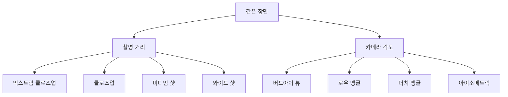

# AI 이미지 생성 101 (4/10): 구도와 시점

유튜브 썸네일은 클로즈업이 좋고, 여행 블로그는 와이드샷이 좋다는 건 알겠는데, 프롬프트에 정확히 어떤 단어를 써야 하는지 모르겠다는 분이 많습니다. "카메라를 어디에 놓을지"를 지정하는 것만으로 같은 장면이 완전히 달라지는데, 문제는 그 키워드를 모르면 매번 AI가 임의로 결정한 구도를 받아들일 수밖에 없다는 점입니다.

오늘은 중세 절벽 성이라는 하나의 장면을 촬영 거리 4단계, 카메라 각도 4종류로 생성해서 각각 어떤 느낌을 주는지 직접 비교합니다.

이 글은 AI 이미지 생성 101 시리즈의 4번째 글입니다.

---

*구도를 결정하는 두 축: 촬영 거리와 카메라 각도*

## 먼저 던지는 질문

- 클로즈업과 와이드 샷은 같은 장면에 어떤 다른 감정을 만드는가?
- 카메라 각도(위에서/아래에서/비스듬히)는 분위기를 어떻게 바꾸는가?
- 용도별(썸네일, 배경, 다이어그램)로 어떤 구도가 최적인가?

---

## 실험 설계

공통 장면:

> 극적인 해안 절벽 위의 중세 석조 성, 아래로 부서지는 파도, 흐린 하늘

이 장면에 **촬영 거리**와 **카메라 각도**를 바꿔 총 8장을 생성합니다.

---

## Part 1: 촬영 거리 — 카메라를 얼마나 가까이 놓을 것인가

### 1. 익스트림 클로즈업 (Extreme Close-up)

> ...extreme close-up of weathered stone wall texture with moss and cracks

*익스트림 클로즈업: 이끼 낀 돌벽의 질감이 화면 전체를 채운다. 성인지 바위인지 맥락은 사라지고 오직 재질만 남는다.*

**효과**: 디테일과 질감에 집중합니다. 주변 맥락을 완전히 제거해서 텍스처 자체가 주인공이 됩니다.

**사용처**: 제품 디테일 샷, 텍스처 클로즈업, 감각적인 SNS 콘텐츠

**키워드**: `extreme close-up`, `macro shot`, `texture detail`, `filling the frame`

---

### 2. 클로즈업 (Close-up)

> ...close-up shot focusing on the castle entrance gate with iron portcullis

*클로즈업: 성문과 철격자에 초점. 주인공(문)이 명확하면서도 약간의 맥락(돌벽, 하늘)이 남아 있다.*

**효과**: 한 가지 요소에 시선을 고정시키면서도 최소한의 맥락을 유지합니다. "이게 뭐다"가 바로 읽힙니다.

**사용처**: 유튜브 썸네일, 인물 초상, 제품 메인 샷

**키워드**: `close-up`, `portrait shot`, `head shot`, `detail shot`

---

### 3. 미디엄 샷 (Medium Shot)

> ...medium shot showing the full castle tower and surrounding walls

*미디엄 샷: 성의 주 탑과 성벽이 보인다. 건물 전체 형태를 파악할 수 있으면서도 디테일이 살아 있다.*

**효과**: 주인공의 전체 모습을 보여주면서 배경과의 관계도 드러냅니다. 가장 "중립적인" 거리입니다.

**사용처**: 블로그 본문 이미지, 설명용 일러스트, 일반적인 장면 묘사

**키워드**: `medium shot`, `mid shot`, `waist shot`, `full body shot`

---

### 4. 와이드 샷 (Wide Shot)

> ...wide shot showing the entire castle complex with the cliff and ocean below

*와이드 샷: 성, 절벽, 바다가 모두 보인다. 주인공보다 환경과 분위기가 주도한다.*

**효과**: 환경 전체를 보여줍니다. 주인공이 환경 속에 "놓여 있는" 느낌을 줘서 서사와 분위기가 강조됩니다.

**사용처**: 여행 블로그 히어로 이미지, 배경화면, 랜딩페이지 배너, 환경 소개

**키워드**: `wide shot`, `establishing shot`, `landscape`, `full scene`, `panoramic`

---

### 촬영 거리 비교 정리

| 거리 | 보이는 것 | 느낌 | 최적 용도 |
|------|----------|------|----------|
| 익스트림 클로즈업 | 질감/디테일만 | 감각적, 추상적 | 텍스처 강조, SNS |
| 클로즈업 | 주인공 하나 | 집중, 임팩트 | 썸네일, 초상 |
| 미디엄 샷 | 주인공 + 약간의 배경 | 중립, 설명적 | 본문 이미지, 일반 묘사 |
| 와이드 샷 | 전체 환경 | 서사적, 분위기 | 배너, 배경화면, 여행 |

---

## Part 2: 카메라 각도 — 어디에서 바라볼 것인가

### 5. 버드아이 뷰 (Bird's Eye View)

> ...bird's eye view directly from above looking down, aerial photography

*버드아이 뷰: 하늘에서 내려다본 성과 절벽. 지도를 보는 듯한 전체 구조가 한눈에 파악된다.*

**효과**: 위에서 내려다보면 구조와 배치가 한눈에 보입니다. 지도적 시각을 제공해서 "전체 그림"을 파악하게 합니다.

**사용처**: 지도/평면도 느낌, 건축 조감도, 인포그래픽, 구조 설명

**키워드**: `bird's eye view`, `top-down view`, `aerial photography`, `overhead shot`, `drone shot`

---

### 6. 로우 앵글 (Worm's Eye / Low Angle)

> ...worm's eye view from the base of the cliff looking up at the castle towering above, dramatic low angle

*로우 앵글: 절벽 아래에서 올려다본 성. 위압적이고 거대하게 느껴진다.*

**효과**: 아래에서 올려다보면 피사체가 거대하고 위압적으로 보입니다. 권위, 위엄, 공포를 표현하기 좋습니다.

**사용처**: 건물/기념물 강조, 영웅적 느낌, 드라마틱한 포스터, 위압감 표현

**키워드**: `worm's eye view`, `low angle`, `looking up`, `dramatic perspective`, `towering`

---

### 7. 더치 앵글 (Dutch Angle)

> ...Dutch angle tilted 30 degrees creating tension and unease, dramatic atmosphere

*더치 앵글: 30도 기울어진 화면. 불안정하고 긴장감 있는 분위기가 만들어진다.*

**효과**: 화면을 의도적으로 기울이면 불안정감과 긴장감이 생깁니다. 영화에서 공포/스릴러 장면에 자주 쓰는 기법입니다.

**사용처**: 공포/스릴러 분위기, 역동적인 액션, 불안정한 상황 표현, 창의적 구도

**키워드**: `Dutch angle`, `tilted camera`, `canted angle`, `diagonal composition`

---

### 8. 아이소메트릭 (Isometric)

> ...isometric perspective as if viewing a 3D model, clean architectural visualization style

*아이소메트릭: 3D 모델을 보는 듯한 균일한 시점. 깔끔하고 정돈된 느낌.*

**효과**: 원근법 없이 동일한 비율로 표현되어 도면이나 게임 그래픽 같은 느낌을 줍니다. 정보 전달에 최적화된 시점입니다.

**사용처**: 건축 시각화, 게임 맵 디자인, 인포그래픽, 기술 다이어그램, 프레젠테이션

**키워드**: `isometric`, `isometric view`, `axonometric`, `no perspective distortion`, `architectural visualization`

---

### 카메라 각도 비교 정리

| 각도 | 시선 방향 | 느낌 | 최적 용도 |
|------|----------|------|----------|
| 버드아이 | 위에서 아래로 | 객관적, 전체 파악 | 지도, 구조 설명 |
| 로우 앵글 | 아래에서 위로 | 위압적, 거대함 | 건물 강조, 영웅적 |
| 더치 앵글 | 비스듬히 기울임 | 불안, 긴장, 역동 | 공포, 액션, 창의적 |
| 아이소메트릭 | 45도 대각선 위 | 정돈, 균일, 기술적 | 다이어그램, 게임 |

---

## 구도 조합하기

거리와 각도를 동시에 지정하면 더 정밀한 결과를 얻습니다.

| 조합 | 프롬프트 예시 | 결과 |
|------|-------------|------|
| 클로즈업 + 로우 앵글 | `close-up, low angle looking up` | 인물을 영웅처럼 보이게 |
| 와이드 + 버드아이 | `wide shot, aerial bird's eye view` | 전체 지형을 한눈에 |
| 미디엄 + 더치 앵글 | `medium shot, Dutch angle tilt` | 긴장감 있는 인물 장면 |
| 와이드 + 아이소메트릭 | `wide isometric view` | 깔끔한 구조 시각화 |

---

## 정리: 구도가 바꾸는 것

같은 성을 8가지 구도로 찍어보면서 확인한 것:

- 촬영 거리는 "무엇에 집중할지"를 결정한다 — 디테일 vs 전체 분위기
- 카메라 각도는 "어떤 감정을 줄지"를 결정한다 — 위압 vs 안정 vs 긴장
- 거리와 각도를 조합하면 의도한 느낌을 정밀하게 만들 수 있다

다음 글에서는 색감과 조명—같은 장면의 시간대와 조명을 바꿔 분위기를 완전히 전환하는 방법을 다룹니다.

---

## 처음 질문으로 돌아가기

**클로즈업과 와이드 샷은 같은 장면에 어떤 다른 감정을 만드는가?**

클로즈업은 하나의 요소에 시선을 고정시켜 집중과 임팩트를 줍니다. 와이드 샷은 전체 환경을 보여줘서 서사와 분위기를 만듭니다. 동일한 성이지만 클로즈업에서는 "돌의 질감"이, 와이드 샷에서는 "절벽 위 외로운 성"이 이야기의 주인공이 됩니다.

**카메라 각도는 분위기를 어떻게 바꾸는가?**

로우 앵글은 위압감과 거대함을, 버드아이는 객관성과 전체 파악을, 더치 앵글은 불안과 긴장을, 아이소메트릭은 정돈과 명확함을 만듭니다. 각도 하나로 같은 장면이 공포 영화가 되기도 하고 건축 도면이 되기도 합니다.

**용도별로 어떤 구도가 최적인가?**

썸네일: 클로즈업(임팩트). 배경화면/배너: 와이드 샷(분위기). 설명 다이어그램: 아이소메트릭(명확). 드라마틱 포스터: 로우 앵글(위엄). 정답은 "뭘 보여줄지"가 아니라 "어떤 감정을 줄지"에서 결정됩니다.

---

<!-- toc:begin -->
## 이 시리즈에서 다루는 글

- [AI 이미지 생성 101 (1/10): 첫 이미지 생성하기](./01-first-image-generation.md)
- [AI 이미지 생성 101 (2/10): 좋은 프롬프트의 구조](./02-prompt-structure.md)
- [AI 이미지 생성 101 (3/10): 스타일 마스터하기](./03-mastering-styles.md)
- **AI 이미지 생성 101 (4/10): 구도와 시점 (현재 글)**
- AI 이미지 생성 101 (5/10): 색감과 조명 (예정)
- AI 이미지 생성 101 (6/10): 복잡한 장면 설계하기 (예정)
- AI 이미지 생성 101 (7/10): 일관성 유지하기 (예정)
- AI 이미지 생성 101 (8/10): 텍스트와 타이포그래피 (예정)
- AI 이미지 생성 101 (9/10): 레퍼런스 이미지 활용 (예정)
- AI 이미지 생성 101 (10/10): 실전 워크플로우 (예정)
<!-- toc:end -->

## 참고 자료

- [OpenAI 이미지 생성 가이드](https://platform.openai.com/docs/guides/images)
- [god-tibo-imagen GitHub 저장소](https://github.com/NomaDamas/god-tibo-imagen)
- [Photography Composition Techniques (Digital Photography School)](https://digital-photography-school.com/composition/)

Tags: AI, ChatGPT, 이미지 생성, 프롬프트 엔지니어링
