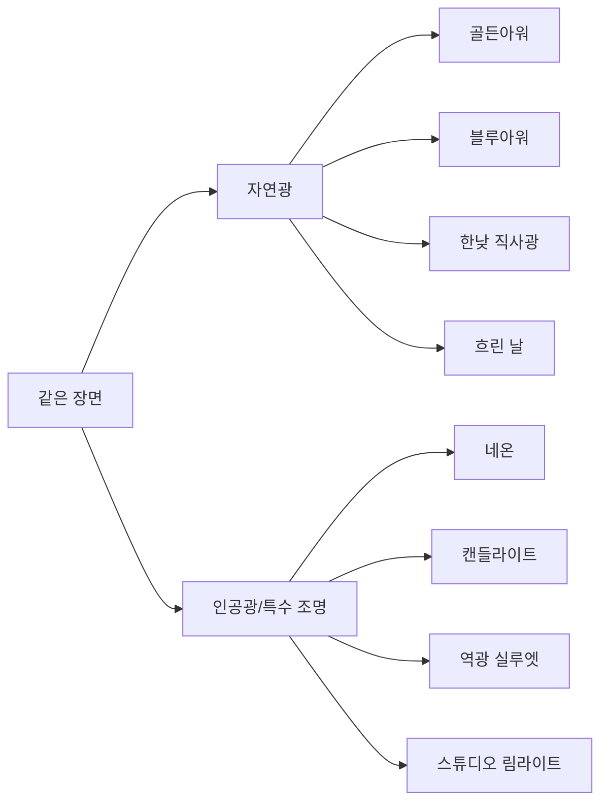

# AI 이미지 생성 101 (5/10): 색감과 조명

같은 카페 사진인데 어떤 건 따뜻하고 감성적이고, 어떤 건 차갑고 세련됩니다. 차이를 만드는 건 장소도 구도도 아닌 **조명**입니다. 인스타그램에서 "분위기 좋다"고 느끼는 사진 대부분은 조명 키워드 하나가 결정합니다.

오늘은 유럽 카페에서 책 읽는 사람이라는 하나의 장면을 8가지 조명으로 생성합니다. 자연광 4종, 인공광 4종으로 나눠서 각각 어떤 분위기를 만드는지 직접 비교합니다.

이 글은 AI 이미지 생성 101 시리즈의 5번째 글입니다.

---

*조명의 두 갈래: 자연광과 인공광*

## 먼저 던지는 질문

- 골든아워와 블루아워는 같은 장면을 어떻게 다르게 만드는가?
- 네온과 캔들라이트는 둘 다 인공광인데 분위기 차이가 얼마나 나는가?
- 역광 실루엣은 언제 쓰면 효과적인가?

---

## 실험 설계

공통 장면:

> 유럽 도시의 자갈길, 작은 야외 카페 테이블에 혼자 앉아 책을 읽는 사람

이 장면에 조명 키워드만 바꿔 8장을 생성합니다.

---

## Part 1: 자연광 — 시간대가 만드는 색감

### 1. 골든아워 (Golden Hour)

> ...golden hour warm sunset light casting long orange shadows

*골든아워: 길게 늘어진 오렌지색 그림자, 따뜻한 톤이 장면 전체를 감싼다. 감성적이고 노스탤직한 분위기.*

**효과**: 일몰 직전의 따뜻한 주황빛이 모든 것을 부드럽게 감쌉니다. 그림자가 길고 색 대비가 풍부합니다.

**사용처**: 감성 블로그, 여행 포스트, 라이프스타일 SNS, 로맨틱한 분위기

**키워드**: `golden hour`, `warm sunset light`, `magic hour`, `long shadows`, `warm orange tones`

---

### 2. 블루아워 (Blue Hour)

> ...blue hour twilight, cool blue ambient light mixed with warm cafe interior glow

*블루아워: 차가운 파란 하늘과 따뜻한 카페 실내 조명이 대비. 세련되고 영화적인 분위기.*

**효과**: 일몰 직후의 차가운 파란빛과 실내의 따뜻한 빛이 대비됩니다. 영화 포스터에서 자주 보는 "시네마틱" 느낌입니다.

**사용처**: 영화적 분위기, 세련된 브랜드 이미지, 도시 야경 콘텐츠

**키워드**: `blue hour`, `twilight`, `cool blue ambient`, `warm interior glow`, `cinematic lighting`

**골든아워 vs 블루아워**:

| 특성 | 골든아워 | 블루아워 |
|------|---------|---------|
| 색온도 | 따뜻한 주황 | 차가운 파랑 |
| 그림자 | 길고 부드러움 | 짧고 확산됨 |
| 분위기 | 감성적, 노스탤직 | 세련됨, 시네마틱 |
| 시간대 | 일몰 30분 전 | 일몰 20분 후 |

---

### 3. 한낮 직사광 (Harsh Noon)

> ...harsh midday sun directly overhead, strong contrast, sharp defined shadows

*한낮 직사광: 머리 위에서 내리쬐는 강렬한 빛. 대비가 강하고 그림자가 짧고 선명하다.*

**효과**: 태양이 머리 바로 위에 있어서 그림자가 짧고 강합니다. 대비가 극도로 높아져 거칠고 날카로운 느낌을 줍니다.

**사용처**: 강렬한 분위기, 여름 느낌, 거친 다큐멘터리 스타일, 하이 콘트라스트 효과

**키워드**: `harsh midday sun`, `high noon`, `strong contrast`, `sharp shadows`, `direct overhead light`

---

### 4. 흐린 날 (Overcast)

> ...overcast cloudy day, soft diffused even lighting with no harsh shadows

*흐린 날: 구름이 빛을 고르게 분산시켜 그림자가 거의 없다. 차분하고 편안한 톤.*

**효과**: 구름이 거대한 소프트박스 역할을 합니다. 그림자가 거의 없어서 부드럽고 균일한 조명이 됩니다.

**사용처**: 제품 사진(그림자 없는 깨끗한 조명), 편안한 블로그, 패션 포토, 차분한 톤

**키워드**: `overcast`, `soft diffused light`, `cloudy day`, `even lighting`, `no harsh shadows`

---

## Part 2: 인공광 — 빛의 색과 방향이 만드는 극적 변화

### 5. 네온 (Neon Lighting)

> ...nighttime cyberpunk neon lighting, pink and blue neon signs reflecting on wet streets

*네온: 핑크와 블루 네온이 젖은 거리에 반사. 일상적인 카페가 사이버펑크 세계로 변한다.*

**효과**: 채도 높은 인공 색광이 장면 전체를 지배합니다. 일상적인 장면이 SF 느낌으로 완전히 전환됩니다.

**사용처**: 사이버펑크/SF 콘텐츠, 음악 앨범 커버, 나이트라이프, 테크 브랜딩

**키워드**: `neon lighting`, `cyberpunk`, `neon signs`, `pink and blue neon`, `wet street reflections`

---

### 6. 캔들라이트 (Candlelight)

> ...candlelight only, warm flickering orange glow, dark surroundings, intimate atmosphere

*캔들라이트: 촛불의 따뜻한 깜박임만으로 비춰진 장면. 어둠 속에서 친밀한 공간이 만들어진다.*

**효과**: 조명 범위가 극도로 좁아서 인물 주변만 밝습니다. 친밀하고 프라이빗한 분위기가 됩니다.

**사용처**: 로맨틱한 장면, 친밀한 인터뷰 느낌, 감성 콘텐츠, 저녁 식사 분위기

**키워드**: `candlelight`, `warm flickering glow`, `single candle`, `intimate lighting`, `dark surroundings`

**네온 vs 캔들라이트** — 둘 다 인공광이지만 정반대의 분위기:

| 특성 | 네온 | 캔들라이트 |
|------|-----|-----------|
| 색상 | 채도 높은 핑크/블루 | 따뜻한 오렌지 |
| 범위 | 넓게 반사 | 좁고 집중적 |
| 분위기 | 미래적, 자극적 | 고전적, 친밀한 |
| 용도 | SF, 테크, 나이트 | 로맨스, 감성, 저녁 |

---

### 7. 역광 실루엣 (Backlit Silhouette)

> ...strong backlight silhouette, sun directly behind the person creating rim light and lens flare

*역광: 태양이 인물 뒤에서 비춰 윤곽만 남긴다. 드라마틱하고 신비로운 분위기.*

**효과**: 빛이 인물 뒤에서 비춰서 윤곽선만 빛나고 앞면은 어둡습니다. 신비롭고 드라마틱한 분위기를 만듭니다.

**사용처**: 포스터, 영감을 주는 콘텐츠, 신비로운 분위기, 예술적 인물 사진

**키워드**: `backlit`, `silhouette`, `rim light`, `lens flare`, `contre-jour`, `sun behind subject`

---

### 8. 스튜디오 림라이트 (Studio Rim Light)

> ...dramatic studio lighting with rim light and dark background, cinematic high contrast

*스튜디오 림라이트: 어두운 배경에 인물 윤곽만 빛나는 스튜디오 조명. 영화 포스터급 드라마.*

**효과**: 배경을 어둡게 밀어내고 인물 윤곽에만 빛을 집중시킵니다. 영화 포스터나 프로필 사진에서 보는 전문적인 느낌입니다.

**사용처**: 프로필 사진, 영화 포스터, 프리미엄 브랜딩, 전문적 인물 촬영

**키워드**: `studio lighting`, `rim light`, `dark background`, `cinematic lighting`, `high contrast`, `edge light`

---

## 조명 선택 가이드

| 분위기 | 추천 조명 | 키워드 |
|--------|----------|--------|
| 따뜻하고 감성적 | 골든아워 | `golden hour, warm light` |
| 세련되고 영화적 | 블루아워 | `blue hour, cinematic` |
| 강렬하고 거친 | 한낮 직사광 | `harsh noon, high contrast` |
| 부드럽고 균일한 | 흐린 날 | `overcast, soft diffused` |
| 미래적/SF | 네온 | `neon, cyberpunk` |
| 친밀하고 따뜻한 | 캔들라이트 | `candlelight, intimate` |
| 신비롭고 드라마틱 | 역광 | `backlit, silhouette` |
| 전문적/프리미엄 | 스튜디오 림 | `studio rim light` |

---

## 정리: 조명이 바꾸는 것

같은 카페 장면을 8가지 조명으로 비교하면서 확인한 것:

- 조명은 색온도(따뜻/차가움)와 대비(강/약)로 분위기를 결정한다
- 자연광은 시간대를 지정하면 되고, 인공광은 광원의 색과 위치를 지정하면 된다
- 조명 키워드 하나가 같은 장면을 감성 블로그에서 사이버펑크 포스터로 바꿀 수 있다

다음 글에서는 복잡한 장면 설계하기—여러 인물과 요소를 한 화면에 배치하는 방법을 다룹니다.

---

## 처음 질문으로 돌아가기

**골든아워와 블루아워는 같은 장면을 어떻게 다르게 만드는가?**

골든아워는 따뜻한 주황빛으로 감성적이고 향수 어린 분위기를, 블루아워는 차가운 파란빛으로 세련되고 시네마틱한 분위기를 만듭니다. 같은 카페인데 골든아워에서는 "편안한 오후"가, 블루아워에서는 "영화 속 한 장면"이 됩니다.

**네온과 캔들라이트는 분위기 차이가 얼마나 나는가?**

네온은 채도 높은 색광으로 미래적이고 자극적입니다. 캔들라이트는 좁은 범위의 따뜻한 빛으로 고전적이고 친밀합니다. 같은 인공광이지만 네온은 거리를, 캔들라이트는 방 한 칸을 만듭니다.

**역광 실루엣은 언제 쓰면 효과적인가?**

인물의 정체를 감추거나 신비로운 분위기를 줄 때 효과적입니다. 얼굴 디테일보다 윤곽선과 분위기가 중요한 포스터, 영감을 주는 콘텐츠, 예술적 프로필에 적합합니다.

---

<!-- toc:begin -->
## 이 시리즈에서 다루는 글

- [AI 이미지 생성 101 (1/10): 첫 이미지 생성하기](./01-first-image-generation.md)
- [AI 이미지 생성 101 (2/10): 좋은 프롬프트의 구조](./02-prompt-structure.md)
- [AI 이미지 생성 101 (3/10): 스타일 마스터하기](./03-mastering-styles.md)
- [AI 이미지 생성 101 (4/10): 구도와 시점](./04-composition-and-perspective.md)
- **AI 이미지 생성 101 (5/10): 색감과 조명 (현재 글)**
- AI 이미지 생성 101 (6/10): 복잡한 장면 설계하기 (예정)
- AI 이미지 생성 101 (7/10): 일관성 유지하기 (예정)
- AI 이미지 생성 101 (8/10): 텍스트와 타이포그래피 (예정)
- AI 이미지 생성 101 (9/10): 레퍼런스 이미지 활용 (예정)
- AI 이미지 생성 101 (10/10): 실전 워크플로우 (예정)
<!-- toc:end -->

## 참고 자료

- [OpenAI 이미지 생성 가이드](https://platform.openai.com/docs/guides/images)
- [god-tibo-imagen GitHub 저장소](https://github.com/NomaDamas/god-tibo-imagen)

Tags: AI, ChatGPT, 이미지 생성, 프롬프트 엔지니어링
