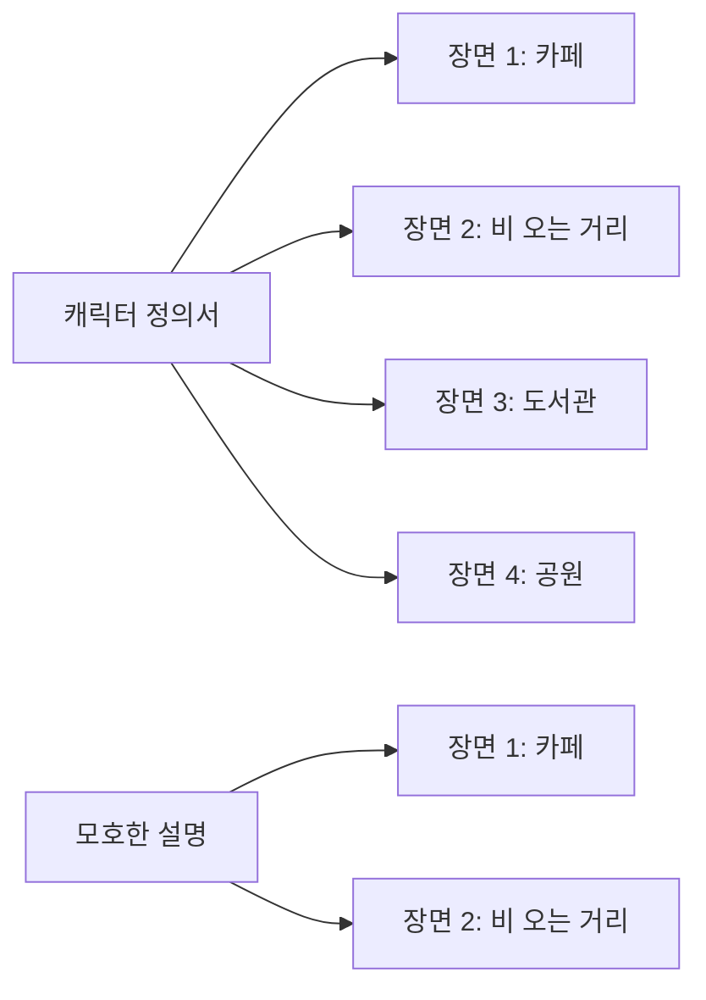

# AI 이미지 생성 101 (7/10): 일관성 유지하기

블로그 시리즈에 같은 캐릭터가 반복 등장해야 하는데, 매번 다른 사람이 나옵니다. 머리색이 바뀌고, 옷이 달라지고, 심지어 성별이 바뀌기도 합니다. AI 이미지 생성의 가장 까다로운 도전 중 하나가 바로 **일관성**입니다.

오늘은 상세한 캐릭터 설명을 만들고, 같은 캐릭터를 4개의 다른 장면에서 생성합니다. 그리고 모호한 설명으로 같은 시도를 해서 얼마나 차이가 나는지도 비교합니다.

이 글은 AI 이미지 생성 101 시리즈의 7번째 글입니다.

---



*같은 캐릭터 정의서 → 다른 장면 vs 모호한 설명 → 다른 장면*

## 먼저 던지는 질문

- 캐릭터 설명에 어떤 요소를 포함해야 일관성이 유지되는가?
- 모호한 설명과 상세한 설명은 결과에서 얼마나 차이가 나는가?
- 스타일을 바꿔도 같은 캐릭터로 인식되게 하려면 어떻게 해야 하는가?

---

## 캐릭터 정의서 만들기

일관성의 핵심은 **캐릭터 정의서**(Character Sheet)입니다. 매번 프롬프트에 복사-붙여넣기할 고정 설명을 먼저 만듭니다.

우리의 캐릭터:

```
a young woman with short black bob haircut, round glasses, 
wearing a yellow raincoat over a striped navy and white shirt, 
carrying a brown leather satchel
```

이 설명에는 5가지 핵심 요소가 들어 있습니다:

| 요소 | 구체적 설명 | 왜 필요한가 |
|------|-----------|-----------|
| 헤어스타일 | short black bob haircut | 가장 강력한 식별 요소 |
| 얼굴 특징 | round glasses | 얼굴 인식의 앵커 |
| 상의 | yellow raincoat | 색상으로 즉시 식별 |
| 내의 | striped navy and white shirt | 레이어드 디테일 |
| 소품 | brown leather satchel | 추가 식별 요소 |

---

## 실험 1: 상세한 정의서로 4개 장면 생성

### 장면 1: 카페


*카페에서 책을 읽는 캐릭터. 단발 검은 머리, 둥근 안경, 노란 레인코트가 일관되게 유지된다.*

### 장면 2: 비 오는 거리


*비 오는 거리를 걷는 캐릭터. 환경이 완전히 바뀌었지만 핵심 특징이 유지된다.*

### 장면 3: 도서관


*도서관에서 책을 고르는 캐릭터. 실내 조명이 달라져도 의상과 헤어스타일은 유지된다.*

### 장면 4: 공원


*가을 공원에서 비둘기에게 먹이를 주는 캐릭터. 골든아워 조명에서도 캐릭터 식별이 가능하다.*

**결과 분석**: 4개 장면 모두에서 단발 검은 머리, 둥근 안경, 노란 레인코트라는 핵심 3요소가 유지됩니다. 완벽히 동일한 얼굴은 아니지만, "같은 캐릭터"로 인식할 수 있는 수준입니다.

---

## 실험 2: 모호한 설명과의 비교

같은 장면을 **구체적 특징 없이** 생성하면 어떻게 될까요?

### 모호한 카페: "a young woman at a coffee shop"


*모호한 설명: "젊은 여성"만으로는 AI가 완전히 다른 인물을 생성한다.*

### 모호한 비: "a girl walking in the rain with an umbrella"


*모호한 설명: 머리색, 의상, 체형까지 모두 달라서 같은 캐릭터로 인식할 수 없다.*

**상세 vs 모호 비교**:

| 항목 | 상세 정의서 사용 | 모호한 설명 |
|------|----------------|-----------|
| 헤어스타일 | 4장 모두 단발 검은 머리 | 매번 다름 |
| 안경 | 4장 모두 둥근 안경 | 있기도 없기도 |
| 의상 | 노란 레인코트 유지 | 매번 다른 옷 |
| 전체 인식 | "같은 사람" 인식 가능 | "다른 사람" |

---

## 실험 3: 스타일을 바꿔도 일관성 유지

같은 캐릭터 정의서를 사용하되 스타일만 바꾸면 어떻게 될까요?

### 수채화 스타일


*수채화 스타일: 렌더링 방식은 달라졌지만 단발, 안경, 노란 코트라는 핵심 식별자는 유지된다.*

### 애니메이션 스타일


*애니메이션 스타일: 완전히 다른 렌더링인데도 노란 레인코트 + 단발 + 안경 = 같은 캐릭터.*

**핵심 발견**: 스타일이 바뀌면 얼굴 디테일은 크게 달라지지만, **색상 기반 식별자**(노란 코트)와 **형태 기반 식별자**(단발, 둥근 안경)는 스타일을 넘어 유지됩니다.

---

## 캐릭터 정의서 작성 공식

```
[성별/나이대] + [헤어스타일 + 색상] + [얼굴 특징] + 
[상의 색상 + 형태] + [하의] + [소품/액세서리]
```

**각 요소의 일관성 강도**:

| 요소 | 일관성 강도 | 설명 |
|------|-----------|------|
| 의상 색상 | 매우 높음 | "노란 코트"는 거의 항상 유지 |
| 헤어스타일 형태 | 높음 | "단발"은 대부분 유지 |
| 안경/모자 등 | 높음 | 형태가 명확한 액세서리 |
| 체형/키 | 중간 | 전신 샷에서만 유효 |
| 얼굴 세부 | 낮음 | AI가 가장 자주 변경 |

**실용적 조언**:
- 얼굴 일관성에 집착하지 않는다 — 현재 AI의 한계
- 색상 + 형태 기반 식별자에 집중한다
- 정의서를 텍스트 파일로 저장해두고 매번 복사-붙여넣기한다
- 3개 이상의 식별자를 조합하면 충분히 "같은 캐릭터"로 읽힌다

---

## 세계관 일관성

캐릭터뿐 아니라 배경/세계관도 일관성을 유지해야 하는 경우가 있습니다.

**세계관 정의서 예시**:

```
Setting: 1920s Art Deco city, brass and copper tones, 
geometric architecture, steam-powered vehicles, 
gas lamps with warm amber glow, cobblestone streets
```

이 정의서를 캐릭터 정의서와 결합하면:

```
[캐릭터 정의서] + [세계관 정의서] + [이번 장면의 상황]
```

프롬프트가 길어지지만, 일관된 시리즈를 만들 때는 이 길이가 정당합니다.

---

## 일관성 체크리스트

시리즈 이미지를 만들 때 사용하는 체크리스트:

1. 캐릭터 정의서를 먼저 작성했는가?
2. 색상 기반 식별자가 2개 이상 포함되었는가?
3. 형태 기반 식별자가 1개 이상 포함되었는가?
4. 정의서를 모든 프롬프트에 동일하게 사용했는가?
5. 세계관/배경 설정이 필요한 경우 별도 정의서를 만들었는가?

---

## 정리

같은 캐릭터를 여러 장면에서 생성하면서 확인한 것:

- 상세한 캐릭터 정의서가 일관성의 핵심이다
- 색상과 형태 기반 식별자가 가장 안정적으로 유지된다
- 얼굴 디테일은 현재 AI의 한계 — 집착보다는 식별 가능 수준을 목표로 한다
- 스타일이 바뀌어도 핵심 식별자는 유지된다

다음 글에서는 텍스트와 타이포그래피—이미지 안에 글씨를 넣는 기법을 다룹니다.

---

## 처음 질문으로 돌아가기

**캐릭터 설명에 어떤 요소를 포함해야 일관성이 유지되는가?**

의상 색상(노란 코트), 헤어스타일 형태(단발), 액세서리(둥근 안경)처럼 색상과 형태가 명확한 요소가 가장 안정적입니다. 얼굴 세부사항보다 "한눈에 보이는 특징"에 집중하는 것이 현실적입니다.

**모호한 설명과 상세한 설명은 결과에서 얼마나 차이가 나는가?**

"젊은 여성"만으로는 매번 완전히 다른 인물이 나옵니다. 5가지 구체적 특징을 포함하면 4개 장면에서 "같은 캐릭터"로 인식할 수 있는 수준이 됩니다.

**스타일을 바꿔도 같은 캐릭터로 인식되게 하려면?**

색상 기반 식별자(노란 코트)와 형태 기반 식별자(단발, 둥근 안경)는 사진→수채화→애니메이션으로 바뀌어도 유지됩니다. 3개 이상의 강한 식별자를 조합하면 스타일을 넘어 "같은 캐릭터"로 읽힙니다.

---

<!-- toc:begin -->
## 이 시리즈에서 다루는 글

- [AI 이미지 생성 101 (1/10): 첫 이미지 생성하기](./01-first-image-generation.md)
- [AI 이미지 생성 101 (2/10): 좋은 프롬프트의 구조](./02-prompt-structure.md)
- [AI 이미지 생성 101 (3/10): 스타일 마스터하기](./03-mastering-styles.md)
- [AI 이미지 생성 101 (4/10): 구도와 시점](./04-composition-and-perspective.md)
- [AI 이미지 생성 101 (5/10): 색감과 조명](./05-color-and-lighting.md)
- [AI 이미지 생성 101 (6/10): 복잡한 장면 설계하기](./06-complex-scene-design.md)
- **AI 이미지 생성 101 (7/10): 일관성 유지하기 (현재 글)**
- AI 이미지 생성 101 (8/10): 텍스트와 타이포그래피 (예정)
- AI 이미지 생성 101 (9/10): 레퍼런스 이미지 활용 (예정)
- AI 이미지 생성 101 (10/10): 실전 워크플로우 (예정)
<!-- toc:end -->

## 참고 자료

- [OpenAI 이미지 생성 가이드](https://platform.openai.com/docs/guides/images)
- [god-tibo-imagen GitHub 저장소](https://github.com/NomaDamas/god-tibo-imagen)

Tags: AI, ChatGPT, 이미지 생성, 프롬프트 엔지니어링
