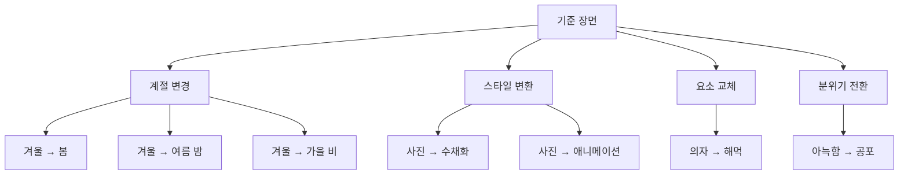

# AI 이미지 생성 101 (9/10): 레퍼런스 이미지 활용

마음에 드는 이미지를 하나 만들었는데, "이 느낌 그대로 계절만 바꾸고 싶다" 또는 "같은 장소를 다른 스타일로 보고 싶다"는 생각이 듭니다. 기존 이미지를 직접 업로드해서 편집하는 방법도 있지만, 프롬프트만으로도 같은 장면의 변주를 만들어낼 수 있습니다.

오늘은 하나의 "기준 장면"을 만들고, 이 장면을 계절 변경, 스타일 변환, 요소 교체, 분위기 전환이라는 4가지 축으로 변형합니다. 기존 이미지를 "참고"하면서 새로운 버전을 만드는 프롬프트 기법입니다.

이 글은 AI 이미지 생성 101 시리즈의 9번째 글입니다.

---



*하나의 기준 장면에서 4가지 변형 축*

## 먼저 던지는 질문

- 기준 프롬프트를 유지하면서 계절만 바꾸면 같은 공간으로 인식되는가?
- 스타일 변환 시 구도와 요소가 얼마나 유지되는가?
- 분위기만 바꿔도 완전히 다른 이야기를 만들 수 있는가?

---

## 기준 장면 만들기

모든 변형의 출발점이 될 기준 프롬프트:

```
A cozy reading nook with a large window overlooking a snowy forest, 
a plush armchair with a wool blanket, 
a cup of hot cocoa on the side table, 
warm interior lighting, photorealistic, medium shot
```


*기준 장면: 눈 내리는 숲이 보이는 창가의 아늑한 독서 공간. 이 프롬프트가 모든 변형의 출발점이다.*

이 프롬프트의 핵심 구조를 분해하면:

| 요소 | 설명 | 변형 가능 여부 |
|------|------|-------------|
| 공간 | 독서 공간 + 큰 창문 | 고정 (앵커) |
| 창밖 풍경 | 눈 내리는 숲 | 계절 변경 가능 |
| 가구 | 안락의자 + 담요 | 요소 교체 가능 |
| 소품 | 핫초코 | 계절에 맞게 변경 |
| 조명 | 따뜻한 실내 조명 | 분위기에 따라 변경 |
| 스타일 | 사진 | 스타일 변환 가능 |

---

## 변형 1: 계절 변경

### 봄 버전


*봄: 눈 내리는 숲이 벚꽃 핀 정원으로, 울 담요가 가벼운 면 쓰로우로, 핫초코가 아이스티로 바뀌었다.*

**바꾼 것**: 창밖 풍경(눈 → 벚꽃), 담요(울 → 면), 음료(핫초코 → 아이스티), 조명(따뜻한 → 밝은 자연광)

### 여름 밤 버전


*여름 밤: 반딧불이와 별이 보이는 창, 리넨 담요, 레모네이드. 같은 공간이 완전히 다른 계절을 담는다.*

**바꾼 것**: 창밖(눈 → 반딧불이/별), 담요(울 → 린넨), 음료(핫초코 → 레모네이드), 조명(실내 → 달빛 혼합)

### 가을 비 버전


*가을 비: 단풍과 빗방울이 맺힌 창. 두꺼운 니트 담요와 사이다. 계절의 서사가 바뀌었다.*

**바꾼 것**: 창밖(눈 → 단풍/비), 담요(울 → 니트), 음료(핫초코 → 사이다), 날씨(맑음 → 비)

**계절 변경 공식**:

```
[공간 구조 유지] + [창밖 풍경 변경] + [소품을 계절에 맞게] + [조명 조정]
```

---

## 변형 2: 스타일 변환

같은 장면 설명에서 스타일 키워드만 교체합니다.

### 수채화 버전


*수채화: 같은 공간이 부드럽고 몽환적으로 변한다. 구도와 요소 배치는 유사하게 유지된다.*

### 애니메이션 버전


*애니메이션: 지브리 스타일로 렌더링. 따뜻한 색감과 디테일한 배경이 다른 세계를 만든다.*

**스타일 변환의 핵심**: 프롬프트에서 `photorealistic`을 다른 스타일 키워드로 교체하면 됩니다.

| 원본 | 변환 | 교체 키워드 |
|------|------|-----------|
| photorealistic | 수채화 | `watercolor painting style, soft washes` |
| photorealistic | 애니메이션 | `anime illustration style, Studio Ghibli` |
| photorealistic | 유화 | `oil painting style, thick brushstrokes` |
| photorealistic | 픽셀아트 | `pixel art style, 16-bit` |

---

## 변형 3: 요소 교체

공간 구조는 유지하면서 하나의 핵심 요소만 바꿉니다.

### 의자 → 행잉 해먹


*요소 교체: 안락의자가 마크라메 행잉 체어로 바뀌면서 보헤미안 분위기가 된다.*

**요소 교체 기법**: 프롬프트에서 하나의 명사를 다른 명사로 치환합니다.

| 원래 요소 | 교체 요소 | 분위기 변화 |
|----------|----------|-----------|
| 안락의자 | 행잉 해먹 | 클래식 → 보헤미안 |
| 핫초코 | 와인 글라스 | 아늑 → 세련 |
| 울 담요 | 모피 러그 | 캐주얼 → 럭셔리 |
| 사이드 테이블 | 나무 그루터기 | 실내 → 자연적 |

---

## 변형 4: 분위기 전환

같은 공간의 구조를 유지하되, 분위기를 극적으로 뒤집습니다.

### 아늑함 → 공포


*공포 버전: 같은 독서 공간이 버려지고 황폐해졌다. 구조는 같지만 이야기가 완전히 달라진다.*

**바꾼 것**:

| 요소 | 아늑한 원본 | 공포 버전 |
|------|-----------|---------|
| 창문 | 큰 창문 | 금 간 창문 |
| 창밖 | 눈 내리는 숲 | 어둡고 죽은 숲, 안개 |
| 의자 | 푹신한 안락의자 | 먼지 쌓인 찢어진 의자 |
| 소품 | 핫초코 | 엎어진 컵, 마른 얼룩 |
| 조명 | 따뜻한 실내 | 차가운 파란 회색빛 |
| 추가 요소 | (없음) | 거미줄 |

**분위기 전환의 핵심**: 같은 구조물에 반대되는 형용사와 상태를 적용합니다. "plush" → "dusty torn", "warm" → "cold blue-grey", "snowy" → "dark dead."

---

## 변형 조합하기

4가지 변형 축을 동시에 적용할 수도 있습니다:

```
계절 변경 + 스타일 변환:
"같은 공간, 가을, 수채화 스타일"

요소 교체 + 분위기 전환:
"해먹 체어, 공포 분위기"
```

변형 축을 조합할수록 원본에서 더 멀어지지만, **핵심 구조**(창가의 독서 공간)를 유지하면 "같은 공간의 다른 버전"으로 읽힙니다.

---

## 프롬프트 변주 실전 가이드

1. **기준 프롬프트를 먼저 확정**: 마음에 드는 결과가 나올 때까지 기준을 다듬는다
2. **앵커를 정한다**: 절대 바꾸지 않을 핵심 구조 (공간, 구도, 주인공)
3. **한 번에 하나만 바꾼다**: 여러 축을 동시에 바꾸면 원본과의 연결이 끊어진다
4. **변형 프롬프트를 저장한다**: 성공한 변형은 템플릿으로 재사용

---

## 정리

하나의 기준 장면에서 4가지 변형을 만들면서 확인한 것:

- 공간 구조를 앵커로 유지하면 계절/스타일/분위기를 바꿔도 "같은 공간"으로 인식된다
- 스타일 변환은 키워드 하나를 교체하면 되어 가장 간단하다
- 분위기 전환은 같은 구조에 반대 형용사를 적용하는 것이 핵심이다
- 한 번에 하나의 축만 바꾸면 원본과의 연결을 유지할 수 있다

다음 글(마지막)에서는 실전 워크플로우—지금까지 배운 모든 기법을 합쳐 썸네일, SNS, 프레젠테이션용 이미지를 대량 제작하는 방법을 다룹니다.

---

## 처음 질문으로 돌아가기

**기준 프롬프트를 유지하면서 계절만 바꾸면 같은 공간으로 인식되는가?**

공간 구조(창가 독서 공간)를 앵커로 유지하고 창밖 풍경, 소품, 조명만 계절에 맞게 바꾸면 "같은 공간의 다른 계절"로 읽힙니다. 핵심은 구조를 고정하고 디테일만 변형하는 것입니다.

**스타일 변환 시 구도와 요소가 얼마나 유지되는가?**

장면 설명이 동일하면 구도와 요소 배치가 유사하게 유지됩니다. 다만 스타일에 따라 비율이나 디테일 수준이 달라질 수 있으므로 완벽히 동일하지는 않습니다.

**분위기만 바꿔도 완전히 다른 이야기를 만들 수 있는가?**

같은 독서 공간이 형용사와 상태만 바꿔도 "아늑한 겨울 오후"에서 "버려진 공포 공간"으로 완전히 뒤집힙니다. 구조가 같기 때문에 오히려 대비가 극적으로 느껴집니다.

---

<!-- toc:begin -->
## 이 시리즈에서 다루는 글

- [AI 이미지 생성 101 (1/10): 첫 이미지 생성하기](./01-first-image-generation.md)
- [AI 이미지 생성 101 (2/10): 좋은 프롬프트의 구조](./02-prompt-structure.md)
- [AI 이미지 생성 101 (3/10): 스타일 마스터하기](./03-mastering-styles.md)
- [AI 이미지 생성 101 (4/10): 구도와 시점](./04-composition-and-perspective.md)
- [AI 이미지 생성 101 (5/10): 색감과 조명](./05-color-and-lighting.md)
- [AI 이미지 생성 101 (6/10): 복잡한 장면 설계하기](./06-complex-scene-design.md)
- [AI 이미지 생성 101 (7/10): 일관성 유지하기](./07-consistency-across-images.md)
- [AI 이미지 생성 101 (8/10): 텍스트와 타이포그래피](./08-text-and-typography.md)
- **AI 이미지 생성 101 (9/10): 레퍼런스 이미지 활용 (현재 글)**
- AI 이미지 생성 101 (10/10): 실전 워크플로우 (예정)
<!-- toc:end -->

## 참고 자료

- [OpenAI 이미지 생성 가이드](https://platform.openai.com/docs/guides/images)
- [god-tibo-imagen GitHub 저장소](https://github.com/NomaDamas/god-tibo-imagen)

Tags: AI, ChatGPT, 이미지 생성, 프롬프트 엔지니어링
