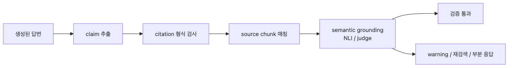

# Hallucination Guardrail — Grounding 검증

Hallucination이라는 말은 너무 넓게 쓰여서 운영 설계를 어렵게 만듭니다. 프로덕션에서 더 중요한 질문은 “이 답이 제공된 근거에 실제로 지지되는가”입니다. 특히 RAG 시스템에서는 사실 검증보다 grounding 검증이 훨씬 현실적인 첫 단계입니다.

이 문제가 중요한 이유는 사용자 피해가 단순한 오답으로 끝나지 않기 때문입니다. 인용 없이 단정적으로 말한 잘못된 답은 의사결정에 직접 영향을 주고, 근거가 붙어 있어 보여도 실제 문맥은 그 주장을 지지하지 않을 수 있습니다. 즉 citation, source, semantic 세 층을 모두 봐야 합니다.

그래서 이 글은 hallucination을 막연한 “헛소리”가 아니라 닫힌 문맥에서 검증 가능한 grounding 실패로 좁혀 다룹니다. 이 정의를 잡아야 측정과 차단, fallback 설계가 가능해집니다.

이 글은 AI Safety & Guardrails 101 시리즈의 7번째 글입니다.

이 글에서는 claim 추출, NLI entailment, judge 보강, citation 형식 강제, 회귀 지표를 묶어 grounding 검증 구조를 설명합니다.

## 이 글에서 다룰 문제

- closed-domain hallucination과 open-domain 사실 오류는 왜 구분해야 할까요?
- grounding 검증을 citation·source·semantic 세 단계로 나누는 이유는 무엇일까요?
- 문장 단위가 아니라 claim 단위 검증이 필요한 이유는 무엇일까요?
- NLI와 LLM judge는 어떤 역할 분담으로 쓰는 편이 좋을까요?
- grounding 실패 시 무조건 차단하지 않고도 안전하게 fallback할 수 있을까요?

## 왜 이 글이 중요한가

grounding 검증을 별도 레이어로 두면 팀은 “모델이 틀릴 수 있다”는 추상적 두려움을 구체적 체크리스트로 바꿀 수 있습니다. 인용 여부, 출처 존재, 의미적 지지 여부를 순서대로 검사하면 어떤 단계에서 실패했는지 명확해지고, 회귀 세트로 precision과 recall을 수치화할 수 있습니다.

반대로 citation만 강제하면 겉보기 신뢰성만 올라갑니다. 모델은 plausible-looking citation을 붙일 수 있고, 검색된 chunk가 존재해도 실제 주장을 지지하지 않을 수 있습니다. 그래서 semantic grounding이 빠지면 사용자는 “근거가 있다”는 형식만 보고 잘못된 정보를 더 쉽게 믿게 됩니다.

결국 hallucination guardrail의 핵심은 정답 생성이 아니라 증거 검증입니다. 무엇을 알았는지가 아니라, 어떤 근거로 말했는지를 기계적으로 확인할 수 있어야 합니다.

## Hallucination guardrail을 이해하는 가장 좋은 방법: 답변을 주장 집합으로 분해해 근거와 대조하는 것입니다

RAG 응답 한 문장에는 둘 이상의 사실 주장이 섞여 있는 경우가 많습니다. 문장 전체를 한 번에 참·거짓으로 판단하면 부분 오류를 놓치기 쉽습니다. 그래서 먼저 answer를 atomic claim으로 쪼개고, 각 claim이 어떤 chunk에 의해 지지되는지 확인해야 합니다.

이 과정을 세 단계로 나누면 운영이 단순해집니다. citation grounding은 형식 검증, source grounding은 chunk-ID 매칭, semantic grounding은 실제 지지 여부 확인입니다. 비용이 낮은 검사부터 실행하고, 회색 지대만 judge로 보내는 방식이 가장 현실적입니다.

> hallucination 검증의 핵심은 답변 전체를 한 번에 믿거나 버리는 것이 아닙니다. 답변을 주장 단위로 쪼개고, 각 주장에 대해 근거를 확인하는 것입니다.


*grounding 검증은 답변을 claim으로 분해하고, 점점 비싼 검사를 순서대로 적용할 때 운영 가능해집니다.*

## 핵심 개념

### 닫힌 문맥 hallucination에 집중해야 합니다

- **Closed-domain hallucination**: in RAG-style systems with explicit context, an output that is not supported by that context. This is verifiable.
- **Open-domain hallucination**: a factual error in answers generated from model knowledge alone, with no source. Verifying it requires external fact-checking and is expensive.

프로덕션 guardrail은 보통 전자에 먼저 집중합니다. RAG 시스템은 이미 문맥이 있으므로, 그 문맥이 답을 지지하는지만 봐도 큰 위험을 줄일 수 있기 때문입니다.

### grounding은 세 단계로 봐야 합니다

| Level | Meaning | Check |
| --- | --- | --- |
| Citation grounding | Every factual sentence carries a citation marker | Regex + length |
| Source grounding | The cited chunk actually appears in retrieved results | Chunk-ID match |
| Semantic grounding | The cited chunk really supports the claim | NLI model or LLM judge |

이 세 단계는 서로 대체 관계가 아닙니다. citation만 있으면 형식만 맞고, source만 맞으면 내용이 틀릴 수 있습니다. semantic grounding까지 가야 실제 검증이 됩니다.

### claim 추출이 첫 단계입니다

```python
import json

CLAIM_PROMPT = """Decompose the answer below into atomic factual claims.
Each claim must be a single declarative sentence that can be verified independently.
Return JSON: {"claims": [{"id": 1, "text": "..."}, ...]}.

ANSWER:
"""{answer}""""""

def extract_claims(answer: str) -> list[dict]:
    resp = client.chat.completions.create(
        model="gpt-4o-mini",
        messages=[{"role": "user", "content": CLAIM_PROMPT.format(answer=answer)}],
        response_format={"type": "json_object"},
        temperature=0,
    )
    return json.loads(resp.choices[0].message.content)["claims"]
```

claim이 너무 잘게 쪼개지면 비용이 폭증하므로, 후처리에서 문장 경계 기준으로 병합하는 전략도 함께 고려해야 합니다.

### NLI는 semantic grounding의 첫 필터입니다

```python
from transformers import pipeline

nli = pipeline(
    "text-classification",
    model="cross-encoder/nli-deberta-v3-large",
    return_all_scores=True,
)

def entails(premise: str, hypothesis: str) -> float:
    """Return entailment probability between 0 and 1."""
    pairs = [{"text": premise, "text_pair": hypothesis}]
    out = nli(pairs)[0]
    return next(s["score"] for s in out if s["label"] == "ENTAILMENT")
```

```python
def grounded(claims: list[dict], chunks: list[str], threshold: float = 0.7) -> dict:
    failures = []
    for c in claims:
        best = max(entails(chunk, c["text"]) for chunk in chunks)
        if best < threshold:
            failures.append({"claim": c["text"], "score": best})
    return {"ok": not failures, "failures": failures}
```

NLI는 빠르고 일관되지만 다단계 추론이 필요한 claim에서는 약할 수 있습니다. 그래서 회색 구간만 judge로 보냅니다.

### judge는 회색 지대를 재판정합니다

```python
JUDGE_PROMPT = """Decide whether the CLAIM is supported by the EVIDENCE.
Reply with JSON: {"supported": true|false, "reason": "..."}.

CLAIM: {claim}

EVIDENCE:
"""{evidence}""""""

def judge_grounding(claim: str, evidence: str) -> dict:
    resp = client.chat.completions.create(
        model="gpt-4o-mini",
        messages=[{"role": "user", "content": JUDGE_PROMPT.format(claim=claim, evidence=evidence)}],
        response_format={"type": "json_object"},
        temperature=0,
    )
    return json.loads(resp.choices[0].message.content)
```

NLI score가 0.4~0.7 정도인 회색 구간만 judge로 보내면 비용을 많이 줄일 수 있습니다.

### citation 형식을 강제해야 자동 검증이 쉬워집니다

```text
Seoul is the capital of South Korea, with a population of about 9.7 million [chunk-3]. ...
```

```python
import re

CITE_RE = re.compile(r"\[chunk-(\d+)\]")

def citation_check(answer: str, retrieved_ids: set[int]) -> dict:
    cited = {int(m.group(1)) for m in CITE_RE.finditer(answer)}
    missing = cited - retrieved_ids
    sentences = [s for s in re.split(r"(?<=[.!?])\s+", answer) if s.strip()]
    uncited = [s for s in sentences if not CITE_RE.search(s)]
    return {"missing_chunks": missing, "uncited_sentences": uncited}
```

citation 형식이 강제되면 source grounding은 자동화가 쉬워집니다. uncited sentence는 근거 없는 주장 가능성이 높습니다.

### 전체 파이프라인은 세 레이어를 묶습니다

```python
def verify_grounding(answer: str, chunks: list[dict]) -> dict:
    chunk_texts = [c["text"] for c in chunks]
    chunk_ids = {c["id"] for c in chunks}

    cite = citation_check(answer, chunk_ids)
    if cite["missing_chunks"] or cite["uncited_sentences"]:
        return {"ok": False, "stage": "citation", "detail": cite}

    claims = extract_claims(answer)
    nli_result = grounded(claims, chunk_texts)
    if not nli_result["ok"]:
        rechecked = []
        for f in nli_result["failures"]:
            best_chunk = max(chunk_texts, key=lambda ch: entails(ch, f["claim"]))
            verdict = judge_grounding(f["claim"], best_chunk)
            if not verdict["supported"]:
                rechecked.append(f["claim"])
        if rechecked:
            return {"ok": False, "stage": "semantic", "claims": rechecked}

    return {"ok": True}
```

실패 시 무조건 차단할 필요는 없습니다. 부분 경고, 재검색, 미검증 문장 제거 같은 fallback이 더 나은 UX를 만들 수 있습니다.

### 지표는 claim 단위로 관리해야 합니다

- **TruthfulQA, FEVER, HaluEval**: public grounding evaluation sets
- **Internal set**: 200 to 500 (question, context, answer, label) tuples sampled from real RAG traffic
- **Metrics**: claim-level precision and recall, average verification latency, cost per claim

정확도와 비용은 항상 trade-off입니다. claim recall, precision, latency를 같이 봐야 합니다.

## 흔히 헷갈리는 지점

- citation만 있으면 grounding이 끝났다고 생각하기 쉽습니다.
- 문장 단위 검사만으로 충분하다고 생각하기 쉽지만, 부분 hallucination을 놓칩니다.
- NLI threshold 하나로 모든 회색 지대를 처리하려 하면 false positive가 폭증합니다.
- 실패 시 무조건 차단하는 것이 안전하다고 보기 쉽지만, UX는 금방 무너집니다.

## 운영 체크리스트

- [ ] RAG 응답은 citation 형식을 강제하고 chunk-ID를 유지합니다.
- [ ] answer를 claim 단위로 분해한 뒤 entailment를 계산합니다.
- [ ] 회색 구간만 LLM judge로 보내 비용을 통제합니다.
- [ ] 실패 시 block, warning, re-retrieval 중 어떤 fallback을 쓸지 사전에 정합니다.
- [ ] claim precision, recall, latency를 회귀 세트로 지속 측정합니다.

## 정리

Hallucination guardrail의 핵심은 모델을 더 똑똑하게 만드는 것이 아니라, 모델이 한 주장에 대해 어떤 근거를 갖고 있는지 검증하는 것입니다. 특히 RAG 시스템에서는 이 문제가 닫힌 문맥 안에서 비교적 잘 정의됩니다.

운영적으로는 citation, source, semantic grounding을 분리하고, claim 단위로 검증하는 방식이 가장 실용적입니다. 이 구조가 있어야 어떤 부분이 실패했는지 설명할 수 있고, 지표로 튜닝할 수 있습니다.

여기서 더 중요한 것은 자신감 있는 문장이 아니라 실제로 지지되는 문장입니다.

<!-- toc:begin -->
## AI Safety & Guardrails 101 시리즈

- [AI Safety가 왜 중요한가](./01-why-ai-safety-matters.md)
- [Prompt Injection 방어](./02-prompt-injection-defense.md)
- [출력 필터링과 콘텐츠 모더레이션](./03-output-filtering.md)
- [PII 감지와 마스킹](./04-pii-detection-redaction.md)
- [Jailbreak 탐지](./05-jailbreak-detection.md)
- [독성과 편향 탐지](./06-toxicity-bias-detection.md)
- **Hallucination Guardrail — Grounding 검증 (현재 글)**
- [Rate Limiting과 남용 방지](./08-rate-limiting-abuse-prevention.md)
- [감사 로깅과 컴플라이언스](./09-audit-logging-compliance.md)
- [운영 가드레일 시스템 구축](./10-production-guardrail-system.md)
<!-- toc:end -->

## 참고 자료

### 공식 문서

- [TruthfulQA: Measuring How Models Mimic Human Falsehoods](https://arxiv.org/abs/2109.07958)
- [FEVER - Fact Extraction and VERification](https://fever.ai/)
- [HaluEval - A Large-Scale Hallucination Evaluation Benchmark](https://arxiv.org/abs/2305.11747)
- [Cross-Encoder NLI - DeBERTa v3 large](https://huggingface.co/cross-encoder/nli-deberta-v3-large)

### 관련 시리즈

- [출력 필터링과 콘텐츠 모더레이션](./03-output-filtering.md)
- [운영 가드레일 시스템 구축](./10-production-guardrail-system.md)

Tags: AI Safety, Hallucination, RAG, Grounding
