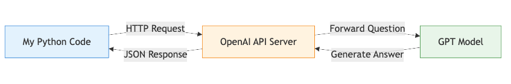
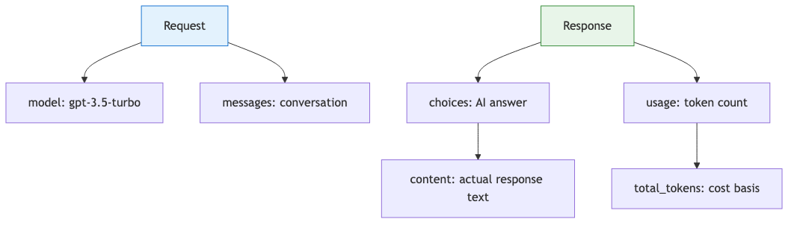
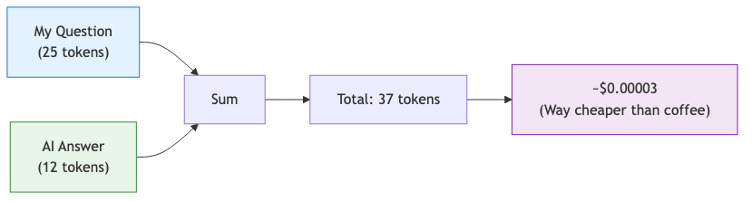
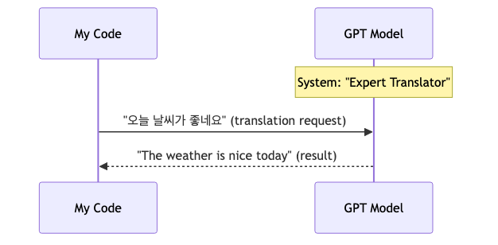

# AI API first steps — sending your first request with the OpenAI API

Using ChatGPT in a browser and calling a model from your own service are two different experiences. One is a finished product. The other is application development: authentication, request shape, response parsing, timeouts, and cost tracking all become your responsibility.

This is the first post in the AI Web Development 101 series.

Here, we will build the smallest successful OpenAI API call and turn it into a practical mental model you can reuse in later chapters.

## Questions this chapter answers

- What is different between using ChatGPT on the web and integrating an AI API into my own service?
- What is the minimum setup for the OpenAI API?
- What does the first request look like, and where do I read the response?
- Which fields matter most in the response JSON?
- When the first call fails, should I suspect authentication, the model id, or prompt design first?

> An AI API is not a ready-made chatbot. It is an interface that lets your application call a remote model as one component inside your system. That is why the first skill is not “asking better questions.” It is reading the request-response contract clearly.

## Why the first call matters more than it seems

At the beginning, the blurry part is rarely model quality. The blurry part is the service boundary. A chat UI hides it. Runtime code does not. Your application sends an HTTP request with authentication headers and a JSON body, and the model service sends a JSON response back.

If that structure is clear, later topics become easier. Token accounting, prompt design, streaming responses, RAG context injection, and evaluation workflows all build on the same first round trip. If the structure stays fuzzy, every later feature feels like “it works somehow, but I do not really know why.”



*Overview of a basic AI API call*

## Minimum setup

The setup is short. Create an OpenAI account, issue an API key, check billing, and load the key through an environment variable.

```bash
export OPENAI_API_KEY="your-issued-key"

python3 - <<'PY2'
import os
print("key loaded:", bool(os.environ.get("OPENAI_API_KEY")))
PY2
```

**Expected output:**

```text
key loaded: True
```

If this prints `False`, do not start tweaking prompts yet. Fix the environment variable first.

## Think in JSON request and JSON response

The Python SDK is convenient, but it does not change the underlying contract. `client.chat.completions.create()` still creates a JSON request and returns parsed response data.

Conceptually, the request body looks like this:

```json
{
  "model": "gpt-4o-mini",
  "messages": [
    {
      "role": "user",
      "content": "Give one encouraging sentence to a developer starting AI API work."
    }
  ]
}
```

The first three blocks to read in the response are `model`, `choices`, and `usage`.

```json
{
  "model": "gpt-4o-mini-2024-07-18",
  "choices": [
    {
      "message": {
        "role": "assistant",
        "content": "Start with one tiny automation. Once the first connection works, the next step becomes much clearer."
      },
      "finish_reason": "stop"
    }
  ],
  "usage": {
    "prompt_tokens": 24,
    "completion_tokens": 19,
    "total_tokens": 43
  }
}
```



*Key fields in the response JSON*

## The smallest successful SDK example

```bash
python3 -m venv .venv
source .venv/bin/activate
pip install "openai>=2.0"
```

```python
import os
from openai import OpenAI

client = OpenAI(api_key=os.environ["OPENAI_API_KEY"])

response = client.chat.completions.create(
    model="gpt-4o-mini",
    messages=[
        {
            "role": "user",
            "content": "Give one encouraging sentence to a developer starting AI API work."
        }
    ],
)

print("assistant:", response.choices[0].message.content)
print("model:", response.model)
print("usage:", response.usage)
```

**Expected output:**

```text
assistant: Start with one tiny automation. Once the first connection works, the next step becomes much clearer.
model: gpt-4o-mini-2024-07-18
usage: CompletionUsage(completion_tokens=19, prompt_tokens=24, total_tokens=43)
```

The exact wording will vary, but you should confirm these three things:

- `response.choices[0].message.content` contains the text you want to show the user
- `response.model` tells you which model version answered
- `response.usage` gives token counts you can log for cost tracking

## Add the minimum protection for application code

Terminal success is not enough for production-minded code. Model calls are remote network calls, so timeouts and explicit error handling should be part of the first design.

```python
import os
from openai import OpenAI
from openai import APIConnectionError, APIStatusError, RateLimitError

client = OpenAI(api_key=os.environ["OPENAI_API_KEY"], timeout=20.0)


def ask_model(user_text: str) -> dict:
    try:
        response = client.chat.completions.create(
            model="gpt-4o-mini",
            temperature=0.2,
            messages=[
                {
                    "role": "system",
                    "content": "You explain things briefly and practically to junior developers."
                },
                {"role": "user", "content": user_text},
            ],
        )
    except RateLimitError as exc:
        return {"ok": False, "error": f"rate_limit: {exc}"}
    except APIConnectionError as exc:
        return {"ok": False, "error": f"network: {exc}"}
    except APIStatusError as exc:
        return {"ok": False, "error": f"status_{exc.status_code}: {exc}"}

    return {
        "ok": True,
        "answer": response.choices[0].message.content,
        "prompt_tokens": response.usage.prompt_tokens,
        "completion_tokens": response.usage.completion_tokens,
        "total_tokens": response.usage.total_tokens,
    }
```

The goal is simple: classify failure modes before you start debating prompt quality.

## Use cURL once to see the raw contract

When the SDK feels too magical, `curl` is a useful reality check.

```bash
curl https://api.openai.com/v1/chat/completions   -H "Content-Type: application/json"   -H "Authorization: Bearer $OPENAI_API_KEY"   -d '{
    "model": "gpt-4o-mini",
    "messages": [
      {"role": "user", "content": "Why does usage matter in the response JSON?"}
    ]
  }'
```

This is not the final integration style you will ship, but it makes the HTTP endpoint, auth header, and JSON body visible.

## What you should read from every response

A common beginner mistake is treating the response as “just a string.” In real applications, you usually need more than that.

- `choices[0].message.content`: user-facing text
- `finish_reason`: whether the answer stopped normally or was cut off
- `usage.prompt_tokens`: input cost signal
- `usage.completion_tokens`: output cost signal
- `model`: which model version actually answered

If `finish_reason` is `length`, the first suspect is not necessarily prompt quality. It may be your output limit.

## Start logging token usage early

AI APIs are typically billed by tokens. Tokens are not identical to characters, but the basic operational intuition is enough: longer prompts and longer answers cost more.

```python
def log_usage(result: dict) -> None:
    if not result["ok"]:
        print("request failed:", result["error"])
        return

    print(
        "usage => prompt:", result["prompt_tokens"],
        "completion:", result["completion_tokens"],
        "total:", result["total_tokens"],
    )
```



*How token count and response cost relate*

## What to check first when the first call fails

### 1. `401` or authentication problems

- Is `OPENAI_API_KEY` really loaded in the shell or runtime environment?
- Did you accidentally copy whitespace into the key?
- Are you using the right project or organization context?

### 2. `404` or wrong model id

- Check the model name against current docs or the dashboard.
- Do not copy a stale model id from an old blog post without verifying it.

### 3. `429` or rate limits

- Did you send too many requests in a short time?
- Is an automatic retry loop amplifying the traffic?
- Did you already hit the account budget or quota limit?

### 4. The request succeeds but the answer is weak

- Confirm the request structure first.
- Then inspect role separation, instruction clarity, and output constraints.
- Only after that should prompt refinement become the main suspect.

## Small follow-up exercise: a translator

```python
import os
from openai import OpenAI

client = OpenAI(api_key=os.environ["OPENAI_API_KEY"])


def translate_ko_to_en(text: str) -> str:
    response = client.chat.completions.create(
        model="gpt-4o-mini",
        temperature=0.1,
        messages=[
            {
                "role": "system",
                "content": "You are a technical translator. Translate Korean into natural English."
            },
            {
                "role": "user",
                "content": f"Translate this sentence into English: {text}"
            },
        ],
    )
    return response.choices[0].message.content


print(translate_ko_to_en("오늘은 API 응답 구조를 먼저 이해하는 것이 중요합니다."))
```

**Expected output:**

```text
Today, it is important to understand the API response structure first.
```



*How a system prompt and user prompt combine in a translation request*

## Checklist

- [ ] I am not hardcoding `OPENAI_API_KEY` in source code.
- [ ] I can explain `model`, `messages`, `choices`, and `usage`.
- [ ] I verified token usage after a successful call.
- [ ] I can separate `401`, `404`, and `429` from prompt-design problems.

## Summary

The important part of the first call is not “I talked to a model.” It is “I can now read the API contract.”

- An AI API is not a finished chat product. It is a remote model interface your service calls.
- Under the SDK, you still have an HTTP request and a JSON response.
- You should read `usage`, `finish_reason`, and `model`, not only the text body.
- Early debugging becomes much easier when you separate authentication, model id, rate-limit, and prompt-structure failures.

The next chapter builds directly on this. Once the request-response shape is clear, prompt engineering stops feeling mysterious.

<!-- toc:begin -->
## Series table of contents

- **AI API first steps — sending your first request with the OpenAI API (current)**
- Prompt engineering basics — getting the answer you actually want (upcoming)
- Building an AI chatbot — real-time chat with Next.js and the Vercel AI SDK (upcoming)
- RAG introduction — answering with your own data (upcoming)
- First steps with AI agents — making the model use tools (upcoming)
- Deploying an AI web app — shipping to Vercel and Azure (upcoming)
- Evaluating and improving an AI app — measuring quality over time (upcoming)

<!-- toc:end -->

## References

- [OpenAI API reference: Chat Completions](https://platform.openai.com/docs/api-reference/chat)
- [OpenAI Quickstart](https://platform.openai.com/docs/quickstart)
- [openai-python README](https://github.com/openai/openai-python)
- [OpenAI pricing](https://platform.openai.com/docs/pricing)

Tags: AI, LLM, Web Development, Python, Tutorial
