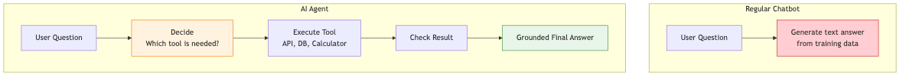
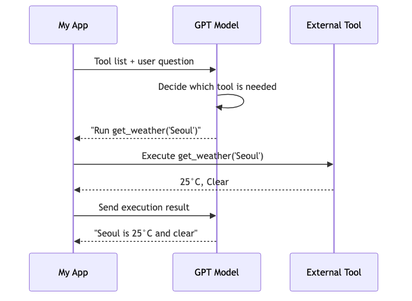
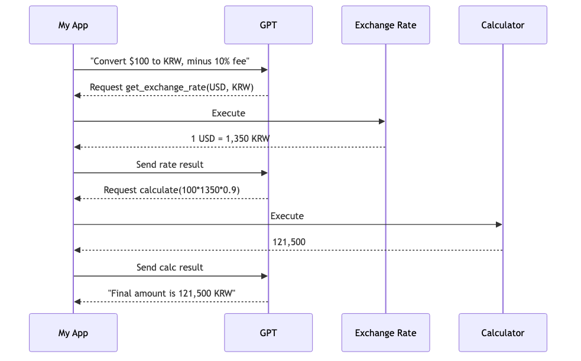
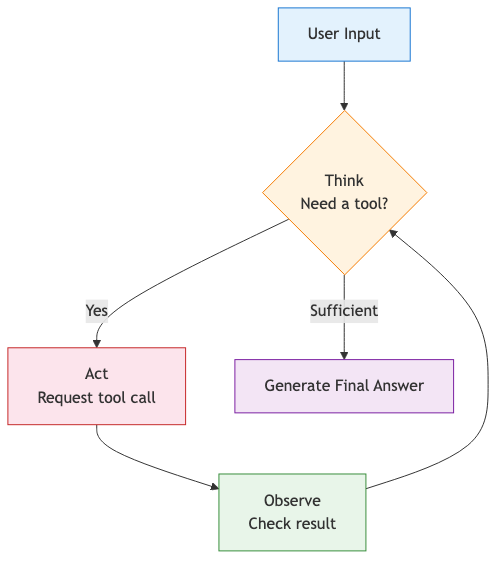
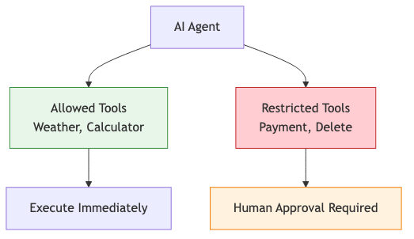

# First steps with AI agents — making the model use tools

So far, the AI features in this series only exchanged text. They could answer questions, but they could not actually fetch live weather, run a calculator, or query an external system. To move beyond text-only answers, you need a loop where the model can request tools.

This is post 5 in the AI Web Development 101 series.

Here, we will focus on tool use, function calling, and the boundary between model judgment and application execution.

## Questions this chapter answers

- What makes an agent different from a normal chatbot?
- How does function calling work as a contract?
- How does the model ask for a function invocation?
- How do you build a loop that can use more than one tool?
- What safety rules matter as soon as tool use is enabled?

> An agent is not “a smarter chatbot.” It is a system where the model decides when external actions are needed, while the application validates and executes those actions.

## Chatbot versus agent

A normal chatbot generates text from the information already available in the prompt or the model weights. An agent goes one step further. It can decide that a tool is needed, request the tool call, read the result, and then continue.

- chatbot: answer from existing context
- agent: ask for tools such as APIs, databases, calculators, or search systems



*Difference between a chatbot and an AI agent*

## The basic tool-use loop

1. the application tells the model which tools exist
2. the model decides which tool is needed
3. the model emits a function-call request with arguments
4. the application validates and executes the function
5. the result goes back into the conversation so the model can produce the final answer

The key point is execution ownership. The model proposes. The application decides whether and how to execute.



*How model judgment and function execution interact*

## A minimal tool definition

```python
tools = [
    {
        "type": "function",
        "function": {
            "name": "get_weather",
            "description": "Returns the current weather for a location.",
            "parameters": {
                "type": "object",
                "properties": {
                    "location": {
                        "type": "string",
                        "description": "City name, such as Seoul or Busan"
                    }
                },
                "required": ["location"]
            }
        }
    }
]
```

The model does not read your Python implementation. It reads the tool description and parameter schema. Weak descriptions often lead to weak tool selection.

## Example 1: weather lookup agent

```python
import json
from openai import OpenAI

client = OpenAI()


def get_weather(location: str) -> str:
    if "Seoul" in location:
        return json.dumps({"location": "Seoul", "temperature": "25C", "condition": "Sunny"})
    if "Busan" in location:
        return json.dumps({"location": "Busan", "temperature": "22C", "condition": "Partly cloudy"})
    return json.dumps({"location": location, "temperature": "Unknown", "condition": "No data"})


messages = [{"role": "user", "content": "What is the weather in Seoul today?"}]

response = client.chat.completions.create(
    model="gpt-4o",
    messages=messages,
    tools=tools,
    tool_choice="auto",
)

tool_calls = response.choices[0].message.tool_calls

if tool_calls:
    tool_call = tool_calls[0]
    function_name = tool_call.function.name
    function_args = json.loads(tool_call.function.arguments)
    function_response = get_weather(location=function_args["location"])

    messages.append(response.choices[0].message)
    messages.append({
        "tool_call_id": tool_call.id,
        "role": "tool",
        "name": function_name,
        "content": function_response,
    })

    final_response = client.chat.completions.create(
        model="gpt-4o",
        messages=messages,
    )

    print(final_response.choices[0].message.content)
```

The important boundary is visible here. The model never directly executes `get_weather`. It only asks for it.

## Example 2: a multi-tool loop

Tool use becomes more interesting when more than one step is required.

```python
import ast
import json
import operator as op

ALLOWED_OPERATORS = {
    ast.Add: op.add,
    ast.Sub: op.sub,
    ast.Mult: op.mul,
    ast.Div: op.truediv,
    ast.Pow: op.pow,
    ast.USub: op.neg,
}


def safe_eval(node):
    if isinstance(node, ast.Constant) and isinstance(node.value, (int, float)):
        return node.value
    if isinstance(node, ast.BinOp) and type(node.op) in ALLOWED_OPERATORS:
        return ALLOWED_OPERATORS[type(node.op)](safe_eval(node.left), safe_eval(node.right))
    if isinstance(node, ast.UnaryOp) and type(node.op) in ALLOWED_OPERATORS:
        return ALLOWED_OPERATORS[type(node.op)](safe_eval(node.operand))
    raise ValueError("Unsupported expression")


def get_exchange_rate(from_currency, to_currency):
    rates = {"USD_KRW": 1350}
    pair = f"{from_currency}_{to_currency}"
    return json.dumps({"pair": pair, "rate": rates.get(pair, 1300)})


def calculate(expression):
    tree = ast.parse(expression, mode="eval")
    return str(safe_eval(tree.body))
```

```python
tools = [
    {
        "type": "function",
        "function": {
            "name": "get_exchange_rate",
            "description": "Gets an exchange rate between two currencies.",
            "parameters": {
                "type": "object",
                "properties": {
                    "from_currency": {"type": "string"},
                    "to_currency": {"type": "string"}
                },
                "required": ["from_currency", "to_currency"]
            }
        }
    },
    {
        "type": "function",
        "function": {
            "name": "calculate",
            "description": "Evaluates a simple arithmetic expression.",
            "parameters": {
                "type": "object",
                "properties": {
                    "expression": {"type": "string"}
                },
                "required": ["expression"]
            }
        }
    }
]
```

```python
def run_agent(user_prompt):
    messages = [{"role": "user", "content": user_prompt}]

    for _ in range(5):
        response = client.chat.completions.create(
            model="gpt-4o",
            messages=messages,
            tools=tools,
        )

        message = response.choices[0].message
        messages.append(message)

        if not message.tool_calls:
            break

        for tool_call in message.tool_calls:
            name = tool_call.function.name
            args = json.loads(tool_call.function.arguments)

            if name == "get_exchange_rate":
                result = get_exchange_rate(**args)
            elif name == "calculate":
                result = calculate(**args)
            else:
                result = "Unknown tool"

            messages.append({
                "tool_call_id": tool_call.id,
                "role": "tool",
                "name": name,
                "content": result,
            })

    return messages[-1].content
```



*An agent using multiple tools in sequence*

## How to read the agent loop

1. user input
2. model judgment
3. tool-call request
4. application execution
5. result observation
6. either final answer or another loop iteration

That order matters because it keeps debugging grounded. When the behavior looks strange, you can ask whether the issue came from tool selection, argument generation, execution, or result interpretation.



*The repeating agent loop of judgment and action*

## Safety rules you need immediately

- clear tool descriptions
- argument validation before execution
- retry limits and timeouts
- maximum loop count
- permission boundaries for side-effecting tools

The core rule is simple: never execute model-generated arguments blindly.



*Tool permission boundaries and safety checks*

## Checklist

- [ ] Tool descriptions and parameter schemas are explicit enough.
- [ ] The application validates arguments before execution.
- [ ] The loop has a maximum number of iterations.
- [ ] High-risk tools have stricter permission boundaries.

## Summary

An agent is not “the model doing everything by itself.” It is a controlled loop where the model requests external actions and the application remains the execution owner.

- Tool use lets the model ask for functions rather than guess everything from text alone.
- The application validates and executes those functions.
- Multi-step tool loops make agent behavior feel more capable, but they also expand the risk surface.
- Safety controls are not optional once tools can cause side effects.

The next chapter shifts from tool use to deployment, where these AI features have to run in real environments with logs, secrets, and cost limits.

<!-- toc:begin -->
## Series table of contents

- [AI API first steps — sending your first request with the OpenAI API](./01-hello-ai-api.md)
- [Prompt engineering basics — getting the answer you actually want](./02-prompt-engineering.md)
- [Building an AI chatbot — real-time chat with Next.js and the Vercel AI SDK](./03-ai-chatbot.md)
- [RAG introduction — answering with your own data](./04-rag-intro.md)
- **First steps with AI agents — making the model use tools (current)**
- Deploying an AI web app — shipping to Vercel and Azure (upcoming)
- Evaluating and improving an AI app — measuring quality over time (upcoming)

<!-- toc:end -->

## References

- [OpenAI: Function calling guide](https://platform.openai.com/docs/guides/function-calling) — canonical spec for `tools`, `tool_choice`, and the `tool_calls` response flow
- [OpenAI: Structured Outputs](https://platform.openai.com/docs/guides/structured-outputs) — enforcing tool and response schemas with JSON Schema
- [OpenAI Cookbook: function calling and tools](https://cookbook.openai.com/topic/tools) — runnable examples of the tool-calling loop
- [Anthropic: Tool use](https://docs.anthropic.com/en/docs/build-with-claude/tool-use) — how a different provider defines the same tool-use pattern, useful for cross-checking
- [LangGraph: Agent runtime](https://langchain-ai.github.io/langgraph/concepts/agentic_concepts/) — what a framework-managed agent loop looks like when you stop hand-rolling it
- [JSON Schema specification](https://json-schema.org/specification.html) — keywords and validation rules behind the `parameters` schema

Tags: AI, LLM, Web Development, Python, Tutorial
