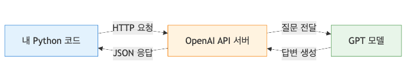
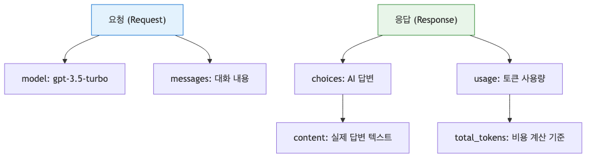
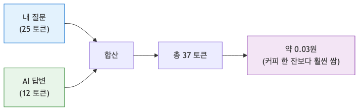

# AI API 첫 걸음 — OpenAI API로 첫 번째 요청 보내기

ChatGPT를 브라우저에서 쓰는 것과, 내 서비스 코드에서 AI를 호출하는 것은 꽤 다릅니다. 전자는 완성된 제품을 쓰는 경험이고, 후자는 모델을 내 기능 안에 조립하는 개발 작업입니다. 여기서부터 인증, 요청 형식, 응답 파싱, 비용 관리 같은 현실적인 문제가 바로 시작됩니다.

이 글은 AI 웹 개발 입문 시리즈의 첫 번째 글입니다.

복잡한 이론보다 먼저, OpenAI API로 실제 요청을 한 번 보내고 결과를 읽어내는 감각을 잡겠습니다.

## 이 글에서 다룰 문제

- ChatGPT 웹사이트를 쓰는 것과 AI API를 붙이는 것은 무엇이 다를까요?
- OpenAI API를 호출하려면 어떤 준비가 필요할까요?
- 첫 번째 요청은 어떤 형식으로 보내고, 어디서 응답을 읽어야 할까요?
- 응답 JSON에서 실제로 필요한 필드는 무엇일까요?
- 토큰 기반 과금은 어떤 식으로 감각을 잡아야 할까요?

> AI API는 완성된 챗봇을 가져다 쓰는 기능이 아니라, 외부 모델을 내 애플리케이션의 한 컴포넌트처럼 호출하는 인터페이스입니다. 그래서 핵심은 “질문을 잘한다”보다 “요청과 응답의 계약을 이해한다”에 있습니다.

## AI API가 필요한 이유

웹사이트에서 ChatGPT를 쓰는 것과 API를 사용하는 것의 차이는 레스토랑에서 음식을 주문하는 것과 재료를 사서 직접 요리하는 것의 차이에 가깝습니다. 웹사이트는 이미 완성된 제품이라 바로 쓸 수 있지만, 내 서비스의 화면 흐름, 데이터베이스, 사용자 권한, 로그 체계에 맞게 동작시키기는 어렵습니다.

반면 API를 쓰면 모델을 내 서비스 안으로 끌어올 수 있습니다. 입력창은 내가 설계하고, 이전 대화는 내가 저장하고, 회사 데이터나 사용자 문맥도 내가 함께 붙일 수 있습니다. 대신 그만큼 개발자가 책임져야 할 것도 늘어납니다. 인증, 예외 처리, 응답 파싱, 비용 통제가 모두 개발 범위에 들어옵니다.

API(Application Programming Interface)는 서로 다른 프로그램이 대화하기 위한 약속입니다. AI API는 그중에서도 LLM 같은 모델에게 요청을 보내고 결과를 돌려받는 통로라고 보면 됩니다. 모델 자체를 내 컴퓨터에 두지 않고도, 네트워크를 통해 필요한 순간에 호출할 수 있다는 점이 핵심입니다.



AI API 호출의 기본 흐름

## 주요 AI API 제공자

지금 시장에는 여러 AI API 제공자가 있습니다. 입문 단계에서는 한 곳만 먼저 익혀도 충분하지만, 어떤 선택지가 있는지는 알아두는 편이 좋습니다.

- OpenAI: GPT 계열 모델을 제공하며 문서와 예제가 많아 입문에 적합합니다.
- Anthropic: Claude 모델을 제공하며 긴 글쓰기와 안전성 측면에서 자주 언급됩니다.
- Google: Gemini 모델을 제공하며 Google Cloud 생태계와 연결하기 좋습니다.

이 시리즈는 가장 널리 쓰이고 예제가 풍부한 OpenAI API를 기준으로 설명합니다. 중요한 점은 이후 다른 제공자를 쓰더라도 기본 감각은 크게 다르지 않다는 것입니다. 결국 개발자는 모델 이름, 인증 방식, 요청 본문, 응답 구조를 맞춰 붙이는 일을 하게 됩니다.

## OpenAI API 시작하기

API를 호출하려면 먼저 인증 수단이 필요합니다. OpenAI에서는 이것을 API Key로 제공합니다. 이 키는 “누가 이 요청을 보냈는가”를 식별하는 비밀 값이므로 비밀번호처럼 다뤄야 합니다.

1. 계정 생성: [OpenAI Platform](https://platform.openai.com/)에 접속해 가입합니다.
2. API Key 발급: `API Keys` 탭에서 `Create new secret key`를 눌러 키를 생성합니다.
   - 주의: 이 키는 한 번만 보여주니 안전한 곳에 따로 저장해 두세요. GitHub 같은 공용 저장소에 올리면 안 됩니다.
3. 결제 수단 등록: API는 사용량 기반 과금이므로 `Settings > Billing`에서 결제 수단이나 예산을 먼저 점검하는 편이 좋습니다.

Python 환경에서는 라이브러리 설치부터 시작하면 됩니다.

```bash
# 2026-04-29 기준 테스트
pip install "openai>=2.0"
```

여기서 중요한 것은 라이브러리를 깔았다는 사실보다, 실제 비밀 키를 코드에 하드코딩하지 않는 습관입니다. 실전에서는 `OPENAI_API_KEY` 같은 환경 변수로 주입하고, 코드는 그 값을 읽기만 하게 두는 방식이 가장 안전합니다.

## 첫 번째 API 호출

이제 가장 작은 예제로 실제 요청을 보내 보겠습니다. 아래 코드는 사용자 메시지 하나를 보내고, 모델이 돌려준 첫 번째 답변을 출력합니다.

```python
import os
from openai import OpenAI

# 실제 키는 환경 변수 OPENAI_API_KEY로 주입합니다.
client = OpenAI(api_key=os.environ.get("OPENAI_API_KEY"))

# GPT에게 요청 보내기
response = client.chat.completions.create(
    model="gpt-4o-mini",
    messages=[
        {"role": "user", "content": "AI API 개발을 시작하는 개발자에게 응원의 한마디 해줘!"}
    ]
)

# 결과 출력
print(response.choices[0].message.content)
```

이 예제에서 먼저 봐야 할 부분은 세 군데입니다.

- `model`: 어떤 모델을 호출할지 정합니다.
- `messages`: 대화 메시지 목록입니다. Chat Completions API는 이 배열을 기반으로 답을 만듭니다.
- `response.choices[0].message.content`: 최종 텍스트 답변이 들어 있는 위치입니다.

OpenAI에는 API 표면이 두 가지 있습니다. 오래전부터 널리 쓰인 방식은 지금 예제처럼 `chat.completions`를 호출하는 Chat Completions API이고, 최근에는 도구 사용·웹 검색·파일 검색 같은 에이전트형 워크플로에 더 잘 맞는 Responses API도 제공합니다. 이 시리즈는 예제가 가장 많고 이식성이 좋은 Chat Completions를 기준으로 설명하지만, 이후 agent 기능을 붙일 계획이라면 Responses API도 함께 알아두면 좋습니다.

## API 응답 구조 이해하기

모델 응답은 결국 구조화된 데이터입니다. 라이브러리가 객체처럼 감싸주더라도, 내부 JSON이 어떻게 생겼는지 알아야 원하는 값만 정확히 꺼낼 수 있습니다.

```json
{
  "id": "chatcmpl-123...",
  "object": "chat.completion",
  "created": 1677652288,
  "model": "gpt-4o-mini-2024-07-18",
  "choices": [
    {
      "index": 0,
      "message": {
        "role": "assistant",
        "content": "AI API 개발을 시작하는 분께는 작은 자동화부터 붙여보라고 권하고 싶습니다. 한 번 연결해 보면 다음 단계가 훨씬 또렷해집니다."
      },
      "finish_reason": "stop"
    }
  ],
  "usage": {
    "prompt_tokens": 25,
    "completion_tokens": 12,
    "total_tokens": 37
  }
}
```

- `choices`: 모델이 생성한 후보 답변 목록입니다. 보통 하나만 쓰므로 첫 번째 항목을 읽습니다.
- `message`: 실제 답변 본문과 역할 정보가 들어 있습니다.
- `usage`: 입력과 출력에 각각 얼마나 많은 토큰이 쓰였는지 보여줍니다.

입문 단계에서 가장 자주 하는 실수는 응답을 “그냥 문자열”로만 생각하는 것입니다. 하지만 실제 서비스에서는 토큰 수를 기록하거나, `finish_reason`을 보고 중간 종료 여부를 판단하거나, 여러 후보를 비교할 수도 있습니다. 응답 구조를 초반에 정확히 익혀 두면 이후 RAG, 에이전트, 평가 단계에서 훨씬 편해집니다.



API 응답 JSON의 핵심 필드

## 비용은 어떻게 보나

AI API는 대개 토큰 기반으로 과금됩니다. 토큰은 글자 수와 완전히 같지는 않지만, “입력 길이와 출력 길이가 길어질수록 비용이 늘어난다”는 감각을 잡는 데는 충분합니다.

영어 기준으로 1,000토큰은 대략 750단어 안팎으로 자주 설명됩니다. 우리가 방금 보낸 짧은 질문과 답변은 보통 50~100토큰 안팎에 머무는 경우가 많습니다. 연습 단계에서는 큰 부담이 아닐 수 있지만, 대화 기록을 길게 넣거나 더 큰 모델을 쓰기 시작하면 상황이 달라집니다.

그래서 초반부터 두 가지 습관을 들이는 편이 좋습니다.

- `usage` 필드를 확인해 토큰 소비 감각을 익힙니다.
- 정확한 가격은 그때그때 공식 가격 페이지에서 다시 확인합니다.



입력 토큰 수와 응답 비용의 관계

## 작은 실습으로 감각 굳히기

이제 같은 구조를 응용해 번역기를 하나 만들어 보겠습니다. 핵심은 모델에게 역할을 먼저 주고, 그다음 사용자 입력을 보내는 방식입니다.

```python
import os
from openai import OpenAI

client = OpenAI(api_key=os.environ.get("OPENAI_API_KEY"))

def translate_ko_to_en(text):
    response = client.chat.completions.create(
        model="gpt-4o-mini",
        messages=[
            {"role": "system", "content": "너는 한국어를 영어로 아주 자연스럽게 번역해주는 전문 번역가야."},
            {"role": "user", "content": f"다음 문장을 번역해줘: '{text}'"}
        ]
    )
    return response.choices[0].message.content

# 실행 예시
print(translate_ko_to_en("오늘 날씨가 정말 좋네요. 산책 가고 싶어요!"))
```

여기서 새로 등장한 것은 `system` 역할입니다. 모델의 기본 태도와 출력을 어느 방향으로 유도할지 먼저 지정하는 장치라고 생각하면 됩니다. 다음 글에서 다룰 프롬프트 엔지니어링의 출발점도 바로 여기입니다.


번역 요청을 만드는 System Prompt와 User Prompt 구성

## 체크리스트

- [ ] `OPENAI_API_KEY`를 코드에 하드코딩하지 않았다.
- [ ] `model`, `messages`, 응답 읽기 위치를 설명할 수 있다.
- [ ] `usage` 필드에서 토큰 사용량을 확인할 수 있다.
- [ ] 작은 예제를 직접 실행해 응답을 터미널에서 확인했다.

## 정리

첫 요청을 보내는 단계에서 가장 중요한 것은 “모델을 불렀다”보다 “API 계약을 읽을 수 있게 됐다”는 점입니다.

- AI API는 완성된 채팅 제품이 아니라 내 서비스가 호출하는 외부 모델 인터페이스입니다.
- API Key는 코드가 아니라 환경 변수로 관리해야 합니다.
- Chat Completions API는 `model`, `messages`, `choices` 구조를 이해하면 기본 흐름을 읽을 수 있습니다.
- `usage` 필드를 보면 토큰과 비용 감각을 초반부터 잡을 수 있습니다.

이제 모델을 한 번 호출해 본 만큼, 다음 글에서는 같은 모델이라도 왜 프롬프트 설계에 따라 결과가 크게 달라지는지 살펴보겠습니다.

<!-- toc:begin -->
## 시리즈 목차

- **AI API 첫 걸음 — OpenAI API로 첫 번째 요청 보내기 (현재 글)**
- 프롬프트 엔지니어링 기초 — AI에게 원하는 답을 얻는 기술 (예정)
- AI 챗봇 만들기 — Next.js와 Vercel AI SDK로 실시간 채팅 구현 (예정)
- RAG 입문 — 내 데이터로 답하는 AI 만들기 (예정)
- AI 에이전트 첫걸음 — Tool Use로 똑똑한 AI 만들기 (예정)
- AI 웹 앱 배포하기: Vercel과 Azure에 올리고 운영하기 (예정)
- AI 앱의 평가와 개선, 품질을 측정하고 더 좋게 만드는 법 (예정)

<!-- toc:end -->

## 참고 자료

- [OpenAI API Reference](https://platform.openai.com/docs/api-reference)
- [Microsoft Learn: Introduction to Azure OpenAI Service](https://learn.microsoft.com/training/paths/introduce-azure-openai-service/)
- [Python OpenAI Library GitHub](https://github.com/openai/openai-python)

Tags: AI, LLM, 웹 개발, Python, Tutorial
