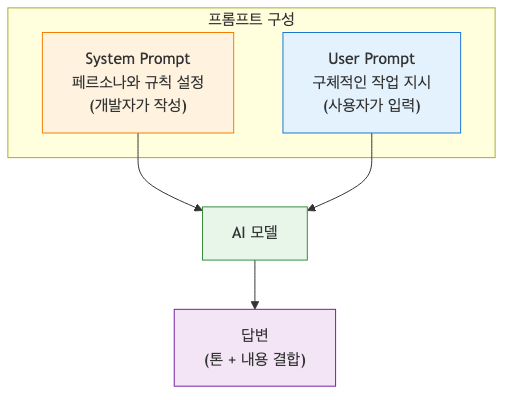
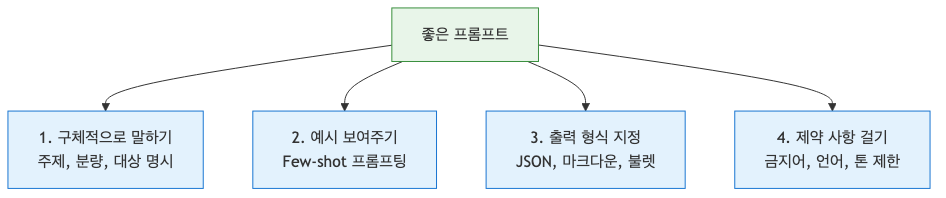
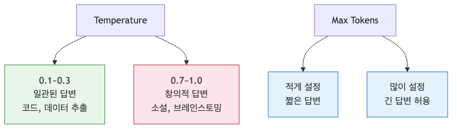

# 프롬프트 엔지니어링 기초 — AI에게 원하는 답을 얻는 기술

> AI 웹 개발 입문 시리즈 (2/7)

똑같은 AI를 쓰는데 누구는 업무 시간을 절반으로 줄이고, 누구는 "별로네"라고 하며 창을 닫습니다. 차이는 어디에서 올까요? 바로 AI에게 건네는 첫 마디, **프롬프트**에 있습니다.

지난 글에서 우리는 API를 호출해 AI와 대화하는 법을 배웠습니다. 하지만 단순히 "코드를 짜줘"나 "글을 써줘" 같은 짧은 요청만으로는 우리가 진짜 원하는 결과물을 얻기 어렵습니다. 오늘은 AI의 잠재력을 100% 끌어내는 기술, 프롬프트 엔지니어링의 핵심 원칙을 살펴봅니다.

이 글은 AI 웹 개발 입문 시리즈의 2번째 글입니다. 여기서는 AI에게 원하는 답을 더 안정적으로 얻기 위한 프롬프트 설계 원칙을 정리합니다.

---

### 프롬프트가 뭔가요?

프롬프트를 어렵게 생각할 필요 없습니다. 새로운 팀원에게 업무 지시를 내리는 상황을 떠올려 보세요.

"보고서 좀 써줘."

이렇게만 말하면 팀원은 당황할 겁니다. 어떤 주제인지, 분량은 어느 정도인지, 누구를 대상으로 쓰는지 전혀 모르니까요. AI도 똑같습니다. 우리가 배경 지식과 구체적인 가이드라인을 주지 않으면, AI는 인터넷상의 수많은 데이터 중 가장 '평균적인' 답변을 내놓을 뿐입니다.

프롬프트 엔지니어링은 AI가 우리가 의도한 맥락(Context)을 정확히 파악하도록 업무 지시서를 정교하게 다듬는 과정입니다.

---

### System Prompt vs User Prompt

OpenAI의 Chat Completions API를 보면 `role`이라는 필드가 있습니다. 여기서 가장 중요한 두 가지 역할이 `system`과 `user`입니다.

- **System Prompt (시스템 프롬프트):** AI에게 '페르소나'를 부여합니다. "너는 10년 차 시니어 풀스택 개발자야", "너는 유머러스한 마케팅 전문가야"처럼 AI의 기본 태도와 전문성 수준을 정합니다.
- **User Prompt (사용자 프롬프트):** 우리가 실제로 시킬 구체적인 작업 내용입니다. "이 함수를 리팩토링해줘", "이 상품의 카피를 써줘" 같은 내용이 들어갑니다.

사람도 "전문가로서 답변해 주세요"라는 말을 들으면 마음가짐이 달라지듯, AI도 시스템 프롬프트를 통해 답변의 톤과 깊이를 조절합니다.



*System Prompt와 User Prompt의 역할*

---

### 좋은 프롬프트의 4가지 원칙

프롬프트를 짤 때 다음 네 가지만 기억해도 품질이 확 달라집니다.

#### 1. 구체적으로 말하기
"블로그 글 써줘"보다는 "초보 개발자를 위한 리액트 상태 관리 블로그 글을 3문단 내외로 써줘"가 훨씬 낫습니다. 주제, 분량, 대상을 명시하세요.

#### 2. 예시를 주기 (Few-shot)
말만으로 설명하기 어려울 때는 "이런 느낌으로 해줘"라며 예시를 한두 개 보여주는 것이 가장 효과적입니다. 이를 **Few-shot 프롬프팅**이라고 부릅니다. 예시가 아예 없으면 Zero-shot, 하나면 One-shot입니다.

#### 3. 출력 형식을 지정하기
"JSON 형태로 줘", "마크다운 표로 정리해줘", "불렛 포인트 3개로 요약해줘"처럼 결과물의 형태를 미리 정해주면 후속 처리(Parsing)가 훨씬 편해집니다.

#### 4. 제약 사항 걸기
"전문 용어는 빼고 설명해줘", "비속어는 절대 쓰지 마", "답변은 한국어로만 해줘" 같은 제약을 명확히 두면 엉뚱한 대답을 막을 수 있습니다.



*좋은 결과를 이끄는 프롬프트 설계 원칙*


*모호한 프롬프트를 구체적으로 개선하는 과정*

---

### Temperature와 Max Tokens

API 설정값 중 답변의 성격을 결정짓는 중요한 파라미터가 두 가지 있습니다.

- **Temperature (온도):** 0에서 2 사이의 값을 가집니다. 0에 가까울수록 답변이 일관되고 결정론적(정확함)입니다. 1에 가까울수록 창의적이고 다양한 답변을 내놓습니다. 
    - 코드 생성이나 데이터 추출: **0.1 ~ 0.3** 권장
    - 소설 쓰기나 아이디어 브레인스토밍: **0.7 ~ 1.0** 권장
- **Max Tokens:** 답변의 최대 길이를 제한합니다. 너무 짧게 설정하면 답변이 중간에 끊길 수 있으니 주의해야 합니다.



*생성 다양성과 답변 길이를 조절하는 두 설정*

---

### 실습 1: 상품 설명 자동 생성기

마케팅 문구를 만들어주는 프롬프트를 짜봅시다.

**System Prompt:**
> 너는 유능한 이커머스 카피라이터야. 상품의 이름과 특징을 주면, 구매 욕구를 자극하는 감성적인 문구 3개를 만들어줘. 각 문구는 2문장 이내로 짧고 강렬하게 작성해.

**User Prompt:**
> 상품명: 무소음 기계식 키보드
> 특징: 밤샘 작업 가능, 부드러운 타건감, 파스텔 블루 컬러

이렇게 역할을 명확히 하고 형식을 정해주면, AI는 훨씬 전문적인 마케팅 문구를 생산합니다.

---

### 실습 2: 코드 리뷰어 만들기

개발 생산성을 높여줄 코드 리뷰어 프롬프트입니다.

**System Prompt:**
> 너는 보안과 성능을 중시하는 구글 출신 시니어 개발자야. 전달받은 코드를 분석해서 1) 잠재적 버그, 2) 성능 개선점, 3) 가독성 향상 방안을 불렛 포인트로 정리해줘. 칭찬보다는 냉철한 비판 위주로 답변해.

**User Prompt:**
```javascript
function login(user, pass) {
  if (user == 'admin' && pass == '1234') {
    return true;
  }
  return false;
}
```

이 프롬프트는 단순히 "코드 고쳐줘"라고 했을 때보다 훨씬 깊이 있는 리뷰를 제공할 겁니다.

---

### 프롬프트 디버깅 체크리스트

원하는 답이 나오지 않는다면 다음 항목을 확인해 보세요.

1. **배경 지식이 부족한가?** AI가 모를 법한 고유 명사나 상황 설명을 더 추가하세요.
2. **부정문보다는 긍정문을 썼는가?** "~하지 마"보다는 "~라고 해줘"가 AI에게 더 잘 먹힙니다.
3. **단계별로 생각하게 했는가?** 복잡한 문제는 "차근차근 단계별로 생각해서 답변해줘"라고 덧붙여 보세요. (Chain of Thought)
4. **예시가 적절한가?** 내가 원하는 출력 형태와 가장 유사한 예시를 다시 넣어보세요.


*프롬프트 개선 반복 과정*

---

<!-- toc:begin -->


## 시리즈 목차

- [AI API 첫 걸음 — OpenAI API로 첫 번째 요청 보내기](./01-hello-ai-api.md)
- **프롬프트 엔지니어링 기초 — AI에게 원하는 답을 얻는 기술 (현재 글)**
- AI 챗봇 만들기 — Next.js와 Vercel AI SDK로 실시간 채팅 구현 (예정)
- RAG 입문 — 내 데이터로 답하는 AI 만들기 (예정)
- AI 에이전트 첫걸음 — Tool Use로 똑똑한 AI 만들기 (예정)
- AI 웹 앱 배포하기: Vercel과 Azure에 올리고 운영하기 (예정)
- AI 앱의 평가와 개선, 품질을 측정하고 더 좋게 만드는 법 (예정)

<!-- toc:end -->

---

## 참고 자료

- [OpenAI Prompt Engineering Guide](https://platform.openai.com/docs/guides/prompt-engineering)
- [PromptingGuide.ai (DeepLearning.AI)](https://www.promptingguide.ai/kr)

Tags: AI, LLM, 웹 개발, Python, Tutorial
