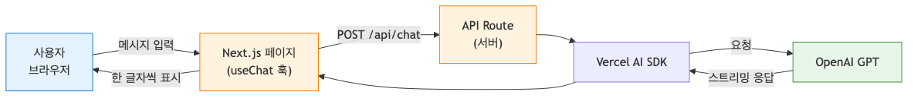
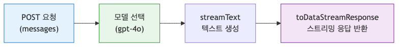
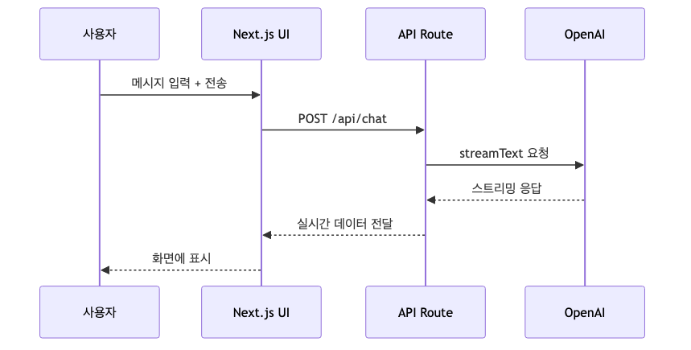
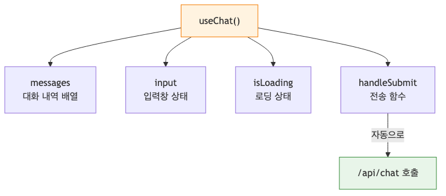
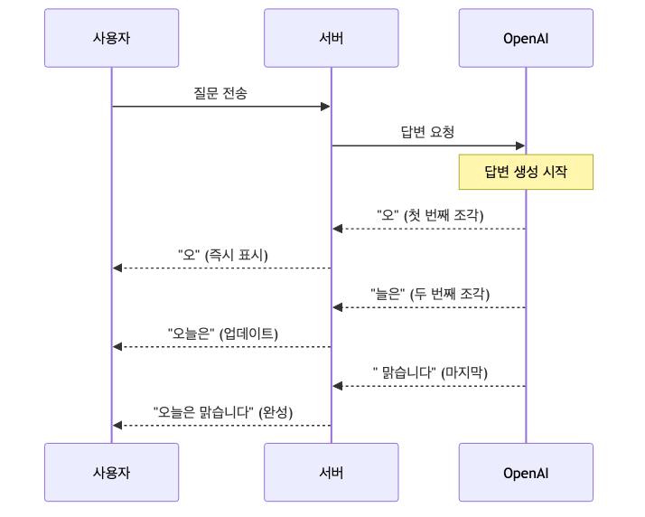

# AI 챗봇 만들기 — Next.js와 Vercel AI SDK로 실시간 채팅 구현

> AI 웹 개발 입문 시리즈 (3/7)

지금까지 터미널에서만 AI를 불렀는데, 이제 브라우저에서 사용자가 직접 대화할 수 있는 UI를 만들어 봅시다. 단순히 API를 연결하는 수준을 넘어, 글자가 한 글자씩 타이핑되는 스트리밍 효과와 시스템 프롬프트를 활용한 페르소나 설정까지 살펴보겠습니다.

이번 편은 시리즈 안에서 잠시 프론트엔드로 이동하는 인터루드입니다. Python 예제를 잠깐 벗어나므로 Node.js, npm, React 기본기와 Next.js App Router 구조를 알고 있다는 전제로 진행하겠습니다.

---

<!-- a-grade-intro:begin -->
## 핵심 질문

Next.js + Vercel AI SDK로 실전에 쓸 수 있는 채팅 UI를 만들려면 무엇을 챙겨야 할까요?

이 글은 그 질문에 답하기 위해 Next.js 기반 AI 챗봇의 핵심 개념과 실무 고려사항을 단계별로 살펴봅니다.

<!-- a-grade-intro:end -->

## 왜 Next.js + Vercel AI SDK인가?

AI 기능을 웹에 구현할 때 가장 큰 고민은 '응답 속도'와 '상태 관리'입니다. AI의 답변이 길어질수록 사용자는 빈 화면을 보며 기다려야 하죠. 

**Vercel AI SDK**는 이 문제를 해결해 줍니다.
- **실시간 스트리밍**: 답변이 생성되는 대로 즉시 화면에 뿌려주는 기능을 단 몇 줄로 구현합니다.
- **useChat 훅**: 메시지 목록과 전송 상태를 관리하고, `sendMessage`로 서버와 대화 흐름을 연결합니다.
- 프레임워크 최적화: Next.js App Router와 잘 맞아서 서버와 클라이언트 간의 데이터 흐름을 쉽게 제어할 수 있습니다.

**[그림 1] AI 챗봇 서비스의 전체 구조**



*브라우저와 모델 API를 잇는 챗봇 서비스 구조*

---

## 프로젝트 초기 설정

먼저 새로운 Next.js 프로젝트를 생성하고 필요한 패키지를 설치합니다.

```bash
npx create-next-app@latest my-ai-chatbot --typescript --tailwind --eslint
cd my-ai-chatbot
```

그다음 Vercel AI SDK와 OpenAI를 사용하기 위한 패키지를 추가합니다.

```bash
npm install ai @ai-sdk/react @ai-sdk/openai
```

실제 키는 저장소에 올리지 말고, 예시 파일만 남긴 뒤 로컬에서 별도 파일로 복사해 사용하세요.

```text
# .env.local.example
OPENAI_API_KEY=your_api_key_here
```

`.env.local.example`만 커밋하고, 실제 `.env.local`은 `.gitignore`에 넣어 GitHub에 올라가지 않게 관리하는 방식이 안전합니다.

---

## Step 1: API Route 만들기 (/api/chat)

사용자의 메시지를 받아서 OpenAI에게 전달하고, 그 답변을 다시 클라이언트로 스트리밍해 주는 서버측 경로를 만듭니다. 

`app/api/chat/route.ts` 파일을 생성하고 아래 코드를 작성합니다.

```typescript
import { openai } from "@ai-sdk/openai";
import { convertToModelMessages, streamText, type UIMessage } from "ai";

export const runtime = "edge";
export const maxDuration = 30;

export async function POST(req: Request) {
  const { messages }: { messages: UIMessage[] } = await req.json();

  const result = streamText({
    model: openai("gpt-4o-mini"),
    system: "당신은 친절한 요리 도우미입니다. 사용자의 냉장고 재료에 맞춰 레시피를 추천해 주세요.",
    messages: convertToModelMessages(messages),
  });

  return result.toUIMessageStreamResponse();
}
```



*API Route의 요청 처리 흐름*

- `UIMessage[]`: 브라우저에서 보낸 대화 내역의 타입입니다.
- `convertToModelMessages(...)`: UI용 메시지 구조를 모델이 이해하는 형식으로 바꿔 줍니다.
- `toUIMessageStreamResponse()`: 스트리밍 결과를 `useChat`이 바로 읽을 수 있는 응답 형식으로 감싸 줍니다.



*사용자 메시지가 AI 답변으로 변환되는 과정*

---

## Step 2: 채팅 UI 만들기 (useChat 훅)

이제 사용자 화면을 구성할 차례입니다. 최신 `useChat` 훅은 메시지 목록과 전송 상태를 관리하고, 입력창 값은 일반적인 React 방식대로 `useState`로 다루는 편이 가장 명확합니다.

`app/page.tsx` 내용을 모두 지우고 아래 코드를 넣으세요.

```tsx
"use client";

import { useChat } from "@ai-sdk/react";
import { useState } from "react";

export default function Chat() {
  const [input, setInput] = useState("");
  const { messages, sendMessage, status } = useChat();
  const isLoading = status === "submitted" || status === "streaming";

  return (
    <div className="flex flex-col w-full max-w-md py-24 mx-auto stretch">
      <div className="space-y-4">
        {messages.map((m) => (
          <div key={m.id} className="whitespace-pre-wrap">
            <span className="font-bold">
              {m.role === "user" ? "User: " : "Assistant: "}
            </span>
            {m.parts.map((part, i) =>
              part.type === "text" ? <span key={i}>{part.text}</span> : null,
            )}
          </div>
        ))}
      </div>

      <form
        onSubmit={(e) => {
          e.preventDefault();
          if (input.trim()) {
            sendMessage({ text: input });
            setInput("");
          }
        }}
        className="fixed bottom-0 w-full max-w-md mb-8"
      >
        <input
          className="w-full p-2 border border-gray-300 rounded shadow-xl text-black"
          value={input}
          placeholder="가지고 있는 재료를 말해보세요..."
          onChange={(e) => setInput(e.target.value)}
          disabled={isLoading}
        />
      </form>
    </div>
  );
}
```

- `messages`: 대화 내역이 담긴 배열입니다.
- `sendMessage(...)`: 현재 입력값을 `/api/chat`으로 보내고, 그 결과를 스트리밍으로 이어 붙입니다.
- `status`: 현재 요청 상태입니다. `submitted`나 `streaming`일 때 입력창을 잠가 중복 전송을 막을 수 있습니다.
- `message.parts`: 메시지 본문을 구성하는 조각입니다. 텍스트뿐 아니라 tool call, 파일 등 다른 타입이 추가될 수 있으므로 `content` 문자열 하나만 가정하지 않는 편이 안전합니다.



*useChat 훅의 상태 관리 흐름*

---

## Step 3: 스트리밍 응답 구현

별도의 설정을 하지 않아도 `useChat`과 `streamText`를 조합하면 이미 스트리밍이 동작합니다. 사용자가 `sendMessage`를 호출하면 서버는 `toUIMessageStreamResponse()`로 응답을 흘려 보내고, 브라우저는 그 조각을 이어 붙여 화면을 갱신합니다.

이는 사용자 경험(UX) 측면에서 중요합니다. 전체 답변이 올 때까지 몇 초를 기다리는 대신 첫 글자가 바로 나타나기 때문에 사용자는 서비스가 빠르다고 느낍니다.

**[그림 2] 스트리밍 방식의 데이터 흐름**



*스트리밍 방식으로 답변이 전달되는 흐름*

---

## Step 4: System Prompt로 성격 부여하기

Step 1의 코드에서 `system` 속성을 기억하시나요? 이 부분을 수정하면 챗봇의 정체성을 완전히 바꿀 수 있습니다.

- **전문가 모드**: "당신은 10년 차 시니어 소프트웨어 엔지니어입니다. 코드를 리뷰하고 최적화 방안을 제시하세요."
- **엔터테인먼트**: "당신은 조선시대 선비입니다. 현대의 기술을 보고 깜짝 놀란 말투로 대화하세요."

이처럼 시스템 프롬프트는 챗봇 개발의 핵심적인 재미 요소이자 비즈니스 로직을 담는 공간입니다.

---

## 완성된 전체 코드 (Copy & Paste)

### API Route (`app/api/chat/route.ts`)
```typescript
import { openai } from "@ai-sdk/openai";
import { convertToModelMessages, streamText, type UIMessage } from "ai";

export const runtime = "edge";
export const maxDuration = 30;

export async function POST(req: Request) {
  const { messages }: { messages: UIMessage[] } = await req.json();

  const result = streamText({
    model: openai("gpt-4o-mini"),
    system: "당신은 친절한 요리 도우미입니다. 사용자의 질문에 정중하게 답하세요.",
    messages: convertToModelMessages(messages),
  });

  return result.toUIMessageStreamResponse();
}
```

### Client Page (`app/page.tsx`)
```tsx
"use client";

import { useChat } from "@ai-sdk/react";
import { useState } from "react";

export default function Chat() {
  const [input, setInput] = useState("");
  const { messages, sendMessage, status } = useChat();
  const isLoading = status === "submitted" || status === "streaming";

  return (
    <div className="flex flex-col w-full max-w-md py-24 mx-auto stretch">
      <h1 className="text-2xl font-bold mb-8 text-center">AI 요리 도우미</h1>

      <div className="flex-1 space-y-4 mb-20">
        {messages.length === 0 && (
          <p className="text-gray-500 text-center">궁금한 레시피나 재료를 물어보세요!</p>
        )}
        {messages.map((m) => (
          <div
            key={m.id}
            className={`p-4 rounded-lg ${m.role === "user" ? "bg-blue-100 ml-auto" : "bg-gray-100"}`}
            style={{ maxWidth: "80%" }}
          >
            <p className="text-sm font-semibold mb-1">
              {m.role === "user" ? "User" : "Assistant"}
            </p>
            <div className="text-black">
              {m.parts.map((part, i) =>
                part.type === "text" ? <span key={i}>{part.text}</span> : null,
              )}
            </div>
          </div>
        ))}
        {isLoading && <div className="text-gray-400">Assistant가 답변을 작성하는 중입니다...</div>}
      </div>

      <form
        onSubmit={(e) => {
          e.preventDefault();
          if (input.trim()) {
            sendMessage({ text: input });
            setInput("");
          }
        }}
        className="fixed bottom-4 w-full max-w-md bg-white p-2"
      >
        <input
          className="w-full p-3 border border-gray-300 rounded-lg focus:outline-none focus:ring-2 focus:ring-blue-500 text-black"
          value={input}
          placeholder="냉장고에 남은 재료는?"
          onChange={(e) => setInput(e.target.value)}
          disabled={isLoading}
        />
        <button
          type="submit"
          disabled={isLoading}
          className="mt-2 w-full rounded-lg bg-blue-600 px-4 py-2 text-white disabled:bg-blue-300"
        >
          Send
        </button>
      </form>
    </div>
  );
}
```

---

## 개선 아이디어

여기까지 성공했다면, 다음 단계로 기능을 확장해 보세요.
1. **대화 기록 저장**: 데이터베이스(예: Vercel Postgres)를 연결해 새로고침해도 대화가 유지되게 만듭니다.
2. **로딩 상태 세분화**: `status` 값을 활용해 `submitted`, `streaming`, `error` 상태별 UI를 다르게 보여줄 수 있습니다.
3. **에러 처리**: API 호출 실패 시 사용자에게 친절한 안내 메시지를 띄웁니다.

---

<!-- toc:begin -->
## 시니어 엔지니어는 이렇게 생각합니다

- **스트리밍이 기본이다** — 응답을 한 번에 받으면 체감 지연이 크므로 토큰 스트리밍을 표준으로 둡니다.
- **API 키는 서버 라우트 뒤에 둔다** — AI SDK도 키 노출 위험은 같으므로 클라이언트에서 직접 호출하지 않습니다.
- **대화 히스토리는 잘라서 보낸다** — 전체를 매번 보내면 비용·지연이 폭증하므로 윈도잉·요약을 적용합니다.
- **취소·중단을 UI로 노출한다** — 긴 응답을 사용자가 끊을 수 있어야 비용과 UX가 모두 개선됩니다.
- **사용량 한도를 사용자별로 건다** — rate limit과 토큰 한도를 사용자·세션 단위로 둬야 어뷰즈를 막습니다.

## 시리즈 목차

- [AI API 첫 걸음 — OpenAI API로 첫 번째 요청 보내기](./01-hello-ai-api.md)
- [프롬프트 엔지니어링 기초 — AI에게 원하는 답을 얻는 기술](./02-prompt-engineering.md)
- **AI 챗봇 만들기 — Next.js와 Vercel AI SDK로 실시간 채팅 구현 (현재 글)**
- RAG 입문 — 내 데이터로 답하는 AI 만들기 (예정)
- AI 에이전트 첫걸음 — Tool Use로 똑똑한 AI 만들기 (예정)
- AI 웹 앱 배포하기: Vercel과 Azure에 올리고 운영하기 (예정)
- AI 앱의 평가와 개선, 품질을 측정하고 더 좋게 만드는 법 (예정)

<!-- toc:end -->

---

## 참고 자료
- [Vercel AI SDK Documentation](https://sdk.vercel.ai/docs)
- [Next.js App Router Guide](https://nextjs.org/docs/app)

Tags: AI, LLM, 웹 개발, Python, Tutorial
