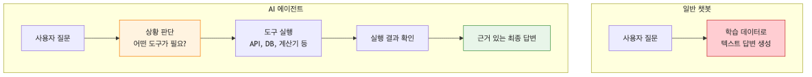
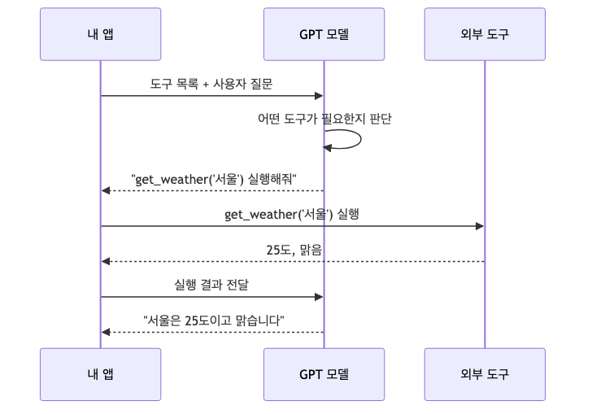
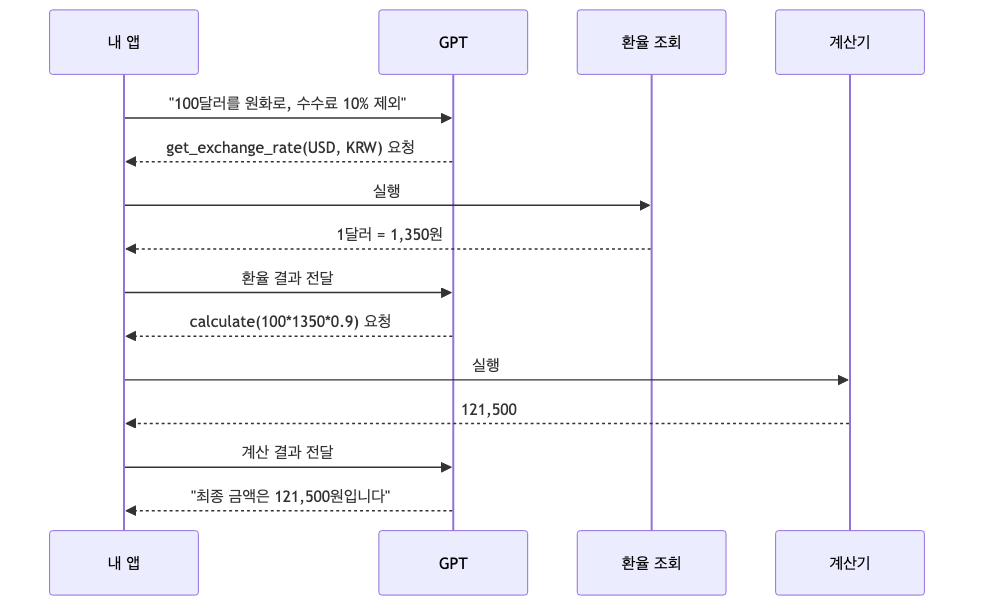
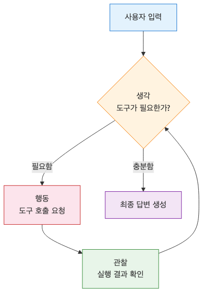
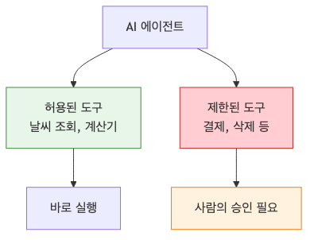

# AI 에이전트 첫걸음 — Tool Use로 똑똑한 AI 만들기

> AI 웹 개발 입문 시리즈 (5/7)

지금까지 만든 AI는 텍스트만 주고받았습니다. 질문을 던지면 학습한 데이터를 바탕으로 그럴싸한 답변을 내놓는 식이었죠. 그런데 만약 AI가 직접 날씨 API를 호출하거나, 데이터베이스를 검색하거나, 계산기를 쓸 수 있다면 어떨까요?

단순히 말만 잘하는 인공지능이 아니라, 필요한 상황에 직접 도구를 꺼내 쓰는 '일 잘하는 비서'가 되는 셈입니다. 오늘은 AI가 스스로 판단하고 외부 기능을 실행하는 **AI 에이전트**의 핵심 원리와 구현 방법을 알아보겠습니다.

---

## AI 에이전트가 뭔가요?

우리가 흔히 쓰는 챗봇과 '에이전트'는 무엇이 다를까요? 가장 큰 차이는 **판단**과 **행동**입니다.

- **일반 챗봇**: 사용자의 질문을 이해하고 텍스트 응답을 생성합니다. 가진 지식 안에서만 답할 수 있습니다.
- **AI 에이전트**: 사용자의 목표를 달성하기 위해 어떤 단계가 필요한지 스스로 계획을 세웁니다. 필요하다면 외부 도구(API, DB, 웹 검색 등)를 사용해 정보를 가져오고, 그 결과를 바탕으로 최종 답변을 완성합니다.

쉽게 비유하자면, 챗봇은 "오늘 날씨 어때?"라는 질문에 "어제 예보로는 맑다고 들었어요"라고 답하는 친구라면, 에이전트는 **"잠시만요, 기상청 사이트에서 실시간 날씨를 확인해 드릴게요"**라고 말하며 직접 스마트폰을 꺼내 검색하는 비서와 같습니다.



---

## Tool Use (Function Calling)란?

AI가 도구를 사용하게 만드는 기술을 보통 **Tool Use** 또는 **Function Calling**이라고 부릅니다. 원리는 생각보다 단순합니다.

1. 개발자가 AI에게 사용 가능한 **도구 목록**(함수의 이름, 설명, 파라미터 정보)을 전달합니다.
2. AI는 사용자의 질문을 듣고 "지금 내 지식으로는 부족한데, 이 도구를 쓰면 답할 수 있겠어"라고 판단합니다.
3. AI는 직접 함수를 실행하는 대신, **"이 함수를 이런 값(파라미터)으로 실행해 줘"**라는 요청을 우리에게 보냅니다.
4. 우리(애플리케이션)가 실제로 그 함수를 실행하고 결과값을 다시 AI에게 전달합니다.
5. AI는 그 결과값을 읽고 사용자에게 최종 답변을 드립니다.

여기서 핵심은 **AI가 상황에 맞춰 어떤 도구를 쓸지 스스로 고른다**는 점입니다.



---

## OpenAI Function Calling 기본 구조

OpenAI API에서는 `tools`라는 파라미터를 통해 AI에게 도구를 알려줍니다. 함수의 구조를 JSON 스키마 형식으로 정의해서 넘겨주면 됩니다.

```python
tools = [
    {
        "type": "function",
        "function": {
            "name": "get_weather",
            "description": "특정 지역의 현재 날씨 정보를 가져옵니다.",
            "parameters": {
                "type": "object",
                "properties": {
                    "location": {
                        "type": "string",
                        "description": "도시 이름 (예: 서울, 부산)"
                    }
                },
                "required": ["location"]
            }
        }
    }
]
```

이제 이 구조를 바탕으로 실제 작동하는 에이전트를 만들어 보겠습니다.

---

## 실습 1: 날씨 조회 에이전트 만들기

실제 날씨 API 연동은 복잡할 수 있으니, 간단한 가짜 함수를 만들어 실습해 보겠습니다.

### 1. 도구 정의하기

먼저 파이썬 함수와 이를 AI에게 설명할 스키마를 준비합니다.

```python
import ast
import json
import operator as op

ALLOWED_OPERATORS = {
    ast.Add: op.add,
    ast.Sub: op.sub,
    ast.Mult: op.mul,
    ast.Div: op.truediv,
    ast.Pow: op.pow,
    ast.USub: op.neg,
}

def safe_eval(node):
    if isinstance(node, ast.Constant) and isinstance(node.value, (int, float)):
        return node.value
    if isinstance(node, ast.BinOp) and type(node.op) in ALLOWED_OPERATORS:
        return ALLOWED_OPERATORS[type(node.op)](safe_eval(node.left), safe_eval(node.right))
    if isinstance(node, ast.UnaryOp) and type(node.op) in ALLOWED_OPERATORS:
        return ALLOWED_OPERATORS[type(node.op)](safe_eval(node.operand))
    raise ValueError("허용되지 않은 수식입니다.")

# 실제로 실행될 가짜 날씨 함수
def get_weather(location):
    if "서울" in location:
        return json.dumps({"location": "서울", "temperature": "25도", "condition": "맑음"})
    elif "부산" in location:
        return json.dumps({"location": "부산", "temperature": "22도", "condition": "구름 조금"})
    else:
        return json.dumps({"location": location, "temperature": "알 수 없음", "condition": "정보 없음"})

# AI에게 전달할 도구 명세
tools = [
    {
        "type": "function",
        "function": {
            "name": "get_weather",
            "description": "특정 지역의 현재 날씨 정보를 가져옵니다.",
            "parameters": {
                "type": "object",
                "properties": {
                    "location": {"type": "string", "description": "도시 이름"}
                },
                "required": ["location"]
            }
        }
    }
]
```

### 2. AI에게 질문하고 판단 결과 받기

사용자가 "서울 날씨 알려줘"라고 물었을 때, AI가 어떻게 반응하는지 확인해 봅시다.

```python
from openai import OpenAI
client = OpenAI()

messages = [{"role": "user", "content": "서울 날씨는 어때?"}]

response = client.chat.completions.create(
    model="gpt-4o",
    messages=messages,
    tools=tools,
    tool_choice="auto"
)

# AI가 함수 호출이 필요하다고 판단했는지 확인
tool_calls = response.choices[0].message.tool_calls

if tool_calls:
    print(f"AI의 판단: {tool_calls[0].function.name} 함수를 호출해야 함!")
```

### 3. 함수 실행 및 결과 전달

AI는 함수 호출 '요청'만 보냅니다. 실제 실행은 우리 코드가 담당합니다.

```python
if tool_calls:
    # 1. AI가 요청한 함수 이름과 인자 추출
    tool_call = tool_calls[0]
    function_name = tool_call.function.name
    function_args = json.loads(tool_call.function.arguments)
    
    # 2. 실제 파이썬 함수 실행
    if function_name == "get_weather":
        function_response = get_weather(location=function_args.get("location"))
    
    # 3. AI의 메시지와 함수 실행 결과를 메시지 목록에 추가
    messages.append(response.choices[0].message) # AI의 호출 요청 추가
    messages.append({
        "tool_call_id": tool_call.id,
        "role": "tool",
        "name": function_name,
        "content": function_response,
    })
    
    # 4. 결과가 포함된 메시지 목록을 다시 AI에게 보내 최종 답변 받기
    final_response = client.chat.completions.create(
        model="gpt-4o",
        messages=messages
    )
    
    print(final_response.choices[0].message.content)
    # 출력 예시: "현재 서울의 날씨는 25도로 맑은 상태입니다."
```

어떻게 작동하는지, 어떤 식으로 응답이 오는지 감이 잡히시나요? AI가 직접 함수를 실행하는 게 아니라, '나 대신 이 함수 좀 실행해 줘'라고 우리에게 요청을 보내는 과정이 핵심입니다.

---

## 실습 2: 계산기 + 환율 변환기 (멀티 툴 사용)

에이전트의 진짜 강력함은 여러 도구를 함께 쓸 때 나옵니다. "100달러를 원화로 환전하면 얼마야? 그리고 거기서 10% 수수료를 뺀 금액도 알려줘"라는 복잡한 요청을 처리해 볼까요?

이번에는 루프(반복문)를 활용해 AI가 필요한 만큼 도구를 호출할 수 있도록 만들어 보겠습니다.

```python
def get_exchange_rate(from_currency, to_currency):
    # 가짜 환율 데이터
    rates = {"USD_KRW": 1350}
    pair = f"{from_currency}_{to_currency}"
    rate = rates.get(pair, 1300)
    return json.dumps({"pair": pair, "rate": rate})

def calculate(expression):
    # 간단한 사칙연산만 허용하는 안전한 계산기
    try:
        tree = ast.parse(expression, mode="eval")
        return str(safe_eval(tree.body))
    except Exception as e:
        return f"계산 오류: {str(e)}"

tools = [
    {
        "type": "function",
        "function": {
            "name": "get_exchange_rate",
            "description": "통화 간 실시간 환율을 조회합니다.",
            "parameters": {
                "type": "object",
                "properties": {
                    "from_currency": {"type": "string", "description": "기준 통화 (예: USD)"},
                    "to_currency": {"type": "string", "description": "대상 통화 (예: KRW)"}
                },
                "required": ["from_currency", "to_currency"]
            }
        }
    },
    {
        "type": "function",
        "function": {
            "name": "calculate",
            "description": "수학 수식을 계산합니다.",
            "parameters": {
                "type": "object",
                "properties": {
                    "expression": {"type": "string", "description": "계산할 수식 (예: 100 * 1350 * 0.9)"}
                },
                "required": ["expression"]
            }
        }
    }
]

def run_agent(user_prompt):
    messages = [{"role": "user", "content": user_prompt}]
    
    # 최대 5번까지 도구 사용을 허용하는 루프
    for i in range(5):
        response = client.chat.completions.create(
            model="gpt-4o",
            messages=messages,
            tools=tools
        )
        
        message = response.choices[0].message
        messages.append(message)
        
        # AI가 최종 답변을 내놓으면 루프 종료
        if not message.tool_calls:
            break
            
        # 모든 도구 호출 처리
        for tool_call in message.tool_calls:
            name = tool_call.function.name
            args = json.loads(tool_call.function.arguments)
            
            # 실제 서비스에서는 LLM이 만든 인자를 그대로 실행하지 말고
            # allowlist, 타입 검사, 범위 검사로 먼저 검증해야 합니다.
            
            print(f"--- AI가 {name} 도구를 사용합니다: {args} ---")
            
            if name == "get_exchange_rate":
                result = get_exchange_rate(**args)
            elif name == "calculate":
                result = calculate(**args)
            else:
                result = "알 수 없는 도구입니다."
                
            messages.append({
                "tool_call_id": tool_call.id,
                "role": "tool",
                "name": name,
                "content": result,
            })
            
    return messages[-1].content

# 실행 테스트
prompt = "100달러를 원화로 환전하고, 거기서 10% 수수료를 뺀 최종 금액을 알려줘."
print(f"최종 답변: {run_agent(prompt)}")
```

AI는 이 과정을 통해 먼저 환율을 조회하고, 그 결과를 바탕으로 수식을 만들어 계산기를 두드린 뒤 우리에게 최종 금액을 알려줍니다. 여러 도구를 순차적으로 혹은 한꺼번에 호출하며 문제를 해결하는 흐름을 한눈에 볼 수 있습니다.



---

## 에이전트 루프 이해하기

에이전트가 동작하는 과정을 정리하면 다음과 같은 순환 구조를 가집니다. 이를 **에이전트 루프(Agent Loop)**라고 부릅니다.

1. **사용자 입력**: "이 작업을 해줘."
2. **생각 (Reasoning)**: AI가 현재 상태를 파악하고 어떤 도구가 필요한지 결정합니다.
3. **행동 (Action)**: AI가 도구 호출을 요청하고, 애플리케이션이 이를 실행합니다.
4. **관찰 (Observation)**: 도구의 실행 결과를 AI가 전달받습니다.
5. **완료 또는 반복**: 결과가 충분하면 답변을 마무리하고, 부족하면 다시 2번으로 돌아가 다음 단계를 진행합니다.

이 루프 덕분에 AI는 스스로 문제를 해결해 나가는 '지능'을 가진 것처럼 보이게 됩니다.



---

## 에이전트를 만들 때 주의할 점

똑똑한 에이전트를 만들려면 다음 항목을 기억하세요.

1. **도구 설명이 핵심입니다**: AI는 함수 코드 자체를 보는 게 아니라 여러분이 작성한 `description`을 보고 판단합니다. "이 함수는 언제 써야 하는지", "인자는 무엇을 의미하는지"를 아주 명확하게 설명해야 엉뚱한 실수를 하지 않습니다.
2. **무한 루프 방지**: AI가 답을 찾지 못하고 계속 같은 도구만 호출하는 경우가 생길 수 있습니다. 최대 반복 횟수(예: 5회)를 정해두어 안전장치를 마련해야 합니다.
3. **인자 검증과 권한 범위**: LLM이 만든 도구 인자는 항상 검증해야 합니다. 허용된 함수만 실행하고, 파일 쓰기·결제·삭제처럼 부작용이 큰 작업은 사용자 확인 단계를 두는 편이 안전합니다.
4. **타임아웃과 재시도 한도**: 외부 API나 DB를 호출하는 도구는 타임아웃을 두고, 실패 시 재시도 횟수도 제한해야 합니다. 그래야 에이전트가 느리게 매달리거나 같은 실패를 반복하지 않습니다.
5. **비용 관리**: 에이전트는 한 번의 답변을 위해 여러 번 API를 호출합니다. 루프가 길어질수록 비용과 지연 시간(Latency)이 늘어날 수 있다는 점을 고려해야 합니다.



---

## 마무리하며

오늘은 AI에게 손과 발을 달아주는 **Tool Use**와 **에이전트**의 개념을 배웠습니다. 이제 여러분의 AI는 단순히 아는 체하는 것을 넘어, 직접 API를 두드리고 데이터를 찾아오는 실질적인 능력을 갖추게 되었습니다.

다음 시간에는 지금까지 배운 내용을 총동원해서, 실제로 사용자에게 가치 있는 기능을 제공하는 **AI 웹 서비스**를 직접 구축해 보겠습니다.

---

<!-- toc:begin -->
## 시리즈 목차

- [AI API 첫 걸음 — OpenAI API로 첫 번째 요청 보내기](./01-hello-ai-api.md)
- [프롬프트 엔지니어링 기초 — AI에게 원하는 답을 얻는 기술](./02-prompt-engineering.md)
- [AI 챗봇 만들기 — Next.js와 Vercel AI SDK로 실시간 채팅 구현](./03-ai-chatbot.md)
- [RAG 입문 — 내 데이터로 답하는 AI 만들기](./04-rag-intro.md)
- **AI 에이전트 첫걸음 — Tool Use로 똑똑한 AI 만들기 (현재 글)**
- AI 웹 앱 배포하기: Vercel과 Azure에 올리고 운영하기 (예정)
- AI 앱의 평가와 개선, 품질을 측정하고 더 좋게 만드는 법 (예정)

<!-- toc:end -->

---

## 참고 자료
- [OpenAI Function Calling Guide](https://platform.openai.com/docs/guides/function-calling)
- [JSON Schema Documentation](https://json-schema.org/)

Tags: AI, LLM, 웹 개발, Python, Tutorial
