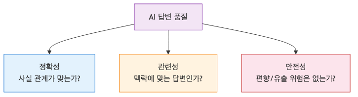
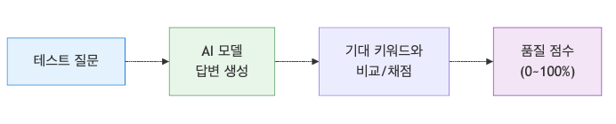
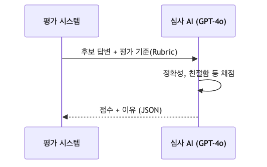
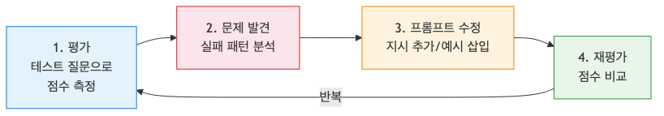
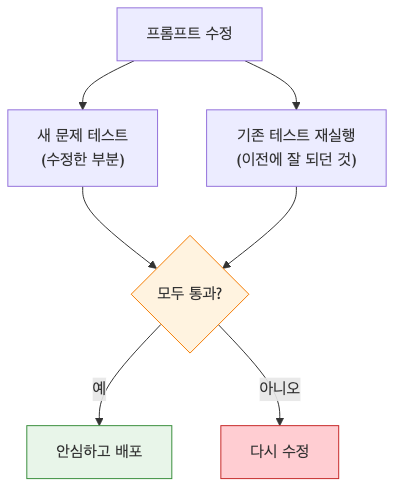

# AI 앱의 평가와 개선, 품질을 측정하고 더 좋게 만드는 법

AI 앱은 배포했다고 끝나지 않습니다. 오히려 그때부터가 시작입니다. 사용자는 곧 “가끔 엉뚱한 답을 한다”, “어제는 되던 질문이 오늘은 이상하다”, “너무 장황하다” 같은 문제를 드러내기 시작합니다.

이 글은 AI 웹 개발 입문 시리즈의 마지막 글입니다.

여기서는 배포 이후에도 답변 품질을 측정하고 개선하는 평가 관점을 정리합니다.

## 이 글에서 다룰 문제

- AI 앱에서 평가는 왜 선택이 아니라 운영 업무일까요?
- 답변 품질은 어떤 축으로 나눠 봐야 할까요?
- 가장 작은 자동 평가는 어떻게 시작할 수 있을까요?
- LLM-as-Judge는 언제 유용할까요?
- 평가 결과를 프롬프트와 RAG 개선으로 어떻게 연결할까요?

> AI 품질 평가는 “좋아 보인다”를 숫자와 사례로 바꾸는 일입니다. 모델이 확률적으로 답하는 이상, 바뀐 프롬프트나 모델이 실제로 나아졌는지 확인하려면 입력 세트와 판정 기준을 따로 가져야 합니다.

## 왜 평가가 필요한가

전통적인 소프트웨어는 같은 입력에 같은 출력이 나오는지 확인하면 됩니다. 하지만 AI 앱은 같은 질문에도 답이 조금씩 달라질 수 있고, 프롬프트를 조금만 바꿔도 다른 질문에서 회귀가 생길 수 있습니다.

예를 들어 프롬프트를 고쳐서 A 질문 품질은 좋아졌는데, 이전에 잘 되던 B 질문이 무너질 수 있습니다. 눈대중으로 두세 개만 테스트해서는 이런 변화를 놓치기 쉽습니다. 그래서 평가가 필요합니다.



정확도 회귀 비용 관점에서 본 평가 필요성

평가가 필요한 이유는 크게 세 가지입니다.

1. 객관적인 기준 확보: “좋아진 것 같다”가 아니라 점수와 통계로 말할 수 있어야 합니다.
2. 회귀 테스트: 프롬프트나 모델을 바꿨을 때 기존 기능이 망가지지 않았는지 확인해야 합니다.
3. 비용 효율성 판단: 비싼 모델이 항상 필요한지, 더 저렴한 모델로 충분한지 비교할 수 있어야 합니다.

## AI 품질을 보는 세 가지 축

입문 단계에서는 아래 세 축만 잡아도 평가 관점이 꽤 선명해집니다.

- 정확성(Accuracy): 사실 관계가 맞는가
- 관련성(Relevance): 질문 의도에 맞는 답인가
- 안전성(Safety): 유해 표현, 개인정보 노출, 위험한 지시를 포함하지 않는가

서비스마다 우선순위는 다를 수 있습니다. 고객 지원 봇이라면 정확성과 안전성이 우선일 수 있고, 아이디어 생성 도구라면 관련성과 톤 일관성이 더 중요할 수 있습니다. 중요한 것은 모든 앱에 하나의 절대 점수가 있는 것이 아니라, 서비스 목적에 맞는 평가 축을 먼저 고르는 일입니다.



정확성 관련성 안전성으로 나뉜 답변 품질 기준

## 가장 쉬운 평가 시작법

가장 먼저 할 수 있는 일은 입력과 기대 출력을 작게라도 모으는 것입니다. 이름이 거창하게 들려도, 결국 “이 질문에는 이런 요소가 들어가야 한다”는 테스트 세트를 만드는 작업입니다.

### 1. 입력과 기대값 쌍 만들기

```json
[
  {
    "question": "이 서비스의 가격은 얼마인가요?",
    "expected_keywords": ["월 9,900원", "무료 체험", "구독"],
    "category": "pricing"
  },
  {
    "question": "비밀번호를 잊어버렸어요.",
    "expected_keywords": ["이메일 인증", "비밀번호 재설정", "마이페이지"],
    "category": "support"
  }
]
```

이런 데이터셋이 있으면 프롬프트나 모델을 바꿀 때마다 같은 질문 묶음을 다시 돌려 비교할 수 있습니다.

### 2. 가장 단순한 자동 점수

```python
def evaluate_response(response, expected_keywords):
    score = 0
    for keyword in expected_keywords:
        if keyword in response:
            score += 1
    return score / len(expected_keywords)

# 예시 실행
user_query = "가격 알려줘"
ai_response = "저희 서비스는 월 9,900원에 이용 가능하며, 첫 달은 무료 체험 기간입니다."
expected = ["월 9,900원", "무료 체험"]

print(f"품질 점수: {evaluate_response(ai_response, expected) * 100}%")
```

키워드 기반 평가는 단순하지만 출발점으로는 충분합니다. 최소한 “이 답변이 꼭 포함해야 할 정보는 들어갔는가”를 빠르게 체크할 수 있기 때문입니다.

여기서 한 단계 더 가면, 질문 세트를 한 번에 돌려 평균 점수와 실패 사례를 함께 볼 수 있습니다.

```python
test_cases = [
    {
        "question": "가격 알려줘",
        "response": "월 9,900원이며 첫 달은 무료 체험이 제공됩니다.",
        "expected": ["월 9,900원", "무료 체험"],
    },
    {
        "question": "비밀번호를 잊어버렸어요",
        "response": "로그인 화면에서 비밀번호 재설정을 진행하세요.",
        "expected": ["비밀번호 재설정", "이메일 인증"],
    },
]

scores = []
for case in test_cases:
    score = evaluate_response(case["response"], case["expected"])
    scores.append(score)
    print(case["question"], score)

print("average", sum(scores) / len(scores))
```

이 정도만 있어도 프롬프트를 바꾸기 전과 후를 비교하는 회귀 테스트의 출발점이 됩니다.

## LLM-as-Judge

키워드 검사만으로는 자연스러움, 설명 충분성, 어조 같은 요소를 평가하기 어렵습니다. 이때는 더 강한 모델을 판정자로 써서 결과를 채점하게 할 수 있습니다. 이를 LLM-as-Judge라고 부릅니다.

핵심은 판정 모델에게도 평가 기준을 아주 분명하게 주는 것입니다.

```text
### 역할
당신은 AI 답변 품질 평가 전문가입니다.

### 평가 기준
1. 정확성 (1-5점): 답변이 제공된 문서의 내용과 일치하는가?
2. 친절함 (1-5점): 사용자에게 예의 바르게 답변했는가?

### 출력 형식
JSON 형태로 점수와 이유를 출력하세요.
{
  "accuracy": 5,
  "politeness": 4,
  "reason": "..."
}
```

이렇게 하면 사람이 모든 답변을 일일이 읽지 않아도, 수백 건 단위의 응답을 일정한 루브릭으로 비교할 수 있습니다. 물론 판정 모델도 완벽하지 않으므로, 중요한 변경 전에는 일부 샘플을 사람이 함께 검토하는 편이 좋습니다.

실제로는 판정 결과를 저장 가능한 형태로 남겨야 다음 실험과 비교할 수 있습니다.

```python
evaluation_report = {
    "model": "gpt-4o-mini",
    "prompt_version": "v3",
    "cases": [
        {"question": "가격 알려줘", "score": 1.0},
        {"question": "비밀번호를 잊어버렸어요", "score": 0.5},
    ],
}

failed_cases = [case for case in evaluation_report["cases"] if case["score"] < 0.8]
print(failed_cases)
```

이런 식으로 실패 케이스를 바로 뽑을 수 있어야 “무엇을 고칠지”가 선명해집니다.



판정 모델이 답변 품질을 채점하는 흐름

## 평가를 개선으로 연결하는 사이클

평가는 그 자체가 목표가 아니라 개선 루프를 만들기 위한 장치입니다. 아래 순서를 반복하면 됩니다.

1. 평가: 현재 프롬프트나 모델로 테스트 세트를 실행합니다.
2. 문제 발견: 낮은 점수 사례를 모아 실패 패턴을 찾습니다.
3. 수정: 프롬프트, 검색 전략, 시스템 규칙, 모델 선택을 조정합니다.
4. 재평가: 같은 테스트 세트로 다시 비교합니다.

이 과정이 중요한 이유는, AI 품질 개선이 직감 싸움으로 흐르기 쉽기 때문입니다. 실패 사례를 분류하지 않으면 계속 손봐도 무엇이 좋아졌는지 알기 어렵습니다.



평가 결과를 다음 수정에 반영하는 순환 구조

## RAG 챗봇을 개선하는 예

4편에서 만든 RAG 챗봇을 떠올려 보겠습니다. 테스트 질문 5개 중 2개에서 환각이 나왔다면, 막연히 “모델이 별로다”라고 결론 내리기보다 실패 원인을 나눠 봐야 합니다.

### 1단계: 현재 품질 측정

질문 다섯 개를 같은 조건으로 돌려 보고, 어떤 질문에서 환각이 났는지 기록합니다.

### 2단계: 문제점 파악

질문과 관련된 문서 조각을 제대로 찾지 못했는지, 찾았는데도 모델이 근거 밖의 내용을 덧붙였는지 구분합니다.

### 3단계: 전략 수정

- 청킹 전략 변경: 문서 조각을 조금 더 크게 잡아 문맥 손실을 줄입니다.
- 프롬프트 보완: 문서에 답이 없으면 모른다고 답하게 규칙을 강화합니다.

### 4단계: 개선 결과 비교

다시 같은 질문 세트로 돌려 보고, 환각이 줄었는지 확인합니다. 이 비교가 있어야 수정이 실제 개선인지, 우연인지 판단할 수 있습니다.



기존 동작을 지키는 회귀 테스트 흐름

## 비용까지 함께 봐야 하는 이유

품질이 좋아졌더라도 비용이 과하게 늘면 운영이 어렵습니다. 그래서 평가는 품질만이 아니라 효율까지 함께 봐야 합니다.

- 모델 믹스: 단순 작업은 저렴한 모델, 복잡한 추론만 상위 모델에 맡깁니다.
- 캐싱: 자주 반복되는 질문은 저장해 두고 재사용합니다.
- 프롬프트 다이어트: 불필요하게 긴 시스템 프롬프트와 문맥을 줄입니다.

좋은 개선은 답변 품질을 높이면서도 토큰 사용량과 지연 시간을 통제하는 방향으로 가야 합니다.

## 체크리스트

- [ ] 테스트 질문 세트와 기대 기준을 따로 관리한다.
- [ ] 정확성, 관련성, 안전성 중 우선 축을 정했다.
- [ ] 프롬프트나 모델을 바꾼 뒤 같은 세트로 재평가한다.
- [ ] 품질 점수와 함께 비용, 지연 시간도 함께 본다.

## 정리

AI 앱의 평가는 선택 기능이 아니라 운영을 지속하기 위한 기본 장치입니다.

- 정확성, 관련성, 안전성 같은 평가 축을 먼저 정해야 합니다.
- 작은 테스트 세트와 단순 자동 점수만 있어도 개선 루프를 시작할 수 있습니다.
- LLM-as-Judge는 대량 평가에 유용하지만, 사람 검토와 함께 쓰는 편이 안전합니다.
- 프롬프트, RAG, 모델 선택을 바꿨다면 같은 입력 세트로 재평가해야 회귀를 잡을 수 있습니다.

이 시리즈는 여기서 마무리됩니다. 이제 여러분은 API 호출, 프롬프트 설계, 챗봇 UI, RAG, 에이전트, 배포, 평가까지 AI 웹 앱의 기본 흐름을 한 바퀴 돌았습니다. 다음 단계에서는 이 기본기를 바탕으로 더 구체적인 도메인 문제를 풀면 됩니다.

<!-- toc:begin -->
## 시리즈 목차

- [AI API 첫 걸음 — OpenAI API로 첫 번째 요청 보내기](./01-hello-ai-api.md)
- [프롬프트 엔지니어링 기초 — AI에게 원하는 답을 얻는 기술](./02-prompt-engineering.md)
- [AI 챗봇 만들기 — Next.js와 Vercel AI SDK로 실시간 채팅 구현](./03-ai-chatbot.md)
- [RAG 입문 — 내 데이터로 답하는 AI 만들기](./04-rag-intro.md)
- [AI 에이전트 첫걸음 — Tool Use로 똑똑한 AI 만들기](./05-ai-agent.md)
- [AI 웹 앱 배포하기: Vercel과 Azure에 올리고 운영하기](./06-deploy.md)
- **AI 앱의 평가와 개선, 품질을 측정하고 더 좋게 만드는 법 (현재 글)**

<!-- toc:end -->

## 참고 자료

- [OpenAI Cookbook: Evaluation examples](https://cookbook.openai.com/categories/evaluation)
- [OpenAI Evals Design Guide](https://platform.openai.com/docs/guides/evals)
- [OpenAI Prompt Engineering Guide](https://platform.openai.com/docs/guides/prompt-engineering)
- [DeepLearning.AI: Evaluating and Debugging Generative AI](https://www.deeplearning.ai/short-courses/evaluating-debugging-generative-ai/)

Tags: AI, LLM, 웹 개발, Python, Tutorial
