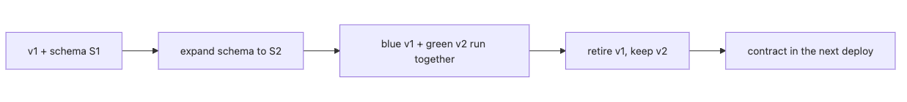

# Deploy ordering and blue/green: synchronizing schema and application code safely

Many schema incidents begin with deploy ordering, not with the migration code itself. In blue/green or rolling setups, two app versions may share one database, so compatibility width has to be designed up front.

This is post 9 in the Alembic 101 series. Here we will pin down the safe order for shipping migrations and application code together.

## What you will learn

- The difference between migration-first and code-first deploy ordering
- Why a blue/green deploy requires schema changes that are compatible with two app versions at once
- How to split a NOT NULL tightening into two phases via expand-contract
- The four-phase pattern for a column rename
- How to run a migration exactly once across many application instances

## Why this matters

Most production schema incidents are caused by code and schema being deployed in the wrong order. If a new column exists before the code that uses it, you are safe. If the code starts using a new column before the schema catches up, you get an immediate 500. In a blue/green deploy two app versions hit the same database at the same time, so the schema must always be compatible with both.

## Mental Model

> A migration always ships **"before the code, and with broader compatibility than the code"**. When you add a column the column exists first; when you drop a column the code stops using it first. Memorize those two directions and most deploy incidents disappear.

If git is your analogy, a migration is a PR that lands earlier than the code PR, and a drop is a PR that lands later than the "stop using" PR.

### Diagram: the blue/green compatibility window


*The expanded schema must stay compatible with both versions throughout the overlap window.*

## Core concepts

### migration-first vs code-first

| Change kind | Deploy order | Reason |
| --- | --- | --- |
| **Add column / table** | migration → code | The column must already exist before the code can use it |
| **Drop column / table** | code → migration | Drop only after the code stops using it |
| **Type widen** (`String(50)` → `String(100)`) | migration → code | Bigger storage must be available before code writes wider values |
| **Type narrow** | code → migration | Narrow only after code starts writing smaller values |

The key rule is that the previous version of the code must keep working during the transition. That is the basic assumption of blue/green and rolling deploys.

### Schema compatibility requirement under blue/green

```text
t0: only blue (v1) running, schema=S1
t1: migrate schema to S2 (S1, S2 both compatible with v1)
t2: bring up green (v2); blue (v1) and green (v2) run concurrently (both work with S2)
t3: shut down blue, only green runs
t4 (next deploy): migrate schema to S3 (now safe to drop S2 compatibility)
```

The schema change at t1 must be compatible with both v1 and v2. This is exactly why expand-contract is mandatory.

### NOT NULL tightening as two phases

Bundling `nullable=False` into a single revision is an immediate incident under blue/green. Split it into two phases.

```text
phase 1 (now):
  - DB: add column as nullable=True with a default
  - code: always writes a value into the new column
  - deploy: migration → code

gate before phase 2:
  - query: SELECT COUNT(*) FROM users WHERE phone IS NULL
  - pass: null_count == 0
  - fail: null_count > 0, stop the tighten revision and keep backfilling

phase 2 (next deploy):
  - DB: tighten column to nullable=False
  - code: unchanged
  - deploy: migration only
```

Here `users.phone` is the concrete example flow. Even after v2 starts writing `phone`, older rows can remain NULL, so phase 2 is only allowed once the `null_count == 0` gate has been proved.

### Four phases for a column rename

```text
phase 1: add new column (nullable=True); code keeps using the old column
phase 2: code dual-writes (writes both old and new)
phase 3: backfill data; code reads and writes only the new column
phase 4: drop the old column (code already stopped using it)
```

Each phase is its own PR, and you confirm production stability between phases. It takes time, but it is the safest pattern available.

### Late-stage rollout state table

For changes such as `users.phone`, where add → write → tighten spans multiple deploys, a late-stage state table is often the fastest way to decide whether you may proceed.

| Phase | DB shape | Code behavior | Allowed next action |
| --- | --- | --- | --- |
| Right after the expand revision | `phone` exists, nullable | v1 ignores it; v2 not deployed yet | Deploy v2 |
| Blue/green overlap | `phone` exists, nullable | v1 ignores it; v2 writes `phone` | Keep backfilling and measure NULL rows |
| Gate passed before tighten | `phone` exists, nullable, zero NULL rows | only v2 is live, write path stable | Apply the `nullable=False` tighten revision |
| After contract | `phone` exists, NOT NULL | only v2 is live; reads and writes use `phone` | Run smoke tests, then consider dropping the old column in the next deploy cycle |

### Running once across many instances

If every application instance runs `alembic upgrade` you create a race condition. Alembic itself takes a lock on the `alembic_version` table, but a safer approach is one of the following.

- **Have the deploy script call it exactly once**: run the migration in a separate stage before any application instance starts
- **Kubernetes Job / initContainer**: run the migration in a dedicated Job before the application containers start
- **Split the CI/CD pipeline**: place a `migrate` stage before the `deploy` stage

Calling `alembic upgrade head` at application startup is fine for single-instance dev, but is not recommended in production.

## Before-After

```text
# Before: code-first deploy, immediate 500 errors
1. deploy v2 (code that uses the new column)
2. every request fails with "no such column"
3. 30 minutes later, schema migrate
```

```text
# After: migration-first deploy
1. schema migrate (add new column as nullable=True)
2. v1 instances keep running normally (they ignore the new column)
3. deploy v2 (code that uses the new column)
4. blue/green both work correctly
```

The After pattern keeps the schema compatible with both v1 and v2 throughout the overlap. Add a NULL-row gate and a smoke test, and you can decide when to tighten based on evidence rather than optimism.

## Step-by-step walkthrough

### Step 1: schema add

```python
# revision: add_users_phone
def upgrade() -> None:
    op.add_column("users", sa.Column("phone", sa.String(20), nullable=True))

def downgrade() -> None:
    op.drop_column("users", "phone")
```

Apply via CI first. Application code does not yet touch `phone`. Both v1 and v2 keep running.

### Step 2: code deploy

Application code starts writing values into `phone`. During the blue/green overlap v1 ignores the column and v2 fills it in. Both are safe.

### Step 3: tighten to NOT NULL

Verify that every row has `phone` populated.

```python
# revision: tighten_users_phone_not_null
def upgrade() -> None:
    bind = op.get_bind()
    null_count = bind.execute(text("SELECT COUNT(*) FROM users WHERE phone IS NULL")).scalar()
    assert null_count == 0, f"{null_count} rows still NULL"
    with op.batch_alter_table("users") as batch:
        batch.alter_column("phone", existing_type=sa.String(20), nullable=False)

def downgrade() -> None:
    with op.batch_alter_table("users") as batch:
        batch.alter_column("phone", existing_type=sa.String(20), nullable=True)
```

The assertion is your safety net. If any NULL is left, the migration fails and the schema is unchanged.

### Step 4: drop the old column

When you want to remove an old column, confirm that the application no longer uses it, then apply the drop revision in the next deploy cycle.

```python
def upgrade() -> None:
    op.drop_column("users", "old_phone")

def downgrade() -> None:
    raise NotImplementedError("drop is irreversible")
```

### Step 5: align the deploy pipeline

```yaml
# CI/CD
stages:
  - test
  - migrate     # alembic upgrade head
  - deploy      # rolling update
  - smoke-test
```

Force `migrate` to always run before `deploy`.

## Cutover runbook

```bash
set -euo pipefail

export DATABASE_URL="postgresql+psycopg://app:secret@db/prod"
export GREEN_DEPLOYMENT="api-green"
export RELEASE_IMAGE="ghcr.io/acme/api:v2"
export HEALTH_URL="https://api.example.com/health"

echo "[1/5] apply expand revision"
alembic upgrade add_users_phone

echo "[2/5] deploy the app version that writes users.phone"
kubectl set image deployment/"$GREEN_DEPLOYMENT" api="${RELEASE_IMAGE}"
kubectl rollout status deployment/"$GREEN_DEPLOYMENT" --timeout=180s

echo "[3/5] block contract until users.phone has no NULL rows"
NULL_COUNT="$({ python3 - <<'PY'
import os
from sqlalchemy import create_engine, text

engine = create_engine(os.environ["DATABASE_URL"])
with engine.connect() as conn:
    count = conn.execute(text("SELECT COUNT(*) FROM users WHERE phone IS NULL")).scalar_one()
print(count)
PY
})"
[ "$NULL_COUNT" = "0" ] || {
  echo "Fail: users.phone still has $NULL_COUNT NULL rows; do not run tighten_users_phone_not_null"
  exit 1
}
echo "Pass: users.phone NULL rows = $NULL_COUNT"

echo "[4/5] apply tighten revision"
alembic upgrade tighten_users_phone_not_null

echo "[5/5] smoke test the live service"
HEALTH_BODY="$(curl -fsS "$HEALTH_URL")"
export HEALTH_BODY
python3 - <<'PY'
import json
import os

payload = json.loads(os.environ["HEALTH_BODY"])
assert payload["status"] == "ok", payload
print(f"Pass: status={payload['status']} alembic_version={payload.get('alembic_version', 'unknown')}")
PY
```

The observable signals should be explicit.

- If `[3/5]` does not produce `Pass: users.phone NULL rows = 0`, the run stops before the tighten revision.
- `kubectl rollout status` must finish before you continue the cutover.
- The final Python check passes only when `/health` returns `status=ok`.

### First checks during a blue/green incident

Before deeper analysis, answer these four questions first.

1. Did the `migrate` stage actually run before `deploy`?
2. Which application version is live right now: v1 or v2?
3. Has `tighten_users_phone_not_null` already been applied?
4. How many rows still match `SELECT COUNT(*) FROM users WHERE phone IS NULL`?

Those four checks quickly narrow the problem to deploy ordering, the live app version, an early tighten, or incomplete data backfill.

## Common mistakes

- **Code-first deploy.** If the code assumes the new schema first, you fail immediately.
- **Bundling NOT NULL into one revision.** The moment v1 writes a NULL under blue/green, you fail.
- **Dropping immediately.** Dropping right after the code stops using a column is dangerous; wait one deploy cycle.
- **Calling `alembic upgrade head` at application startup.** Race conditions and partial application risk under multi-instance.
- **Renaming in a single phase.** It decomposes into drop+add and you lose data; the four-phase dual-write pattern is mandatory.

## Production patterns

- **Split CI stages: `migrate` before `deploy`.** The simplest and most effective rule.
- **NOT NULL tightening always in two phases.** Insert a data verification migration in between.
- **Drop is delayed by one deploy cycle.** Never drop immediately.
- **Kubernetes initContainer pattern.** Use a Job to guarantee exactly-once execution.
- **`alembic check` before deploy.** Auto-detects model/schema drift.
- **Make expand-contract phase part of the PR template.** Force "which phase is this" to be explicit.

## Checklist

- [ ] Every schema add ships before the code deploy
- [ ] Every schema drop ships in the deploy cycle after the code stops using it
- [ ] NOT NULL tightenings are split into two phases
- [ ] Renames follow the four-phase dual-write pattern
- [ ] Application startup does not call `alembic upgrade`
- [ ] CI/CD has `migrate` before `deploy`
- [ ] Under Kubernetes, an initContainer or Job guarantees exactly-once execution

## Exercises

1. Simulate the add-column → code-deploy → NOT NULL tightening flow on SQLite end to end.
2. Write a column rename as a four-phase dual-write and draw the per-phase PR sequence.
3. Split your CI/CD pipeline so that a `migrate` stage always precedes the `deploy` stage.

## Wrap-up and next post

Deploy ordering is an operations policy concern, not an Alembic feature. Keep the one-liner "schema first, broader compatibility" in your head and decompose every change against that rule. In blue/green, the critical point is that the schema is compatible with both versions at once.

The next post covers real team workflows: PR conventions, CI checks, and operational automation.

<!-- toc:begin -->
## In this series

- [Why Alembic, and getting to alembic init](./01-why-alembic-and-init.md)
- [env.py and target_metadata: wiring models to migrations](./02-env-py-and-target-metadata.md)
- [Your first revision: writing upgrade and downgrade by hand](./03-first-revision-upgrade-downgrade.md)
- [autogenerate: the line between what it catches and what it misses](./04-autogenerate-and-its-limits.md)
- [branches and merges: combining revisions made in parallel](./05-branches-and-merges.md)
- [Data migrations: separating schema changes from data changes](./06-data-migrations.md)
- [Online and offline modes: previewing DDL with --sql and handling SQLite batch](./07-online-vs-offline-and-batch.md)
- [Downgrade strategy: when to write it for real and when to forbid it](./08-downgrade-strategy.md)
- **Deploy ordering and blue/green: synchronizing schema and application code safely (current)**
- Production and team workflow: PR, CI, monitoring, and incident response (upcoming)

<!-- toc:end -->

## References

- [sqlalchemy/alembic GitHub repository](https://github.com/sqlalchemy/alembic)
- [Alembic: Cookbook](https://alembic.sqlalchemy.org/en/latest/cookbook.html)
- [Martin Fowler: Blue Green Deployment](https://martinfowler.com/bliki/BlueGreenDeployment.html)
- "Refactoring Databases" by Scott Ambler & Pramod Sadalage
- [Kubernetes: Init Containers](https://kubernetes.io/docs/concepts/workloads/pods/init-containers/)

Tags: Python, Alembic, SQLAlchemy, Migration
