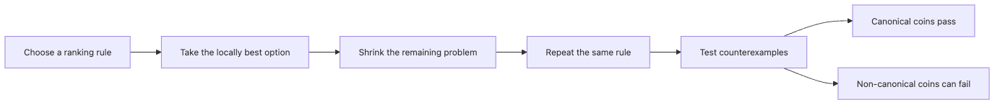

# Greedy Algorithms

Greedy algorithms are appealing because they often turn a hard-looking problem into a short implementation with strong performance. In the right setting, a single smart choice at each step is enough.

The catch is that greedy logic is not universally safe. You need to know why it works for one problem and fails for another, or the simplicity becomes a trap.

This is post 9 in the Algorithms with Python 101 series. Here, we'll examine the conditions that make greedy strategies valid and test them on classic Python examples.

## What You Will Learn

- The conditions under which greedy algorithms produce optimal solutions
- Coin change, activity selection, and fractional knapsack problems
- How greedy compares with dynamic programming
- How to verify greedy correctness with counterexamples

## Why It Matters

Greedy algorithms are concise and fast. Many problems reduce to sort + single pass at O(n log n), far more efficient than DP's typical O(n^2).

> Greedy selects the local optimum at each step, hoping to reach the global optimum.

However, greedy does not always yield the optimal answer. Both the "greedy choice property" and "optimal substructure" must hold.

## Concept Overview

> Greedy choice property = the locally optimal choice is part of the globally optimal solution

```text
Coin change (denominations: 500, 100, 50, 10):
Make change for 1,260:
→ 500 × 2 = 1,000 (remaining: 260)
→ 100 × 2 = 200   (remaining: 60)
→  50 × 1 = 50    (remaining: 10)
→  10 × 1 = 10    (remaining: 0)
Total: 6 coins — optimal via greedy
```



*A greedy algorithm is not “pick the biggest thing.” It is a rule that still has to survive counterexamples.*

## Key Concepts

| Term | Description |
|------|-------------|
| Greedy choice property | The local optimum is part of the global optimum |
| Optimal substructure | The optimal solution is composed of optimal sub-solutions |
| Activity selection | Choose the maximum number of non-overlapping activities |
| Fractional knapsack | A knapsack problem where items can be split — solvable by greedy |
| Counterexample | An input where greedy fails to produce the optimal answer |

## Before / After

Two ways to find the maximum number of non-overlapping activities.

```python
# before: brute-force all combinations — O(2^n)
from itertools import combinations

def max_activities(activities):
    best = 0
    for r in range(len(activities), 0, -1):
        for combo in combinations(activities, r):
            if not overlapping(combo):
                return r
    return best
```

```python
# after: greedy — O(n log n)
def max_activities(activities):
    activities.sort(key=lambda x: x[1])  # sort by end time
    count, last_end = 0, 0
    for start, end in activities:
        if start >= last_end:
            count += 1
            last_end = end
    return count
```

## Hands-On Steps

### Step 1: Coin Change (Greedy)

```python
def coin_change_greedy(amount: int, coins: list[int] | None = None) -> dict[int, int]:
    """Greedy coin change — use the largest coins first."""
    if coins is None:
        coins = [500, 100, 50, 10]
    result: dict[int, int] = {}

    for coin in sorted(coins, reverse=True):
        if amount >= coin:
            count = amount // coin
            result[coin] = count
            amount -= coin * count

    return result

change = coin_change_greedy(1260)
total = sum(change.values())
print(f"Change: {change}")  # {500: 2, 100: 2, 50: 1, 10: 1}
print(f"Coins used: {total}")  # 6
```

### Step 2: Activity Selection

```python
def activity_selection(
    activities: list[tuple[int, int]],
) -> list[tuple[int, int]]:
    """Select the maximum number of non-overlapping activities — O(n log n)."""
    sorted_acts = sorted(activities, key=lambda x: x[1])
    selected: list[tuple[int, int]] = []
    last_end = 0

    for start, end in sorted_acts:
        if start >= last_end:
            selected.append((start, end))
            last_end = end

    return selected

activities = [(1, 4), (3, 5), (0, 6), (5, 7), (3, 9), (5, 9),
              (6, 10), (8, 11), (8, 12), (2, 14), (12, 16)]
result = activity_selection(activities)
print(f"Selected: {result}")
# [(1, 4), (5, 7), (8, 11), (12, 16)]
print(f"Maximum activities: {len(result)}")  # 4
```

### Step 3: Fractional Knapsack

```python
def fractional_knapsack(
    items: list[tuple[int, int]], capacity: int
) -> float:
    """Fractional knapsack — O(n log n)."""
    sorted_items = sorted(
        items, key=lambda x: x[1] / x[0], reverse=True
    )
    total_value = 0.0

    for weight, value in sorted_items:
        if capacity >= weight:
            total_value += value
            capacity -= weight
        else:
            fraction = capacity / weight
            total_value += value * fraction
            break

    return total_value

items = [(10, 60), (20, 100), (30, 120)]  # (weight, value)
print(fractional_knapsack(items, 50))  # 240.0
```

### Step 4: Meeting Rooms and Interval Scheduling

```python
def min_meeting_rooms(meetings: list[tuple[int, int]]) -> int:
    """Minimum meeting rooms required — O(n log n)."""
    events: list[tuple[int, int]] = []
    for start, end in meetings:
        events.append((start, 1))
        events.append((end, -1))

    events.sort()
    max_rooms = 0
    current = 0
    for _, delta in events:
        current += delta
        max_rooms = max(max_rooms, current)

    return max_rooms

meetings = [(0, 30), (5, 10), (15, 20)]
print(f"Minimum rooms: {min_meeting_rooms(meetings)}")  # 2
```

### Step 5: Greedy vs DP

```python
# Greedy fails with non-standard coin denominations
# Coins: [1, 3, 4], amount: 6
# Greedy: 4+1+1 = 3 coins
# Optimal: 3+3 = 2 coins

def coin_change_greedy_count(coins: list[int], amount: int) -> int:
    count = 0
    for coin in sorted(coins, reverse=True):
        count += amount // coin
        amount %= coin
    return count

def coin_change_dp(coins: list[int], amount: int) -> int:
    dp = [float("inf")] * (amount + 1)
    dp[0] = 0
    for i in range(1, amount + 1):
        for coin in coins:
            if coin <= i and dp[i - coin] + 1 < dp[i]:
                dp[i] = dp[i - coin] + 1
    return dp[amount]

coins = [1, 3, 4]
amount = 6
print(f"Greedy: {coin_change_greedy_count(coins, amount)} coins")  # 3 (4+1+1)
print(f"DP:     {coin_change_dp(coins, amount)} coins")            # 2 (3+3)
```

## What to Notice in This Code

- Greedy hinges on sorting: sort by the right criterion and a single pass solves the problem
- Activity selection sorts by end time — this is what makes the greedy choice optimal
- Fractional knapsack sorts by value-to-weight ratio; greedy works because items can be split
- The non-standard coin example shows why counterexamples matter

## 5 Common Mistakes

| Mistake | Why It's a Problem | How to Fix It |
|---------|-------------------|---------------|
| Not verifying greedy correctness | Returns suboptimal results | Find a counterexample or prove the greedy choice property |
| Wrong sort criterion | Selects in the wrong order | Verify the sort key matches the problem's optimal strategy |
| Applying greedy to 0-1 knapsack | Items cannot be split, so greedy is suboptimal | Use DP for 0-1 knapsack |
| Always using greedy for coin change | Fails with non-standard denominations | Check whether denominations form a divisibility chain |
| Using greedy where DP is needed | Local optimum is not global optimum | Verify the greedy choice property |

## Real-World Applications

- Huffman coding builds an optimal compression tree with a greedy strategy
- Job scheduling assigns tasks with deadlines to maximize profit
- Minimum spanning trees (Kruskal, Prim) use greedy edge selection
- Cache replacement policies (LRU) are grounded in greedy heuristics
- API rate-limit optimization batches requests greedily

## How Senior Engineers Think About This

Greedy is not a "try it and see" algorithm. Without verifying correctness, you get code that passes most inputs but fails on specific edge cases.

In a coding interview, if you propose a greedy solution, you should be able to explain in one sentence why greedy is optimal. If you cannot, consider DP instead.

## How to validate a greedy rule before shipping it

- Write the selection rule in one sentence first. If you cannot state it clearly, you cannot verify it.
- Construct small counterexamples on purpose. Passing a few happy-path inputs is not evidence that the greedy rule is correct.
- In production systems, compare more than optimality. A slightly less optimal greedy rule may still win on implementation simplicity, recomputation cost, and predictability.
- If you keep adding exceptions to rescue the rule, step back and reclassify the problem. It may be a DP or graph-optimization problem instead.

## Checklist

- [ ] Explain the conditions under which greedy produces optimal solutions
- [ ] Solve the activity selection problem with greedy
- [ ] Explain the difference between fractional knapsack and 0-1 knapsack
- [ ] Find a counterexample where greedy fails
- [ ] Distinguish when to use greedy vs DP

## Exercises

1. Build a Huffman coding tree from character frequencies.
2. Given a list of jobs with deadlines and profits, find the maximum-profit schedule.
3. Gas station problem: find the minimum number of refueling stops to travel across N cities.

## Summary and Next Steps

Greedy algorithms make the locally optimal choice at each step. They are efficient — often sort + single pass — but do not always guarantee the optimal solution. In the final article, we wrap up the series with a practical guide to coding test problem-solving strategies.

<!-- toc:begin -->
- [What Are Algorithms?](./01-what-are-algorithms.md)
- [Time Complexity and Big-O](./02-time-complexity-and-big-o.md)
- [Linear Search and Binary Search](./03-linear-and-binary-search.md)
- [Sorting Algorithms](./04-sorting-algorithms.md)
- [Recursion and Divide and Conquer](./05-recursion-and-divide-and-conquer.md)
- [Dynamic Programming Basics](./06-dynamic-programming-basics.md)
- [Graph Traversal — BFS and DFS](./07-graph-traversal-bfs-dfs.md)
- [Shortest Path Basics](./08-shortest-path-basics.md)
- **Greedy Algorithms (current)**
- Coding Test Problem-Solving Strategies (upcoming)
<!-- toc:end -->

## References

- [Wikipedia — Greedy Algorithm](https://en.wikipedia.org/wiki/Greedy_algorithm)
- [GeeksforGeeks — Greedy Algorithms](https://www.geeksforgeeks.org/greedy-algorithms/)
- [Real Python — Greedy Algorithms in Python](https://realpython.com/python-greedy-algorithm/)
- [LeetCode — Greedy Problems](https://leetcode.com/tag/greedy/)

Tags: Python, Algorithms, Greedy, Optimization, Activity Selection
