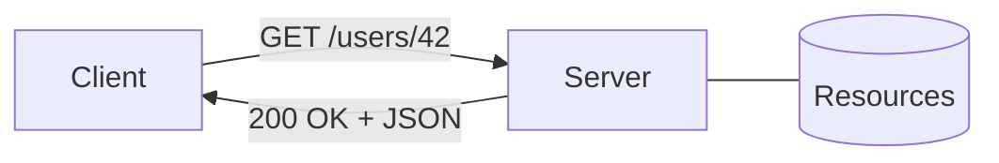

# REST Basics

> API Design 101 series (2/10)

<!-- a-grade-intro:begin -->

**Core question**: REST is not just a *URL convention* — what is it really?

> It is the set of *six architectural constraints* defined by Roy Fielding. At its center sits the *resource*.

<!-- a-grade-intro:end -->

## What You Will Learn

- The definition and history of REST
- The six architectural constraints
- Resource-centric thinking
- The intuition behind HTTP method mapping
- What looks like REST but is not (RPC over HTTP)

## Why It Matters

REST is the most common API style. Follow it well and your API becomes *predictable*; follow it poorly and it becomes *something I have seen before but cannot quite recognize*. Internalize the core and every later episode becomes easier.

> Understand *why* the rule exists, not only the rule.

## Concept at a Glance



Resources are identified by URLs; actions are expressed as HTTP methods.

## Key Terms

- **Resource**: the *noun* an API exposes (users, orders, posts).
- **Representation**: the format a resource is returned in (JSON, XML).
- **Stateless**: the server stores no client state between calls.
- **Uniform Interface**: the call conventions are consistent.
- **HATEOAS**: responses include links to *next actions*.

## Before / After

**Before (RPC style)**

```http
POST /getUser?id=42
POST /createUser
POST /deleteUser?id=42
```

Verbs leak into the URL.

**After (REST style)**

```http
GET    /users/42
POST   /users
DELETE /users/42
```

Resources live in the URL; actions live in the method.

## Hands-on: Walking Through the Six Constraints

### Step 1 — Client and Server Separation

```python
# 1_client_server.py
# Client owns the UI; server owns the data — either side must be replaceable
import requests
print(requests.get("https://api.github.com").status_code)
```

The server can change implementation and the client survives.

### Step 2 — Stateless Calls

```python
# 2_stateless.py
import requests
# Every call is *self-contained* — credentials travel each time
headers = {"Authorization": "token TEST"}
requests.get("https://api.example.com/me", headers=headers)
```

The server does not *remember* sessions — every call must carry what it needs.

### Step 3 — Cacheable Responses

```python
# 3_cache.py
from flask import Flask, jsonify
app = Flask(__name__)

@app.get("/articles/1")
def article():
    resp = jsonify(id=1, title="REST Basics")
    resp.headers["Cache-Control"] = "public, max-age=60"
    return resp
```

Make caching *explicit* in the response.

### Step 4 — Uniform Interface

```python
# 4_uniform.py
# Same resource, different methods
# GET    /users/42  -> read
# PUT    /users/42  -> replace
# DELETE /users/42  -> remove
```

Consistent conventions reduce learning cost.

### Step 5 — Layered + Code on Demand

```python
# 5_layered.py
# Client -> CDN -> LB -> App -> DB
# The client only knows the *next layer*
```

You can insert caches or gateways without changing client code.

## What to Notice in This Code

- *Methods* express verbs; *URLs* express nouns.
- Tokens travel each call — sessions do not live on the *server*.
- Headers like `Cache-Control` are part of the API contract too.

## Five Common Mistakes

1. **Verbs in URLs.** `/getUser` — an RPC tell.
2. **POST for everything.** Throws away method semantics.
3. **Server-side sessions.** Blocks horizontal scaling.
4. **Errors returned as 200.** Clients cannot branch.
5. **Treating REST as only a URL style.** Forgetting the six constraints.

## How This Shows Up in Production

GitHub, Stripe, GitLab — most public APIs are *mostly REST*. Pure HATEOAS is rare, but *resource-centric design + uniform interface* has become the standard. Internal teams default to REST and add GraphQL or gRPC only where the trade-off pays off.

## How a Senior Engineer Thinks

- Define the *boundary* of each resource first.
- Let methods express *state transitions* on the resource.
- Treat caching, auth, and errors as part of the formal contract.
- Do not turn REST into a religion — RPC has its place.
- Always ask: is this *predictable* from the client side?

## Checklist

- [ ] No verbs in URLs?
- [ ] Methods carry the same meaning across resources?
- [ ] Responses include appropriate cache headers?
- [ ] Auth is self-contained on every call?
- [ ] Error status codes are unambiguous?

## Practice Problems

1. Pick a familiar REST API; list five endpoints with method, URL, and meaning.
2. Extend the Step 4 Flask example with `PUT /articles/1`.
3. Implement the same feature once as RPC over HTTP and once as REST; compare.

## Wrap-up and Next Steps

REST is the *sum of six constraints*. The next episode dives into the heart of those constraints — resource design.

<!-- toc:begin -->
- [What Is an API?](./01-what-is-an-api.md)
- **REST Basics (current)**
- Resource Design (upcoming)
- HTTP Methods and Status Codes (upcoming)
- Request and Response Schemas (upcoming)
- Pagination and Filtering (upcoming)
- Designing Error Responses (upcoming)
- OpenAPI and Swagger (upcoming)
- API Versioning (upcoming)
- Writing Good API Documentation (upcoming)
<!-- toc:end -->

## References

- [Roy Fielding — Architectural Styles (Ch. 5)](https://www.ics.uci.edu/~fielding/pubs/dissertation/rest_arch_style.htm)
- [REST API Tutorial (restfulapi.net)](https://restfulapi.net/)
- [HTTP overview (MDN)](https://developer.mozilla.org/en-US/docs/Web/HTTP/Overview)
- [Richardson Maturity Model (Martin Fowler)](https://martinfowler.com/articles/richardsonMaturityModel.html)

Tags: Computer Science, APIDesign, REST, HTTP, Backend, WebDevelopment
