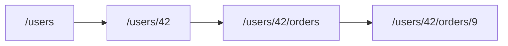

# Resource Design

Good REST URLs come from solid resource modeling, naming, hierarchies, and identifiers, not from path style alone.

This is post 3 in the API Design 101 series.

## What You Will Learn

- How to draw resource boundaries
- Rules for nouns, plurals, and hierarchy
- Modeling sub-resources
- Choosing and exposing identifiers
- Anti-patterns that keep coming back

## Why It Matters

Once a URL is public, it is *expensive to change*. A bad resource model warps every later decision — methods, status codes, documentation. Resource design is *half of API design*.

> If your resources wobble, everything wobbles.

## Concept at a Glance



Collection → item → sub-collection → sub-item.

## Key Terms

- **Collection**: a set of same-kind resources — `/users`.
- **Item**: one element of a collection — `/users/42`.
- **Sub-resource**: a resource that *belongs to* another — `/users/42/orders`.
- **Identifier**: the key that names a resource (id or slug).
- **Canonical URL**: the *official* path for a resource.

## Before / After

**Before (verbs, singular, flat)**

```http
GET /getUserOrder?userId=42&orderId=9
```

**After (nouns, plural, hierarchical)**

```http
GET /users/42/orders/9
```

You can read it and understand it.

## Hands-on: Five Steps to a Resource Model

### Step 1 — Start with Nouns

```text
/users
/orders
/articles
```

Plurals by default — collections hold *many*.

### Step 2 — Attach Identifiers

```text
/users/42
/orders/9
/articles/python-logging
```

Numeric ids and meaningful slugs both work.

### Step 3 — Sub-resources

```text
/users/42/orders          # the orders that belong to user 42
/users/42/orders/9        # order 9 within that scope
```

Ownership is visible in the *shape of the URL*.

### Step 4 — Collection Operations

```python
# 4_collection.py
from flask import Flask, jsonify
app = Flask(__name__)

USERS = {42: {"name": "Yeongseon"}}

@app.get("/users")
def list_users(): return jsonify(list(USERS.values()))

@app.get("/users/<int:uid>")
def get_user(uid): return jsonify(USERS[uid])
```

A collection and a single item are *different endpoints*.

### Step 5 — Restraint on Depth

```text
# Good
/users/42/orders

# Too deep
/users/42/orders/9/items/3/options/red
```

Past three levels, query parameters usually serve you better.

## What to Notice in This Code

- Every collection is plural.
- Each resource has *one* canonical URL.
- Deep nesting breaks *writing* even before it breaks reading.

## Five Common Mistakes

1. **Singular collections.** `/user` — counterintuitive.
2. **Verbs in URLs.** `/users/42/activate` — prefer `POST /users/42:activate` for explicit actions.
3. **Leaking the database schema.** Internal names like `user_tbl`.
4. **Exposing primary keys.** Auto-increment ids hurt security and portability.
5. **Multiple canonical URLs.** Two paths for one resource break caching and SEO.

## How This Shows Up in Production

GitHub's `/repos/{owner}/{repo}/issues/{number}` is the canonical example of nouns + plural + hierarchy. Stripe's `/v1/customers/{id}/sources` follows the same pattern. Larger companies write internal *URL guides* because teams keep drifting otherwise.

## How a Senior Engineer Thinks

- Look at *lifetime* — URLs live for years.
- Separate the database model from the resource model.
- Two levels by default, three by exception.
- Express *actions* as state changes; if unavoidable, mark them with `:verb`.
- Public ids should be *opaque* (UUIDs, slugs).

## Checklist

- [ ] Are all collections plural?
- [ ] No verbs in URLs?
- [ ] Each resource has *one* canonical URL?
- [ ] Depth stays at three or fewer levels?
- [ ] Public ids are decoupled from internal primary keys?

## Practice Problems

1. Sketch the resource model of an internal system — seven collections, five relationships.
2. Extend the Step 4 example with `/users/<uid>/orders`.
3. Rewrite five RPC-style endpoints in REST style.

## Wrap-up and Next Steps

Resources define the shape of your API. The next episode turns to *what actions* live on those resources — HTTP methods and status codes.

<!-- toc:begin -->
- [What Is an API?](./01-what-is-an-api.md)
- [REST Basics](./02-rest-basics.md)
- **Resource Design (current)**
- HTTP Methods and Status Codes (upcoming)
- Request and Response Schemas (upcoming)
- Pagination and Filtering (upcoming)
- Designing Error Responses (upcoming)
- OpenAPI and Swagger (upcoming)
- API Versioning (upcoming)
- Writing Good API Documentation (upcoming)
<!-- toc:end -->

## References

- [REST Resource Naming Guide (restfulapi.net)](https://restfulapi.net/resource-naming/)
- [Google API Design Guide — Resource Names](https://cloud.google.com/apis/design/resource_names)
- [GitHub REST API: Issues](https://docs.github.com/en/rest/issues/issues)
- [Stripe API Reference](https://stripe.com/docs/api)

Tags: Computer Science, APIDesign, REST, Resources, URL, Backend
