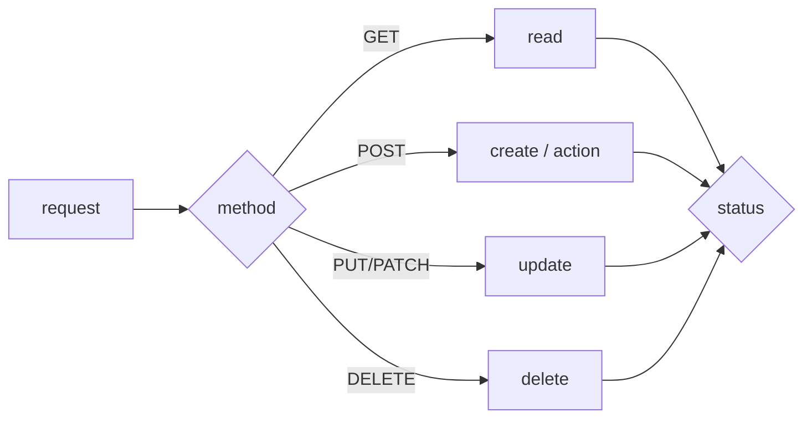

# HTTP Methods and Status Codes

Picking GET, POST, PUT, PATCH, DELETE and the right 2xx, 4xx, and 5xx response codes is what makes an API predictable to clients.

This is post 4 in the API Design 101 series.

## What You Will Learn

- The meaning of GET / POST / PUT / PATCH / DELETE
- Safe vs idempotent operations
- The 2xx / 3xx / 4xx / 5xx families
- The twelve status codes you will use most
- A method × status mapping table

## Why It Matters

Methods and status codes drive the *branching logic* on the client. Return the wrong code and the client cannot even tell whether retrying is safe. This pair determines how *predictable* your API is.

> A status code is not a *number*. It is a *contract*.

## Concept at a Glance



## Key Terms

- **Safe**: a call that does not *mutate* the resource (GET, HEAD).
- **Idempotent**: calling many times yields the *same result* (GET, PUT, DELETE).
- **2xx success** / **3xx redirect** / **4xx client error** / **5xx server error**.
- **201 Created**: creation + a `Location` header.
- **204 No Content**: success but no body.

## Before / After

**Before (intent unclear)**

```http
POST /users/42/update   200 OK   {"ok": true}
POST /users/42/delete   200 OK   {"ok": true}
```

**After (method × status)**

```http
PATCH  /users/42   200 OK
DELETE /users/42   204 No Content
```

The status alone tells you what happened.

## Hands-on: Five Patterns You Will Reuse

### Step 1 — Read (GET)

```python
# 1_get.py
from flask import Flask, jsonify, abort
app = Flask(__name__)
USERS = {42: {"id": 42, "name": "Y"}}

@app.get("/users/<int:uid>")
def get_user(uid):
    if uid not in USERS: abort(404)
    return jsonify(USERS[uid])
```

200 on success, 404 when missing.

### Step 2 — Create (POST)

```python
# 2_post.py
from flask import Flask, request, jsonify
app = Flask(__name__)
NEXT = {"id": 43}

@app.post("/users")
def create_user():
    body = request.get_json()
    uid = NEXT["id"]; NEXT["id"] += 1
    return jsonify(id=uid, **body), 201, {"Location": f"/users/{uid}"}
```

Creation returns *201 + Location*.

### Step 3 — Partial update (PATCH)

```python
# 3_patch.py
from flask import Flask, request, jsonify
app = Flask(__name__)
USERS = {42: {"id": 42, "name": "Y"}}

@app.patch("/users/<int:uid>")
def patch_user(uid):
    USERS[uid].update(request.get_json())
    return jsonify(USERS[uid])
```

PATCH is a partial change; PUT replaces the whole resource.

### Step 4 — Delete

```python
# 4_delete.py
from flask import Flask
app = Flask(__name__)
USERS = {42: {}}

@app.delete("/users/<int:uid>")
def delete_user(uid):
    USERS.pop(uid, None)
    return ("", 204)
```

Success without a body — 204.

### Step 5 — Validation failure and conflict

```python
# 5_errors.py
from flask import Flask, request, jsonify, abort
app = Flask(__name__)

@app.post("/users")
def create():
    body = request.get_json() or {}
    if "name" not in body: abort(400)        # validation
    if body["name"] == "exists": abort(409)  # conflict
    return jsonify(ok=True), 201
```

Validation failure is 400; resource conflict is 409.

## What to Notice in This Code

- The same action returns a different status when the *result* differs.
- Creation always carries a `Location` header.
- A successful empty response is 204, not 200.

## Five Common Mistakes

1. **All-200 success.** Creation, deletion, update — all 200, no information.
2. **Validation failures returned as 500.** Clients think a retry might fix it.
3. **DELETE with a body.** Breaks idempotency and cacheability.
4. **Using PATCH to fully replace.** Wrecks the meaning of PUT.
5. **Confusing 404 with 401 / 403.** Leaks security info or hides auth bugs.

## How This Shows Up in Production

Look at GitHub's responses — method × status reads almost like a textbook: 201 on create, 403 on missing scope, 429 on rate limit. Internally, memorizing the *twelve most common codes* covers ninety-five percent of situations.

## How a Senior Engineer Thinks

- Make *retryable* operations idempotent (PUT / DELETE / GET).
- Sketch the client's *branching* first, then map status codes onto it.
- `4xx` = the *user* can fix it; `5xx` = the *server* must fix it.
- Pick from standard codes; resist inventing new ones.
- Put the *detailed reason* in the body, in a consistent shape.

## Checklist

- [ ] Does creation return 201 + Location?
- [ ] Does successful deletion return 204?
- [ ] Are validation failures 400 / 422?
- [ ] Is missing auth 401 and forbidden 403?
- [ ] Are PATCH and PUT used with their distinct meanings?

## Practice Problems

1. Pick one endpoint and list five plausible 4xx codes for it.
2. Add a *duplicate username* check to Step 2 and return 409.
3. Find three non-idempotent endpoints in your code and outline how to make them idempotent.

## Wrap-up and Next Steps

Methods and status codes are a pair. The next episode looks at the data flowing between them — request and response schemas.

<!-- toc:begin -->
- [What Is an API?](./01-what-is-an-api.md)
- [REST Basics](./02-rest-basics.md)
- [Resource Design](./03-resource-design.md)
- **HTTP Methods and Status Codes (current)**
- Request and Response Schemas (upcoming)
- Pagination and Filtering (upcoming)
- Designing Error Responses (upcoming)
- OpenAPI and Swagger (upcoming)
- API Versioning (upcoming)
- Writing Good API Documentation (upcoming)
<!-- toc:end -->

## References

- [HTTP Methods (MDN)](https://developer.mozilla.org/en-US/docs/Web/HTTP/Methods)
- [HTTP Status Codes (MDN)](https://developer.mozilla.org/en-US/docs/Web/HTTP/Status)
- [RFC 7231 — HTTP/1.1 Semantics](https://www.rfc-editor.org/rfc/rfc7231)
- [Idempotency in REST APIs (Stripe blog)](https://stripe.com/blog/idempotency)

Tags: Computer Science, APIDesign, HTTP, Methods, StatusCodes, Backend
