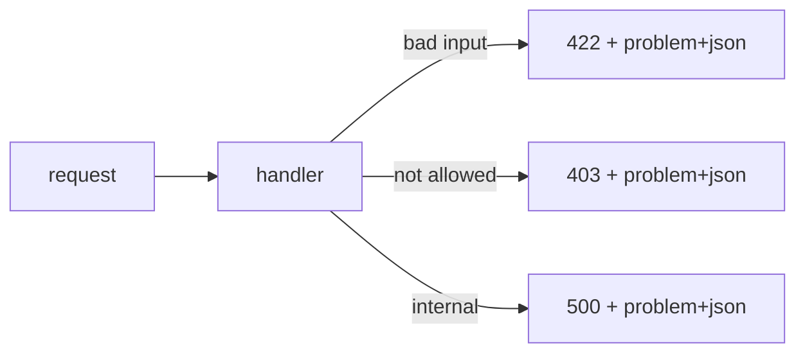

# Designing Error Responses

Error responses work better when the envelope, machine-readable code, and validation details stay consistent across the API.

This is post 7 in the API Design 101 series.

## What You Will Learn

- The four parts of an error response
- RFC 7807 `application/problem+json`
- How to express validation errors
- Separating human messages from machine codes
- Balancing security and debuggability

## Why It Matters

There is one success path and *hundreds of error paths*. If the shape is inconsistent, clients must handle each one separately — and users see only "unknown error".

> A good error response cuts *debugging time*.

## Concept at a Glance



## Key Terms

- **Status code**: the broad category — `4xx` user, `5xx` server.
- **Error code**: a stable *string identifier* — `user.not_found`.
- **Title**: a short message for humans.
- **Detail**: a longer message for humans.
- **Errors[]**: per-field list for validation failures.

## Before / After

**Before (free form)**

```json
{"error": "something went wrong"}
```

**After (RFC 7807 + code)**

```json
{
  "type": "https://example.com/errors/user-not-found",
  "title": "User not found",
  "status": 404,
  "code": "user.not_found",
  "detail": "User 42 does not exist."
}
```

## Hands-on: Five Steps for Error Responses

### Step 1 — Standard envelope

```python
# 1_envelope.py
from flask import Flask, jsonify
app = Flask(__name__)

def problem(status, code, title, detail):
    body = {"type": "about:blank", "title": title,
            "status": status, "code": code, "detail": detail}
    return jsonify(body), status, {"Content-Type": "application/problem+json"}

@app.get("/users/<int:uid>")
def user(uid):
    return problem(404, "user.not_found", "User not found", f"User {uid} does not exist.")
```

### Step 2 — Validation errors

```python
# 2_validation.py
from flask import Flask, request, jsonify
app = Flask(__name__)

@app.post("/users")
def create():
    body = request.get_json() or {}
    errs = []
    if "name" not in body: errs.append({"field": "name", "code": "required"})
    if "email" not in body: errs.append({"field": "email", "code": "required"})
    if errs:
        return jsonify(title="Validation failed", status=422,
                       code="validation_error", errors=errs), 422
    return jsonify(ok=True), 201
```

Wrap *per-field* failures in `errors[]`.

### Step 3 — Stable error codes

```
user.not_found
order.payment_required
order.already_paid
```

The code is a *string* — *more stable than the status code*.

### Step 4 — Avoid leaking secrets

```python
# 4_safe.py
# Bad : detail="No password match for user 'yeongseon'"
# Good: detail="Invalid credentials."
```

Do not even reveal whether an account exists.

### Step 5 — trace id

```python
# 5_trace.py
import uuid
from flask import Flask, jsonify, g, request
app = Flask(__name__)

@app.before_request
def set_trace():
    g.trace_id = request.headers.get("X-Trace-Id") or uuid.uuid4().hex

@app.errorhandler(500)
def server_error(e):
    return jsonify(title="Internal", status=500, trace_id=g.trace_id), 500
```

A trace id turns a *support ticket* into a five-minute lookup.

## What to Notice in This Code

- The body always has the *same shape*.
- Human (`title` / `detail`) and machine (`code`) are separated.
- The trace id rides along on every response.

## Five Common Mistakes

1. **Error body as a *string*.** Clients cannot parse it.
2. **`title` only, no error code.** Branching breaks after translation.
3. **A single message for validation.** No way to know which field.
4. **Stack traces in the body.** A direct path to a security incident.
5. **No trace id.** Every support request becomes a detective novel.

## How This Shows Up in Production

Stripe's error object (`type`, `code`, `param`, `message`) has become the de facto standard. Most large internal APIs use *RFC 7807* or a close variant — the point is *shape stability*.

## How a Senior Engineer Thinks

- Implement the error envelope as a *shared module*.
- Add new errors as new *codes*; never change the shape.
- Return the trace id on 4xx responses too.
- Always review the user-visible message — for both security and UX.
- Document the most common errors *near the top* of the docs.

## Checklist

- [ ] Do all errors share the *same envelope*?
- [ ] Are error codes stable strings?
- [ ] Are validation failures broken down per field?
- [ ] Does `detail` avoid leaking secrets?
- [ ] Is a trace id present on every response?

## Practice Problems

1. Define stable *code names* for the five most common 4xx responses in your API.
2. Add a *minimum length* check to Step 2.
3. Outline a migration from free-form errors to an RFC 7807 envelope.

## Wrap-up and Next Steps

Error responses are the API's *second face*. The next episode brings every promise into one place — OpenAPI and Swagger.

<!-- toc:begin -->
- [What Is an API?](./01-what-is-an-api.md)
- [REST Basics](./02-rest-basics.md)
- [Resource Design](./03-resource-design.md)
- [HTTP Methods and Status Codes](./04-http-methods-and-status.md)
- [Request and Response Schemas](./05-request-and-response-schema.md)
- [Pagination and Filtering](./06-pagination-and-filtering.md)
- **Designing Error Responses (current)**
- OpenAPI and Swagger (upcoming)
- API Versioning (upcoming)
- Writing Good API Documentation (upcoming)
<!-- toc:end -->

## References

- [RFC 7807 — Problem Details for HTTP APIs](https://www.rfc-editor.org/rfc/rfc7807)
- [Stripe API: Errors](https://stripe.com/docs/api/errors)
- [GitHub REST API: Errors](https://docs.github.com/en/rest/overview/troubleshooting)
- [Microsoft REST API Guidelines: Errors](https://github.com/microsoft/api-guidelines/blob/vNext/Guidelines.md)

Tags: Computer Science, APIDesign, Errors, RFC7807, Validation, Backend
