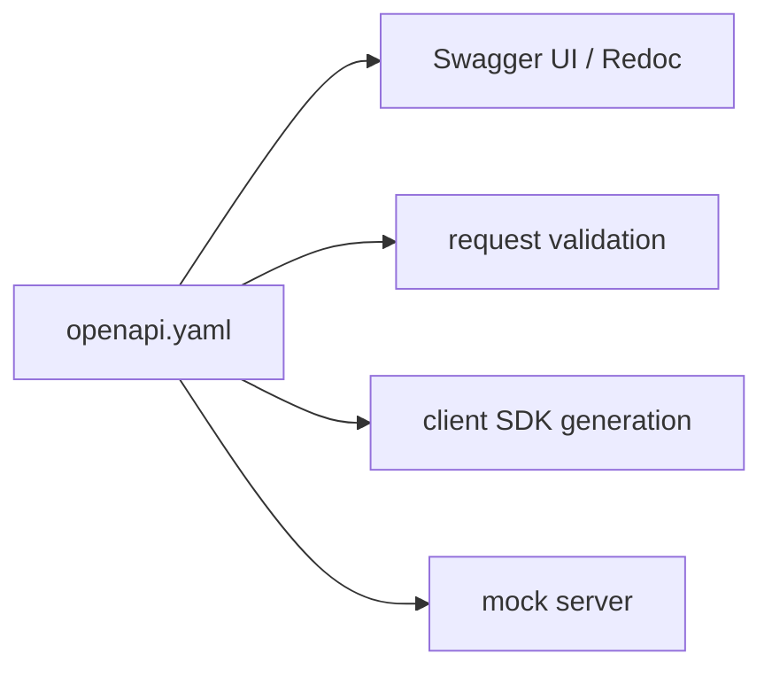

# OpenAPI and Swagger

OpenAPI 3 and Swagger UI turn one contract into docs, validation, and generated clients. The key design choice is where that contract lives.

This is post 8 in the API Design 101 series.

## What You Will Learn

- The structure of the OpenAPI 3 spec
- Swagger UI and Redoc
- Code-first vs schema-first
- Generating client SDKs
- Preventing spec drift

## Why It Matters

A single spec file produces *docs + validation + client code + mock server*. Hand-written docs *always* drift from code — automation is the answer.

> Keep one *single source of truth*.

## Concept at a Glance



## Key Terms

- **OpenAPI**: the API spec standard (formerly Swagger spec).
- **Swagger UI**: renders the spec as *clickable docs*.
- **Redoc**: an alternative, more readable renderer.
- **Code-first**: the spec is *generated* from code decorators.
- **Schema-first**: the spec is *written first*, code is generated.

## Before / After

**Before (hand-written docs)**

```
README.md "GET /users/{id} returns user. id is integer."
```

**After (slice of OpenAPI)**

```yaml
paths:
  /users/{id}:
    get:
      parameters:
        - name: id
          in: path
          required: true
          schema: {type: integer}
      responses:
        '200':
          description: User
          content:
            application/json:
              schema: {$ref: '#/components/schemas/User'}
```

## Hands-on: Five OpenAPI Steps

### Step 1 — Minimal spec

```yaml
# openapi.yaml
openapi: 3.0.0
info: {title: Demo API, version: '1.0'}
paths:
  /health:
    get:
      responses:
        '200': {description: OK}
```

Open it in Swagger UI and you get a *try-it-now* button for free.

### Step 2 — components / schemas

```yaml
components:
  schemas:
    User:
      type: object
      required: [id, name]
      properties:
        id: {type: integer}
        name: {type: string}
```

Schemas are *reusable* via `$ref`.

### Step 3 — Code-first (FastAPI)

```python
# 3_codefirst.py
from fastapi import FastAPI
from pydantic import BaseModel

class User(BaseModel):
    id: int; name: str

app = FastAPI()
@app.get("/users/{uid}")
def user(uid: int) -> User: return User(id=uid, name="Y")
# /docs and /openapi.json are generated automatically
```

### Step 4 — Swagger UI / Redoc

```http
GET /docs        # Swagger UI (try it)
GET /redoc       # Redoc (read it)
GET /openapi.json
```

Two faces of the same spec.

### Step 5 — Generate clients

```bash
# 5_gen.sh
openapi-generator-cli generate \
  -i openapi.json -g python -o ./client
```

Dozens of SDKs from *one command*.

## What to Notice in This Code

- The spec grows *with the code*.
- The same schema powers validation, docs, and SDKs.
- Hand-written docs disappear.

## Five Common Mistakes

1. **Spec and code live *separately*.** They will *certainly* drift.
2. **No examples.** Clients cannot see *what to send*.
3. **Missing error responses.** Only 200 is documented; 4xx/5xx is a *secret*.
4. **No spec versioning.** No way to track changes.
5. **Internal info in the public spec.** Internal endpoints and fields leak.

## How This Shows Up in Production

GitHub publishes its OpenAPI spec at `api.github.com/openapi`. Internally, having CI check that the spec changes whenever the code changes makes drift disappear. FastAPI and NestJS export the spec by default.

## How a Senior Engineer Thinks

- Pick *one* approach — code-first or schema-first, never both.
- Commit the spec to git and review it via PR diffs.
- Always fill in examples — users *copy-paste* to start.
- Document 4xx and 5xx in the spec, not just 200.
- Separate *public* and *internal* specs.

## Checklist

- [ ] Is the spec kept in sync with the code (checked in CI)?
- [ ] Does every endpoint have examples?
- [ ] Are 4xx / 5xx defined in the spec?
- [ ] Are `components/schemas` reused with `$ref`?
- [ ] Are public and internal specs separated?

## Practice Problems

1. Express your largest endpoint as OpenAPI.
2. Add `POST /users` to the Step 3 FastAPI app.
3. Sketch a workflow that makes spec changes part of *PR review*.

## Wrap-up and Next Steps

OpenAPI is the API's *protocol, documentation, and code* in one. The next episode looks at the discipline of *changing* a contract — versioning.

<!-- toc:begin -->
- [What Is an API?](./01-what-is-an-api.md)
- [REST Basics](./02-rest-basics.md)
- [Resource Design](./03-resource-design.md)
- [HTTP Methods and Status Codes](./04-http-methods-and-status.md)
- [Request and Response Schemas](./05-request-and-response-schema.md)
- [Pagination and Filtering](./06-pagination-and-filtering.md)
- [Designing Error Responses](./07-error-response-design.md)
- **OpenAPI and Swagger (current)**
- API Versioning (upcoming)
- Writing Good API Documentation (upcoming)
<!-- toc:end -->

## References

- [OpenAPI Specification](https://spec.openapis.org/oas/latest.html)
- [Swagger UI](https://swagger.io/tools/swagger-ui/)
- [Redoc](https://redocly.com/redoc/)
- [FastAPI: Automatic docs](https://fastapi.tiangolo.com/features/)

Tags: Computer Science, APIDesign, OpenAPI, Swagger, Documentation, Backend
