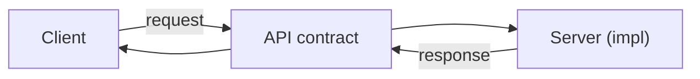

# API란 무엇인가?

> API Design 101 시리즈 (1/10)


## 이 글에서 다룰 문제

API는 시스템의 *얼굴* 입니다. 안쪽 구현이 바뀌어도 API가 안정적이면 외부는 영향받지 않습니다. 반대로 API가 흔들리면 내부 변경이 외부 폭풍이 됩니다.

> API는 *변하지 않을 약속*에 가까워야 합니다.

## 개념 한눈에 보기



클라이언트는 *약속*만 알면 됩니다.

## Before/After

**Before (약속 없는 호출)**

```python
# 클라이언트가 서버 내부 구현을 알아야 한다
data = open("/var/db/users.json").read()
```

**After (API 사용)**

```python
# 약속만 안다
import requests
data = requests.get("https://api.example.com/users").json()
```

내부 구현이 바뀌어도 클라이언트는 영향을 받지 않습니다.

## 실습: API를 이해하는 5단계

### 1단계 — 라이브러리 API 호출

```python
# 1_lib_api.py
import json
data = json.dumps({"a": 1})
print(data)
```

`json.dumps`도 API입니다 — 약속된 입력으로 약속된 출력을 돌려줍니다.

### 2단계 — 웹 API 호출

```python
# 2_web_api.py
import requests
r = requests.get("https://api.github.com/repos/python/cpython")
print(r.status_code, r.json()["full_name"])
```

HTTP는 가장 흔한 *전송 방식*입니다.

### 3단계 — 약속 살펴보기

```python
# 3_contract.py
# https://docs.github.com/en/rest 의 GET /repos/{owner}/{repo} 약속
# - 입력: owner, repo (path)
# - 출력: 200 OK + JSON (full_name, stargazers_count, ...)
```

문서가 곧 *약속*입니다.

### 4단계 — 작은 서버 만들기

```python
# 4_min_server.py
from flask import Flask, jsonify
app = Flask(__name__)

@app.get("/health")
def health(): return jsonify(status="ok")

if __name__ == "__main__":
    app.run(port=8000)
```

가장 작은 약속 — `GET /health` → `{"status": "ok"}`.

### 5단계 — 클라이언트로 확인

```python
# 5_call.py
import requests
r = requests.get("http://localhost:8000/health")
assert r.status_code == 200
assert r.json() == {"status": "ok"}
```

테스트는 약속의 *검증*입니다.

## 이 코드에서 주목할 점

- 클라이언트는 서버의 *내부* 를 모릅니다.
- 같은 약속이라면 구현은 자유롭게 바뀔 수 있습니다.
- 응답의 *상태 코드* 와 *본문* 이 약속의 양 축입니다.

## 자주 하는 실수 5가지

1. **약속 문서 없이 시작.** 클라이언트는 구현을 추측한다.
2. **상태 코드 무시.** 200으로 모든 것을 돌려보낸다.
3. **에러 본문이 자유 형식.** 클라이언트가 파싱 못 함.
4. **버전 없이 deploy.** 변경이 외부 폭풍이 된다.
5. **클라이언트 없이 설계.** 사용자 입장이 빠진다.

## 실무에서는 이렇게 쓰입니다

GitHub REST API, Stripe API, Google Maps API — 모두 *문서화된 약속* 입니다. 사내에서는 OpenAPI(Swagger) 문서가 그 역할을 합니다. 좋은 회사일수록 *내부 API* 도 외부처럼 다룹니다.

## 체크리스트

- [ ] 이 API에 *공개 문서*가 있는가?
- [ ] 입력/출력 형식이 명시되어 있는가?
- [ ] 상태 코드 목록이 명시되어 있는가?
- [ ] 에러 본문 형식이 일관되는가?
- [ ] 클라이언트가 스스로 호출 예제를 가진다.

## 정리 및 다음 단계

API는 *약속* 입니다. 다음 글에서는 그 약속의 가장 흔한 형태인 — REST 기본 — 을 봅니다.

<!-- toc:begin -->
- **API란 무엇인가? (현재 글)**
- REST 기본 (예정)
- 리소스 설계 (예정)
- HTTP method와 status code (예정)
- Request와 response schema (예정)
- Pagination과 filtering (예정)
- Error response 설계 (예정)
- OpenAPI와 Swagger (예정)
- Versioning (예정)
- 좋은 API 문서 만들기 (예정)
<!-- toc:end -->

## 참고 자료

- [What is an API? (MDN)](https://developer.mozilla.org/en-US/docs/Glossary/API)
- [GitHub REST API](https://docs.github.com/en/rest)
- [HTTP overview (MDN)](https://developer.mozilla.org/en-US/docs/Web/HTTP/Overview)
- [Flask Quickstart](https://flask.palletsprojects.com/quickstart/)

Tags: Computer Science, APIDesign, REST, HTTP, Backend, WebDevelopment
