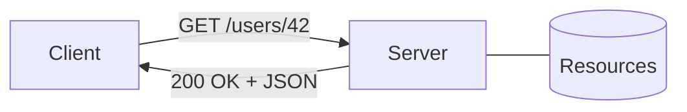

# REST 기본

이 글은 API Design 101 시리즈의 두 번째 글입니다. REST를 제대로 쓰려면 URL 모양만 흉내 내는 수준을 넘어서, 왜 이런 규칙이 생겼고 어떤 제약이 전체 구조를 지탱하는지 이해해야 합니다.

## 이 글에서 다룰 문제

- REST는 어디서 나왔고 무엇을 뜻할까요?
- REST를 이루는 여섯 가지 아키텍처 제약은 무엇일까요?
- 리소스 중심 사고는 RPC 스타일과 어떻게 다를까요?
- HTTP method는 왜 리소스와 함께 읽어야 할까요?
- REST처럼 보이지만 실제로는 REST가 아닌 API는 어떤 모습일까요?

## 왜 중요한가

REST는 가장 널리 쓰이는 API 스타일입니다. 제대로 따르면 API가 예측 가능해지고, 어설프게 따르면 익숙해 보이지만 매번 미묘하게 헷갈리는 인터페이스가 됩니다. 핵심을 정확히 이해해 두면 뒤의 모든 글이 더 쉽게 연결됩니다.

> 규칙만 외우지 말고, 그 규칙이 왜 필요한지까지 이해해야 합니다.

## 한눈에 보는 개념



URL은 리소스를 가리키고, HTTP method는 그 리소스에 대한 동작을 표현합니다.

## 핵심 용어

- **Resource**: API가 외부에 드러내는 명사입니다. 예를 들면 users, orders, posts입니다.
- **Representation**: 리소스를 어떤 형식으로 표현해 돌려주는지입니다. 보통 JSON이나 XML입니다.
- **Stateless**: 서버가 호출 사이에 클라이언트 상태를 기억하지 않는다는 뜻입니다.
- **Uniform Interface**: 호출 규칙이 일관되어 있다는 뜻입니다.
- **HATEOAS**: 응답 안에 다음 행동으로 이어지는 링크를 담는 방식입니다.

## Before / After

**Before (RPC 스타일)**

```http
POST /getUser?id=42
POST /createUser
POST /deleteUser?id=42
```

동사가 URL 안으로 새어 나옵니다.

**After (REST 스타일)**

```http
GET    /users/42
POST   /users
DELETE /users/42
```

URL에는 리소스가 있고, 동작은 method에 있습니다.

## 실습: 여섯 제약을 따라가 보기

### Step 1 — Client and Server Separation

```python
# 1_client_server.py
# Client owns the UI; server owns the data — either side must be replaceable
import requests
print(requests.get("https://api.github.com").status_code)
```

서버 구현이 바뀌어도 클라이언트는 계약만 유지되면 살아남아야 합니다.

### Step 2 — Stateless Calls

```python
# 2_stateless.py
import requests
# Every call is *self-contained* — credentials travel each time
headers = {"Authorization": "token TEST"}
requests.get("https://api.example.com/me", headers=headers)
```

각 요청은 스스로 필요한 정보를 모두 담아야 합니다. 서버가 이전 세션을 기억하는 방식에 기대면 수평 확장이 어려워집니다.

### Step 3 — Cacheable Responses

```python
# 3_cache.py
from flask import Flask, jsonify
app = Flask(__name__)

@app.get("/articles/1")
def article():
    resp = jsonify(id=1, title="REST Basics")
    resp.headers["Cache-Control"] = "public, max-age=60"
    return resp
```

캐시 가능 여부도 응답 계약의 일부로 명시해야 합니다.

### Step 4 — Uniform Interface

```python
# 4_uniform.py
# Same resource, different methods
# GET    /users/42  -> read
# PUT    /users/42  -> replace
# DELETE /users/42  -> remove
```

같은 리소스에 대해 method가 일관된 의미를 가지면 학습 비용이 크게 줄어듭니다.

### Step 5 — Layered + Code on Demand

```python
# 5_layered.py
# Client -> CDN -> LB -> App -> DB
# The client only knows the *next layer*
```

중간에 캐시나 게이트웨이를 넣어도 클라이언트 코드는 바뀌지 않아야 합니다.

## 이 코드에서 봐야 할 점

- 동작은 method가 표현하고, URL은 명사를 표현합니다.
- 인증 정보는 매 요청에 함께 이동합니다.
- `Cache-Control` 같은 헤더도 계약의 일부입니다.

## 자주 하는 실수 다섯 가지

1. **URL에 동사를 넣습니다.** `/getUser`는 RPC 스타일의 신호입니다.
2. **모든 일을 POST로 처리합니다.** method의 의미를 버리게 됩니다.
3. **서버 세션에 의존합니다.** 수평 확장을 막습니다.
4. **에러도 200으로 반환합니다.** 클라이언트가 분기하지 못합니다.
5. **REST를 URL 스타일 정도로만 이해합니다.** 여섯 제약을 놓치게 됩니다.

## 실무에서는 이렇게 드러납니다

GitHub, Stripe, GitLab 같은 공개 API는 대체로 REST 스타일을 따릅니다. 순수한 HATEOAS까지 밀어붙이는 경우는 드물지만, 리소스 중심 설계와 uniform interface는 사실상 표준이 되었습니다. 내부 시스템도 기본은 REST로 두고, GraphQL이나 gRPC는 정말 이득이 분명할 때만 선택하는 경우가 많습니다.

## 시니어 엔지니어는 이렇게 생각합니다

- 먼저 각 리소스의 경계를 정의합니다.
- method가 리소스 상태 전이를 표현하게 둡니다.
- 캐시, 인증, 에러도 정식 계약으로 취급합니다.
- REST를 종교처럼 다루지 않습니다. RPC가 더 나은 자리도 있습니다.
- 항상 클라이언트 입장에서 예측 가능한가를 묻습니다.

## 체크리스트

- [ ] URL에 동사가 없는가?
- [ ] 같은 method가 리소스마다 비슷한 의미를 가지는가?
- [ ] 응답에 적절한 cache header가 포함되는가?
- [ ] 인증 정보가 매 요청에 자기완결적으로 담기는가?
- [ ] 에러 status code가 모호하지 않은가?

## 연습 문제

1. 익숙한 REST API 하나를 골라 endpoint 다섯 개의 method, URL, 의미를 정리해 보세요.
2. Step 4 예제에 `PUT /articles/1`을 직접 추가해 보세요.
3. 같은 기능을 RPC over HTTP와 REST 두 방식으로 각각 설계해 보고 차이를 비교해 보세요.

## 정리와 다음 글

REST는 여섯 가지 제약이 함께 만드는 구조입니다. 다음 글에서는 그 중심에 있는 리소스 설계를 더 깊게 다룹니다.

<!-- toc:begin -->
- [API란 무엇인가?](./01-what-is-an-api.md)
- **REST 기본 (현재 글)**
- 리소스 설계 (예정)
- HTTP method와 status code (예정)
- Request와 response schema (예정)
- Pagination과 filtering (예정)
- Error response 설계 (예정)
- OpenAPI와 Swagger (예정)
- Versioning (예정)
- 좋은 API 문서 만들기 (예정)
<!-- toc:end -->

## 참고 자료

- [Roy Fielding — Architectural Styles (Ch. 5)](https://www.ics.uci.edu/~fielding/pubs/dissertation/rest_arch_style.htm)
- [REST API Tutorial (restfulapi.net)](https://restfulapi.net/)
- [HTTP overview (MDN)](https://developer.mozilla.org/en-US/docs/Web/HTTP/Overview)
- [Richardson Maturity Model (Martin Fowler)](https://martinfowler.com/articles/richardsonMaturityModel.html)

Tags: Computer Science, APIDesign, REST, HTTP, Backend, WebDevelopment
