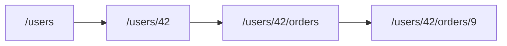

# 리소스 설계

자원 모델링과 URL 계층, 복수형과 하위 자원 규칙을 먼저 정리해 두면 이후 설계 결정이 훨씬 단단해집니다.

이 글은 API Design 101 시리즈의 3번째 글입니다.

## 이 글에서 다룰 문제

URL은 한 번 외부에 나가면 바꾸기 어렵습니다. 잘못된 자원 모델은 method와 status, 문서 같은 후속 결정까지 비뚤게 만듭니다. 자원 설계가 곧 API 설계의 절반입니다.

> 자원이 흔들리면 모든 것이 흔들립니다.

## 전체 흐름


컬렉션 → 개별 자원 → 하위 컬렉션 → 하위 개별 자원.

## Before/After

**Before (동사·단수·평탄)**

```http
GET /getUserOrder?userId=42&orderId=9
```

**After (명사·복수·계층)**

```http
GET /users/42/orders/9
```

읽기만 해도 무엇인지 보입니다.

## 자원 5단계

### 1단계 — 명사로 시작

```
/users          # 사용자들
/orders         # 주문들
/articles       # 글들
```

복수형이 기본입니다. 컬렉션은 여럿이기 때문입니다.

### 2단계 — 식별자 붙이기

```
/users/42
/orders/9
/articles/python-logging
```

숫자 id 또는 의미 있는 slug 모두 가능합니다.

### 3단계 — 하위 자원

```
/users/42/orders          # 사용자 42의 주문 컬렉션
/users/42/orders/9        # 그 중 9번 주문
```

소속 관계가 URL의 모양에 드러납니다.

### 4단계 — 컬렉션 동작

```python
# 예제 4: 컬렉션 동작
from flask import Flask, jsonify
app = Flask(__name__)

USERS = {42: {"name": "Yeongseon"}}

@app.get("/users")
def list_users(): return jsonify(list(USERS.values()))

@app.get("/users/<int:uid>")
def get_user(uid): return jsonify(USERS[uid])
```

컬렉션과 개별 자원은 서로 다른 endpoint입니다.

### 5단계 — 깊이의 절제

```
# 좋음
/users/42/orders

# 너무 깊음
/users/42/orders/9/items/3/options/red
```

3단계 이상으로 깊어지면 질의 파라미터로 바꾸는 편이 낫습니다.

## 이 코드에서 주목할 점

- 모든 컬렉션은 복수형.
- 같은 자원을 가리키는 길은 하나의 canonical URL만 둡니다.
- 깊은 계층은 읽기보다 쓰기를 먼저 깨뜨립니다.

## 자주 하는 실수 5가지

1. **단수형 컬렉션을 씁니다.** `/user`는 직관에 어긋납니다.
2. **동사를 경로에 넣습니다.** `/users/42/activate` 대신 `POST /users/42:activate` 같은 액션 전용 경로를 검토합니다.
3. **DB 스키마를 노출합니다.** `user_tbl` 같은 내부 이름이 그대로 보입니다.
4. **id를 PK 그대로 씁니다.** auto-increment 값 노출은 보안과 이식성에 모두 불리합니다.
5. **canonical URL을 여러 개 둡니다.** 같은 자원을 두 길로 열면 캐시와 SEO가 모두 흔들립니다.

## 실무에서는 이렇게 쓰입니다

GitHub의 `/repos/{owner}/{repo}/issues/{number}`는 명사, 복수형, 계층 구조를 잘 보여 줍니다. Stripe의 `/v1/customers/{id}/sources`도 같은 패턴입니다. 큰 회사일수록 URL 가이드를 사내에 명시적으로 두는데, 그만큼 자주 어긋나기 때문입니다.

## 체크리스트

- [ ] 모든 컬렉션이 복수형인가?
- [ ] URL에 동사가 없는가?
- [ ] 같은 자원의 canonical URL이 하나인가?
- [ ] 깊이가 3단계를 넘지 않는가?
- [ ] 외부 노출 id가 내부 PK와 분리되어 있는가?

## 정리 및 다음 단계

자원이 곧 API의 모양입니다. 다음 글에서는 그 자원에 어떤 동작을 매핑할지, 즉 HTTP method와 status code를 봅니다.

<!-- toc:begin -->
- [API란 무엇인가?](./01-what-is-an-api.md)
- [REST 기본](./02-rest-basics.md)
- **리소스 설계 (현재 글)**
- HTTP method와 status code (예정)
- Request와 response schema (예정)
- Pagination과 filtering (예정)
- Error response 설계 (예정)
- OpenAPI와 Swagger (예정)
- Versioning (예정)
- 좋은 API 문서 만들기 (예정)
<!-- toc:end -->

## 참고 자료

- [REST Resource Naming Guide (restfulapi.net)](https://restfulapi.net/resource-naming/)
- [Google API Design Guide — Resource Names](https://cloud.google.com/apis/design/resource_names)
- [GitHub REST API: Issues](https://docs.github.com/en/rest/issues/issues)
- [Stripe API Reference](https://stripe.com/docs/api)

Tags: Computer Science, APIDesign, REST, Resources, URL, Backend
