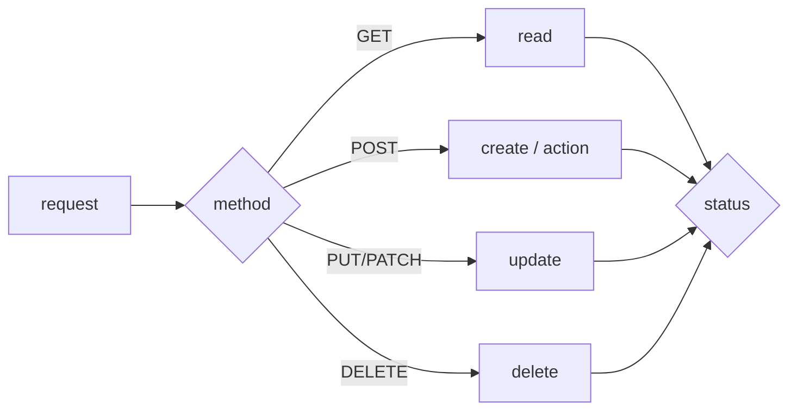

# HTTP method와 status code

이 글은 API Design 101 시리즈의 네 번째 글입니다. 클라이언트가 API를 예측 가능하다고 느끼는지 여부는 결국 어떤 method를 골랐는지, 그리고 어떤 status code를 반환하는지에 크게 달려 있습니다.

## 이 글에서 다룰 문제

- GET, POST, PUT, PATCH, DELETE는 각각 무엇을 의미할까요?
- safe와 idempotent는 어떻게 다를까요?
- 2xx, 3xx, 4xx, 5xx 계열은 어떻게 읽어야 할까요?
- 실무에서 자주 쓰는 status code 열두 개는 무엇일까요?
- method와 status를 함께 설계할 때 어떤 매핑 감각이 필요할까요?

## 왜 중요한가

method와 status code는 클라이언트의 분기 로직을 결정합니다. 잘못된 코드를 반환하면 클라이언트는 재시도가 안전한지조차 판단할 수 없습니다. 이 둘은 API의 예측 가능성을 만드는 핵심 쌍입니다.

> status code는 단순한 숫자가 아니라 계약입니다.

## 한눈에 보는 개념



## 핵심 용어

- **Safe**: 리소스를 변경하지 않는 호출입니다. GET, HEAD가 대표적입니다.
- **Idempotent**: 여러 번 호출해도 결과가 같게 유지되는 호출입니다. GET, PUT, DELETE가 여기에 가깝습니다.
- **2xx success / 3xx redirect / 4xx client error / 5xx server error**: 응답 계열입니다.
- **201 Created**: 리소스가 생성되었고 보통 `Location` header가 함께 옵니다.
- **204 No Content**: 성공했지만 본문이 없습니다.

## Before / After

**Before (의도가 불분명함)**

```http
POST /users/42/update   200 OK   {"ok": true}
POST /users/42/delete   200 OK   {"ok": true}
```

**After (method × status가 분명함)**

```http
PATCH  /users/42   200 OK
DELETE /users/42   204 No Content
```

성공 방식이 status만으로도 읽혀야 합니다.

## 실습: 반복해서 쓰게 될 다섯 패턴

### Step 1 — Read (GET)

```python
# 1_get.py
from flask import Flask, jsonify, abort
app = Flask(__name__)
USERS = {42: {"id": 42, "name": "Y"}}

@app.get("/users/<int:uid>")
def get_user(uid):
    if uid not in USERS: abort(404)
    return jsonify(USERS[uid])
```

성공이면 200, 없으면 404입니다.

### Step 2 — Create (POST)

```python
# 2_post.py
from flask import Flask, request, jsonify
app = Flask(__name__)
NEXT = {"id": 43}

@app.post("/users")
def create_user():
    body = request.get_json()
    uid = NEXT["id"]; NEXT["id"] += 1
    return jsonify(id=uid, **body), 201, {"Location": f"/users/{uid}"}
```

생성은 보통 `201 + Location`입니다.

### Step 3 — Partial update (PATCH)

```python
# 3_patch.py
from flask import Flask, request, jsonify
app = Flask(__name__)
USERS = {42: {"id": 42, "name": "Y"}}

@app.patch("/users/<int:uid>")
def patch_user(uid):
    USERS[uid].update(request.get_json())
    return jsonify(USERS[uid])
```

PATCH는 일부 수정이고, PUT은 전체 대체입니다. 둘을 섞어 쓰면 계약 의미가 흐려집니다.

### Step 4 — Delete

```python
# 4_delete.py
from flask import Flask
app = Flask(__name__)
USERS = {42: {}}

@app.delete("/users/<int:uid>")
def delete_user(uid):
    USERS.pop(uid, None)
    return ("", 204)
```

본문이 없는 성공 삭제는 204가 잘 맞습니다.

### Step 5 — Validation failure and conflict

```python
# 5_errors.py
from flask import Flask, request, jsonify, abort
app = Flask(__name__)

@app.post("/users")
def create():
    body = request.get_json() or {}
    if "name" not in body: abort(400)        # validation
    if body["name"] == "exists": abort(409)  # conflict
    return jsonify(ok=True), 201
```

입력 검증 실패는 400, 리소스 충돌은 409처럼 결과 의미에 맞춰 골라야 합니다.

## 이 코드에서 봐야 할 점

- 같은 action이라도 결과가 다르면 status도 달라집니다.
- 생성 응답에는 `Location` header가 따라옵니다.
- 비어 있는 성공 응답은 200보다 204가 더 정확합니다.

## 자주 하는 실수 다섯 가지

1. **성공을 전부 200으로 반환합니다.** 생성과 삭제, 수정의 차이가 사라집니다.
2. **검증 실패를 500으로 반환합니다.** 클라이언트는 재시도하면 될 문제라고 오해합니다.
3. **DELETE에 본문을 싣습니다.** idempotency와 캐시 의미를 흐립니다.
4. **PATCH로 전체 대체를 합니다.** PUT의 의미가 무너집니다.
5. **404와 401, 403을 혼동합니다.** 보안 정보가 새거나 인증 버그를 가립니다.

## 실무에서는 이렇게 드러납니다

GitHub 같은 성숙한 API를 보면 method와 status의 조합이 교과서처럼 읽힙니다. 생성에는 201, 권한 부족에는 403, rate limit에는 429가 옵니다. 내부 API도 자주 쓰는 status code 열두 개 정도만 정확히 익혀 두면 대부분의 상황을 설명할 수 있습니다.

## 시니어 엔지니어는 이렇게 생각합니다

- 재시도 가능한 작업은 idempotent하게 설계합니다.
- 먼저 클라이언트 분기 로직을 그린 뒤 status code를 매핑합니다.
- `4xx`는 사용자가 고칠 수 있는 문제, `5xx`는 서버가 고쳐야 하는 문제로 봅니다.
- 표준 status code 안에서 해결하려고 합니다.
- 자세한 이유는 일관된 본문 형식 안에 담습니다.

## 체크리스트

- [ ] 생성은 201 + Location을 반환하는가?
- [ ] 성공적인 삭제는 204를 반환하는가?
- [ ] 검증 실패는 400 또는 422인가?
- [ ] 인증 누락은 401, 권한 부족은 403으로 구분되는가?
- [ ] PATCH와 PUT이 각자의 의미대로 쓰이는가?

## 연습 문제

1. endpoint 하나를 골라 가능한 4xx 응답 다섯 개를 적어 보세요.
2. Step 2 예제에 중복 username 검사를 추가하고 409를 반환해 보세요.
3. 현재 코드베이스에서 non-idempotent한 endpoint 세 개를 찾아 어떻게 개선할지 적어 보세요.

## 정리와 다음 글

method와 status code는 항상 짝으로 읽어야 합니다. 다음 글에서는 그 사이를 오가는 실제 데이터, 즉 request와 response schema를 다룹니다.

<!-- toc:begin -->
- [API란 무엇인가?](./01-what-is-an-api.md)
- [REST 기본](./02-rest-basics.md)
- [리소스 설계](./03-resource-design.md)
- **HTTP method와 status code (현재 글)**
- Request와 response schema (예정)
- Pagination과 filtering (예정)
- Error response 설계 (예정)
- OpenAPI와 Swagger (예정)
- Versioning (예정)
- 좋은 API 문서 만들기 (예정)
<!-- toc:end -->

## 참고 자료

- [HTTP Methods (MDN)](https://developer.mozilla.org/en-US/docs/Web/HTTP/Methods)
- [HTTP Status Codes (MDN)](https://developer.mozilla.org/en-US/docs/Web/HTTP/Status)
- [RFC 7231 — HTTP/1.1 Semantics](https://www.rfc-editor.org/rfc/rfc7231)
- [Idempotency in REST APIs (Stripe blog)](https://stripe.com/blog/idempotency)

Tags: Computer Science, APIDesign, HTTP, Methods, StatusCodes, Backend
