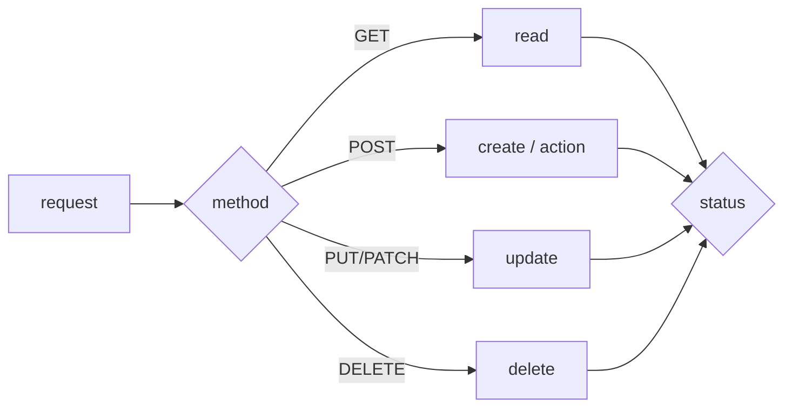

# HTTP method와 status code

> API Design 101 시리즈 (4/10)

<!-- a-grade-intro:begin -->

**핵심 질문**: 어떤 method를 쓰고, 어떤 상태 코드를 돌려줄지 — 이 두 결정의 *기준* 은 무엇일까요?

> *멱등성(idempotency)* 과 *결과의 의미* 입니다.

<!-- a-grade-intro:end -->

## 이 글에서 배울 것

- GET/POST/PUT/PATCH/DELETE의 의미
- 안전(safe)·멱등(idempotent) 구분
- 2xx / 3xx / 4xx / 5xx의 분류
- 가장 자주 쓰는 코드 12가지
- method × status 매핑 표

## 왜 중요한가

method와 status는 클라이언트의 *분기 로직* 입니다. 잘못된 코드를 돌려주면 클라이언트는 *재시도해도 되는지* 조차 모릅니다. 이 한 쌍이 API의 *예측 가능성* 을 결정합니다.

> 상태 코드는 *문자* 가 아니라 *계약* 입니다.

## 개념 한눈에 보기



## 핵심 용어 정리

- **Safe**: 호출해도 자원이 *변하지 않는다* (GET, HEAD).
- **Idempotent**: 여러 번 불러도 *같은 결과* (GET, PUT, DELETE).
- **2xx 성공** / **3xx 리다이렉트** / **4xx 클라이언트 오류** / **5xx 서버 오류**.
- **201 Created**: 생성 + `Location` 헤더.
- **204 No Content**: 성공이지만 본문 없음.

## Before/After

**Before (의미 흐릿)**

```
POST /users/42/update   200 OK   {"ok": true}
POST /users/42/delete   200 OK   {"ok": true}
```

**After (method × status)**

```
PATCH  /users/42   200 OK
DELETE /users/42   204 No Content
```

코드만 봐도 *무엇이 일어났는지* 알 수 있습니다.

## 실습: 가장 자주 쓰는 패턴 5단계

### 1단계 — 조회 (GET)

```python
# 1_get.py
from flask import Flask, jsonify, abort
app = Flask(__name__)
USERS = {42: {"id": 42, "name": "Y"}}

@app.get("/users/<int:uid>")
def get_user(uid):
    if uid not in USERS: abort(404)
    return jsonify(USERS[uid])
```

성공 200, 없는 자원 404.

### 2단계 — 생성 (POST)

```python
# 2_post.py
from flask import Flask, request, jsonify
app = Flask(__name__)
NEXT = {"id": 43}

@app.post("/users")
def create_user():
    body = request.get_json()
    uid = NEXT["id"]; NEXT["id"] += 1
    return jsonify(id=uid, **body), 201, {"Location": f"/users/{uid}"}
```

생성은 *201 + Location*.

### 3단계 — 부분 수정 (PATCH)

```python
# 3_patch.py
from flask import Flask, request, jsonify
app = Flask(__name__)
USERS = {42: {"id": 42, "name": "Y"}}

@app.patch("/users/<int:uid>")
def patch_user(uid):
    USERS[uid].update(request.get_json())
    return jsonify(USERS[uid])
```

부분 수정 200, 전체 교체는 PUT.

### 4단계 — 삭제 (DELETE)

```python
# 4_delete.py
from flask import Flask
app = Flask(__name__)
USERS = {42: {}}

@app.delete("/users/<int:uid>")
def delete_user(uid):
    USERS.pop(uid, None)
    return ("", 204)
```

성공이지만 본문 없음 — 204.

### 5단계 — 검증 실패와 충돌

```python
# 5_errors.py
from flask import Flask, request, jsonify, abort
app = Flask(__name__)

@app.post("/users")
def create():
    body = request.get_json() or {}
    if "name" not in body: abort(400)        # 검증 실패
    if body["name"] == "exists": abort(409)  # 중복
    return jsonify(ok=True), 201
```

검증 실패는 400, 자원 충돌은 409.

## 이 코드에서 주목할 점

- 같은 동작이라도 *결과* 가 다르면 status가 달라집니다.
- 생성에는 `Location` 헤더가 *함께* 갑니다.
- 본문 없는 성공은 200이 아닌 204.

## 자주 하는 실수 5가지

1. **모든 성공을 200으로.** 생성도 200, 삭제도 200 — 의미를 잃음.
2. **검증 실패를 500으로.** 클라이언트가 *재시도* 할 수 있다고 오해.
3. **DELETE에 본문.** 멱등성과 캐시 동작이 흔들림.
4. **PATCH로 전체 교체.** PUT의 의미를 망가뜨림.
5. **404와 401·403 혼동.** 보안 정보가 새거나, 디버깅이 어려움.

## 실무에서는 이렇게 쓰입니다

GitHub 응답을 보면 method × status가 거의 *교과서* 입니다 — 생성은 201, 권한 부족은 403, rate limit은 429. 사내에서도 *가장 자주 쓰는 12개 코드* 만 외워 두면 95%의 상황을 다룰 수 있습니다.

## 시니어 엔지니어는 이렇게 생각합니다

- *재시도 가능* 한 동작은 멱등(PUT/DELETE/GET)으로 둔다.
- 클라이언트의 *분기* 를 먼저 그린다 → 거기에 status를 매핑.
- `4xx` 는 *사용자가 고칠 수 있는* 오류, `5xx` 는 *서버가 고칠 책임*.
- 새 코드를 만들지 말고 표준에서 고른다.
- 응답 본문에 *세부 사유* 를 일관된 형식으로 담는다.

## 체크리스트

- [ ] 생성 응답이 201 + Location 인가?
- [ ] 삭제 성공이 204인가?
- [ ] 검증 실패가 400 / 422 인가?
- [ ] 권한 부족이 403, 미인증이 401인가?
- [ ] PATCH와 PUT의 의미가 분리되어 있는가?

## 연습 문제

1. 자신의 API 한 endpoint에 대해 가능한 4xx 코드 5개를 적어 보세요.
2. 위 2단계에 *중복 사용자명* 검사를 추가해 409를 돌려주세요.
3. 멱등하지 않은 endpoint 3개를 찾아 멱등하게 바꾸는 방법을 적어 보세요.

## 정리 및 다음 단계

method와 status는 한 쌍입니다. 다음 글에서는 그 사이에서 흐르는 *데이터의 모양* — request/response schema — 를 봅니다.

<!-- toc:begin -->
- [API란 무엇인가?](./01-what-is-an-api.md)
- [REST 기본](./02-rest-basics.md)
- [리소스 설계](./03-resource-design.md)
- **HTTP method와 status code (현재 글)**
- Request와 response schema (예정)
- Pagination과 filtering (예정)
- Error response 설계 (예정)
- OpenAPI와 Swagger (예정)
- Versioning (예정)
- 좋은 API 문서 만들기 (예정)
<!-- toc:end -->

## 참고 자료

- [HTTP Methods (MDN)](https://developer.mozilla.org/en-US/docs/Web/HTTP/Methods)
- [HTTP Status Codes (MDN)](https://developer.mozilla.org/en-US/docs/Web/HTTP/Status)
- [RFC 7231 — HTTP/1.1 Semantics](https://www.rfc-editor.org/rfc/rfc7231)
- [Idempotency in REST APIs (Stripe blog)](https://stripe.com/blog/idempotency)

Tags: Computer Science, APIDesign, HTTP, Methods, StatusCodes, Backend
